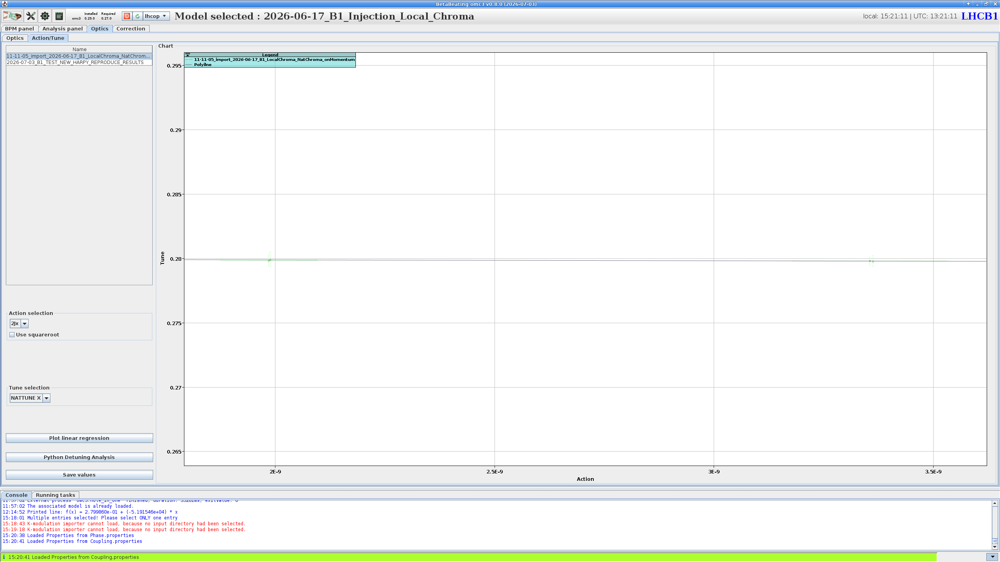

# Amplitude Detuning Analysis

Accessing amplitude detuning is done via the `Optics` panel, by navigating to the `Action/Tune` tab.

In this tab are shown the measured tune against the action for the selected optics result(s).
The controls on the left select the action (e.g. `2Jx`) and tune (e.g. `NATTUNE X`) to use, a linear fit can be drawn with ++"Plot linear regression"++, and the full analysis is launched with the ++"Python Detuning Analysis"++ button.

<figure>
  

  
  <figcaption>The Action/Tune sub-tab, plotting tune versus action.</figcaption>
  

</figure>

!!! warning "Incomplete"
    This page is a placeholder and is yet to be fully written.
    For now, please refer to the analysis section of the [Amplitude Detuning procedure page](../../measurements/procedures/ampdet.md#analysis), which includes a step by step guide and screenshots.
