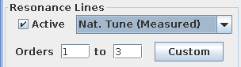
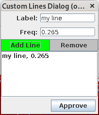
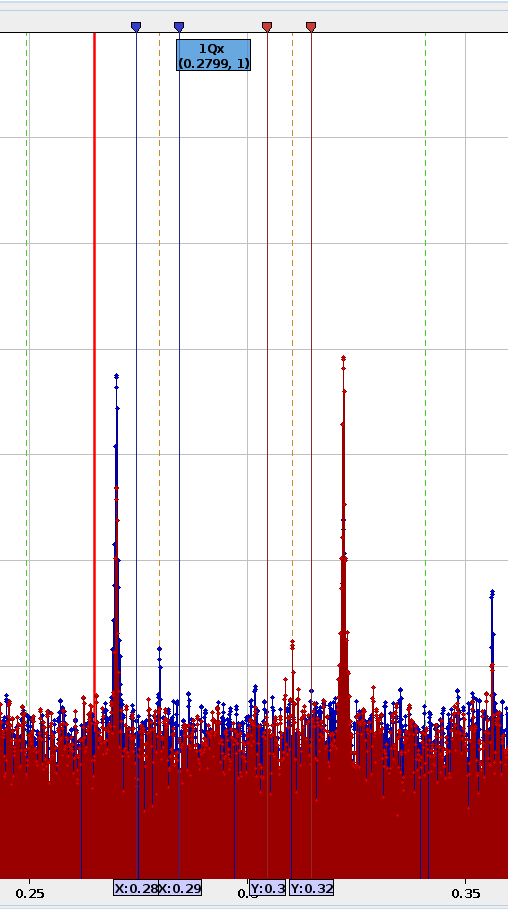
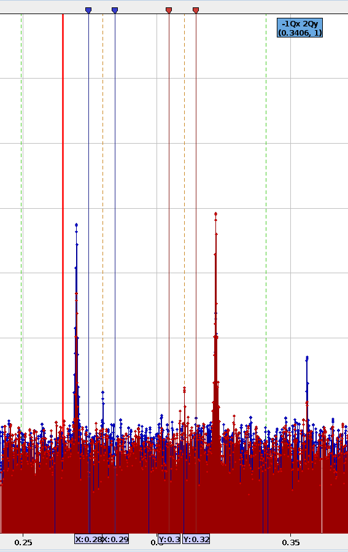
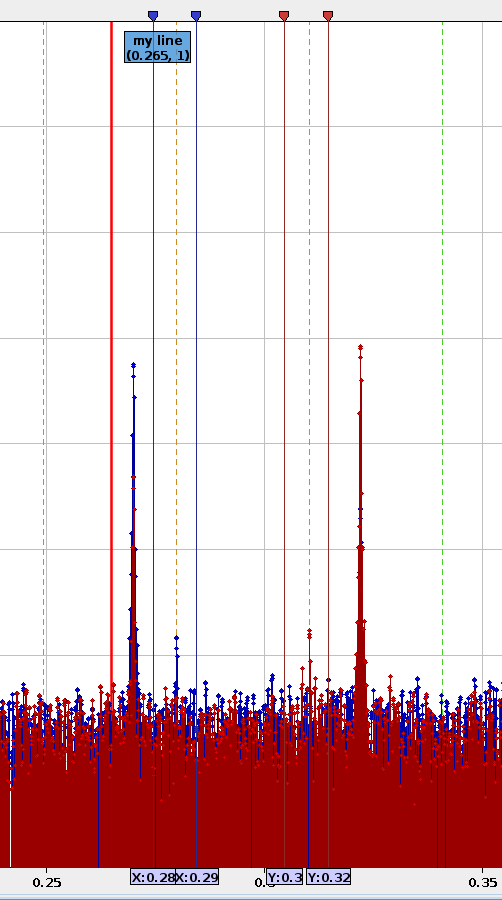
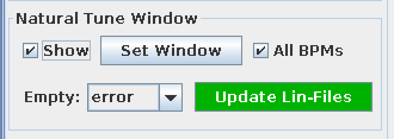
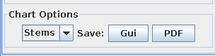
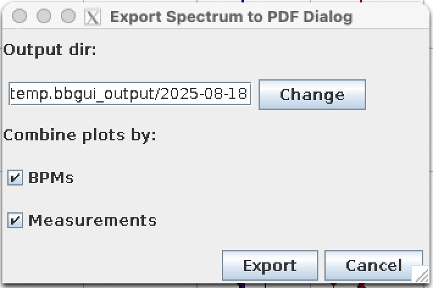
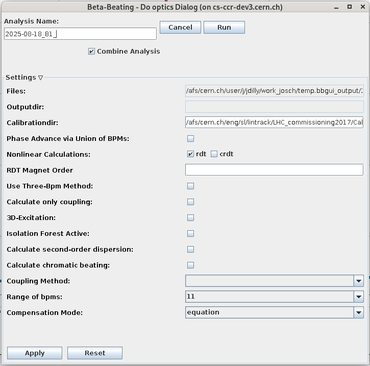

# The Analysis Panel

The analysis panel provides graphical interface to visualize results from harmonic analysis performed on the given data.

<figure>
  

  
  <figcaption>The Analysis Panel.</figcaption>
  

</figure>

## Loading Files

When the `harpy` analysis is started from the [BPM-Panel](bpm_panel.md), the results are automatically loaded when the analysis task has finished.
The buttons at the top of the panel provide functionality to manually load files and remove entries from the analysis table,
as well as to start the [optics analysis](#do-optics-dialog).

- ++"Open Files"++{.green-gui-button}: Opens a dialog to select files to be loaded. The files will be **copied** into the `Measurements` folder and opened from there.
- ++"Attach Files"++{.yellow-gui-button}: Opens a dialog to select files to be loaded. The files will be **opened from their current location**.
- ++"Delete Files"++{.red-gui-button}: Removes the selected files from the analysis table.
  A dialog will pop up, asking if the files should only be removed from this table, i.e. from being loaded in memory (see admonition below), or if they should also be deleted from disk. 
  :fontawesome-solid-triangle-exclamation:{.warning-colored} Due to [an unresolved issue][issue268]{target=_blank} it is currently **not advised** to delete files from disk.
- ++"Get Optics"++{.green-gui-button}: Opens [the optics analysis dialog](#do-optics-dialog) which can trigger an external python script to compute the optics functions from the harmonic analysis data of the selected files.

<figure>
  

  
  <figcaption>The table of currently loaded files.</figcaption>
  

</figure>

!!! warning "Memory Usage"
    Files that are opened in this panel are stored in memory.
    If your computer is running low on memory, you might want to close some of the open files.

## The Time / Space Tab

In the `Time / Space` tab one can examine the phases and amplitudes of different spectral lines over the length of the accelerator (per BPM), and perform cleaning procedures if needed.

<figure>
  

  
  <figcaption>The Time / Space tab.</figcaption>
  

</figure>

In the lists on the left-hand side, one can select from the resulting values of the [`harpy` analysis].
These correspond to the columns in the `.lin[xy]` files and are separated by plane.
These include phase (`PHASE`), frequency (`FREQ`) and amplitude (`AMP`) of the lines identified by `harpy` as well as their respective errors (`ERR`).
The lines are multiples of the found tunes (`TUNE`) and can be identified by the two numbers in their name,
which correspond to the multiples of the horizontal and vertical tune, respectively, using underscores to represent a minus sign;
e.g. `PHASE1_2`, as seen in the screenshot above, corresponds to the phase of the line at frequency `Qx - 2Qy`.
In addition, further data from the harmonic analysis is available, such as:

- `TUNE`: (driven) tune
- `NATTUNE`: natural tune (if available)
- `MU`: phase advance
- `CO`: closed orbit
- `BPM_RES`: BPM resolution
- `PK2PK`: peak-to-peak oscillation value
- `NOISE`: estimated cleaned noise

It is possible to select multiple files (++ctrl++ / ++shift++) at once, to compare the same quantities between measurements, and also multiple entries, e.g. to compare the amplitudes of different lines.

!!! tip "Deselection"
    To see the data of one plane only, one can deselect the other plane by either choosing `None` at the bottom of the list
    or by right-clicking into the respective list.

### Cleaning

Even though extensive cleaning is done automatically in the [harmonic analysis][harpy_analysis], there can still be outliers in the data,
e.g. due to undetected [faulty BPMs][bad_bpms].
To prevent the appearance of unphysical spikes in the optics functions, manual cleaning can be performed using the controls at the bottom left of the `Time / Space` tab,
which trigger the python [`linfile_clean` script][omc3_linfile_clean]{target=_blank}.

<figure>
  

  
  <figcaption> Cleaning controls to clean data before optics analysis </figcaption>
  

</figure>

!!! tip "Keep BPMs"
    Some BPMs, e.g. the AC-Dipole BPMs, are required for the optics analysis and **the analysis will fail** if they are not found in the data.
    You can therefore specify to **keep these BPMs** in the [GUI Cleaning section of the Cleaning Settings Tab](settings.md#gui-cleaning) and they will be kept,
    even if they are outside the given [cut-offs](#clean) or identified as [outliers](#auto-clean).

!!! tip "Always remove BPMs"
    If BPMs show up regularly as outliers in the data, independent of machine configuration, it is likely that they are [faulty BPMs][bad_bpms].
    You can specify to **always clean these BPMs** during the cleaning of the data in the `harpy` analysis via the `Bad BPMs` field in the [Cleaning Settings Tab](settings.md#cleaning-tab).

#### Clean

=== "Before Cleaning"

    <figure>
    

    
    <figcaption>Identified natural tunes per BPM with outliers. </figcaption>
    

    </figure>

=== "After Cleaning"

    <figure>
    

    
    <figcaption>Identified natural tunes per BPM after cleaning outliers.</figcaption>
    

    </figure>

This section allows for the most manual cleaning of the data by setting the cursors (lines) around the data to keep.
This can be done manually by dragging their markers on the right-hand-side of the chart.
They can also be set automatically at the position corresponding to the _Sigmas_,
i.e. the number of standard deviations away from the mean **of all data currently shown in the chart**,
by using the ++"Set Cursors"++ button.
Then press ++"Clean"++{.red-gui-button} to remove the data outside of the selected area, as shown in the images above.

!!! info "Automatic Data Selection"
    The order of the cursors does not matter, and neither does the selection of data: The GUI will automatically determine the area between the cursors and check
    which of the selected data sources, columns and/or files, has most (default: more than 70% of the data; see the warning admonition below) of its data in that area.

!!! warning "Default Bounds"
    Before cleaning, the GUI will check if the ratio of remaining data-points is inside predefined bounds (default: `0.7`, i.e. keep at least 70%) to **prevent accidental removal of too much data**.
    This ratio, as well as the GUI-default value for the `sigmas` and `limit` parameter can be changed [through the `bbgui_user.properties` file][additional_defaults].

#### Auto Clean

A more automated cleaning approach can be utilized with the help of the _outlier filter_
(see Section 3.2.3 in [Malina2018][malina2018]
or Section II.E.1 in [Dilly2023][dilly2023]), which iteratively removes points in the tails of the data until the distribution of the remaining data is close to a normal distribution.
The _limit_ parameter defines a "save zone" in standard deviations around the mean, in which data will not be removed (default: `0.0`, i.e. any datapoint could be removed).
This cleaning can be run by simply pressing the ++"Auto"++{.red-gui-button} button and is then applied to **all data currently shown in the chart**, individually per column, plane and `sdds`-file.

#### Undo Cleaning

The [`linfile_clean`][omc3_linfile_clean]{target=_blank} function automatically creates a backup of the data before cleaning,
which can be restored by pressing the buttons in this section.
Use ++"X"++ to restore the latest backup for the X-plane and ++"Y"++ for the Y-plane,
 or press ++"Both"++ to restore the latest backup for both planes.

!!! warning "Backup History"
    At each cleaning run a **separate backup per file** will be created.
    The undo-functionality always restores the latest backup file found and then deletes it.
    You can therefore undo multiple cleaning steps by pressing the buttons multiple times.
    The latest backup is chosen **per `lin`-file** independently, i.e. you can go back to different states for the X and Y planes,
    but **not for different columns** if you have cleaned them in the same step, as they are in the same file.
    Conversely, if you cleaned another column than the currently visible one in the same file, **restoring the backup might restore the wrong column**.
    If no backup was found, a warning will be logged in the [console](common_components.md#console).

## The Frequency Tab

<figure>
  

  
  <figcaption>The Frequency tab.</figcaption>
  

</figure>

The `Frequency` tab displays the computed spectrum for every BPM.
Here, one can visually check the quality of the data, identify resonance lines, and perform some additional (natural-) tune windowing.

It is possible to select multiple files (++ctrl++ / ++shift++) as well as multiple BPMs (++ctrl++ / ++shift++) at once to compare the frequency data between them.
Depending on the number of selected files and BPMs as well as the frequency resolution of the spectra, the GUI may take a few seconds to display all data.

!!! tip "Deselection"
    To see the frequency data of one plane only, one can deselect the other plane by either choosing `None` at the bottom of the list of BPMs
    or by right-clicking into the respective list.

!!! tip "Find BPMs"
    The BPMs in the list are sorted alphabetically.
    Use the text field and the ++"Find BPM"++ button to quickly find BPMs in the list and **automatically select them**.
    The text input is based on regular expressions and **all BPMs that match the pattern** in both planes will be selected.
    Note that `^.*` and `.*$` will be added automatically to start and end of the string respectively,
    to look for your pattern **anywhere** in the BPM name.

Use the controls at the bottom left of the panel for the additional functionality, which is described below.

### Resonance Lines

<figure>
  

  
  <figcaption>Resonance lines controls at the bottom of the Frequency tab.</figcaption>
  

</figure>

Activate these controls to mark the location of resonance lines in the spectrum with dashed vertical lines and bars.
Choose from the dropdown menu which tune values should be used for the calculation of the lines:

- **Nat. Tune (Model)**: The natural tune set in the currently loaded model.
- **ACD Tune (Model)**: The ac-dipole tune set in the currently loaded model _(if available)_.
- **ADT Tune (Model)**: The adt-tune set in the currently loaded model _(if available)_.
- **Nat. Tune (Measured)**: The average natural tune of all measured BPMs.
- **Driven Tune (Measured)**: The average driven tune of all measured BPMs.
- **Nat. Tune (Gui)**: The currently set natural tune in the [tunes settings](settings.md#tunes-tab) _(usually same as model)_.
- **Driven Tune (Gui)**: The currently set driven tune in the [tunes settings](settings.md#tunes-tab) _(usually same as model)_.

The range of orders of the resonance lines to be shown can be chosen by changing the values in the text fields,
where the order `n` is defined as the sum of absolute multiples of the horizontal and vertical tune of the line, e.g. the order of the `2Qy - Qx` line is `n = 2 + 1 = 3`.
Different orders will be shown in different colors.
Hovering the resonance line towards the top of the chart will show a tooltip with the tune multiples of that line and its frequency.

Clicking the ++"Custom"++ button will open a dialog to manually enter frequency and labels of additional vertical bars to be shown in red in the chart.

<figure>

<figcaption>The custom lines dialog to manually add lines.</figcaption>

</figure>

Use ++"Add Line"++{.green-gui-button} to add a new line based on your input to the table and ++"Remove"++{.red-gui-button} to remove the currently selected line.
The lines in the charts will only update after clicking ++"Approve"++.

=== "Natural Tune Line"

    <figure>
    

    
    <figcaption>The spectrum showing a tooltip at the natural tune line.</figcaption>
    

    </figure>

=== "2Qy - Qx Line"

    <figure>
    

    
    <figcaption>The spectrum showing a tooltip at the 2Qy - Qx line.</figcaption>
    

    </figure>

=== "Manual Line"

    <figure>
    

    
    <figcaption>The spectrum showing a tooltip at a manually added marker at 0.265.</figcaption>
    

    </figure>

### Natural Tune Window

The natural tune window controls help to correctly identify the natural tune in the spectrum and assign it to the `NATTUNE`-column in the lin-file
using the [`update_nattune_in_linfile` script][omc3_update_nattune]{target=_blank}.
This avoids having to re-run the `harpy` analysis with different tolerance windows and natural tunes settings.
Accurate identification of the natural tune is important e.g. for [amplitude detuning analysis][amplitude_detuning_analysis].

There are two main reasons for a possible misidentification of the natural tune line in the spectrum by the `harpy` analysis,
even when the values are set "correctly" (in accordance with the model) in the [`Tune Settings`](settings.md#tunes-tab):

- Due to detuning, the natural tune line can be shifted and might not be any longer within the tolerance window.
This can in particular happen during a wide range of amplitude detuning scans, for which one does not want to change the tolerance window at every kick,
or cannot easily make it larger as it would include the driven tune line.
- Large resonances can appear within the tolerance window, e.g. excited by the approach of the natural tune due to detuning effects,
and might be misidentified as the natural tune line when their amplitude is higher than that of the natural tune line itself.

<figure>
  

  
  <figcaption>Natural tune window controls at the bottom of the Frequency tab.</figcaption>
  

</figure>

To update the natural tune in the lin-file, first activate the vertical cursors at the top of the chart by setting a tick in the **Show** checkbox,
they will appear at their last set position or at 0 if they have not been set yet.

!!! tip "Cursors for each plane"
    If BPMs from both planes are selected, two sets of cursors will appear: blue for the horizontal spectrum and red for the vertical spectrum.
    In case only one plane is selected, only one set of cursors will appear.
    To update the amount of cursors shown, select BPMs in the desired planes, then untick and re-activate the **Show** checkbox.

Click ++"Set Window"++ to set the markers around the model natural tune with a spacing given by the _Tolerance_,
both of which are taken from the [`Tune Settings`](settings.md#tunes-tab).

<figure>

<figcaption>The spectrum showing a tooltip at the natural tune line.</figcaption>

</figure>

Adapt the cursors such that the natural tune line is the highest line between them,
avoiding resonances and the driven tune line.
For measurements with many BPMs not showing a clear natural tune line, tightening the window can also help reducing the errorbar on the tune.

!!! tip "Identifying the Natural Tune"
    If unsure which of the shown lines is the natural tune, it often helps to look at the spectrum of other kicks,
    e.g. the ones with similar kick-amplitude in an amplitude detuning scan.
    The natural tune line in this measurement is usually the line closest to the natural tune in the other measurements,
    as the detuning effect is usually very small between similar kick amplitudes.

A ticked _"All BPMs"_ checkbox will update the `NATTUNE`-column for all BPMs, while an unticked one will only update the currently selected BPMs.
If unticked and no BPMs are selected in a given plane that plane will be skipped,
but if _"All BPMs"_ is active, both planes will be updated as long as a window is set for each (see tip above).
If there is no window set for a plane, it will be skipped.

Click ++"Update Lin-Files"++{.green-gui-button} to update the `NATTUNE`-column in the lin-files of the currently selected measurements, with the window defined by the currently set cursors.

!!! tip "The `Empty` dropdown"
    In rare cases, e.g. when using a large frequency spacing (low number of [output bits](settings.md#harpy-tab)) or a very small tolerance window,
    it can happen that for some BPMs no frequency line lies between the cursors.
    In this case, the action taken in the `Empty` dropdown menu is applied:

    - **error** _(default)_: The `NATTUNE`-column is not updated and an error is raised.
    - **ignore**: The BPM is ignored and the value in the `NATTUNE`-column is not updated.
    - **remove**: The BPM is removed from the lin-file.

!!! bug "Free Kicks"
    Do **NOT** use the Natural Tune Updater when working with free kicks, as the script will add a `NATTUNE`-Column to the lin-file!

### Chart Options

<figure>
  

  
  <figcaption>Chart options controls at the bottom of the Frequency tab.</figcaption>
  

</figure>

Use the first drop-down in the chart options to select the display type of the chart:

- **Stem** _(default)_:
This shows the spectrum in a stem plot, i.e. as thin vertical lines for each measured frequency, starting at the bottom of the chart and ending in a marker at the amplitude value.
- **Bars**:
This also shows the spectrum in a stem-like plot, but with wider stems and no markers at the top.
This was the default in GUI versions pre 2019 and comes with a warning: When plotting multiple files/BPMs the bars are "stacked" **next** to each other,
which makes it hard to see which frequency they actually belong to.
- **Points**:
This shows the spectrum in a scatter plot, i.e. as markers for each frequency set at the corresponding amplitude.
These are the markers of the _Stems_ plot, but without the actual stems.
- **Lines**:
This shows the spectrum in a scatter plot, i.e. as markers for each frequency set at the corresponding amplitude connected by lines.
So this is the same as _Points_ but with additional lines between the markers.

Two methods are available to save the chart to file:

- ++"GUI"++ :
This button will open a dialog asking where to save the **chart component directly from java** as a **PNG file**.
The output will look exactly like the chart in the GUI, as it is rendered directly from `java`.
- ++"PDF"++ :
This button allows passing the currently selected data to the [`plot_spectrum` script][omc3_plot_spectrum]{target=_blank} to save the spectrum as a **PDF file**.
As the spectrum is completely rendered by the `python` script, the output will look different from the chart in the GUI but will show in general the same information, with some important caveats listed below.

    - Clicking the button will open a dialog to select an output **directory**.
      As multiple files might be created, the filenames are determined automatically.
      Subsequently, a second dialog will appear, displaying the selected path (modifiable if required).
      In this window, the data to be grouped within the same plots/files can be defined:

        <figure>
        

        
        <figcaption>The export spectrum dialog.</figcaption>
        

        </figure>

    - In any case, the spectrum of horizontal and vertical BPMs will be split into separate plots on the top and bottom of the same file.
      Which also means, that no matter in which plane you have selected a BPM - if it has a horizontal and a vertical spectrum they will both be plotted.
    - _"Combine Plots by BPMs"_: Will plot all selected BPMs into the same plots in the same file, with the BPM name in the legend.
      If deactivated, there will be separate files per BPM with the BPM name in the filename.
    - _"Combine Plots by Measurements"_: Will plot all selected Measurements into the same plots in the same file,  with the Measurement name in the legend.
      If deactivated, there will be separate files per Measurement with the Measurement name in the filename.
    - Having both _"BPMs"_ and _"Measurements"_ activated will therefore lead to a single output file, with a chart for each plane and a combination of BPM and Measurement names as legend.
    - Having both _"BPMs"_ and _"Measurements"_ deactivated will lead to `N = No. of selected BPMs x No. of selected Measurements` files, containing two charts for the planes with each showing only a single spectrum.
      Both, BPM and Measurement name will be in the filename.

## Do Optics Dialog

The ++"Get Optics"++{.green-gui-button} button opens a dialog to select the settings and run the [optics analysis][optics_analysis],
which will calculate the optics parameters based on the spectra of the [currently selected files](#loading-files).

=== "Closed Settings"

    <figure>
    

    
    <figcaption>The "Do Optics" Dialog.</figcaption>
    

    </figure>

=== "Open Settings"

    <figure>
    

    
    <figcaption>The "Do Optics" Dialog with open settings.</figcaption>
    

    </figure>

It is possible to combine all selected files into a single optics analysis, using the individual measurements for statistics.
In this case **a descriptive output name** should be specified for the analysis, the prefix of which will already be provided as a suggestion.
When unchecking the _Combine Analysis_ option, each open file will produce an optics analysis named based on the name of the `harpy` output files, as displayed in the table at the top of this panel.
All optics analysis results are stored in the `Results` folder, and will be automatically loaded into the [Optics Panel](optics_panel.md).

### Settings

By expanding the _Settings_ section at the bottom of the dialog
one can change the [settings](settings.md) of the _[Optics tab](settings.md#optics-tab)_.

!!! warning "Changing the Settings"
    This will **change the global settings** for all subsequent analysis runs,
    not just for the current one!
    You need to click the ++"Apply"++ button to actually apply these settings before the run.

[additional_defaults]: defaults.md#additional-gui-defaults
[harpy_analysis]: ../../measurements/physics/harpy.md
[bad_bpms]: ../../measurements/physics/bpm_filtering.md
[amplitude_detuning_analysis]: ../../measurements/procedures/ampdet.md
[optics_analysis]: ../../measurements/physics/optics.md

[omc3_linfile_clean]: https://pylhc.github.io/omc3/entrypoints/scripts.html#linfile-cleaning
[omc3_update_nattune]: https://pylhc.github.io/omc3/entrypoints/scripts.html#update-natural-tune-in-lin-files
[omc3_plot_spectrum]: https://pylhc.github.io/omc3/entrypoints/plotting.html#plot-spectrum
[malina2018]: https://repository.cern/records/bxyez-pt407
[dilly2023]: http://cds.cern.ch/record/2883681/
[issue268]: https://gitlab.cern.ch/acc-co/lhc/lhc-app-beta-beating/-/issues/268

*[LHC]: Large Hadron Collider
*[SPS]: Super Proton Synchrotron
*[PS]:  Proton Synchrotron
*[PSB]: Proton Synchrotron Booster
*[OMC]: Optics Measurement and Correction
*[BPM]: Beam Position Monitor
*[BPMs]: Beam Position Monitors
