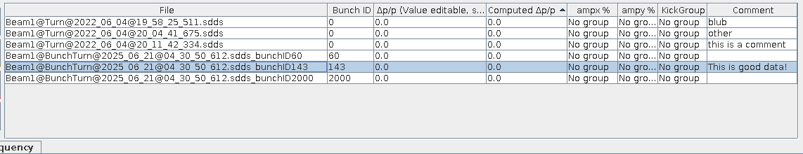

# The Analysis Panel

The analysis panel provides graphical interface to visualize results from harmonic analysis performed on the given data.

<figure>
  

  
  <figcaption>The Analysis Panel.</figcaption>
  

</figure>

## Loading Files

The buttons at the top of the panel provide functionality to load and remove files from the analysis table as well as to start the [optics analysis](#do-optics-dialog).

- ++"Open Files"++{.green-gui-button}: Opens a dialog to select files to be loaded. The files will be **copied** into the `Measurements` folder and opened from there.
- ++"Attach Files"++{.yellow-gui-button}: Opens a dialog to select files to be loaded. The files will be **opened from their current location**.
- ++"Delete Files"++{.red-gui-button}: Removes the selected files from the analysis table.
- ++"Get Optics"++{.green-gui-button}: Opens [the optics analysis dialog](#do-optics-dialog) which can trigger an external python script to compute the optics functions from the harmonic analysis data of the selected files.

<figure>
  

  
  <figcaption>The table of currently loaded files.</figcaption>
  

</figure>

## The Time / Space Tab

In the `Time / Space` tab one can examine the phases and amplitudes over the length of the accelerator (per BPM), and can clean the values if needed.

<figure>
  

  
  <figcaption>The Time / Space tab.</figcaption>
  

</figure>

In the lists on the left-hand side, you can select from the resulting values of the [`harpy` analysis].
These correspond to the columns in the `.lin[xy]` files and are separated by plane.
In here you can find phase (`PHASE`), frequency (`FREQ`) and amplitude (`AMP`) of the lines identified by `harpy` and their respective errors (`ERR`).
The lines are multiples of the found tunes (`TUNE`) and can be identified by the two numbers in their name,
which correspond to the multiples of the horizontal and vertical tune, respectively, using underscores to represent a minus sign.
In addition to these lines, you also find additional data, such as:

- `TUNE`: (driven) tune
- `NATTUNE`: natural tune (if available)
- `MU`: phase advance
- `CO`: closed orbit
- `BPM_RES`: BPM resolution
- `PK2PK`: peak-to-peak oscillation value
- `NOISE`: estimated cleaned noise

You can select multiple files (++ctrl++ / ++shift++) at once to compare the same value between them and also multiple entries, e.g. to compare the amplitudes of different lines.

!!! tip "Deselection"
    In case you only want to see the data of one plane, you can deselcect the other plane by either chosing `None` at the bottom of the list
    or by right-clicking into the respective list.

### Cleaning

Even though extensive cleaning is done automatically in the [harmonic analysis][harpy_analysis], there can still be outliers in the data,
e.g. due to undetected [faulty BPMs][bad_bpms].
To prevent the appearance of unphysical spikes in the optics functions, manual cleaning can be performed using the controls at the bottom left of the `Time / Space` tab,
which trigger the python [`linfile_clean` script][omc3_linfile_clean]{target="_blank"}.

<figure>
  

  
  <figcaption> Cleaning controls to clean data before optics analysis </figcaption>
  

</figure>

!!! tip "Keep BPMs"
    Some BPMs, e.g. the AC-Dipole BPMs, are required for the optics analysis and **the analysis will fail** if they are not found in the data.
    You can therefore specify to **keep these BPMs** in the [GUI Cleaning section of the Cleaning Settings Tab](settings.md#gui-cleaning) and they will be kept,
    even if they are outside the given [cut-offs](#clean) or identified as [outliers](#auto-clean).

#### Clean

=== "Before Cleaning"

    <figure>
    

    
    <figcaption>Identified natural tunes per BPM with outliers. </figcaption>
    

    </figure>

=== "After Cleaning"

    <figure>
    

    
    <figcaption>Identified natural tunes per BPM after cleaning outliers.</figcaption>
    

    </figure>

This section allows for the most manual cleaning of the data: You can set the cursors (lines) around the data that you want to keep,
either manually by dragging their markers on the right-hand-side of the chart, or by using the ++"Set Cursors"++ button,
which will set them at the position corresponding to the _Sigmas_, i.e. the number of standard deviations away from the mean **of all data currently shown in the chart**.
Then press ++"Clean"++{.red-gui-button} to remove the data outside of the selected area, as shown in the images above.

!!! info "Automatic Data Selection"
    The order of the cursors does not matter, and neither does the selection of data: The GUI will automatically determine the area between the cursors and check
    which of the selected data sources, columns and/or files, has most (default: more than 70% of the data; see the warning admonition below) of its data in that area.

!!! warning "Default Bounds"
    Before cleaning, the GUI will check if the ratio of remaining data-points is inside predefined bounds (default: `0.7`, i.e. keep at least 70%) to **prevent accidental removal of too much data**.
    This ratio, as well as the GUI-default value for the `sigmas` and `limit` parameter can be changed [through the `bbgui_user.properties` file][additional_defaults].

#### Auto Clean

A more automated cleaning approach can be utilized with the help of the _outlier filter_ (see Section 3.2.3 in [Malina2018][malina2018]
or Section II.E.1 in [Dilly2023][dilly2023]), which iteratively removes points in the tails of the data until the distribution of the remaining data is close to a normal distribution.
The _limit_ parameter defines a "save zone" in standard deviations around the mean, in which data will not be removed (default: `0.0`, i.e. any datapoint could be removed).
This cleaning can be run by simply pressing the ++"Auto"++{.red-gui-button} button and is then applied to **all data currently shown in the chart**, individually per column, plane and `sdds`-file.

#### Undo Cleaning

The [`linfile_clean`][omc3_linfile_clean]{target="_blank"} function automatically creates a backup of the data before cleaning,
which can be restored by pressing the buttons in this section.
Use ++"X"++ to restore the latest backup for the X-plane and ++"Y"++ for the Y-plane,
 or press ++"Both"++ to restore the latest backup for both planes.

!!! warning "Backup History"
    At each cleaning run a **separate backup per file** will be created.
    The undo-functionality always restores the latest backup file found and then deletes it.
    You can therefore undo multiple cleaning steps by pressing the buttons multiple times.
    The latest backup is chosen **per `lin`-file** independently, i.e. you can go back to different states for the X and Y planes,
    but **not for different columns** if you have cleaned them in the same step, as they are in the same file.
    Conversely, if you cleaned another column than the currently visible one in the same file, **restoring the backup might restore the wrong column**.
    If no backup was found, a warning will be logged in the [console](common_components.md#console).

## The Frequency Tab

The `Frequency` tab displays the computed spectrum for every BPM.

<figure>
  

  
  <figcaption>The Frequency tab.</figcaption>
  

</figure>

!!! tip "Deselection"
    In case you only want to see the frequency data of one plane, you can deselcect the other plane by either chosing `None` at the bottom of the list of BPMs
    or by right-clicking into the respective list.

### Nattune Updater

- You can set a frequency range and it does not redo the analysis but just picks the highest peak in that range and assigns it to `NATTUNE` in the lin-file.
- This should be very helpful for amplitude detuning analysis.
- Do NOT use the Nattune-Updater if you have free kicks (it adds a `NATTUNE`-Column to the lin-file).

!!! todo
    Include a screenshot of the frequency panel.

## Do Optics Dialog

=== "Closed Settings"

    <figure>
    

    
    <figcaption>The "Do Optics" Dialog.</figcaption>
    

    </figure>

=== "Open Settings"

    <figure>
    

    
    <figcaption>The "Do Optics" Dialog with open settings.</figcaption>
    

    </figure>

[additional_defaults]: defaults.md#additional-gui-defaults
[harpy_analysis]: ../../measurements/physics/harpy.md
[bad_bpms]: ../../measurements/physics/bpm_filtering.md

[omc3_linfile_clean]: https://pylhc.github.io/omc3/entrypoints/scripts.html#linfile-cleaning
[malina2018]: https://repository.cern/records/bxyez-pt407
[dilly2023]: http://cds.cern.ch/record/2883681/

*[LHC]: Large Hadron Collider
*[SPS]: Super Proton Synchrotron
*[PS]:  Proton Synchrotron
*[PSB]: Proton Synchrotron Booster
*[OMC]: Optics Measurement and Correction
*[BPM]: Beam Position Monitor
