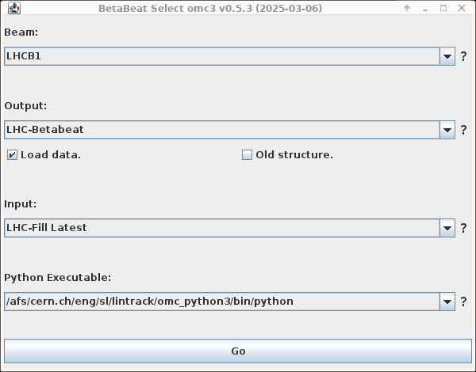

# The Beam Selection Window

<figure>
  <center>
  
  <figcaption>The Beam Selection Window.</figcaption>
  </center>
</figure>

The Beam Selection Window is your entry point to the GUI.
Here, you set which machine you will be using and which `python` backend to run.
The options chosen here will also define the **folder-structure** you will be using during your current analysis session.

!!! tip "Setting Your Defaults"
    You can set all entries in this window to your preferred defaults for a quick start!
    Check the [Defaults Page](defaults.md) for more details.

## Beam

In this field you can choose from the implemented Beams of the LHC or machines in general.
Use the `generic` accelerator, if your machine does not have its own accelerator class.

The beam you choose not only determines some of the **default settings**, which can be overwritten by user [defaults](defaults.md)
or changed later on, but also the **folder-structure** of the GUI, which cannot be changed without restarting the GUI.

## Output

### Load Data

### Old Structure

## Input

## Python Executable

In the Beam-Selection Window you need to give it a python-binary (e.g. `.venv/bin/python`).
Best would be if you have a local virtual environment.
This **needs to have omc3 installed as a package**.
See [omc3 on github][omc3_github]{target=_blank}.

```bash
python -m pip install git+https://github.com/pylhc/omc3.git
```

This is because python calls are now made by module, i.e.:

```bash
python -m omc3.module arg1 arg2 ...
```

[omc3_github]: https://github.com/pylhc/omc3
