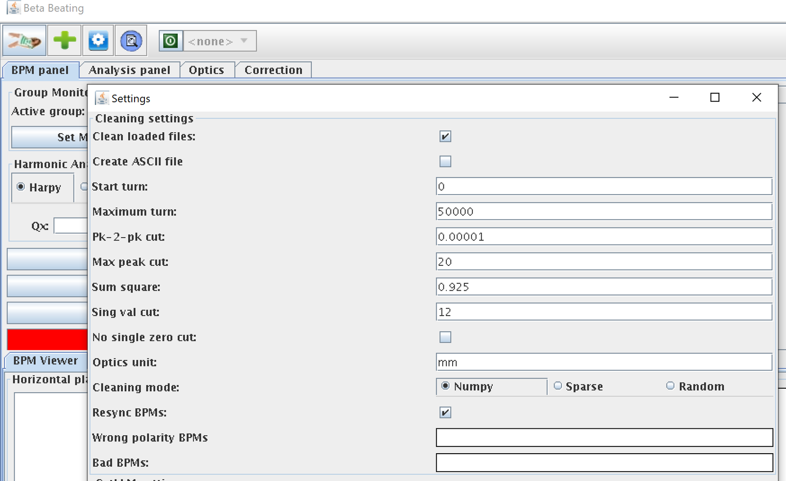

# The Beta-Beat GUI BPM Panel

The BPM panel provides a graphical interface to query and visualize information for the BPM data files.
It can load data files for all supported beams, mostly binary SDDS files or files in the SDDS ASCII format.

!!! todo
    Include a screenshot, possibly of settings when opening files?

## Opening Files and Applying SVD Cleaning

### Automatic BPM removal

First, BPMs are removed based on the following criteria:

- known bad BPMs (list is provided in `Beta-Beat.src/harmonic_analysis/clean.py` and can be extended in `Bad BPMs` field)
- BPMs which are not found in the model are discarded
- Flat BPMs (difference between min/max is smaller than `Pk-2-pk cut`)
- Spiky BPMs (value higher than `Max peak cut` found in at least one turn)
- An exact 0 is detected in at least one turn

### SVD-cleaning

Secondly, SVD cleaning is performed.
SVD modes with localized spikes in their spatial vectors indicate faulty BPMs using `Sum square` setting to find such spikes. 
To globally reduce the noise on all BPM readings, only a predefined number of strongest singular modes (`Sing val cut`) remain in the turn-by-turn data.
While the `Sum square` setting has a direct influence on the number of BPMs identified as faulty, the number of modes affects the overall noise level in turn-by-turn signal. 
The original application of SVD on BPMs data cleaning can be found [in this publication][svd_clean_rhic].

If SVD is enabled in the settings, the external SVD cleaning python script will be called for the current file during the loading process.
If SVD cleaning detects and removes bad BPMs, they will be marked in the BPM names list.

All the settings mentioned above can be changed in the global settings panel:
<figure>

  
  <figcaption>Settings panel where cleaning thresholds can be changed.</figcaption>

</figure>

Turn-by-turn data cleaning is summurized in the output file which can be found under the path: 
`Measurements/Beam1@...1-6600/Beam1@...sdds.bad_bpms_{x,y}.`

It contains BPM names and corresponding threshold which identified a BPM as faulty.

!!! note 
    A single BPM can appear twice (for each threshold separately), e.g. in the case of exact zero flat signal.

The content of the loaded files will be displayed in two charts:

- Horizontal BPMs,
- Vertical BPMs.

!!! todo
    Include a screenshot with two BPM panels.

The charts are interactive and can be used to zoom in/out, or focus on a given rectangle of the shown data.

The charts can display either the measured amplitude values over turns for every BPM from the list or display the phase space, which is calculated by two consecutive BPMs.

!!! todo
    Include a screenshot of the bad bpms panel.

## Removing Turns and Computing an Average

The buttons on the top left side of the pane provide useful features to handle the BPM data.

- `Remove Turns` can be used to cut turns from the start or the end, to focus on a specified range of the data. 

!!! todo
    Include a screenshot of before-after comparison for `Remove Turns`.

- `Create Average` allows loading several data files too visualize their average repesentations on the same graph, which helps detecting differences or reducing noise.

!!! todo
    Include a screenshot of `Create Average` effect.

- `Do Analysis` spawns the configuration dialogue for the external analysis.
  This will call an external program to perform harmonic analysis of the BPM data, in order to compute tunes and similar beam properties.
  The results from the analysis can be seen in the [Analysis Panel](analysis_panel.md).
   
!!! todo
    Include of screenshot of `Do Analysis` dialogue window.

!!! note
    The `Create Average` option requires synchronized data from withing the same bounds, otherwise the results will be meaningless.
    The figure below shows three runs from LHC beam one with synchronized peaks for every turn and their corresponding averages.
    
  [svd_clean_rhic]: https://journals.aps.org/prab/abstract/10.1103/PhysRevSTAB.7.042801
