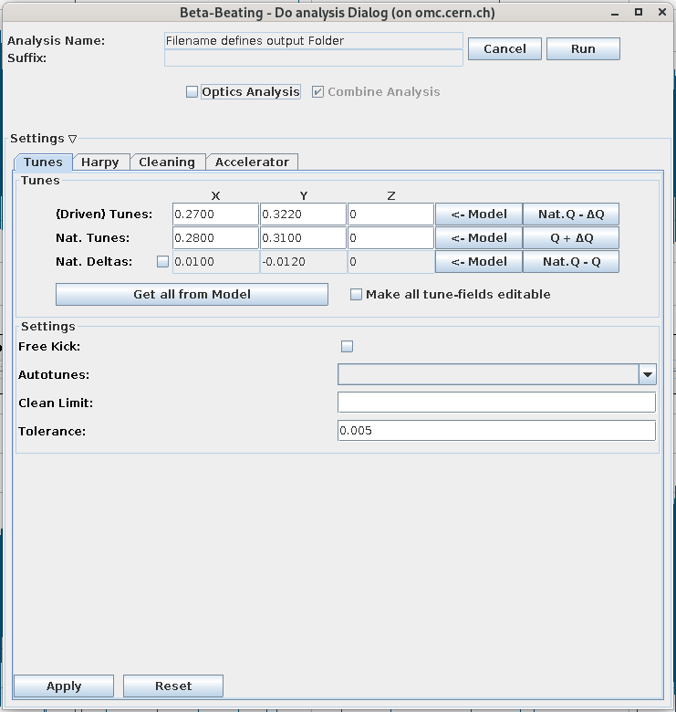

# The BPM Panel

<figure>
  

  
  <figcaption>The BPM Panel.</figcaption>
  

</figure>

The BPM panel provides a graphical interface to query and visualize information for the BPM data files, i.e. the Turn-by-Turn data
and select the data to be analyzed further.

## Loading Data

### Measurement Groups aka Kick Groups

!!! warning "Not yet implemented"
    The GUI does [not yet support loading of measurement groups][issue282]{target=_blank .cern_login} (i.e. kick groups).
    The idea is to load all data from a single [kick-group, as defined in the Multiturn GUI](../multiturn/excitation.html#kick-groups) at once
    or monitor a currently active kick-group and load the files as they are created.

### Open Files

Use the ++"Open Files"++{.green-gui-button} button to open turn-by-turn data.

<figure>
  

  
  <figcaption>The Open Files Dialog.</figcaption>
  

</figure>

!!! warning "Model Required"
    To be able to load files, you need to first need to have a [model loaded](model_creation.md#model-selection-window).
    The name of the model will appear at the top of the GUI.
    This is required, as the BPMs are checked vs the model and sorted by longitudinal location.

!!! tip "Naming Filter"
    For the LHC, the displayed files in the file-dialog are automatically filtered to show only `@BunchTurn` files of the currently selected beam.
    You can change/deactivate that filter ("Files of Type") at the bottom of the dialog!

Multiple files can be opened at once and are added to the current `Measurements` directory, as well as to the table of loaded files in the panel.
If the file contained multiple bunches, they are added as separate entries (see [below](#table-of-loaded-files)).

If the ["Analyse TbT files on opening" setting](settings.md#gui-tab) is active, a window will open to prompt the user with the ["Do analysis Dialog"][do_analysis_dialog].

!!! tip "Reopening Files"
    - If you are opening a file with the same filename as an already opened file, an error will be thrown.
    - If you want to open a new file with the same name as a previously opened file, i.e. one with the same name in the `Measurements` directory,
    a popup will ask if the old file should be overwritten or simply opened instead (without running the converter).
    - If you restart the GUI and select the ["Load Data" option in the beam selection window](beam_selection.md#load-data),
      all files in the `Measurements` directory in the selected _Output Path_ will be reloaded (without running the converter).

#### Supported File Formats

The GUI itself only supports the opening of LHC-type (dual plane BPMs) or SPS-type (single plane BPMs) binary `.sdds` files.
You can choose in the [gui tab of the settings](settings.md#gui-tab) which format your turn-by-turn data is and if you want
to convert it into one of the supported formats.
The GUI will then call the [`omc3.tbt_converter`][tbt_converter]{target=_blank} to convert the file.
All formats that can be read by the [`turn-by-turn` package][tbt_package]{target=_blank} are supported.
If you choose the **"DO NOT CONVERT"** option, the files are simply copied into the current `Measurements` directory.

!!! tip "ASCII files"
    The old ASCII format (for SPS and LHC), which is still in use in some older conversion scripts and MAD-X tracking scripts,
    is identified automatically by the converter when choosing `lhc` or `sps` as the file type to be opened.
    One can use **the same format** for the conversion, i.e. `lhc` or `sps` respectively, and the converter will output the data in binary format.
    The `ascii` input format can also be chosen directly.

## Table of Loaded Files

<figure>
  

  
  <figcaption>The Table of loaded files in the BPM Panel.</figcaption>
  

</figure>

The table at the top of the panel shows the files that are currently opened in the GUI.
These are not necessarily all files present in the `Measurement` directory, as they need to be explicitly opened!
Each column in the table provides information regarding the opened measurement:

- **File**:
Name of the file, without the path.
- **Bunch ID**:
The ID of the bunch within the file.
If the file contains multiple bunches, multiple entries with the same _File_ name, but different _Bunch IDs_ will be created.
- **Analysis Done**:
Indicator stating whether the analysis has been performed on this file.
_(:fontawesome-solid-triangle-exclamation:{.warning-colored} [Currently not working.][issue285]{target=_blank .cern_login})_
- **Kick Group**:
Name of the [Kick Group](#measurement-groups-aka-kick-groups) this file belongs to.
_(:fontawesome-solid-triangle-exclamation:{.warning-colored} [Currently not working.][issue282]{target=_blank .cern_login})_
- **No. of bad BPMs**:
Number of [bad BPMs][bpm_filtering] identified in this file as a sum between the two planes.
This value is `0` upon loading the file and will be updated when the harmonic analysis is done, which also performs the BPM filtering if [cleaning](settings.md#cleaning-tab) is active.
Bad BPMs will be [marked in red in the BPM lists below](#bad-bpms). 
_(:fontawesome-solid-triangle-exclamation:{.warning-colored} The default value for the case of something going wrong when updating this value is `-1` per plane
and hence sometimes `-2` is shown in this column, e.g. when the bad-BPM output file is missing.)_

!!! warning "Memory Usage"
    File that are opened in this panel are stored in memory.
    If your computer is running low on memory, you might want to close some of the open files.

### Removing Entries

Clicking on the ++"Remove"++{.red-gui-button} button will remove the selected entries from the table of loaded files. 
:fontawesome-solid-triangle-exclamation:{.warning-colored} This will **not** remove the files from the `Measurements` directory!

## Investigating Turn-by-Turn Data

After selecting one or more files in the table of loaded files, the turn-by-turn data is visualized in the two bottom charts, one for each plane.
The charts are [interactive](common_components.md#plotting) and can display either the measured amplitude values over turns for every BPM from the list or display the phase space, which is calculated by two consecutive BPMs.
You can select multiple measurements at once to compare them, but only one BPM per plane at a time.

=== "Turn-by-Turn view"

    <figure>
    

    
    <figcaption>Turn-by-Turn view of BPM data with two measurements selected.</figcaption>
    

    </figure>

=== "Phase space view"

    <figure>
    

    
    <figcaption>Phase space view of BPM data.</figcaption>
    

    </figure>

### Bad BPMs

After [harmonic-analysis](#start-analysis) has been performed, the [bad BPMs][bpm_filtering] will be marked in red in the lists.
Hovering the BPM name will show a tooltip with the reason the BPM was deemed bad.

### Averages, Removal of Turns and Splitting Files

!!! warning "Broken Functionality"
    These features [are currently broken][issue283] and we are considering whether they are actually needed.

The buttons on the top left side of the pane provide some features to handle the BPM data.

- ++"Create Average"++ allows loading several data files too visualize their average repesentations on the same graph, which helps detecting differences or reducing noise.
- ++"Remove Turns"++ can be used to cut turns from the start or the end, to focus on a specified range of the data.
- ++"Split Files"++ splits the current BPM data file into N files, where N is specified in the dialog and the resulting files will have old-turns/N turns.

## Start Analysis

The ++"Analyse Spectra"++{.green-gui-button} button spawns [the configuration dialog](#do-analysis-dialog) for the analysis.
This will call an external program to perform a frequency analysis of the BPM data [**of the selected files**](#table-of-loaded-files), in order to compute tunes and similar beam properties and (optionally) to get the optics functions from that spectrum.
The **"Run optics as well"** checkbox will define whether the [_"Optics Analysis"_ in the _"Do analysis Dialog"_](#do-analysis-dialog) is automatically pre-checked.

### Do-Analysis Dialog

=== "Closed Settings"

    <figure>
    

    
    <figcaption>The Do-Analysis Dialog.</figcaption>
    

    </figure>

=== "Open Settings"

    <figure>
    

    
    <figcaption>The Do-Analysis Dialog with open settings.</figcaption>
    

    </figure>

This dialog allows you to specify the settings and output for the analysis run
on the currently selected files in the BPM-Panel.
Click the ++"Run"++ button to start the analysis.

!!! warning "Parallelization"
    Parallelization of the analysis is only implemented on the GUI side,
    possibly starting multiple python processes.
    Check the caveats of the _"Run Per-File Tasks in Parallel"_
    setting in the _[GUI-Settings Tab](settings.md#gui-tab)_.

### Harmonic Analysis

Keeping the _Optics Analysis_ checkbox unchecked will only perform the [harmonic analysis][harpy_analysis].

In this case, you will **not be able to specify an output name** for the results, as the resulting files will be **automatically** put into subfolders of the `Measurements` folder, based on the name of the `.sdds` files.
They therefore usually appear within the same folder as the turn-by-turn data.

The analysis results are automatically loaded into the [Analysis Panel](analysis_panel.md).

### Optics

In case the _Optics Analysis_ checkbox is checked, also the optics are calculated.
You have the choice to combine the analysis of all files into a single optics, using the individual measurements for statistics, in which case you need to **specify a descriptive output name** for the analysis, the prefix of which will already be provided.
If you don't check the _Combine Analysis_ checkbox, the results are stored in a subfolder of the `Results` folder, based on the name of the `.sdds` files.

The analysis results are loaded automatically into the [Optics Panel](optics_panel.md).
If you want to take a look at the spectrum, it needs to be loaded **manually**
into the [Analysis Panel](analysis_panel.md) from the `Results/<Optics Output Name>/lin_files`
subfolder.

!!! warning "Loading the `lin_files` subfolder"
    If the analysis files are loaded via [++"Open Files"++{.green-gui-button} in the Analysis Panel](analysis_panel.md) from the `lin_files` subfolder,
    this folder is **copied** into the `Measurements` folder, keeping the `lin_files` name.
    If you want to open another set of analyzed files from an `lin_files` folder, the GUI will **complain that the folder already exists**.
    To avoid this, use the ++"Attach Files"++{.yellow-gui-button} button instead.

### Settings and Suffixes

By expanding the _Settings_ section at the bottom of the dialog
you can optionally change the [settings](settings.md) for the harmonic analysis in the _[Tunes](settings.md#tunes-tab)_, _[Harpy](settings.md#harpy-tab)_, _[Cleaning](settings.md#cleaning-tab)_ and _[Accelerator](settings.md#accelerator-tab)_ tabs, as well as for the optics analysis in the _[Optics](settings.md#optics-tab)_ tab if the _Optics Analysis_ checkbox is checked.

The _Suffix_-field will be automatically set from your suffix-choices in the [_Harpy_ settings tab](settings.md#harpy-tab) and is only applied to the harmonic analysis output files (i.e. `.lin[xy]`, `.amps[xy]`, `.freqs[xy]`), **not to the folder names**.

!!! warning "Changing the Settings"
    This will **change the global settings** for all subsequent analysis runs,
    not just for the current one!
    You need to click the ++"Apply"++ button to actually apply these settings before the run.

[tbt_converter]: https://github.com/pylhc/omc3/blob/master/omc3/tbt_converter.py
[tbt_package]: https://github.com/pylhc/turn_by_turn
[issue282]: https://gitlab.cern.ch/acc-co/lhc/lhc-app-beta-beating/-/issues/282
[issue283]: https://gitlab.cern.ch/acc-co/lhc/lhc-app-beta-beating/-/issues/283
[issue285]: https://gitlab.cern.ch/acc-co/lhc/lhc-app-beta-beating/-/issues/285
[bpm_filtering]: ../../measurements/physics/bpm_filtering.md
[do_analysis_dialog]: analysis_panel.md#do-analysis-dialog
[harpy_analysis]: ../../measurements/physics/harpy.md

*[LHC]: Large Hadron Collider
*[SPS]: Super Proton Synchrotron
*[PS]:  Proton Synchrotron
*[PSB]: Proton Synchrotron Booster
*[BPM]: Beam Position Monitor
