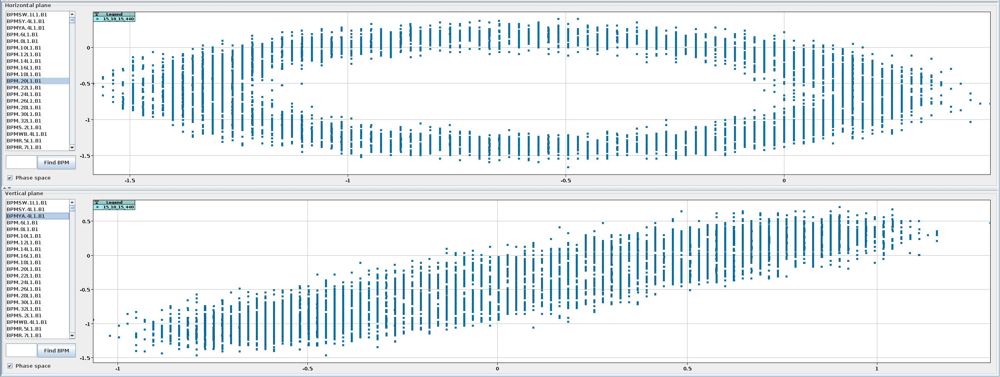

# The Beta-Beat GUI BPM Panel

<figure>
  

  
  <figcaption>The BPM Panel.</figcaption>
  

</figure>

The BPM panel provides a graphical interface to query and visualize information for the BPM data files, i.e. the Turn-by-Turn data.

## Loading Data

### Measurement Groups aka Kick Groups

!!! warning "Not yet implemented"
    The GUI does not yet support loading of measurement groups (i.e. kick groups).
    The idea is to load all data from a single [kick-group, as defined in the Multiturn GUI](../multiturn/excitation.html#kick-groups) at once
    or monitor a currently active kick-group and load the files as they are created.

### Open Files

Use the ++"Open Files"++{.green-gui-button} button to open turn-by-turn data.

<figure>
  

  
  <figcaption>The Open Files Dialog.</figcaption>
  

</figure>

!!! warning "Model Required"
    To be able to load files, you need to first need to have a [model loaded](model_creation.md#model-selection-window).
    The name of the model will appear at the top of the GUI.
    This is required, as the BPMs are checked vs the model and sorted by longitunial location.

!!! warning "Naming Filter"
    For the LHC, the displayed files in the file-dialog are automatically filtered to show only `@BunchTurn` files of the currently selected beam.
    You can change/deactivate that filter ("Files of Type") at the bottom of the dialog!

Multiple files can be opened at once and are added to the current `Measurements` directory, as well as to the table of loaded files in the panel.
If the file contained multiple bunches, they are added as separate entries.

!!! warning "Supported Formats"
    The GUI itself only supports the opening of LHC-type (dual plane BPMs) or SPS-type (single plane BPMs) binary `.sdds` files.
    You can choose in the [gui tab of the settings](settings.md#gui-tab) which format your turn-by-turn data is and if you want
    to convert it into one of the supported formats.
    The GUI will then call the [`omc3.tbt_converter`][tbt_converter] to convert the file.
    All formats that can be read by the [`turn-by-turn` package][tbt_package] are supported.
    If you choose the **"DO NOT CONVERT"** option, the files are simply copied into the current `Measurements` directory.

If the ["Analyse TbT files on opening" setting](settings.md#gui-tab) is active, a window will open to prompt the user with the ["Do analysis Dialog"](bpm_panel.md#do-analysis).

## Investigating Data

After selecting one or more files in the table of loaded files, the turn-by-turn data is visualized in the two bottom charts, one for each plane.
The charts are [interactive](common_components.md#plotting) and can display either the measured amplitude values over turns for every BPM from the list or display the phase space, which is calculated by two consecutive BPMs.
You can select multiple measurements at once to compare them, but only one BPM per plane at a time.

<figure>
  

  
  <figcaption>Turn-by-Turn view of BPM data with two measurements selected.</figcaption>
  

</figure>

<figure>
  

  
  <figcaption>Phase space view of BPM data.</figcaption>
  

</figure>

!!! info "Bad BPMS"
    After [harmonic-analysis](#do-analysis) has been performed, the [bad BPMS][bpm_filtering] will be marked in red in the lists.

### Averages, Removal of Turns and Splitting Files

!!! warning "Broken Functionality"
    These features [are currently broken][issue283] and we are considering whether they are actually needed.

The buttons on the top left side of the pane provide some features to handle the BPM data.

- ++"Create Average"++ allows loading several data files too visualize their average repesentations on the same graph, which helps detecting differences or reducing noise.
- ++"Remove Turns"++ can be used to cut turns from the start or the end, to focus on a specified range of the data.
- ++"Split Files"++ splits the current BPM data file into N files, where N is specified in the dialog and the resulting files will have old-turns/N turns.

## Do Analysis

- `Do Analysis` spawns the configuration dialogue for the external analysis.
  This will call an external program to perform harmonic analysis of the BPM data, in order to compute tunes and similar beam properties.
  The results from the analysis can be seen in the [Analysis Panel](analysis_panel.md).

!!! todo

    Include of screenshot of `Do Analysis` dialogue window.

!!! note

    The `Create Average` option requires synchronized data from withing the same bounds, otherwise the results will be meaningless.
    The figure below shows three runs from LHC beam one with synchronized peaks for every turn and their corresponding averages.

[svd_clean_rhic]: https://journals.aps.org/prab/abstract/10.1103/PhysRevSTAB.7.042801
[tbt_converter]: https://github.com/pylhc/omc3/blob/master/omc3/tbt_converter.py
[tbt_package]: https://github.com/pylhc/turn_by_turn
[issue283]: https://gitlab.cern.ch/acc-co/lhc/lhc-app-beta-beating/-/issues/283
[bpm_filtering]: ../../measurements/physics/bpm_filtering.md