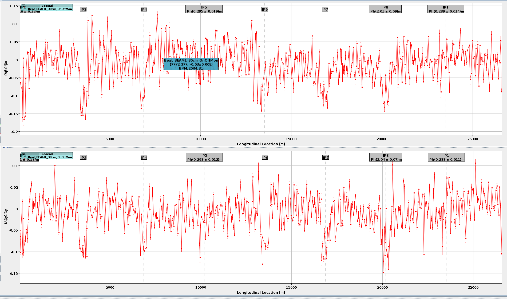
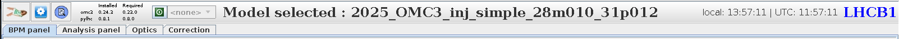
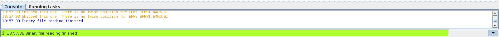
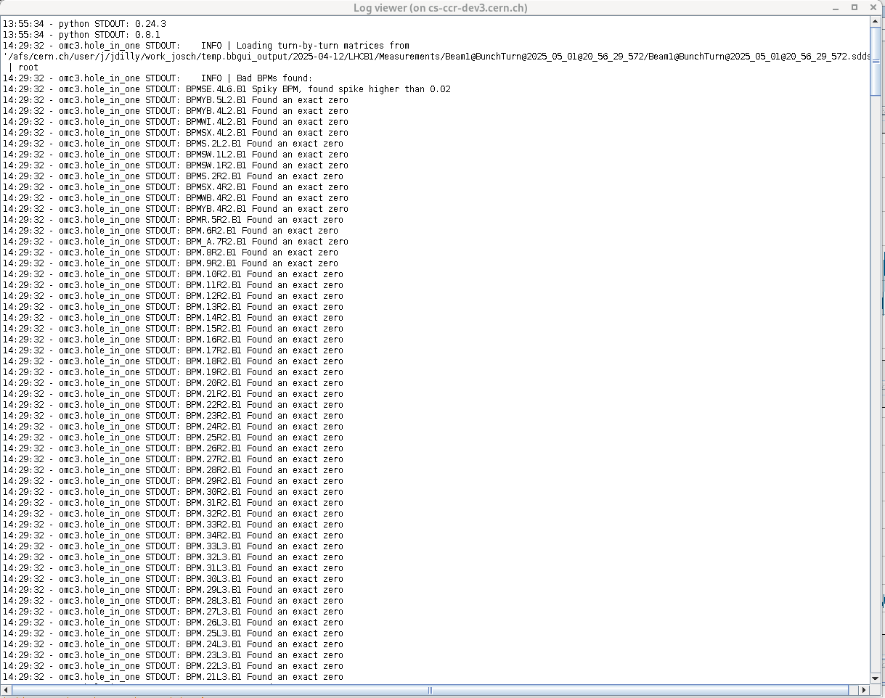
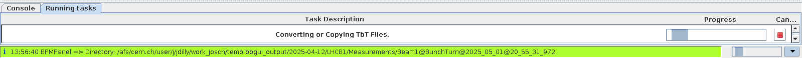
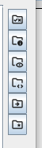

# Common Components

Independent of which tab is selected, some general components of the UI are common or even always present.

!!! note "Changing the Layout"
    The layout of the GUI can be changed temporarily by dragging the splitters, which show the "^v" symbols.
    It is also possible to completely hide the lower [Console](#console) and [Tasks](#running-tasks) tabs by clicking the "V" symbol in the lower right corner.
    These changes are not saved and will be lost when the GUI is closed.

## Plotting

All plots are running with the same back-end classes, which allows additional control via mouse and keyboard.

<figure>
  

  
  <figcaption>Hover info on a Beta-Beating Plot.</figcaption>
  

</figure>

- **Zoom**: Zooming can be achieved by drawing a rectangle with the left mouse button or with the shortcuts listed below.
- **Hover Info**: The plots support the "hover" feature, which allows you to inspect additional details about the plotted points by hovering your mouse cursor over them.

### Shortcuts

- ++lbutton++ : Draw and zoom into rectangle.
- ++mbutton++ : Auto-zoom (in 3 Steps: 4&sigma;, 3&sigma;, 2&sigma;).
- ++rbutton++ : Undo last step.
- ++shift+rbutton++ : Undo all steps (reset plot).
- ++mousewheel++ : Zoom relative to mouse position.
- ++shift+mousewheel++ : Zoom y-axis relative to mouse position.
- ++alt+mousewheel++ : Zoom relative to plot center.
- ++shift+alt+mousewheel++ : Zoom y-axis relative to plot center.

## Top of the GUI

<figure>
  

  
  <figcaption>The top of the GUI.</figcaption>
  

</figure>

At the top left you can find **buttons** to start

- The [model management](model_creation.md).
- A [settings window](settings.md).
- The [logging window](#logging).

The next part shows you which **version** of the [omc3][omc3] and [pylhc][pylhc] packages are installed in your
currently selected `python` environment  and which ones are recommended by the current version of the GUI.
If you are using an older version than recommended, a lot of the functionality might still work, but some
features might be missing or not work with the arguments the GUI provides.

The colored button and dropdown menu that follows is the **RBAC** (Role Based Access Control) menu,
which shows you the current status of, and allows you to aquire, an access token,
e.g. for the [creation of knobs](correction_panel.md#knob-creation).

Next, in the middle of the screen, the **currently selected model** is shown.
This is the model that is usually passed on to the [python tasks](#running-tasks)
and it can be changed in the [model selection](model_creation.md).

Finally, on the right side we have the **current time** in local time and UTC,
as well as the beam/machine that was selected in the [beam selection window](beam_selection.md)
and which defines the current [folder structure](beam_selection.md#folder-structure).

## Logging

There are multiple places to check for logs in the GUI.

### Console

<figure>
  

  
  <figcaption>Logging console.</figcaption>
  

</figure>

At the bottom of the GUI you can find the **Console** tab,
which shows the most recent status entries.
These are the logging information that come from the GUI itself and are very basic in nature.
The most recent of these messages is also printed below, in the status bar.

### Log Viewer

<figure>
  

  
  <figcaption>Log viewer.</figcaption>
  

</figure>

The **Log Viewer** can be opened via the third button on the top left and shows the captured output of
the [tasks](#running-tasks) started from the GUI.
This information is much more detailed than the [console](#console), and should be consulted whenever
an error is reported.

By default the `python` logging is initialized at the `INFO` level.
To enable a more detailed output, you can change the logging level to `DEBUG` for all tasks in the [settings window](settings.md#gui-tab).

### Terminal

If the GUI was started from the terminal and the [`consoleLogging` option](defaults.md#additional-gui-defaults) is set to `True`
additional logging information will be printed to the terminal.

## Running Tasks

<figure>
  

  
  <figcaption>Running Tasks.</figcaption>
  

</figure>

A "task" in the context of this GUI means the running of an external program in a separate process.
Sometimes even multiple processes might be started consecutively in the same taks, if they are dependent on each other.
As the GUI is a front-end for our `python` library, the external processes are usually calls to `python` modules,
constructed from the currently selected files and [settings](settings.md).
The exact call can often be found in the [terminal](#terminal) or in the `command.run` files often created by th GUI in the selected output folder,
as well as at the top of the `.ini` files created by `python`.

When a task is started from the GUI, it is shown in the **Running tasks** tab found at the bottom of the GUI next to the console,
with a small animation to indicate that it is running.

As long as any task is running, there will also be a small animation on the right of the status bar at the very bottom.

!!! warning "Cancellation of Tasks"
    Despite there being "Cancel" :fontawesome-regular-circle-stop:{.cernred} sign next to the running tasks,
    the tasks cannot really be aborted and either nothing will happen or the task entry will vanish,
    but the actual task will keep running in the background.
    This needs to be implemented in the future.

## File Opening Dialogs

To make navigating between different folders easier, especially considering the deeply nested paths of `afs` and `nfs`,
some shortcuts have been implemented into the file opening dialogs, which become available for all relavant dialogs **after [the beam selection window](beam_selection.md)**.
They can be found at the top right of the dialog, and hovering them will show their functionality:

<figure>
  

  
  <figcaption>Special links in the file opening dialogs.</figcaption>
  

</figure>

- **First Path** (:fontawesome-solid-check::fontawesome-solid-x:):
Return to the initial path you were in when the window opened.
- **Input Path** (:fontawesome-solid-circle-info:):
Go to the path set as [_Input Path_ in the beam selection window](beam_selection.md#input).
- **Output Path** (:fontawesome-solid-eye:):
Go to the path set as [_Output Path_ in the beam selection window](beam_selection.md#output).
- **Root Path** (**<>**)
Go to the root-path for the current GUI instance, i.e. the path in which the accelerator-folder (e.g. `LHCB1`) is located.
This is usually the date-directory within the output folder, unless you have choosen that folder as the _Output Path_,
in which case it will be the same as the _Output Path_ (see the [Continue Analysis Admonition in the Beam Selection Window](beam_selection.md#folder-structure)).
- **Fill Dir** (:fontawesome-solid-arrow-right:) _(Only available for the LHC and only if the folder is mounted)_:
Go to the fill-directory of [the choosen accelerator](beam_selection.md#beam).
- **Accelerator Dir** (:fontawesome-solid-star:) _(Only available for LHC, SPS, PS and PSB, and only if the folder is mounted)_:
Go to the default OMC analyis directory of [the choosen accelerator](beam_selection.md#beam),
which is usually the same as [the _Output Dir_, if the default is used in the beam selection window](beam_selection.md#output).

[omc3]: https://github.com/omc3
[pylhc]: https://github.com/PyLHC