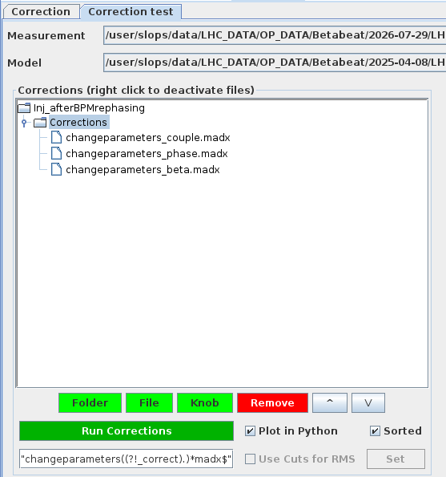
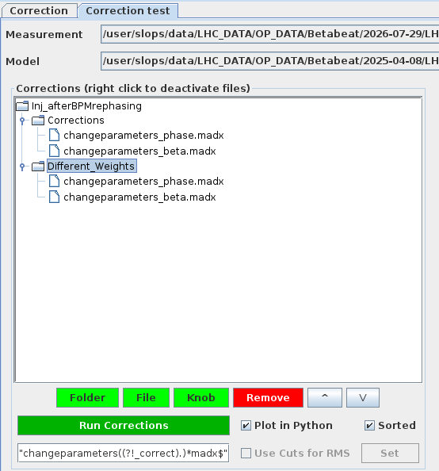
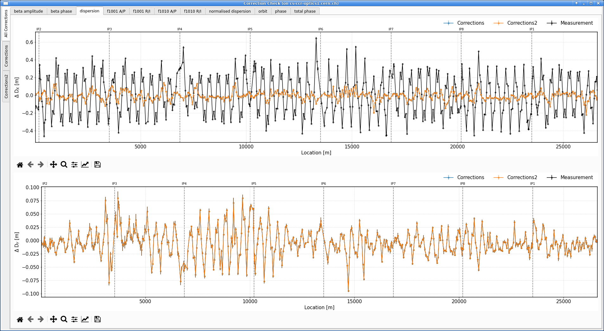
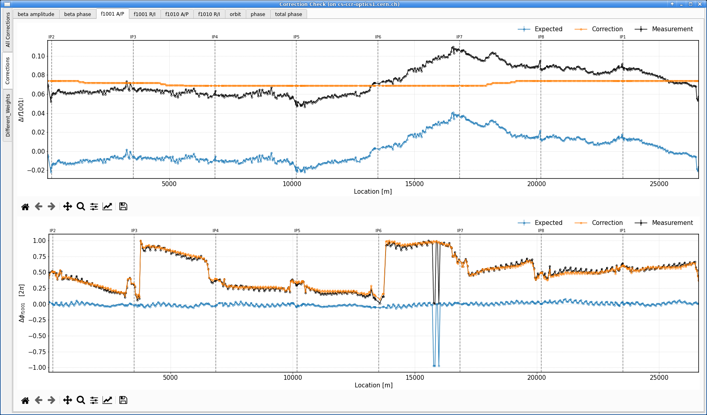

# The Correction Panel

The `Correction` panel is where global corrections [computed in the `Optics` panel](optics_panel.md#computing-global-corrections) are loaded, reviewed and tested, with the aim of bringing the measured machine as close as possible to nominal model conditions.
It also gives access to the `Knob Panel`, used to turn a correction into a knob in the LSA database for use in operations.
The panel is split into two sub-tabs: `Correction` and `Correction test`.

The default view is the `Correction` tab, which loads correction files and displays the resulting powering of the affected magnets or knobs once a correction is applied.
The `Correction test` tab will be covered further down, see [checking corrections](#checking-corrections).

<figure>
  

  
  <figcaption>The <code>Correction</code> panel's default appearance.</figcaption>
  

</figure>

The `Correction` tab is organised into three areas.
On the left is a table listing the loaded correction files, named as the relative path to the corresponding `changeparameters_*.tfs` file.
Any correction computed in the [`Optics` panel](optics_panel.md#computing-global-corrections) will appear here automatically
Clicking the ++"Load Correction Files"++{.green-gui-button} button above the table opens a dialogue to select and load previously determined corrections from disk.

To the right, the `Strengths` plot displays the resulting powering of each affected magnet or knob after the selected correction is applied.
Below the table, the ++"Open Knob Panel"++{.blue-gui-button} button allows exporting a correction as a knob, see [knob creation](#knob-creation).

!!! info "About Correction Files"

    Now is a good time to recap what results from determining a correction in the [`Optics` panel](optics_panel.md#computing-global-corrections).

    Each computed correction for a given parameter (e.g. phase) creates the following files in the `Corrections` folder:

    - A `changeparameters_*.tfs` file: the correction as a knob table, holding one powering *delta* per corrector — the change to apply to correct the machine (see [viewing corrections](#viewing-corrections)).
    - A `changeparameters_*_correct.madx` file: the same correction (deltas) expressed as `MAD-X` assignments, to apply in order to correct the machine.
    - A `changeparameters_*.madx` file: the counterpart that instead makes the *model reproduce the measurement*; this is the file the [correction test](#checking-corrections) calls.
    - A `changeparameters_*_gui.ini` file: a record of the settings used for the run, written by the Python side process.

## Viewing Corrections

Clicking an entry in the correction table on the left displays the resulting powering in the `Strengths` plot on the right, with one bar per affected magnet or knob.

<figure>
  

  
  <figcaption>The <code>Correction</code> tab with correction files loaded; the <code>Strengths</code> plot on the right shows the resulting powering of each corrector for the selected correction.</figcaption>
  

</figure>

These values are the absolute powering of each element once the correction is applied.
They must not be confused with the `changeparameters_*.tfs` file, which instead lists the *delta* to apply to each element: the change in powering, not the resulting absolute value shown in the plot.

Hovering over a specific bar reveals the name of the magnet it corresponds to along with its exact value.
One can inspect these values to check that constraints are respected, e.g. no magnet would end up outside of its powering limits.

!!! failure "No Multi Selection"

    Note that unlike in the `Optics` panel, selecting multiple correction entries from the table will not lead to a comparison.
    This is due to the often different set of correctors modified by different corrections.
    Instead, only one of the correction will have its strengths displayed.

In the case of some corrections which instead of individual magnets use knobs, one bar will be shown for each knob.
This is the case for e.g. the global coupling correction.

!!! tip "Global Coupling Corrections Trims"
    In the special case of global coupling corrections computed with the [coupling preset](optics_panel.md#presets), and to facilitate the user's work, double clicking on the correction file name in the table will spawn a popup detailing the exact trim to apply in the accelerator cockpit app.

    <figure>
      

      
      <figcaption>The global coupling trim popup, highlighting the exact determined corrections and corresponding trims to apply on each knob.</figcaption>
      

    </figure>

## Checking Corrections

The `Correction test` tab lets one apply a determined correction to the measurement's associated model and inspect its effect.
Running a correction then plots, for each correctable parameter, both the effect of the correction itself and the expected result of applying it.

<figure>
  

  
  <figcaption>The <code>Correction test</code> tab's default appearance.</figcaption>
  

</figure>

### Preparing a Test

!!! info "One Measurement at a Time"

    Unlike the `Correction` tab, which can list corrections for several measurements at once, the `Correction test` tab operates on a single measurement at a time.
    It is possible however to hold and test several different corrections (individually or together) for this measurement.

At the top of the tab, two dropdown menus define what the correction test runs on:

- `Measurement`: the measurement to test. The dropdown lists entries known to the GUI (e.g. any measurement for which a correction was loaded in the previous tab), and an `Other...` entry that, when selected, opens a file dialogue to pick any measurement folder from disk.
- `Model`: the model to apply the corrections to. It likewise lists known models (e.g. available in the `Models` menu) and also provides an `Other...` option with the behaviour stated above. Note that the model should naturally be one that matches the selected measurement.

The selected measurement then appears in the tree on the left, with its `Corrections` folder beneath it listing the available `changeparameters_*.madx` correction files.

!!! tip "Deactivating a File"
    Right-clicking a file in the tree deactivates it, excluding it from the correction run without removing it from the tree.
    This makes it easy to toggle a correction in or out of a scenario without having to delete and re-add it.

Different individual corrections can be tested and compared against one another.
Different combinations of corrections can also be tested and compared against one another.
The buttons below this table provide options to do so:

- ++"Folder"++{.green-gui-button}: prompts for a name and creates a new corrections folder with that name. This button is always available, and the new folder is created as a sibling of the original `Corrections` folder in the tree (i.e. at the same level).
- ++"File"++{.green-gui-button}: opens a file dialogue to pick a correction file — which should follow the `changeparameters_*.madx` naming and copies it into the selected folder. It is only available when a corrections folder is selected: the original `Corrections` or one created with ++"Folder"++.
- ++"Knob"++{.green-gui-button}: opens the `Knob selection panel` to search `LSA` for knobs, inspect their content, and import a chosen one as a file to include in the correction. Like ++"File"++, it is only available when a corrections folder is selected.

    !!! warning "Knob Import — Currently Not Working"
        The ++"Knob"++ button opens a `Knob selection panel`, but none of its controls currently have any effect.
        When functional, the panel is intended to let one search `LSA` for knobs, inspect their components, and import a selected knob as a correction file.

- ++"Remove"++{.red-gui-button}: removes the selected entry, file or folder, after a yes/no confirmation popup.

Note that a corrections folder can hold several files; the correction test applies every file in it that matches the file filter, the regular expression shown at the bottom of the tab.
By default this filter picks up the `changeparameters_*.madx` files.
It can be edited to select a different set.

By combining the options above one can assemble several correction scenarios.
The tabs below show a few typical setups of the corrections tree:

=== "Single Correction"

    <figure>
      

      
      <figcaption>A single correction in the <code>Corrections</code> folder: the test runs and plots just this one.</figcaption>
      

    </figure>

=== "Combined Correction"

    <figure>
      

      
      <figcaption>Several correction files placed in the same folder are applied <em>together</em> as one combined scheme.</figcaption>
      

    </figure>

=== "Comparing Schemes"

    <figure>
      

      
      <figcaption>Two folders holding the same correction computed with different weights, to be compared.</figcaption>
      

    </figure>

### Running the Test

Clicking ++"Run Corrections"++{.green-gui-button} then launches the test: each folder in the tree is run as a separate scenario, and the results are plotted together when done.

!!! info "What Happens When Running a Correction"

    Under the hood, the GUI launches the `omc3.check_corrections` module, handing it the selected model and correction files, which:

    - Writes a `job.create_twiss_matched.madx` file in the `Corrections` folder, which calls the provided model and the correction files matching the filter,
    - Runs `MAD-X` to build the corrected ("matched") model,
    - Compares this matched model to the nominal one to determine the correction effect,
    - Uses data from the measurement to determine the expected result from applying this correction.

Two checkboxes next to the ++"Run Corrections"++{.green-gui-button} button control how the run behaves and where its plots go:

- `Plot in Python`: should always be left ticked (its default) as the Java-side plotting has been removed. When checked, a `Qt`-based window opened by the Python process will display the results.
- `Sorted`: if checked (the default), the per-correction plot files are saved into their correction subfolders; otherwise they all go into the measurement directory.

### Reading the Results

A `Correction Check` window opens once the run finishes.
It carries two sets of tabs:

- Those along the top select the optics quantity to display (`beta amplitude`, `beta phase`, `dispersion`, `f1001`, `f1010`, `orbit`, `phase`, `total phase`)
- Those to the left of the window select which correction to look at.

The first left-hand tab is always `All Corrections`, and is a comparison overview.
For the selected quantity it shows the `Measurement` values together with the expected end result of each tested correction.
It shows one curve per scheme, labelled by its folder name, which allows all defined schemes to be judged against one another at a glance.

<figure>
  

  
  <figcaption>The <code>All Corrections</code> tab compares the expected end result of every tested correction against the measurement, here on the dispersion.</figcaption>
  

</figure>

Each of the remaining left-hand tabs corresponds to one correction scheme (one folder from the tree). For the selected quantity it shows three curves:

- `Measurement`: the measured deviation from the model.
- `Correction`: the effect of the correction on the model, which aims to reproduce the measurement. A good correction lies on top of the `Measurement` curve.
- `Expected`: the residual that would remain if the correction were applied to the machine. A good correction brings this close to zero.

<figure>
  

  
  <figcaption>A per-scheme view, showing the <code>Measurement</code>, the <code>Correction</code>, and the <code>Expected</code> residual, here on the <code>f1001</code> amplitude and phase.</figcaption>
  

</figure>

!!! note "Legacy Plotting Controls"
    The controls in the lower-left corner of the tab (the `Details Beta*` button as well as the `Measured`, `Correction` and `Expected` checkboxes) are remnants of the old Java-side plotting, which has been removed.
    They no longer have any effect and can be ignored.

## Knob Creation

<!-- TODO: If a correction is good we want to make a knob including the determined settings and upload it to LSA so we can run it in the machine -->
<!-- TODO: to do so go back to the `Correction` tab and click the ++"Open Knob Panel"++{.blue-gui-button} to access the LHC beam process list. -->

### The Knob Panel

Through the `Knob Panel`, corrections can be provided directly inside the LHC beam system.

<figure>
  

  
  <figcaption>The <code>Knob Panel</code> on its <code>Creation</code> tab, listing the beam processes from which a knob is built.</figcaption>
  

</figure>

!!! warning "Technical Network Access Needed"
    Being inside of the Technical Network is required for the `Knob panel` functionality.

!!! warning "EIC Needed"
    Creating an uploading a knob to LSA requires elevated rights which only the EIC will have.
    A popup will ask for a login, let them enter their ID and password for the knob creation to proceed

In the `Knob Panel`, one can create Knobs (in the `Creation` tab) by using the previously computed corrections.

To create a knob, one or several beam processes have to be selected.
Once selected, the corresponding optics will appear.
At least one optic has to be selected.

After providing a `Knob name`, the `Create Knob` button will create a new Knob in the LSA database.

The `View Knobs` tab displays a list of all BETA-BEATING Knobs.
By selecting one, the user can examine or visualise the values attributed to each component.

<!-- TODO: Include a screenshot of the Knob Panel view knobs table? -->

<!-- TODO: Include a screenshot of the Knob Panel view knobs chart? -->

*[LSA]: LHC Software Architecture
*[EIC]: Engineer in Charge