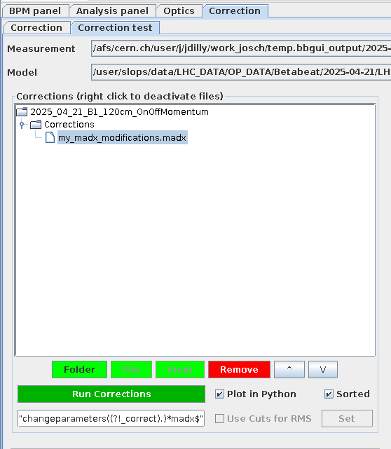

# The Correction Panel

The `Correction` panel displays the corrections computed from the `Optics` panel to bring back the measured machine to nominal model conditions.

## Viewing Corrections

DEFAULT VIEW

!!! tip "Coupling Corrections Trims"
    Special case: double click the correction file name and you will see what corrections and trims this leads to.
    <!-- TODO: include screenshot -->

## Checking Corrections

<figure>
  

  
  <figcaption>Q.</figcaption>
  

</figure>

<figure>
  

  
  <figcaption>QQ.</figcaption>
  

</figure>

<figure>
  

  
  <figcaption>QQQ.</figcaption>
  

</figure>

## Knob Creation

It provides an `Open Knob Panel` button to access the LHC beam process list.

### The Knob Panel

Through the `Knob Panel`, corrections can be provided directly inside the LHC beam system.

!!! info
    Being inside of the Technical Network is required for the KnobPanel.
    To do so, `ssh` into one of the hosts, for instance `cs-ccr-dev<number>.cern.ch`.

In the `Knob Panel`, one can create Knobs (in the `Creation` tab) by using the previously computed corrections.

To create a knob, one or several beam processes have to be selected.
Once selected, the corresponding optics will appear.
At least one optic has to be selected.

After providing a `Knob name`, the `Create Knob` button will create a new Knob in the LSA database.

!!! todo
    Include a screenshot of the Knob Panel on creation tab

The `View Knobs` tab displays a list of all BETA-BEATING Knobs.
By selecting one, the user can examine or visualise the values attributed to each component.

!!! todo
    Include a screenshot of the Knob Panel view knobs table

!!! todo
    Include a screenshot of the Knob Panel view knobs chart
