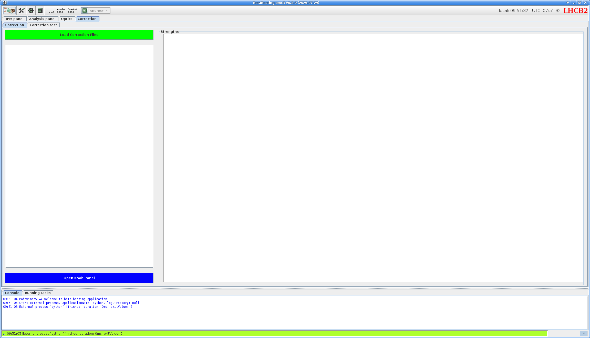
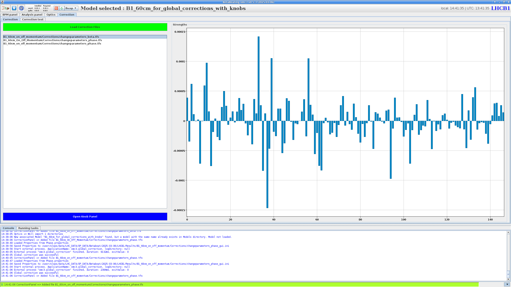
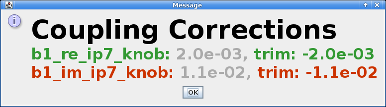
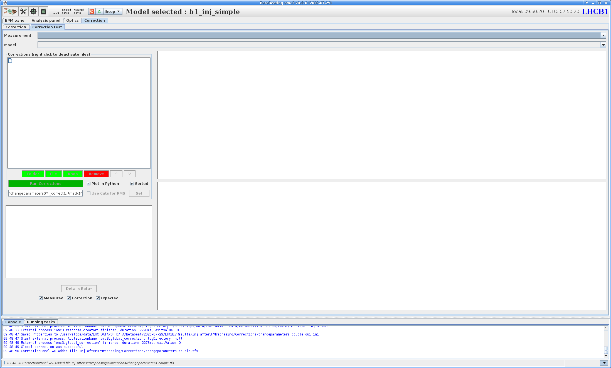
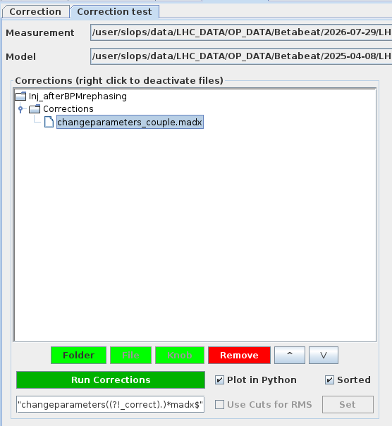
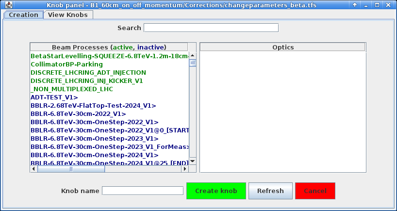

# The Correction Panel

The `Correction` panel is where global corrections [computed in the `Optics` panel](optics_panel.md#computing-global-corrections) are loaded, reviewed and tested, with the aim of bringing the measured machine as close as possible to nominal model conditions.
It also gives access to the `Knob Panel`, used to turn a correction into a knob in the LSA database for use in operations.
The panel is split into two sub-tabs: `Correction` and `Correction test`.

The default view is the `Correction` tab, which loads correction files and displays the resulting powering of the affected magnets or knobs once a correction is applied.
The `Correction test` tab will be covered further down, see [checking corrections](#checking-corrections).

<figure>
  

  
  <figcaption>The <code>Correction</code> panel's default appearance.</figcaption>
  

</figure>

The `Correction` tab is organised into three areas.
On the left is a table listing the loaded correction files, named as the relative path to the corresponding `changeparameters_*.tfs` file.
Any correction computed in the [`Optics` panel](optics_panel.md#computing-global-corrections) will appear here automatically
Clicking the ++"Load Correction Files"++{.green-gui-button} button above the table opens a dialogue to select and load previously determined corrections from disk.

To the right, the `Strengths` plot displays the resulting powering of each affected magnet or knob after the selected correction is applied.
Below the table, the ++"Open Knob Panel"++{.blue-gui-button} button allows exporting a correction as a knob, see [knob creation](#knob-creation).

!!! info "About Correction Files"

    Now is a good time to recap what results from determining a correction in the [`Optics` panel](optics_panel.md#computing-global-corrections).

    Each computed correction for a given parameter (e.g. phase) creates the following files in the `Corrections` folder:

    - A `changeparameters_*.tfs` file: the correction as a knob table, holding one powering *delta* per corrector — the change to apply to correct the machine (see [viewing corrections](#viewing-corrections)).
    - A `changeparameters_*_correct.madx` file: the same correction (deltas) expressed as `MAD-X` assignments, to apply in order to correct the machine.
    - A `changeparameters_*.madx` file: the counterpart that instead makes the *model reproduce the measurement*; this is the file the [correction test](#checking-corrections) calls.
    - A `changeparameters_*_gui.ini` file: a record of the settings used for the run, written by the Python side process.

## Viewing Corrections

Clicking an entry in the correction table on the left displays the resulting powering in the `Strengths` plot on the right, with one bar per affected magnet or knob.

<figure>
  

  
  <figcaption>The <code>Correction</code> tab with correction files loaded; the <code>Strengths</code> plot on the right shows the resulting powering of each corrector for the selected correction.</figcaption>
  

</figure>

These values are the absolute powering of each element once the correction is applied.
They must not be confused with the `changeparameters_*.tfs` file, which instead lists the *delta* to apply to each element: the change in powering, not the resulting absolute value shown in the plot.

Hovering over a specific bar reveals the name of the magnet it corresponds to along with its exact value.
One can inspect these values to check that constraints are respected, e.g. no magnet would end up outside of its powering limits.

!!! failure "No Multi Selection"

    Note that unlike in the `Optics` panel, selecting multiple correction entries from the table will not lead to a comparison.
    This is due to the often different set of correctors modified by different corrections.
    Instead, only one of the correction will have its strengths displayed.

In the case of some corrections which instead of individual magnets use knobs, one bar will be shown for each knob.
This is the case for e.g. the global coupling correction.

!!! tip "Global Coupling Corrections Trims"
    In the special case of global coupling corrections computed with the [coupling preset](optics_panel.md#presets), and to facilitate the user's work, double clicking on the correction file name in the table will spawn a popup detailing the exact trim to apply in the accelerator cockpit app.

    <figure>
      

      
      <figcaption>The global coupling trim popup, highlighting the exact determined corrections and corresponding trims to apply on each knob.</figcaption>
      

    </figure>

## Checking Corrections

The `Correction test` tab lets one apply a determined correction to the measurement's associated model and inspect its effect.
Running a correction then plots, for each correctable parameter, both the effect of the correction itself and the expected result of applying it.

<figure>
  

  
  <figcaption>The <code>Correction test</code> tab's default appearance.</figcaption>
  

</figure>

!!! info "One Measurement at a Time"

    Unlike the `Correction` tab, which can list corrections for several measurements at once, the `Correction test` tab operates on a single measurement at a time.
    It is possible however to hold and test several different corrections (individually or together) for this measurement.

At the top of the tab, two dropdown menus define what the correction test runs on:

- `Measurement`: the measurement to test. The dropdown lists entries known to the GUI (e.g. any measurement for which a correction was loaded in the previous tab), and an `Other...` entry that, when selected, opens a file dialogue to pick any measurement folder from disk.
- `Model`: the model to apply the corrections to. It likewise lists known models (e.g. available in the `Models` menu) and also provides an `Other...` option with the behaviour stated above. Note that the model should naturally be one that matches the selected measurement.

The selected measurement then appears in the tree on the left, with its `Corrections` folder beneath it listing the available `changeparameters_*.madx` correction files.

<figure>
  

  
  <figcaption>The <code>Correction test</code> tab with a measurement selected; its <code>Corrections</code> folder and correction file appear in the tree on the left.</figcaption>
  

</figure>

Different individual corrections can be tested and compared against one another.
Different combinations of corrections can also be tested and compared against one another.

The buttons below this table provide options to do so:

- ++"Folder"++{.green-gui-button}: Write.
- ++"File"++{.green-gui-button}: Write.
- ++"Knob"++{.green-gui-button}: Write.
- ++"Remove"++{.red-gui-button}: Write.

!!! info "Running a Correction"

    Clicking ++"Run Corrections"++{.green-gui-button} does not itself perform the computation: the GUI only launches the `omc3.check_corrections` module, handing it the selected model and correction files.
    On the Python side, `omc3` then writes a `job.create_twiss_matched.madx` file in the correction's output folder, which calls the model and the `changeparameters_*.madx` files and runs `MAD-X` to build the corrected ("matched") model.
    This matched model is compared to the nominal model and to the measurement to determine both the effect of the correction and its expected result.

<!-- TODO: show the correction test in python -->

## Knob Creation

It provides an `Open Knob Panel` button to access the LHC beam process list.

### The Knob Panel

Through the `Knob Panel`, corrections can be provided directly inside the LHC beam system.

<figure>
  

  
  <figcaption>The <code>Knob Panel</code> on its <code>Creation</code> tab, listing the beam processes from which a knob is built.</figcaption>
  

</figure>

!!! warning "Technical Network Access Needed"
    Being inside of the Technical Network is required for the `Knob panel` functionality.

In the `Knob Panel`, one can create Knobs (in the `Creation` tab) by using the previously computed corrections.

To create a knob, one or several beam processes have to be selected.
Once selected, the corresponding optics will appear.
At least one optic has to be selected.

After providing a `Knob name`, the `Create Knob` button will create a new Knob in the LSA database.

The `View Knobs` tab displays a list of all BETA-BEATING Knobs.
By selecting one, the user can examine or visualise the values attributed to each component.

<!-- TODO: Include a screenshot of the Knob Panel view knobs table -->

<!-- TODO: Include a screenshot of the Knob Panel view knobs chart -->

*[LSA]: LHC Software Architecture
