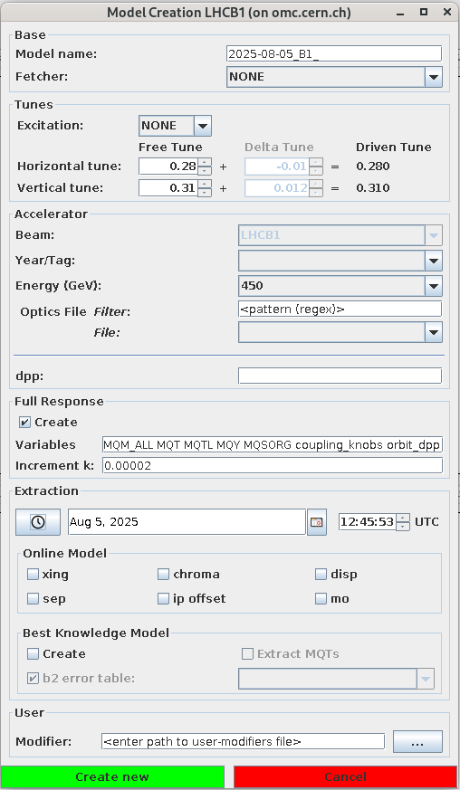

# Model Creation

<figure>
  

  
  <figcaption>Model selection window.</figcaption>
  

</figure>

<figure>
  

  
  <figcaption>Model selection window with a created model</figcaption>
  

</figure>

<figure>
  

  
  <figcaption>Model creation window for the LHC.</figcaption>
  

</figure>