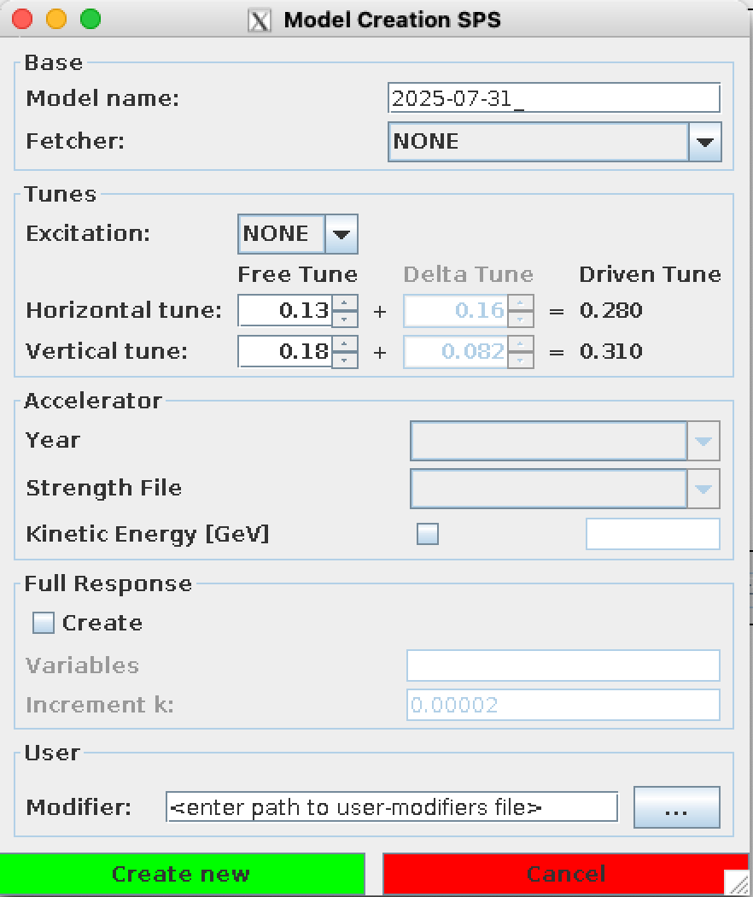

# Model Creation

## Model Selection Window

The _model selection window_ **opens automatically** after starting the main GUI frame from the [beam selection window](beam_selection.md).
This window can be opened at any time by clicking the **left-most button at the top** of the GUI, depicting a "model".

<figure>
  

  
  <figcaption>Open the model creation window with the left-most button at the top, depicting a model.</figcaption>
  

</figure>

If there have been no models previously created, the top part of the window will be blank.
After [creating a model](#model-creation-window), the window will show the **folder names** in the _Models_ folder of the
accelerator sub-folder selected in the [beam selection window](beam_selection.md).

=== "Blank Model Selection Window"

    <figure>
    

    
    <figcaption>Blank Model selection window.</figcaption>
    

    </figure>

=== "Model Selection Window with Created Model"

    <figure>
    

    
    <figcaption>Model selection window with a created model</figcaption>
    

    </figure>

The buttons at the bottom of the window are:

- ++"Create New"++ :
Opens the [model creation window](#model-creation-window) for a new model.
- ++"Load"++{.green-gui-button} _(If a model exists and is selected)_:
Sets the currently chosen model as "selected model" in the GUI and closes this window.

    !!! warning "Loading a model under creation"
        This first checks if certain files are present in the model folder; e.g. if the model is still under creation (check the [running tasks](common_components.md#running-tasks)), it will show an error in the [status bar](common_components.md#console).

- ++"Delete"++{.red-gui-button} _(If a model is selected)_:
Deletes the selected model folder **from disk** :fontawesome-solid-triangle-exclamation:{.warning-colored}.
- ++"Import External"++{.yellow-gui-button} :
Opens a file-dialog
to select a folder with a previously created model at a location outside the current accelerator's _Models_ folder and copies it there.
- ++"Update MQTs"++{.blue-gui-button} _(If a model is selected)_:
Updates the values of the MQTs (which are saved in a separate file) in the currently selected model via extraction from `NXCals`.
A window will open to select a time to extract the MQTs from, which default to the current time.

    !!! warning "Updating MQTs"
        This only **updates** the MQTs, which means they need to have been extracted before.
        It checks in the model folder if the `extracted_mqts.str` file is present, which it updates,
        and if `job.create_model_best_knowledge.madx` exists, which is then reused to re-run.

    !!! warning "Updating MQTs to re-use model"
        It is **heavily discouraged** to update the MQTs to re-use a model later during a shift,
        as it will lead to confusion if optics have already been analyzed with this model and someone tries to reproduce the results later.
        It is therefore usually better to create a new model from scratch and **only use this functionality before doing any analysis**,
        e.g. if you extracted the MQTs too early, or if you created a copy of an older model.

## Model Creation Window

After clicking on ++"Create New"++ in the [model selection window](#model-selection-window), _model creation window_ opens.

Currently model creation is only implemented in the GUI for the [LHC](#lhc-model-creation), [SPS](#sps-model-creation), [PS](#ps-model-creation), and [PSB](#psbooster-model-creation) accelerators.

### General

All model creation windows for the different accelerators are using **unified window components**, which follow a common structure, described here.
They differ in the accelerator specific details, which are explained in the sections below.

#### Base

- **Model Name**:
The name of the model, which will be used to name the folder for the model.
To easily identify a model later on, this should tell the user at a glance **everything important** about the model, e.g. for which **accelerator** the model was created, which optics where used, which **tunes** were set (if particular), if the excitation was special, if **best knowledge** was also created, etc.
Nowadays, the name comes already with a date as prefix-suggestion.

- **Fetcher**:
Which fetcher should be used to get the optics data from [`acc-models`][acc-models] and populate choices in the _Accelerator_ section of this window.
The choices are **AFS**, which uses the default `acc-models` path on `afs`, and **Path**, which allows you to set a custom path
to a local `acc-models` folder.
After selecting the fetcher, a python process runs in the background to retrieve the data.

    !!! warning "First time running Fetcher"
        If this is your first run with this fetcher, **it might take a while to complete** (up to about a minute). Afterwards, the data is cached and the GUI is updated more quickly.

    !!! warning "Fetcher `NONE` not implemented"
        In the current GUI implementation, a fetcher/`acc-models` is needed to create a model (see [#202][bbgui_issue_202])!
        Switching back from a selected fetcher to `None` might even throw a `NullPointerException` and possibly crash the Model Creation Window.

#### Tunes

This section allows you to define the tunes for the model, including the tunes of the exciter element if applicable.

- **Excitation**:
Choose which exciter drives the beam (or tracking simulation) or **`NONE`** in the case of free kicks.
- **Free Tune**:
The natural tune of the machine, without any driven excitation.
- **Delta Tune** _(Only active if an excitation was selected)_:
The tune delta between the _free tune_ and the _driven tune_, using the same convention as in the [multiturn GUI][multiturn_tune_deltas],
i.e. the difference from the _free tune_ to the _driven tune_ (in contrast to the [tune settings](settings.md#tunes-tab) in which the _driven tune_ is the starting point).
- **Driven Tune**:
This is the tune of the beam during the excitation and is **automatically computed** from the _free tune_ and the _delta tune_.

#### Full Response

This section allows you to activate and define the creation of the full response matrices.
See _[Dilly et al. - An updated global optics correction scheme][dilly2018]{target=_blank}_ and the [`omc3` documentation][global_correction_omc3]{target=_blank} for details.

- **Create**:
Activates the creation of the full response matrices.
- **Variables**:
The variables which are changed to calculate a response of the optics.
The names given here can be the MAD-X circuit names directly, or the group names as defined for the accelerator in `omc3`,
i.e. this follows the same logic as the [variables used for global correction](correction_panel.md).

    !!! tip "Use larger variable groups"
        If you do not create a response for a given variable, you will not be able to use it later on in the correction.
        Hence, you probably want to use larger groups here, to have a wider range of choice for variables later.

- **Increment**:
The value by which each variable will be changed to check the response.

!!! note "FullResponse Task"
    The full-response creation will only start after the model is fully created and you have closed the popup-window
    asking you to load the model or not (see below).
    By that time you can **already use the model** as if it was fully created and you **do not need to wait for this taks to finish** for the _standard_ analysis, until you want to calculate [global corrections](correction_panel.md). 
    The full-response creation is also heavily parallelized where possible, so expect a few processes to run at the same time.

#### User

- **Modifier**:
Path to a MAD-X file, which will be called in MAD-X **after** the above selected optics are applied.
This can be used to install your own optics modifications.

??? info "Modifiers in `omc3`"
    Any change to the accelerator sequence is called a "modifier" in the [model creation in `omc3`][model_creation_omc3]{target=_blank}
    and modifiers are given as a list to the model creator.
    The option here simply appends another entry to this list, which already contains the path to the above selected optics file and possibly the `knobs.madx`, if the online-model was used (see below).
    If you need to call multiple files, you need to add `call, file=...` MAD-X commands into the modifier-file you are providing here.
    When the model is later built, e.g. for the [global correction checks][global_correction_checks], these modifiers
    will be identified from tags in the `job.nominal.madx` file.

??? warning "Deprecated `modifiers.madx`"
    In the past, the modifiers were given as a separate `modifiers.madx` in the model folder.
    Due to backwards compatibility, the `modifiers.madx` file is still somewhat supported, but not encouraged.
    So **giving here a file called `modifiers.madx` within the model folder might lead to unexpected behavior**.

#### Create

Clicking on the ++"Create New"++{.green-gui-button} button will start the model creation.
If any [extraction](#extraction-lhc) is selected, these tasks will run first and they can take a few minutes.

!!! warning "Loading a new Model"
    When the model creation is finished (but before the full-response creation), a popup will ask you if you want to load the model or not.
    Before you see this window, clicking on the ++"Load"++{.green-gui-button} button in the [model selection window](#model-selection-window) will only show an error,
    even though its name already appears in the list, because the model is not yet fully created.

### LHC Model Creation

<figure>
  

  
  <figcaption>Model creation window for the LHC.</figcaption>
  

</figure>

#### Tunes (LHC)

For the LHC the tunes are set by default to `0.28 - 0.01` in horizontal and `0.31 + 0.012` in vertical,
which are our default tunes for LHC measurements.

#### Accelerator (LHC)

- **Beam**:
The beam is pre-defined by the accelerator choosen in the [beam selection window](beam_selection.md).
- **Year/Tag**:
This field is automatically filled by the fetcher with the first layer of subfolders in the `acc-models/lhc` repository by the fetcher.
- **Energy**:
The energy at which the accelerator is running in GeV.
- **Optics File**:
The optics used for the model, which has the same name as the one used in the machine.
The **File** dropdown is automatically filled by the fetcher with the files in the `operation/optics` folder within the choosen _year/tag_
of the `acc-models/lhc` repository.
You can search through the list via regular expression in the **Filter** field.
- **dpp**: The momentum deviation for the model.

#### Extraction (LHC)

This section allows you to extract the actual settings from the LHC via NXCals
at the given UTC time at the top of the section.
Use the :fontawesome-regular-clock:-button to set it to the current time.

We distinguish here between two different cases:

- **Online Model**:
The online model settings are applied to the **nominal model**, which is used almost everywhere throughout the analysis.
There will be no model created without these settings!
You can choose which settings you want to extract, and if any of these are activated, a `knobs.madx` file will be created, which contains the extracted settings mapped to the respective MAD-X variables.
    - **xing**: Crossing angles
    - **sep**: Beam separation
    - **chroma**: Chromaticity values
    - **ip offset**: Beam offsets at the IPs
    - **disp**: Dispersion values
    - **mo**: Powering of the landau octupoles (MOs)
- **Best Knowledge Model**:
The best knowledge model is created with the same settings as the **nominal model**,
i.e. all extracted knobs from the _online model_ are also applied.
In addition, this model contains also the $b_2$ errors of the main dipoles from the [magnetic model][fidel_webpage].
This will result in additional `*_best_knowledge.dat` twiss-output files, which are used in the N-BPM method of the beta-from-phase analysis
(see _[Langner et al. - Utilizing the N beam position monitor method for turn-by-turn optics measurements][langner2016]{target=_blank}_).
    - **$b_2$ error table**:
      As these errors are dependend on the powering of the dipoles, you need to choose the table with the closest energy to the one you are creating the model for.
    - **:fontawesome-solid-triangle-exclamation:{.warning-colored} Extract MQTs**:
      As the $b_2$ errors change the tunes, you should **always also extract the MQTs** when creating the best knowledge model.

!!! warning "Java Issues and RBAC token"
    Due to Java misconfiguration in the CCC terminals there can be access-issues with the _online model extraction_,
    additional steps might need to be taken **before starting the GUI**.
    For now, follow the [running in the CCC in 2025 instructions][running_in_the_ccc] and create a valid
    RBAC token via the button at the top of the GUI:

    <figure>
      

      
      <figcaption>RBAC GUI-Element (No Token).</figcaption>
      

    </figure>

### SPS Model Creation

<figure>
  

  
  <figcaption>Model creation window for the SPS.</figcaption>
  

</figure>

#### Tunes (SPS)

The **fractional tunes** are set by default to some values, that have suited us in the past,
but as the settings of the SPS can differ quite drastically, you need to check the currently used values in the SPS multiturn application.

!!! warning "Integer Tunes"
    The **integer part of the tunes** is set from the filename of the choosen _Strength File_ (below).
    To set them manually, make sure to **first select a strength file and then change the integer tunes**.

#### Accelerator (SPS)

- **Year**:
Which year to create the model for.
This field is automatically filled by the fetcher with the first layer of subfolders in the `acc-models/sps` repository.
- **Strength File**:
Strength file to use.
This field is automatically filled by fetcher with the files in the `strengths` folder within the choosen _year_ of the `acc-models/sps` repository.
- **Kinetic Energy**: Activate and set the energy at which the accelerator is running in GeV, if needed for your model.

### PS Model Creation

<figure>
  

  
  <figcaption>Model creation window for the PS.</figcaption>
  

</figure>

#### Tunes (PS)

!!! warning "Not Adapted to PS"
    The tunes are set by default to `0.28 - 0.01` in horizontal and `0.31 + 0.012` in vertical,
    which are our default tunes for LHC measurements, but are not suitable for the PS accelerator.

#### Accelerator (PS)

- **Year**:
Which year to create the model for.
This field is automatically filled by the fetcher with the first layer of subfolders in the `acc-models/ps` repository.
- **Scenario**:
Operational scenario of the PS accelerator.
This field is automatically filled by the fetcher with the content of the `scenarios` folder within the choosen _year_ of the `acc-models/ps` repository.
- **Cycle Point**:
Desired point in the cycle.
This field is automatically filled by the fetcher with the content of the chosen _scenario_ folder above.
- **Strength File**:
Strength file to use.
This field is automatically filled by the fetcher with available `.str` files in the chosen _cycle point_ folder.
- **Kinetic Energy**:
Activate and set the energy at which the accelerator is running in GeV, if needed for your model.
- **Tune Matching Method**:
Choose the method to match the tunes.
Can be
    - `qf`: Main quadrupoles (low energy quads).
    - `pfw`: Pole face windings.
    - `bh`: Combined function magnet quadrupole.
    - `f8l`: Figure-of-eight loop.

### PSBooster Model Creation

<figure>
  

  
  <figcaption>Model creation window for the PSBooster.</figcaption>
  

</figure>

#### Tunes (PSB)

!!! warning "Not Adapted to PSB"
    The tunes are set by default to `0.28 - 0.01` in horizontal and `0.31 + 0.012` in vertical,
    which are our default tunes for LHC measurements, but are not suitable for the PS accelerator.

#### Accelerator (PSB)

- **Ring Number**:
Ring of the PSBooster to create the model for (1 to 4).
- **Year**:
Which year to create the model for.
This field is automatically filled by the fetcher with the first layer of subfolders in the `acc-models/psb` repository.
- **Scenario**:
Operational scenario of the PSBooster.
This field is automatically filled by the fetcher with the content of the `scenarios` folder within the choosen _year_ of the `acc-models/psb` repository.
- **Cycle Point**:
Desired point in the cycle.
This field is automatically filled by the fetcher with the content of the chosen _scenario_ folder above.
- **Strength File**:
Strength file to use.
This field is automatically filled by the fetcher with available `.str` files in the chosen _cycle point_ folder.
- **Kinetic Energy**:
Activate and set the energy at which the accelerator is running in GeV, if needed for your model.

[global_correction_checks]: correction_panel.md#correction-checks
[bbgui_issue_202]: https://gitlab.cern.ch/acc-co/lhc/lhc-app-beta-beating/-/issues/202
[acc-models]: https://acc-models.web.cern.ch/acc-models/
[multiturn_tune_deltas]: ../multiturn/excitation.md#tune-deltas
[dilly2018]: http://cds.cern.ch/record/2632945
[model_creation_omc3]: https://pylhc.github.io/omc3/entrypoints/other.html#model-creator
[global_correction_omc3]: https://pylhc.github.io/omc3/entrypoints/correction.html#global-correction
[fidel_webpage]: https://lhc-div-mms.web.cern.ch/tests/MAG/Fidel
[langner2016]: https://link.aps.org/doi/10.1103/PhysRevAccelBeams.19.092803
[running_in_the_ccc]: ../about.md#running-in-the-ccc-in-2025

*[CCC]: Cern Control Center
*[MQTs]: Tuning Trim Quadrupole Magnets of the LHC
*[RBAC]: Role Based Access Control
*[LHC]: Large Hadron Collider
*[SPS]: Super Proton Synchrotron
*[PS]:  Proton Synchrotron
*[PSB]: Proton Synchrotron Booster
*[OMC]: Optics Measurement and Correction
