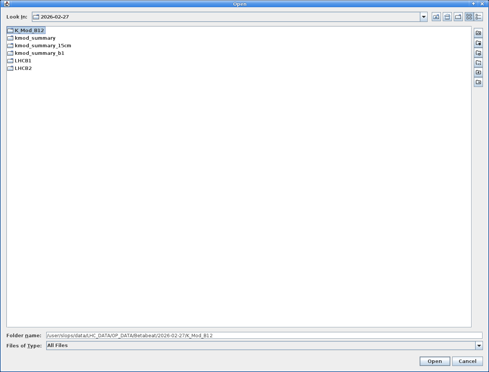

# The Optics Panel

The `Optics` panel is where the computed optics are visualised and compared against the nominal model, but also against one another.
It is also the launch point for follow-up actions such as calculating [corrections](#computing-corrections), starting the [Segment-by-Segment GUI][sbs_gui] etc.

<figure>
  

  
  <figcaption>The Optics panel, here showing the horizontal and vertical beta-beating for two loaded results.</figcaption>
  

</figure>

The panel is split into two sub-tabs: `Optics` and `Action/Tune`.

## The Optics Tab

Once an optics analysis has produced results (via [Get Optics][bbgui_do_optics] in the analysis panel), a new entry will appear in the list box in the top left part of the panel.
Selecting the entry for an optics analysis allows one to inspect all computed optics properties across the machine.

### Open Files

The ++"Open Files"++{.green-gui-button} button opens a [file dialogue][cc_file_dialogues] in which to select one or more optics-analysis output folders.
Each loaded analysis then appears as a row in the `Name` table at the top left of the panel.

!!! info "Legacy Files"
    The panel also accepts the older Beta-Beat.src output files, so results from previous analyses can be loaded and compared.
    See the [meaning of the Beta-Beat.src output files][betabeatsource] for details on those.

### The Results Table

The `Name` table lists all loaded results.
Selecting a row displays its data in the plot area, and selecting several rows overlays them on the same plot, which is the basis for comparing measurements or correction schemes.
Each result is assigned a consistent colour, shown in the plot legend to identify the corresponding curve.

### Removing Entries

To unload a result, select it in the table and click the red ++"Remove entries"++ button.
This only removes the entry from the GUI and does not delete any files from disk.

## Visualising Optics

The **Optics** sub-tab is the default view.
It combines the property tree, from which the quantity to display is selected, with the plot area on the right.

### The Property Tree

The tree on the lower left selects which quantity to plot for the selected result(s).
The available quantities are grouped as follows:

- **Linear**
    - **Phase** — `Phaseadvance`, `ΔPhaseadvance`
    - **Total Phase** — `Phaseadvance`, `ΔPhaseadvance`
    - **Beta from Phase** — `Beta-Function`, `Beta-Beating`
    - **Beta from Amplitude** — `Beta-Function`, `Beta-Beating`
    - **Coupling F1001** — `Amplitude - Phase`, `Real - Imaginary`
    - **Coupling F1010** — `Amplitude - Phase`, `Real - Imaginary`
- **Off-Momentum**
- **Closed Orbit** — `Closed Orbit`
- **RDTs** — `Normal Quadrupole`, `Skew Quadrupole`, `Normal Sextupole`, `Skew Sextupole`, `Normal Octupole`, `Skew Octupole`

<figure>
  

  
  <figcaption>The property tree, here with the dynamically added RDTs branch.</figcaption>
  

</figure>

!!! tip "Dynamic Entries"
    The `RDTs` and `CRDTs` branches are added dynamically, depending on which files are present in the results folders.
    A quantity that was not computed during the analysis will therefore not appear in the tree.

### The Plot Area

Selecting a quantity plots it for the selected result(s) across the longitudinal location in the machine, with the interaction points marked along the top and a legend identifying each result.
The plot supports the usual [navigation and inspection shortcuts][cc_plotting] common to all panels.

### Saving Plots

The `Save Plots` row at the bottom left exports the currently displayed plots.
The ++"Gui"++ button saves them in the native GUI format, while the ++"PDF"++ button exports them to a `PDF` file.
<!-- TODO: confirm exactly what the "Gui" export format is / where files are written. -->

### Load k-Modulation Data

The ++"Load k-Modulation Data"++ button opens a [file dialogue][cc_file_dialogues] to select a k-modulation summary directory (for instance a `kmod_summary` folder).
The imported k-modulation results are then made available so that they can be displayed alongside the computed optics.

<figure>
  

  
  <figcaption>Selecting a k-modulation summary directory to load.</figcaption>
  

</figure>

### Open the Segment-by-Segment GUI

The ++"Open Segment-by-Segment GUI"++ button launches the [Segment-by-Segment GUI][sbs_gui] for the selected result(s), pre-loaded with their optics and associated model.
This is the recommended way to start the SbS GUI, as covered in its own [documentation][sbs_gui].

### Create an eLogbook Entry

The ++"Create eLogBook entry"++ button opens the `New Logbook Entry` dialog, pre-filled with the analysis title as well as the model and measurement paths of the selected result(s).
Choose the target logbook from the dropdown, edit the entry text if needed, attach files with ++"Add Files"++ (or drop unwanted ones with ++"Remove"++), then click ++"Create"++ to push the entry.

<figure>
  

  
  <figcaption>The new eLogbook entry dialog, pre-filled from the selected results.</figcaption>
  

</figure>

!!! tip "PDF Attachments"
    The `Convert pdf2png` checkbox converts attached `PDF` files to `PNG` images, so that they display inline in the logbook entry rather than as attachments.

## The Action/Tune Tab

The **Action/Tune** sub-tab is used for amplitude detuning studies: it plots the measured tune against the action for the selected result(s).
The controls on the left select the action (e.g. `2Jx`) and tune (e.g. `NATTUNE X`) to use, a linear fit can be drawn with ++"Plot linear regression"++, and the full analysis is launched with the ++"Python Detuning Analysis"++ button.

<figure>
  

  
  <figcaption>The Action/Tune sub-tab, plotting tune versus action.</figcaption>
  

</figure>

As it is a topic of its own, the amplitude detuning analysis is not covered here.
Please refer to the dedicated [Amplitude Detuning Analysis][ampdet] page, which itself points to the full procedure.

## Computing Corrections

The green ++"Correction"++ button opens the `Global Correction` dialog, used to compute optics corrections from the loaded measurement and a response matrix.
The dialog is organised in three parts:

- **Presets**: the dropdown at the top offers presets (such as `Beta` or `Coupling`) that pre-fill the whole dialog — the response variables, the targeted observables and their weights and cuts — for a given correction type.
  A preset is applied with ++"Apply"++, and a configured dialog can be stored with ++"Save to File"++ and recalled later with ++"Load from File"++.
- **Full Response**: the response matrix (a `FullResponse.hd5` file) and the correction `Variables` (knobs) to use.
  A response matrix can be created from the current model, either numerically via ++"MAD-X"++ or via the ++"Analytical"++ method.
- **Options**: the measurement and output directories, the correction name (e.g. `changeparameters`), and the table of `Targets` with, for each observable, a `Weights`, `ErrorCut` and `ModelCut` value.
  Further options control the solver (e.g. `pinv`), the SVD cut, the number of iterations and similar parameters.

<!-- TODO: enumerate the full list of available presets if it is worth it. -->

The two tabs below show the same dialog with two different presets applied.

=== "Beta preset"

    <figure>
      

      
      <figcaption>The Global Correction dialog with the <code>Beta</code> preset.</figcaption>
      

    </figure>

=== "Coupling preset"

    <figure>
      

      
      <figcaption>The Global Correction dialog with the <code>Coupling</code> preset, targeting the <code>F1001</code> real and imaginary parts.</figcaption>
      

    </figure>

Clicking ++"Run Correction"++ computes the corrections and writes them to the `changeparameters` files, which store the magnet names and their correction strengths.
These corrections can then be inspected and tested in the [Correction Panel][correction_panel]: see [checking corrections][correction_checks] on the next page.

*[SbS]: Segment-by-Segment
*[RDT]: Resonance Driving Term
*[RDTs]: Resonance Driving Terms
*[CRDT]: Combined Resonance Driving Term
*[CRDTs]: Combined Resonance Driving Terms
*[GUI]: Graphical User Interface
*[IP]: Interaction Point
*[SVD]: Singular Value Decomposition

[sbs_gui]: ../segment_by_segment/gui.md
[bbgui_do_optics]: analysis_panel.md#do-optics-dialogue
[betabeatsource]: betabeatsource.md#meaning-of-the-beta-beatsrc-output-files
[cc_file_dialogues]: common_components.md#file-opening-dialogues
[cc_plotting]: common_components.md#plotting
[ampdet]: ampdet.md
[correction_panel]: correction_panel.md
[correction_checks]: correction_panel.md#correction-checks
