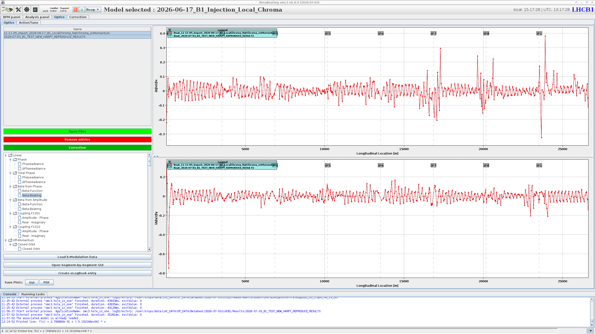
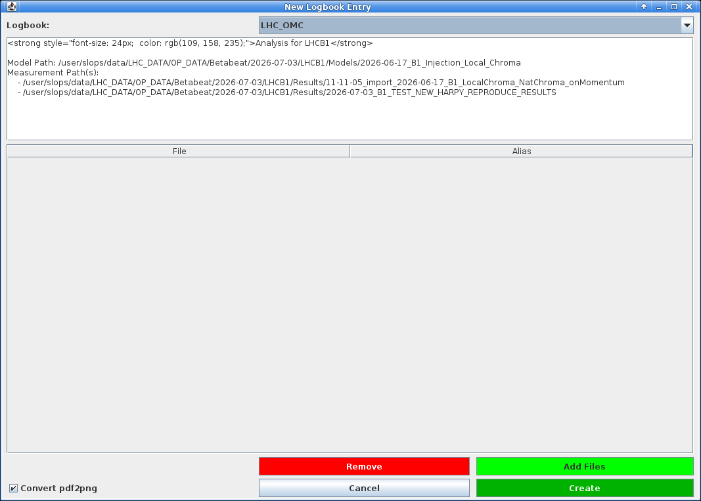
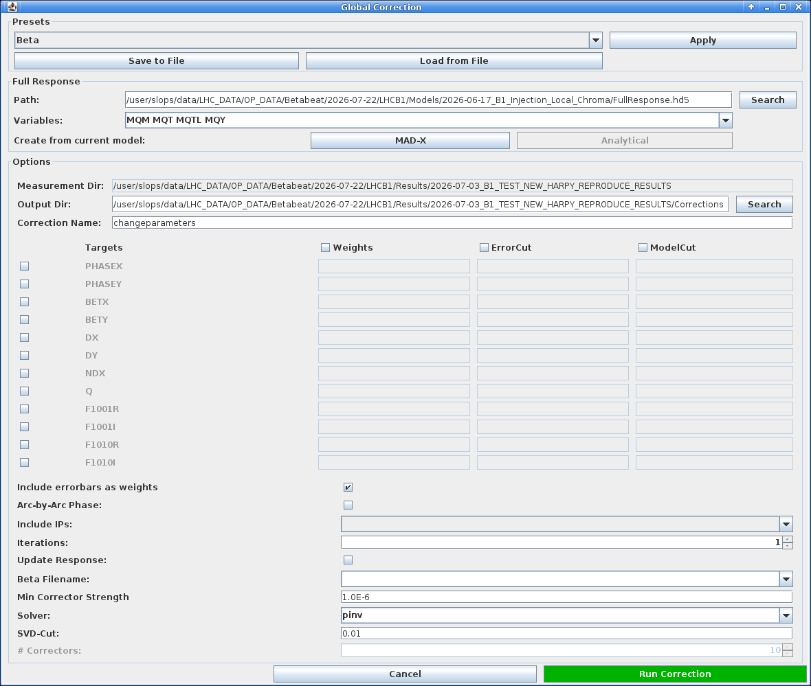
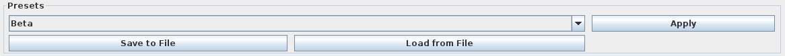
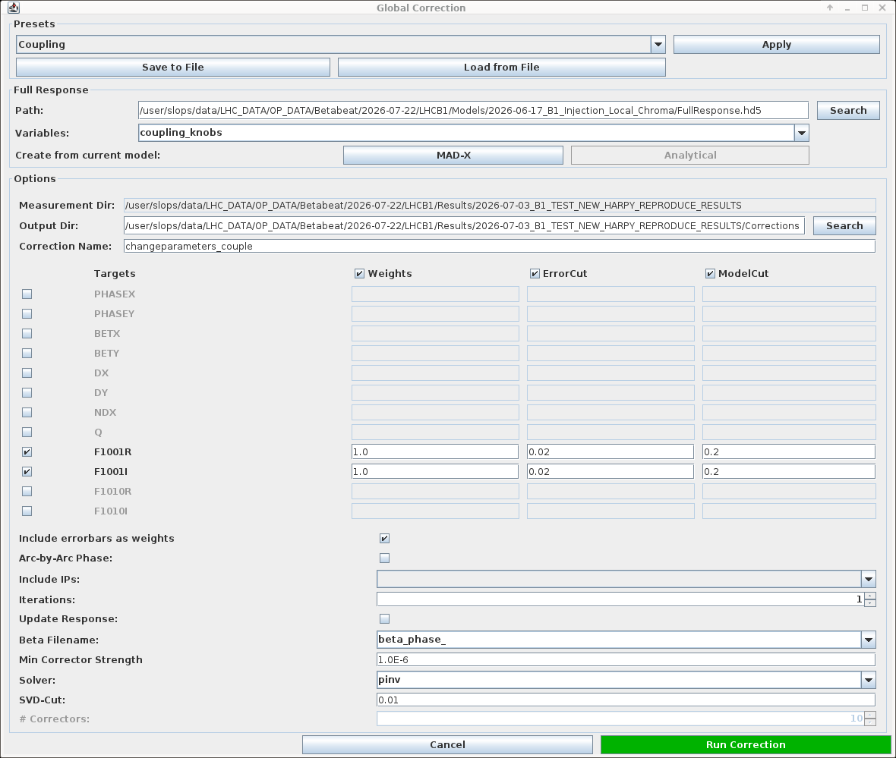
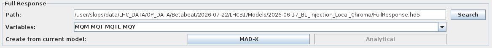
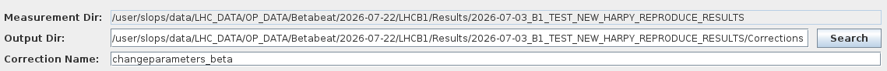
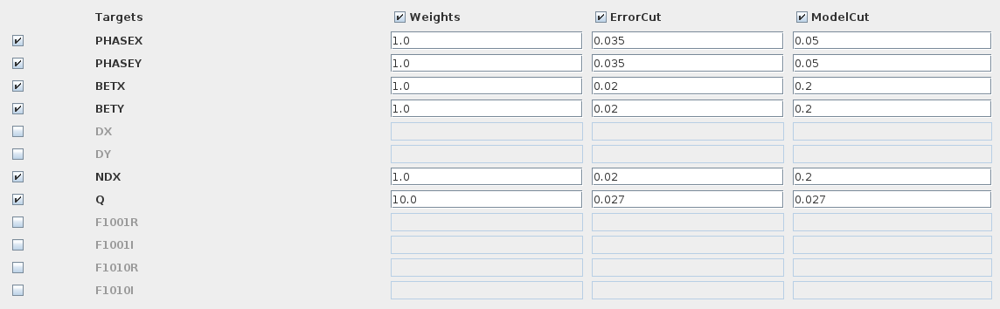
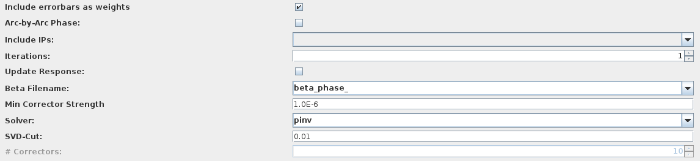

# The Optics Panel

The `Optics` panel is where the computed optics are visualised and compared against the nominal model, but also against one another.
It serves as the launch point for follow-up actions such as calculating corrections, starting the Segment-by-Segment GUI, etc.

The panel is split into two sub-tabs: `Optics` and `Action/Tune`.
The default view of the `Optics` panel is the `Optics` tab, covered by this page, which lists analyses and displays computed properties.
See the [Amplitude Detuning page](./ampdet.md) for the `Action/Tune` tab.

## Loading Data

Once an optics analysis has finished, its results are automatically loaded and a new entry will appear in the `Name` table at the top left of the tab.
Buttons below this table provide functionality to manually load files and remove entries.

- ++"Open Files"++{.green-gui-button}: Opens a dialogue to select one or more optics analysis output folders to be loaded. The files will be copied into the `Results` folder and opened from there. A popup will ask what to do about the associated model, see the admonition below.

    ???+ warning "Associated Models"
        When the import is done, a new popup asks for the action to perform regarding the loaded analysis' associated model, one can:

        - ++"Link Model"++: creates a symlink to the original model folder. This is fragile, as the link breaks if the original folder is moved or deleted.
        - ++"Copy Model"++: copies all the model's files alongside the loaded analysis. This is the recommended option.
        - ++"Close"++: closes the popup and drops the matter about the associated model. Can lead to out of sync models as well.

        **Beware that loading an analysis also loads its associated model**, which then becomes the active model in the GUI.
        Any new analysis performed afterwards will use this model unless it is changed: remember to switch back to the appropriate model before running further analyses.
        The currently active model (now the loaded one) is displayed in the [top bar of the GUI][cc_top], which is the quickest way to check the intended one is selected.

- ++"Remove entries"++{.red-gui-button}: Removes the selected entries from the table. A dialogue will prompt to choose between removing only the entry from the table (recommended) or also deleting the associated files and folder from disk (which has its uses in case of incorrect analysis settings etc.).

??? tip "Loading Legacy Files"
    It is possible to load the older `Beta-Beat.src` output directories to compare results from the old analysis codes.
    Since `Beta-Beat.src` had different file naming conventions, the GUI should automatically call the dedicated [betabeatsrc_output_converter](../../packages/omc3/getting_started.md#other-scripts) script before loading data.
    See the [meaning of the Beta-Beat.src output files][betabeatsource] for details.
    The loaded analysis name should be unchanged.

## Viewing Results

Selecting a row in the `Name` table loads the associated data.
On the lower left a tree allows to choose which quantity to plot for the selected result(s).

<figure>
  

  
  <figcaption>The property tree, here with the dynamically added <code>RDTs</code> branch.</figcaption>
  

</figure>

!!! tip "Dynamic Entries"
    While linear optics are always computed and present, the `RDTs` and `CRDTs` branches are added dynamically, depending on which files are present in the results folders.
    Similarly, normalised dispersion results are only available after on-off momentum analysis.
    Any of these quantities that was not computed during the analysis will therefore not appear in the tree.

When selecting a quantity, its values appear in the plot area in the right part of the window, across the longitudinal location in the machine.
Interaction Points are marked along the top and a collapsible legend identifying each result is added.
The plot supports the usual [navigation and inspection shortcuts][cc_plotting] common to all panels.

<figure>
  

  
  <figcaption>The <code>Optics</code> panel, here showing the horizontal and vertical beta-beating for two loaded results.</figcaption>
  

</figure>

Most shown quantities are computed for both transverse planes and display two plots, one for each of horizontal and vertical.
Some quantities offer alternative layouts, for instance RDTs can be plotted as either amplitude and phase or real and imaginary parts.

Selecting several rows overlays them on the same plot, which allows comparing several measurements or analyses of the same measurements with different settings and/or models.
Each result is assigned a colour, shown in the plot legend to identify the corresponding curve.

!!! info "Shown Models"
    Most linear quantities can be shown either by themselves (e.g. beta-beating) or against the model values (e.g. beta-function itself).
    When choosing the latter, a line is added to the plot corresponding to the model values, with an associated legend.
    When selecting several measurements a line will be added for each of the measurements *and* each of the models.

## Additional Actions

Below the property tree are several buttons for additional actions.

### Saving Plots

The `Save Plots` row at the bottom left allows exporting the currently displayed plots, in one of two ways:

- The ++"Gui"++ button saves them in the native GUI format, a.k.a. a `PNG` image similar to taking a screenshot of the plots area.
- The ++"PDF"++ button starts a Python program to load the data, plots it via `matplotlib` with our custom styles, and export it as a `PDF` file. In this mode it is possible to set axes limits and assign custom labels to plotted measurements.

In both cases a dialogue will pop up prompting the user to choose where on disk to create the file.

<figure>
  

  
  <figcaption>Dialogue window with options for the <code>PDF</code> plot export.</figcaption>
  

</figure>

### Creating an eLogbook Entry

The ++"Create eLogBook entry"++ button is a shortcut to generate an optics analysis entry in the logbook.
It opens the `New Logbook Entry` dialogue, pre-filled with the analysis title as well as the model and measurement paths of the selected result(s).

<figure>
  

  
  <figcaption>The <code>New Logbook Entry</code> dialogue, pre-filled from the selected results.</figcaption>
  

</figure>

Choose the target logbook from the dropdown (defaults to the `LHC_OMC` logbook), edit the entry text if needed, and attach files with ++"Add Files"++ (or drop unwanted ones with ++"Remove"++).
This would typically be [plots exported](#saving-plots) from the optics analysis.
When done, click ++"Create"++ to publish the entry.

!!! tip "PDF Attachments"
    The `Convert pdf2png` checkbox converts attached `PDF` files to `PNG` images, so that they display inline in the logbook entry rather than as attachments.

### Loading K-Modulation Data

The ++"Load k-Modulation Data"++ button opens a [file dialogue][cc_file_dialogues] to select a k-modulation results directory.
The chosen directory should contain subdirectories named `IP*` with k-modulation results for said IPs.

<figure>
  

  
  <figcaption>Selecting a k-modulation result directory to load.</figcaption>
  

</figure>

The imported [k-modulation][kmod_method] results will supersede the optics functions at the inner triplet BPMs and add a data point at IP locations.
This is advantageous considering the k-modulation results are more accurate than optics measurements in these areas.
See the [K-Modulation GUI][kmod_gui] pages to run a k-modulation.

### Opening the Segment-by-Segment GUI

The ++"Open Segment-by-Segment GUI"++ button launches the [segment-by-segment][sbs_method] GUI for the selected result(s), pre-loaded with their optics and associated model.
This is the recommended way to start this GUI.
Refer to the [Segment-by-Segment GUI pages][sbs_gui] for how to use the method.

## Computing Global Corrections

Once the optics have been measured, one can compute a global correction to try and compensate the observed optics deviation throughout the whole machine.
The ++"Correction"++{.green-gui-button} button, found with the loading buttons above the property tree, opens the `Global Correction` dialogue, used to compute optics corrections from the loaded measurement and a response matrix.
It is organised into three parts.

!!! warning "Full Response Needed"
    Please note that corrections require the existence of the response matrices (`Full Response` option during [model creation][model_creation]).
    Should that have been forgotten or omitted, it can be done at this step as well, see the [full response](#full-response) section below.

<figure>
  

  
  <figcaption>The <code>Global Correction</code> dialogue as it opens, with its presets, full response and options sections.</figcaption>
  

</figure>

### Presets

At the top of the dialogue, a dropdown offers presets (such as `Beta`, `Coupling`, etc.) that pre-fill the whole dialogue with default values for a given correction type.
After choosing from the list, click the ++"Apply"++ button for the selected preset to take effect.

<figure>
  

  
  <figcaption>The presets section, with the dropdown of available presets and the <code>Apply</code> button.</figcaption>
  

</figure>

It is possible at any point to export the current option choices for the full dialogue as a personal preset with the ++"Save to File"++ button.
Similarly, it is possible to apply previously saved ones with ++"Load from File"++ which will open a file selection dialogue.

The two tabs below show the same dialogue with two different presets applied.

=== "Beta preset"

    <figure>
      

      
      <figcaption>The <code>Global Correction</code> dialogue with the <code>Beta</code> preset.</figcaption>
      

    </figure>

=== "Coupling preset"

    <figure>
      

      
      <figcaption>The <code>Global Correction</code> dialogue with the <code>Coupling</code> preset, targeting the <code>F1001</code> real and imaginary parts.</figcaption>
      

    </figure>

!!! info "Tweak to Your Needs"
    Note that there isn't a preset for every type of correction and one might need to tweak things to their needs.
    For instance, one cannot select a preset to perform a chromatic coupling correction, but it can be done by providing the variable group of skew sextupole correctors.
    Then tweaking the parameter table might be needed to obtain a satisfying correction.

### Full Response

The second section offers to choose where to load the response matrices (a `FullResponse.hd5` file) and which correction `Variables` (knobs) to use.
This is set by default to the options selected in the model creation.

<figure>
  

  
  <figcaption>The full response section, where the response matrices file and the correction <code>Variables</code> are chosen.</figcaption>
  

</figure>

!!! tip "Full Response on the Fly"
    It is possible to create response matrices from the selected model by clicking the ++"MAD-X"++ button to the right of `Create from current model`.
    Please note that this will start the full response process but **will not give the option to choose the step size**.
    To have this control, one needs to generate response matrices during [model creation][model_creation].
    The ++"Analytical"++ option is currently not implemented.

Alternatively, any valid response file (in the expected `.hd5` format) can be loaded and used.

### Options

The last section is itself split into three parts.

**First**, it allows setting the measurement and output directories (by default uses a `Corrections` subdirectory in the results folder) as well as the correction name (e.g. `changeparameters`).

<figure>
  

  
  <figcaption>The first part of the options section, setting the measurement and output directories and the correction name.</figcaption>
  

</figure>

**Second**, an editable table lets the user choose which parameters to correct by ticking a box next to their name in the `Targets` column.
For each observable, a `Weights`, `ErrorCut` and `ModelCut` column can be ticked as well and values to be used can be manually entered in the relevant boxes.
These values are directly passed on to the correction calculation process.

<figure>
  

  
  <figcaption>The second part of the options section, where the parameters to correct are ticked in the <code>Targets</code> column and their <code>Weights</code>, <code>ErrorCut</code> and <code>ModelCut</code> values set.</figcaption>
  

</figure>

**Finally** is a list of options to be selected or specified in order to control the solver process.

<figure>
  

  
  <figcaption>The last part of the options section, controlling the solver process.</figcaption>
  

</figure>

Their meanings are:

- **Include errorbars as weights**: whether to take into account the measured error bars in the correction calculation. This is active by default.
- **Arc-by-Arc Phase**: if this option (off by default) is selected, the solver will aim to correct the total phase advance per arc instead of correcting the phase advance between consecutive BPMs.
- **Include IPs**: a dropdown list which lets one include IPs in the arc-by-arc phase correction. Providing `left` includes the IP left of the arc, and `right` includes the IP right of the arc. This has no selection by default.
- **Iterations**: the maximum number of correction iterations to perform. At each re-iteration the model is recomputed.

<!-- TODO: make sure this works, but it works fine in the omc3 global correction tests -->
<!-- !!! failure "No Iterative Correction"
    Currently the `Iterative Correction` method (triggered by providing `n > 1` for the `Iterations` parameter) is not implemented. -->

- **Update Response**: only accessible if `Iterations>1`. If ticked (off by default), at each iteration recompute the response matrices analytically.
- **Beta Filename**: the filename prefix of the disk files to use for the measured beta-function values. This defaults to using the beta from phase values rather than beta from amplitude.
- **Min Corrector Strength**: the minimum (absolute) strength of correctors to be used in the correction.
- **Solver**: which optimisation method to use in the calculation. This defaults to `pinv` for pseudo-inverse matrix use, and can otherwise be `omp` for orthogonal matching pursuit, which is the basis of the `MICADO` algorithm.
- **SVD-Cut**: the cutoff for small singular values of the pseudo inverse matrix (only available when choosing `pinv` solver). Any singular value smaller than $r_{\text{cond}} \times max(\text{singular values})$ will be set to 0 (where $r_{\text{cond}}$ is the provided SVD-Cut).
- **# Correctors**: the maximum number of correctors to use, only available when choosing the orthogonal matching pursuit solver.

Clicking ++"Run Correction"++{.green-gui-button} starts the Python process which will write the calculated corrections to the `changeparameters` files in the correction directory.
These files contain the magnet names and their correction strengths (powering changes).
Its progress can be followed in the [running tasks][cc_running_tasks], and any logs or errors will be reported in the [console][cc_console].

These corrections can then be inspected and tested in the [Correction Panel][correction_panel]: see [checking corrections][correction_checks] on the next page.

*[GUI]: Graphical User Interface
*[RDT]: Resonance Driving Term
*[RDTs]: Resonance Driving Terms
*[IP]: Interaction Point
*[IPs]: Interaction Points
*[SVD]: Singular Value Decomposition

[betabeatsource]: betabeatsource.md#meaning-of-the-beta-beatsrc-output-files
[cc_top]: common_components.md#top-of-the-gui
[cc_plotting]: common_components.md#plotting
[cc_console]: common_components.md#console
[cc_running_tasks]: common_components.md#running-tasks
[cc_file_dialogues]: common_components.md#file-opening-dialogues
[kmod_method]: ../../measurements/physics/kmod.md
[kmod_gui]: ../kmod/gui.md
[sbs_method]: ../../measurements/physics/sbs.md
[sbs_gui]: ../segment_by_segment/gui.md
[model_creation]: ./model_creation.md
[correction_panel]: correction_panel.md
[correction_checks]: correction_panel.md#correction-checks
