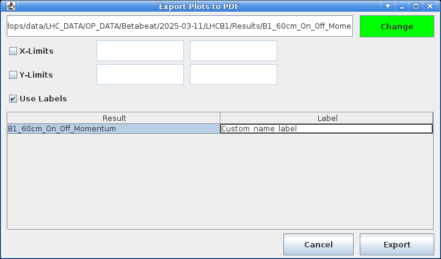
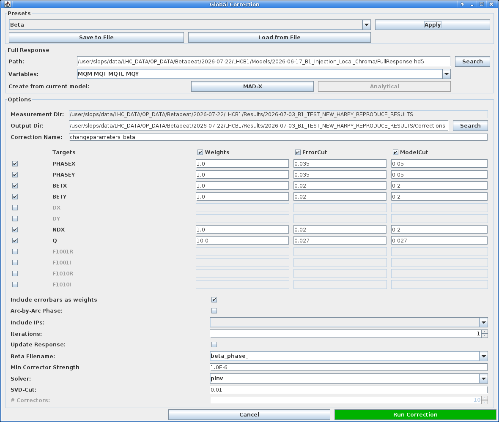

# The Optics Panel

The `Optics` panel is where the computed optics are visualised and compared against the nominal model, but also against one another.
It serves as the launch point for follow-up actions such as calculating corrections, starting the Segment-by-Segment GUI, etc.

The panel is split into two sub-tabs: `Optics` and `Action/Tune`.
The default view of the `Optics` panel is the `Optics` tab, covered by this page, which lists analyses and displays computed properties.
See the [Amplitude Detuning page](./ampdet.md) for the `Action/Tune` tab.

## Loading Data

Once an optics analysis has finished, its results are automatically loaded and a new entry will appear in the `Name` table at the top left of the tab.
Buttons below this table provide functionality to manually load files and remove entries.

- ++"Open Files"++{.green-gui-button}: Opens a dialogue to select one or more optics analysis output folders to be loaded. The files will be copied into the `Results` folder and opened from there. A popup will ask what to do about the associated model, see the admonition below.

???+ warning "Associated Models"
    A popup will ask for the action to perform regarding the loaded analysis' associated model.
    One can either:

    - ++"Link"++: creates a symlink to the original model folder. This is fragile, as the link breaks if the original folder is moved or deleted.
    - ++"Copy"++: copies all the model's files alongside the loaded analysis. This is the recommended option.

    Beware that loading an analysis **also loads its associated model**, which then becomes the active model in the GUI.
    Any new analysis performed afterwards will use this model unless it is changed: remember to switch back to the appropriate model before running further analyses.

- ++"Remove entries"++{.red-gui-button}: Removes the selected entries from the table. A dialogue will prompt to choose between removing only the entry from the table (recommended) or also deleting the associated files and folder from disk (which has its uses in case of incorrect analysis settings etc.).

??? tip "Loading Legacy Files"
    It is possible to load the older `Beta-Beat.src` output directories to compare results from the old analysis codes.
    Since `Beta-Beat.src` had different file naming conventions, the GUI should automatically call the dedicated [betabeatsrc_output_converter](../../packages/omc3/getting_started.md#other-scripts) script before loading data.
    See the [meaning of the Beta-Beat.src output files][betabeatsource] for details.
    The loaded analysis name should be unchanged.

## Viewing Results

Selecting a row in the `Name` table loads the associated data.
On the lower left a tree allows to choose which quantity to plot for the selected result(s).

<figure>
  

  
  <figcaption>The property tree, here with the dynamically added RDTs branch.</figcaption>
  

</figure>

!!! tip "Dynamic RDT Entries"
    While linear optics are always computed and present, the `RDTs` and `CRDTs` branches are added dynamically, depending on which files are present in the results folders.
    A quantity that was not computed during the analysis will therefore not appear in the tree.

Selecting a quantity plots it in the right part of the window for the selected result(s) across the longitudinal location in the machine.
Interaction Points are marked along the top and a collapsible legend identifying each result is added.
The plot supports the usual [navigation and inspection shortcuts][cc_plotting] common to all panels.

<figure>
  

  
  <figcaption>The Optics panel, here showing the horizontal and vertical beta-beating for two loaded results.</figcaption>
  

</figure>

Most shown quantities are computed for both transverse planes and display two plots, one for each of horizontal and vertical.
Some quantities such as the RDTs offer either a plot for each plane or an alternative layout, e.g. amplitude and phase.

Selecting several rows overlays them on the same plot, which allows comparing several measurements or analyses of the same measurements with different settings.
Each result is assigned a consistent colour, shown in the plot legend to identify the corresponding curve.

!!! info "Shown Models"
    Most linear quantities can be shown either by themselves (e.g. beta-beating) or against the model values (e.g. beta-function itself).
    When choosing the latter, a line is added to the plot corresponding to the model values, with an associated legend.
    When selecting several measurements a line will be added for each of the measurements *and* each of the models.

## Additional Actions

Below the property tree are several buttons for additional actions.

### Saving Plots

The `Save Plots` row at the bottom left allows exporting the currently displayed plots, in one of two ways:

- The ++"Gui"++ button saves them in the native GUI format, a.k.a. similarly to taking a screenshot of the plots.
- The ++"PDF"++ button exports starts a Python program to load the data, plots it via `matplotlib` with our custom styles, and export it as a `PDF` file. In this mode it is possible to set axes limits and assign custom labels to plotted measurements.

In both cases a dialogue will pop up prompting the user to choose where on disk to create the file.
<!-- TODO: confirm exactly what the "Gui" export format is / where files are written. -->

<figure>
  

  
  <figcaption>Dialogue window with options for the PDF plot export.</figcaption>
  

</figure>

### Creating an eLogbook Entry

The ++"Create eLogBook entry"++ button is a shotcut to generate an optics analysis entry in the logbook.
It opens the `New Logbook Entry` dialogue, pre-filled with the analysis title as well as the model and measurement paths of the selected result(s).

<figure>
  

  
  <figcaption>The new eLogbook entry dialogue, pre-filled from the selected results.</figcaption>
  

</figure>

Choose the target logbook from the dropdown (defaults to the `LHC_OMC` logbook), edit the entry text if needed, and attach files with ++"Add Files"++ (or drop unwanted ones with ++"Remove"++).
This would typically be [plots exported](#saving-plots) from the optics analysis.
When done, click ++"Create"++ to publish the entry.

!!! tip "PDF Attachments"
    The `Convert pdf2png` checkbox converts attached `PDF` files to `PNG` images, so that they display inline in the logbook entry rather than as attachments.

### Loading K-Modulation Data

The ++"Load k-Modulation Data"++ button opens a [file dialogue][cc_file_dialogues] to select a k-modulation results directory.
The chosen directory should contain subdirectories named `IP*` with k-modulation results for said IPs.

<figure>
  

  
  <figcaption>Selecting a k-modulation summary directory to load.</figcaption>
  

</figure>

The imported [k-modulation][kmod_method] results will be imported and superseed the optics functions at the inner triplet BPMs and add a data point at IP locations.
This is advantageous considering the k-modulation results are more accurate than optics measurements in these areas.
See the [K-Modulation GUI][kmod_gui] pages to run a k-modulation.

### Opening the Segment-by-Segment GUI

The ++"Open Segment-by-Segment GUI"++ button launches the [segment-by-segment][sbs_method] GUI for the selected result(s), pre-loaded with their optics and associated model.
This is the recommended way to start this GUI.
Refer to the [Segment-by-Segment GUI pages][sbs_gui] for how to use the method.

## Computing Global Corrections

Once the optics have been measured, one can compute a global correction to try and compensate the observed optics deviation throughout the whole machine.
The ++"Correction"++{.green-gui-button} button opens the `Global Correction` dialogue, used to compute optics corrections from the loaded measurement and a response matrix.
It is organised in three parts.

!!! warning "Full Response Needed"
    Please note that corrections require the creation of the response matrices (`Full Response` option) during [model creation][model_creation].

<figure>
  

  
  <figcaption>Selecting a k-modulation summary directory to load.</figcaption>
  

</figure>

### Presets

<!-- TODO: enumerate the full list of available presets if it is worth it? -->
A the top of the dialogue, a dropdown at offers presets (such as `Beta`, `Coupling`, etc.) that pre-fill the whole dialogue with default values for a given correction type.
After choosing from the list, click the ++"Apply"++ button for the selected preset to take effect.

It is possible at any point to export the current option choices for the full dialogue as a personnal preset with the ++"Save to File"++ button.
Similarly, it is possible to apply previously saved ones with ++"Load from File"++ which will open a .

The two tabs below show the same dialogue with two different presets applied.

=== "Beta preset"

    <!-- TODO: new screenshot with similar form factor of the coupling one -->

    <figure>
      

      
      <figcaption>The Global Correction dialogue with the <code>Beta</code> preset.</figcaption>
      

    </figure>

=== "Coupling preset"

    <figure>
      

      
      <figcaption>The Global Correction dialogue with the <code>Coupling</code> preset, targeting the <code>F1001</code> real and imaginary parts.</figcaption>
      

    </figure>

### Full Response

The second section offers to choose where to load the response matrices (a `FullResponse.hd5` file) and which correction `Variables` (knobs) to use.
This is set by default to the options selected in the model creation.

A different set of response matrices can be created on the side from the current model.
Any valid response file can be loaded and used.

### Options

<!-- TODO: hover check in the GUI to make sure about the options -->

The last section is also split in three parts.

First, it allows set the measurement and output directories (by default uses a `Corrections` subdirectory in the results folder) as well as the correction name (e.g. `changeparameters`).

Secondly, choose parameters to correct in a table of `Targets` with, for each observable, a `Weights`, `ErrorCut` and `ModelCut` value to be used in the correction calculation.
<!-- TODO: detail this prose -->

Finally, are the following options to control the solver process.
<!-- TODO: make a list.(e.g. `pinv`), the SVD cut, the number of iterations and similar parameters. -->

!!! error "No Iterative Correction"
    Currently the `Iterative Correction` method (triggered by providing `n > 1` for the `Iterations` parameter) is not implemented.

Clicking ++"Run Correction"++ computes the corrections and writes them to the `changeparameters` files, which store the magnet names and their correction strengths.
These corrections can then be inspected and tested in the [Correction Panel][correction_panel]: see [checking corrections][correction_checks] on the next page.

*[SbS]: Segment-by-Segment
*[RDT]: Resonance Driving Term
*[RDTs]: Resonance Driving Terms
*[CRDT]: Combined Resonance Driving Term
*[CRDTs]: Combined Resonance Driving Terms
*[GUI]: Graphical User Interface
*[SVD]: Singular Value Decomposition

[betabeatsource]: betabeatsource.md#meaning-of-the-beta-beatsrc-output-files
[cc_plotting]: common_components.md#plotting
[cc_file_dialogues]: common_components.md#file-opening-dialogues
[kmod_method]: ../../measurements/physics/kmod.md
[kmod_gui]: ../kmod/gui.md
[sbs_method]: ../../measurements/physics/sbs.md
[sbs_gui]: ../segment_by_segment/gui.md
[model_creation]: ./model_creation.md
[correction_panel]: correction_panel.md
[correction_checks]: correction_panel.md#correction-checks
