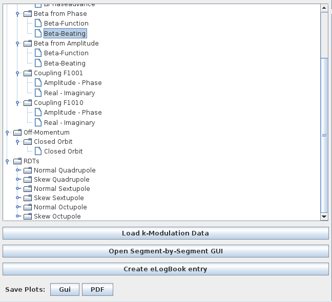
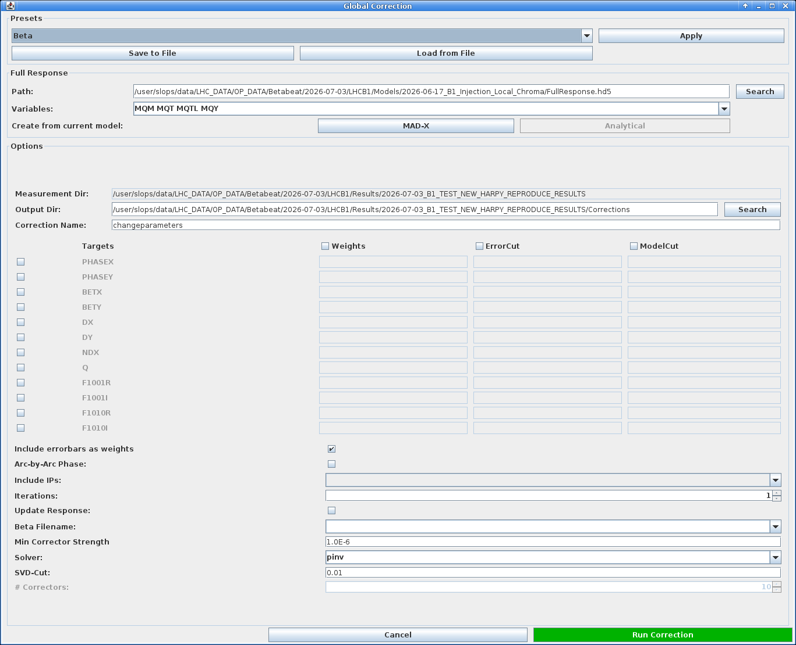
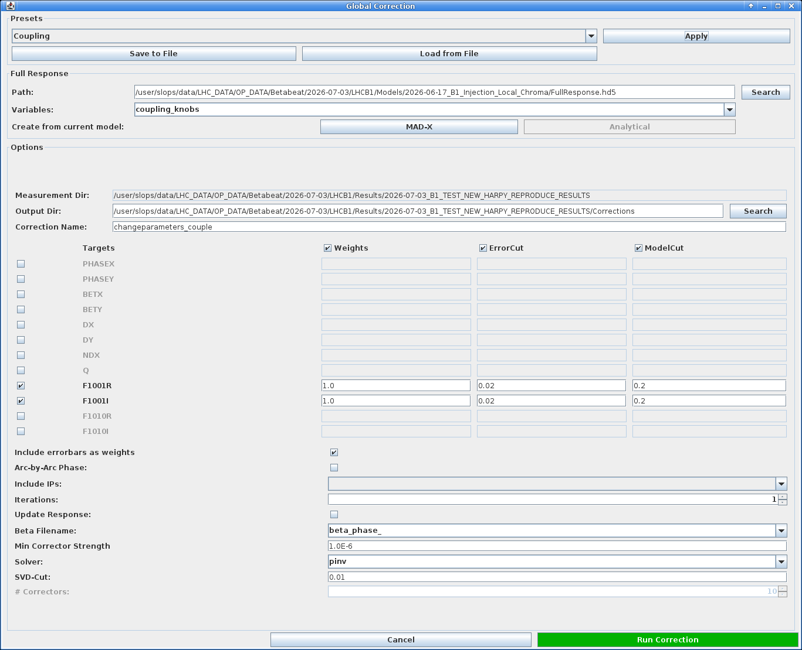

# The Optics Panel

The `Optics` panel is where the computed optics are visualised and compared against the nominal model, but also against one another.
It serves as the launch point for follow-up actions such as calculating corrections, starting the Segment-by-Segment GUI, etc.

The panel is split into two sub-tabs: `Optics` and `Action/Tune`.
The default view of the `Optics` panel is the `Optics` tab, covered by this page, which lists analyses and displays computed properties.
See the [Amplitude Detuning page](./ampdet.md) for the `Action/Tune` tab.

## Loading Data

Once an optics analysis has finished, its results are automatically loaded and a new entry will appear in the `Name` table at the top left of the tab.
Buttons below this table provide functionality to manually load files and remove entries.

- ++"Open Files"++{.green-gui-button}: Opens a dialogue to select one or more optics analysis output folders to be loaded. The files will be copied into the `Results` folder and opened from there. A popup will ask what to do about the associated model, see the admonition below.

???+ warning "Associated Models"
    A popup will ask for the action to perform regarding the loaded analysis' associated model.
    One can either:

    - ++"Link"++: creates a symlink to the original model folder. This is fragile, as the link breaks if the original folder is moved or deleted.
    - ++"Copy"++: copies all the model's files alongside the loaded analysis. This is the recommended option.

    Beware that loading an analysis **also loads its associated model**, which then becomes the active model in the GUI.
    Any new analysis performed afterwards will use this model unless it is changed: remember to switch back to the appropriate model before running further analyses.

- ++"Remove entries"++{.red-gui-button}: Removes the selected entries from the table. A dialogue will prompt to choose between removing only the entry from the table (recommended) or also deleting the associated files and folder from disk (which has its uses in case of incorrect analysis settings etc.).

??? tip "Loading Legacy Files"
    It is possible to load the older `Beta-Beat.src` output directories to compare results from the old analysis codes.
    Since `Beta-Beat.src` had different file naming conventions, the GUI should automatically call the dedicated [betabeatsrc_output_converter](../../packages/omc3/getting_started.md#other-scripts) script before loading data.
    See the [meaning of the Beta-Beat.src output files][betabeatsource] for details.
    The loaded analysis name should be unchanged.

## Viewing Results

Selecting a row in the `Name` table loads the associated data.
On the lower left a tree allows to choose which quantity to plot for the selected result(s).

<figure>
  

  
  <figcaption>The property tree, here with the dynamically added RDTs branch.</figcaption>
  

</figure>

!!! tip "Dynamic RDT Entries"
    While linear optics are always computed and present, the `RDTs` and `CRDTs` branches are added dynamically, depending on which files are present in the results folders.
    A quantity that was not computed during the analysis will therefore not appear in the tree.

Selecting a quantity plots it in the right part of the window for the selected result(s) across the longitudinal location in the machine.
Interaction Points are marked along the top and a collapsible legend identifying each result is added.
The plot supports the usual [navigation and inspection shortcuts][cc_plotting] common to all panels.

<figure>
  

  
  <figcaption>The Optics panel, here showing the horizontal and vertical beta-beating for two loaded results.</figcaption>
  

</figure>

Most shown quantities are computed for both transverse planes and display two plots, one for each of horizontal and vertical.
Some quantities such as the RDTs offer either a plot for each plane or an alternative layout, e.g. amplitude and phase.

Selecting several rows overlays them on the same plot, which allows comparing several measurements or analyses of the same measurements with different settings.
Each result is assigned a consistent colour, shown in the plot legend to identify the corresponding curve.

!!! info "Shown Models"
    Most linear quantities can be shown either by themselves (e.g. beta-beating) or against the model values (e.g. beta-function itself).
    When choosing the latter, a line is added to the plot corresponding to the model values, with an associated legend.
    When selecting several measurements a line will be added for each of the measurements *and* each of the models.

## Additional Actions

Below the property tree are several buttons for additional actions.

### Saving Plots

The ++"Save Plots"++ row at the bottom left exports the currently displayed plots.
The ++"Gui"++ button saves them in the native GUI format, while the ++"PDF"++ button exports them to a `PDF` file.
<!-- TODO: confirm exactly what the "Gui" export format is / where files are written. -->

### Creating an eLogbook Entry

The ++"Create eLogBook entry"++ button opens the `New Logbook Entry` dialog, pre-filled with the analysis title as well as the model and measurement paths of the selected result(s).
Choose the target logbook from the dropdown, edit the entry text if needed, attach files with ++"Add Files"++ (or drop unwanted ones with ++"Remove"++), then click ++"Create"++ to push the entry.

<figure>
  

  
  <figcaption>The new eLogbook entry dialog, pre-filled from the selected results.</figcaption>
  

</figure>

!!! tip "PDF Attachments"
    The `Convert pdf2png` checkbox converts attached `PDF` files to `PNG` images, so that they display inline in the logbook entry rather than as attachments.

### Loading K-Modulation Data

The ++"Load k-Modulation Data"++ button opens a [file dialogue][cc_file_dialogues] to select a k-modulation summary directory (for instance a `kmod_summary` folder).
The imported k-modulation results are then made available so that they can be displayed alongside the computed optics.

<figure>
  

  
  <figcaption>Selecting a k-modulation summary directory to load.</figcaption>
  

</figure>

### Opening the Segment-by-Segment GUI

The ++"Open Segment-by-Segment GUI"++ button launches the [Segment-by-Segment GUI][sbs_gui] for the selected result(s), pre-loaded with their optics and associated model.
This is the recommended way to start the SbS GUI.
Refer to the [Segment-by-Segment GUI pages][sbs_gui] .

## Computing Corrections

The green ++"Correction"++ button opens the `Global Correction` dialog, used to compute optics corrections from the loaded measurement and a response matrix.
The dialog is organised in three parts:

- **Presets**: the dropdown at the top offers presets (such as `Beta` or `Coupling`) that pre-fill the whole dialog — the response variables, the targeted observables and their weights and cuts — for a given correction type.
  A preset is applied with ++"Apply"++, and a configured dialog can be stored with ++"Save to File"++ and recalled later with ++"Load from File"++.
- **Full Response**: the response matrix (a `FullResponse.hd5` file) and the correction `Variables` (knobs) to use.
  A response matrix can be created from the current model, either numerically via ++"MAD-X"++ or via the ++"Analytical"++ method.
- **Options**: the measurement and output directories, the correction name (e.g. `changeparameters`), and the table of `Targets` with, for each observable, a `Weights`, `ErrorCut` and `ModelCut` value.
  Further options control the solver (e.g. `pinv`), the SVD cut, the number of iterations and similar parameters.

<!-- TODO: enumerate the full list of available presets if it is worth it. -->

The two tabs below show the same dialog with two different presets applied.

=== "Beta preset"

    <figure>
      

      
      <figcaption>The Global Correction dialog with the <code>Beta</code> preset.</figcaption>
      

    </figure>

=== "Coupling preset"

    <figure>
      

      
      <figcaption>The Global Correction dialog with the <code>Coupling</code> preset, targeting the <code>F1001</code> real and imaginary parts.</figcaption>
      

    </figure>

Clicking ++"Run Correction"++ computes the corrections and writes them to the `changeparameters` files, which store the magnet names and their correction strengths.
These corrections can then be inspected and tested in the [Correction Panel][correction_panel]: see [checking corrections][correction_checks] on the next page.

*[SbS]: Segment-by-Segment
*[RDT]: Resonance Driving Term
*[RDTs]: Resonance Driving Terms
*[CRDT]: Combined Resonance Driving Term
*[CRDTs]: Combined Resonance Driving Terms
*[GUI]: Graphical User Interface
*[SVD]: Singular Value Decomposition

[betabeatsource]: betabeatsource.md#meaning-of-the-beta-beatsrc-output-files
[cc_plotting]: common_components.md#plotting
[cc_file_dialogues]: common_components.md#file-opening-dialogues
[sbs_gui]: ../segment_by_segment/gui.md

[ampdet]: ampdet.md
[correction_panel]: correction_panel.md
[correction_checks]: correction_panel.md#correction-checks
