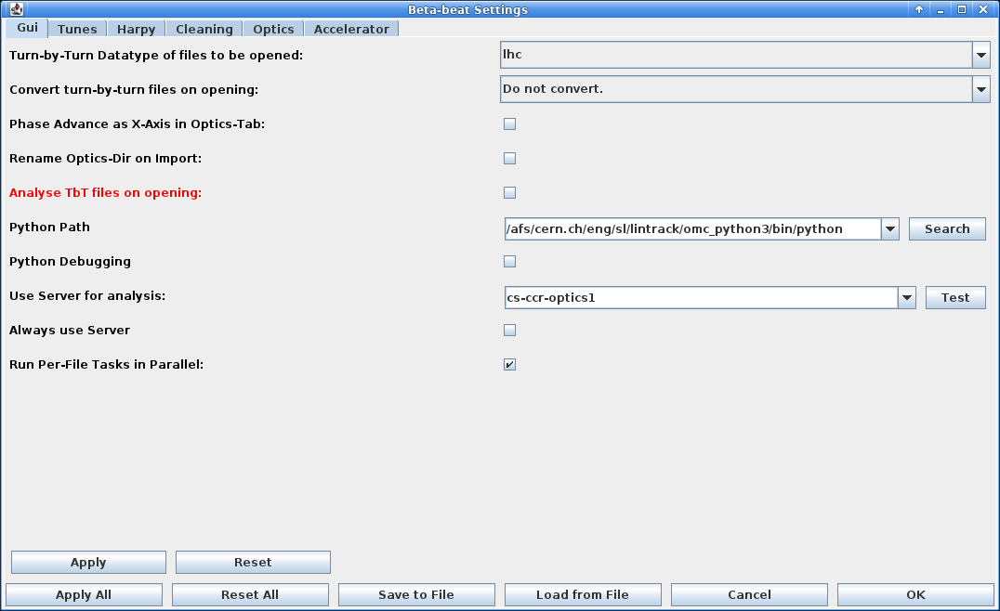
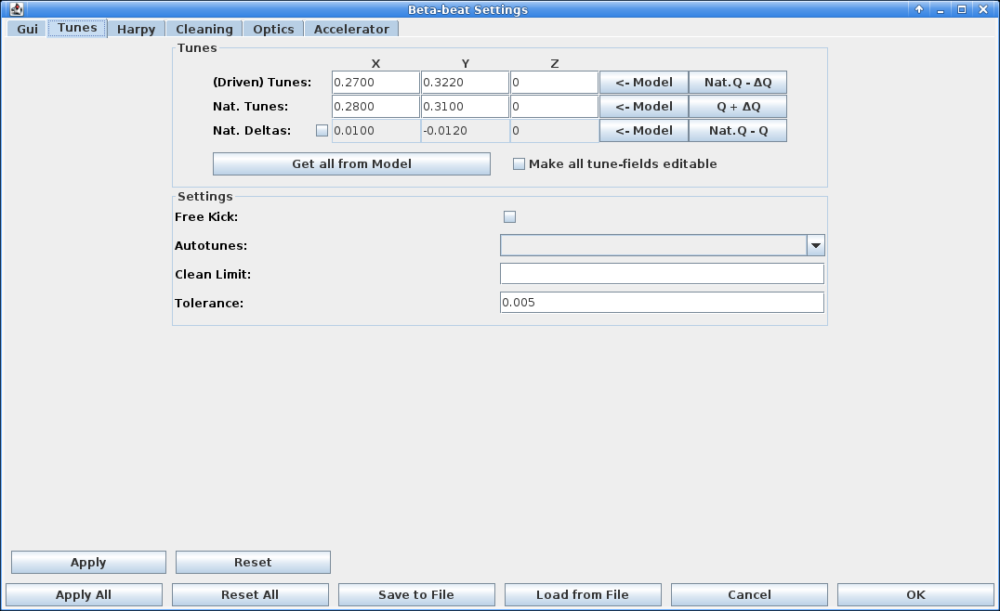
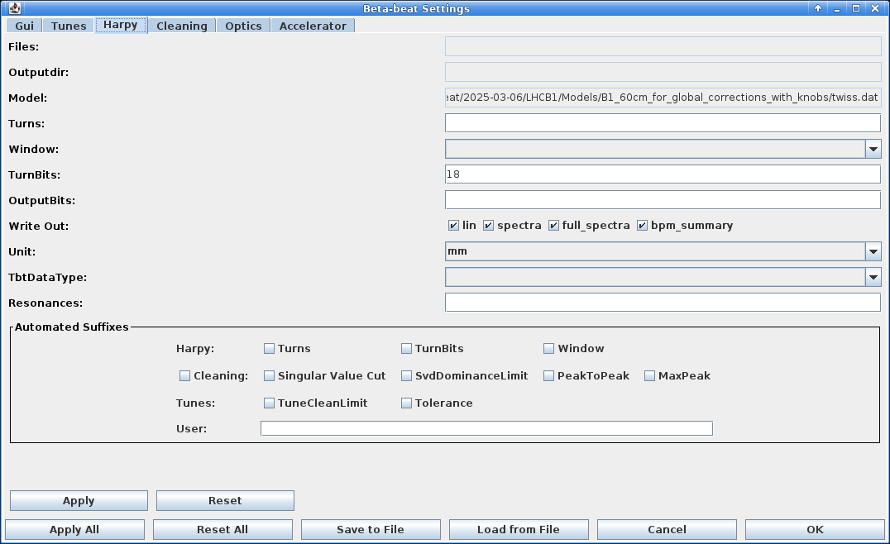
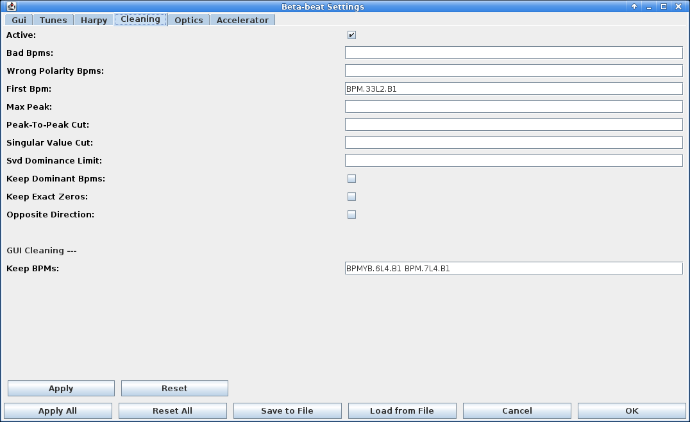
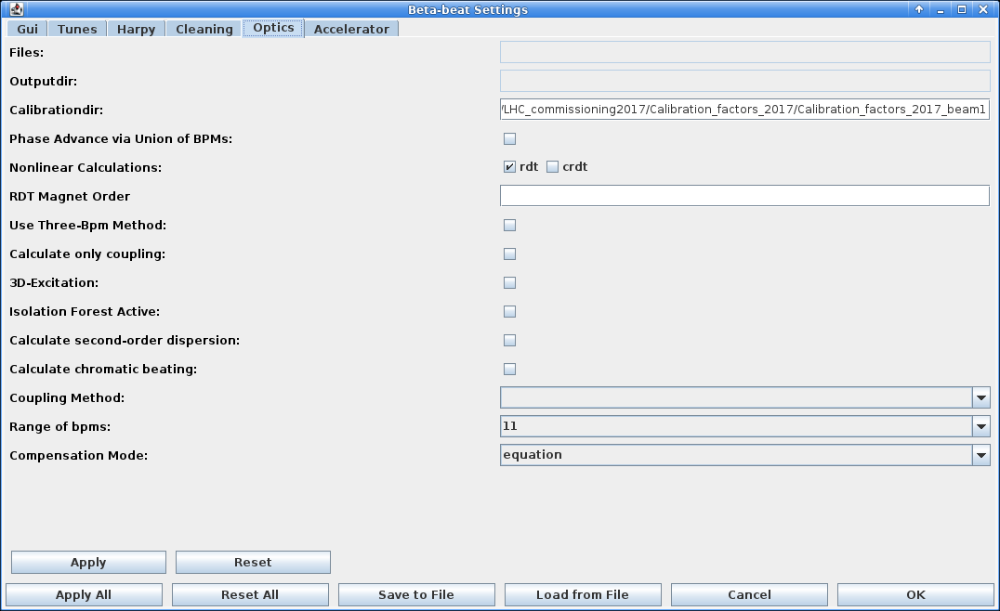
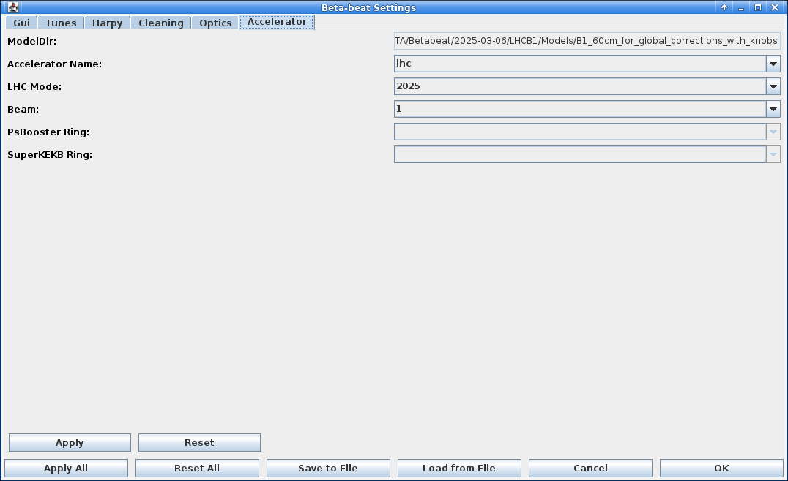

# Settings Window

<figure>
  

  
  <figcaption>Open the settings window with the gear icon.</figcaption>
  

</figure>

Great care has been taken to create a user friendly and easy to find interface for all settings.
The settings window can be initialized by the gear icon in the top left corner of the GUI.

* Settings are now all in one place (the settings-button on top).
* Entries in the settings that are lists (e.g. 'Turns' which will be `STARTTURN ENDTURN`) are given as **space-separated** values, NOT comma separated.
* Settings can be reverted as long as you do not click apply.
* Settings are applied automatically on ++okbtn++.
* Settings are reset to last applied on ++cancelbtn++.

<figure>
  

  
  <figcaption>The Gui-tab of the settings window.</figcaption>
  

</figure>

<figure>
  

  
  <figcaption>The Tunes-tab of the settings window.</figcaption>
  

</figure>

<figure>
  

  
  <figcaption>The Harpy-tab of the settings window.</figcaption>
  

</figure>

<figure>
  

  
  <figcaption>The Cleaning-tab of the settings window.</figcaption>
  

</figure>

<figure>
  

  
  <figcaption>The Optics-tab of the settings window.</figcaption>
  

</figure>

<figure>
  

  
  <figcaption>The Accelerator-tab of the settings window.</figcaption>
  

</figure>

!!! warning "For Developers"
    Quite a lot of functionality has been implemented to make the creation of new settings entries,
    allowing them to be used from configuration files and displaying them in the UI as smooth as possible.
    **Please use it!**

    It should be mostly a copy-and-paste from other already implemented entries,
    if you are using an AI it will probably autosuggest the right functions.
    In short:

    In `model/settings`:

    - add a descriptive attritbute to the respective settings class.
    - add your vlaue to the constructor of the class, with default values.
    - add your value to the copy-constructor of the class.
    - use `getProperty()` to automatically **extract** the value from the property file in a unified way and set the attribute on the class.
    - use `setProperty()` to automatically **set** the value in the property file in a unified way from the current value of the class.
    - add your value into the `toString()` function of the class.

    In `view/settings`:

    - use `getComponentValue()` to automatically **extract** the value from the UI in a unified way and set the attribute on the class.
    - use `setComponentValue()` to automatically **set** the value in the UI in a unified way from the current value of the class.
    - use `addColorActionListener()` on the new label to automatically set the color on changes.
