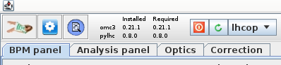

# Settings Window

<figure>
  

  
  <figcaption>Open the settings window with the white-on-blue gear icon &#9881;.</figcaption>
  

</figure>

Great care has been taken to create a user friendly and easy to find interface for all settings.
The settings window can be initialized by the gear icon &#9881; in the top left corner of the GUI.

!!! info "Defaults"
    The "Default" values given here are the defaults used in `python`,
    These might not be up-to-date, check the [omc3 python documentation][python-docs]{:target="_blank"} for more information.
    They might also be different from the defaults used in the GUI, as there are some defaults set upon startup determined by the selected machine.
    These GUI defaults are directly visible in the settings, while the `python` defaults are used when no value is given.

## General Behaviour

There is some general behaviour, that is true for all settings-tabs:

- **Empty** text-fields are treated as _"Not given"_ and the **`python` defaults** will be used.
- **Hovering the mouse over the label** of a setting will give additional information.
  This is often the `help` provided by the corresponding `python` argument. Check the [omc3 python documentation][python-docs]{:target="_blank"} for more information.
- Entries in the settings that are lists (e.g. _Turns_, which will be `STARTTURN ENDTURN`) are given as **space-separated** values, NOT comma separated.
- Of the buttons at the bottom, the top row refers to the current tab, the bottom row to all tabs.
- Settings that have been changed since the last ++"Apply"++ / ++"Apply All"++ are highlighted in red and can be reverted with the ++"Reset"++ button.
- Settings are applied **automatically** on ++okbtn++.
- Settings are **reset** to last applied on ++cancelbtn++.
- ++"Save to File"++: When saving the settings to file, a file `settings_xxx.properties` is created, containing entries for **ALL** settings, even those not set in the GUI.
- ++"Load from File"++: When loading settings from file, not all possible entries need to be present in that file and **only present ones will be modified** in the UI.
  Entries in the file, that are not recognized as settings will be ignored.

!!! info "Some Background on the Internals"
    To "apply" settings simply means that the current values in the UI are assinged to the corresponding settings class,
    each an internal representation of a settings tab,
    which is used to persistently store the settings in memory and pass them between different parts of the application.
    To "reset" the settings, the stored values are reloaded from this internal representation to the UI.

## Gui Tab

<figure>
  

  
  <figcaption>The Gui tab of the settings window.</figcaption>
  

</figure>

The GUI tab contains settings that steer the behaviour of the GUI.
This is in contrast to the other settings tabs, which control the settings passed on to the `python` tasks.

- **Turn-by-Turn Datatype of Files to be Opened**:
  Specify the datatype of the turn-by-turn data files that you open when clicking on ++"Open Files"++{.green-gui-button} in the [BPM Panel](bpm_panel.md).
  If you do **not** convert the files, this needs to be one of **`lhc`** or **`sps`**, as these are the only ones the GUI can handle.

- **Convert Turn-by-Turn Files on Opening**:
  When **`Do not convert`** is selected, turn-by-turn files are simply copied into the current `Measurements` directory.
  If **`lhc`** or **`sps`** is selected, the `omc3.tbt_converter` will be called to convert the files from the
  datatype in the previous setting to the here selected type, **even if the same format is selected!** 
  :fontawesome-solid-triangle-exclamation:{.warning-colored} _The copied/converted files are the ones that will be passed on to `harpy` later on.
  As the default input format there is **`lhc`**, make sure to change it there in case you are using anything else!_

- **Phase-Advance as X-Axis in Optics-Tab**:
  Uses the phase-advance (`MUX`/`MUY`) column as the X-Axis in the Optics-Tab instead of the longitudinal position (`S`).

- **Rename Optics-Dir on Import**:
  If active and you open an already analysed optics directory, via the ++"Open Files"++{.green-gui-button} in the [Optics Panel](optics_panel.md),
  which is **NOT** already in the current `Results` directory, the imported directory will be prefixed with the current time (as was default in the [BetaBeat.src version](betabeatsource.md)).

- **Analyse TbT Files on Opening**:
  If active and you open a turn-by-turn file, via the ++"Open Files"++{.green-gui-button} in the [BPM Panel](bpm_panel.md),
  `harpy` analysis will be automatically started (for now: the user will be prompted with the ["Do analysis Dialog"](bpm_panel.md#do-analysis) directly after TbT import).

- **Python Path**:
  Change the location of the `python` executable to be used to run the python scripts.
  After a change here, the GUI will check which versions of `omc3` and `pylhc` are installed in the selected environment and update the [entry at the top](common_components.md#top-of-the-gui).

- **Python Debugging**:
  If active, the GUI will run the `python` script with the `-d` flag, which initializes the logging level in our scripts automatically to `DEBUG`.

- **Use Server for Analysis**:
  When set, all `python` tasks requireing lots of memory and processing power (e.g. `hole-in-one` for `harpy` and `optics`) will be run on that server.
  If you click the ++"Test"++ button, file creation and reading of the created files from the local machine will be tested and you will be prompted with the results after a few seconds.

- **Always use Server**:
  If active, all `python` tasks will be run on the server, even if they do not require much processing power.

- **Run Per-File Tasks in Parallel**:
  If active, tasks that are started together but can run independently per file will be run in individual tasks in parallel,
  e.g. the `harpy` analysis will be run in parallel for each turn-by-turn file, even if started with multiple files selected.
  Also, when running multiple optics analysis, but clicking the `Run per file` button, the analysis will be run in parallel for each file.
  Conversely, if `Also run optics analysis` is selected, the first step of the `harpy` analsysis will be run sequentially per file,
  as coordination between multiple tasks is not implemented.

## Tunes Tab

<figure>
  

  
  <figcaption>The Tunes tab of the settings window.</figcaption>
  

</figure>

In this tab, the settings for the tunes are defined.
The connection of these settings to the `python` settings is a bit tricky,
because some of the information is passed on to the input arguments of the `accelerator class` (the actual tunes) and some to `harpy` (the settings below).

### Tunes

In this grid, the horizontal (`X`), vertical (`Y`) and longitudinal (`Z`) tunes are defined.
In case of standard (i.e. 2D) kicks, the longitudinal tune needs to be set to `0`.

The tunes are automatically updated when [loading a model](model_creation.md), but can be manually adjusted.

The first row defines the main line to be found in the spectrum, which is the **driven tune** in the case of AC-Dipole kicks and
the **natural tune** in the case of free kicks.

The natural tunes can be given either directly or as differences to the main tune, by activating the `Nat. Deltas` checkbox.
This is also reflected in parameters given to `harpy` and can be useful together with the `Autotunes` setting, e.g. if different working points with the same delta are probed.

!!! warning "Deltas Sign-Convention"
    The signs between the `Nat. Deltas` here and in [Multiturn][multiturn] are inverted, because [Multiturn][multiturn] uses the natural tunes as the basis
    from which the AC-Dipole is set while `harpy` uses the highest peak in the spectrum (i.e. the AC-Dipole tune line) as the basis from which the natural tunes are found.

The ++"<-- Model"++ button will load the tunes of the respective row from the currently loaded model,
while the other buttons calculate the tune in the respective row from the other two rows.
++"Get all from Model"++ will load the tunes of all rows from the loaded model.

The fields are non-editable when it does not make sense in the current settings (e.g. no natural tunes when free kicks are used, switching between natural tunes and deltas).
**"Make all tune-fields editable"** overrides this and does exactly what it says.

### Settings

- **Free Kick**:
  If active, free kicks are used instead of AC-Dipole kicks.

- **Autotunes**:
  If active, the highest peak in the whole spectrum is automatically assumed to be the main tune, either in the **`transverse`** planes or in **`all`** planes including the longitudinal.
  Otherwise the main tune is defined as the highest peak in the spectrum around the tunes given in the first row &plusmn; the tolerance.

- **Clean Limit**:
  When cleaning is active, BPM outliers are detemined as those that are further away than others from the average.
  This limit sets a hard border to the cleaning, where **outliers closer than the given limit to the average tune will not be removed**.

- **Tolerance**:
  The tolerance for the peak search in the spectrum.
  This tolerance is used for all peaks (unless `Autotunes` is active, in which case it is not used for the main tune), i.e. for all harmonics/resonance lines searched for in the spectrum.

## Harpy Tab

<figure>
  

  
  <figcaption>The Harpy tab of the settings window.</figcaption>
  

</figure>

The Harpy tab contains the settings for the harmonic `harpy` analysis.

- **Files**:
  This field is not editable and automatically set when selecting TbT files in the [BPM Panel](bpm_panel.md) and running the analysis.
  It is only shown here, as `files`is an argument to `harpy` and an attribute on the internal `HarpySettings` class, which is set later from the user selection.

- **Outputdir**:
  This field is not editable and automatically set when running the harmonic analysis, as the selected file-names are used to define the output directory.
  When running analysis from the GUI, the output files are put into the same directory as the input files,
  unless also the optics-analysis is run at the same time, in which case they will be put in a sub-directory (`linfiles`) of the
  respective optics output in the `Results` directory.
  The field is only shown here, as `outputdir` is an argument to `harpy` and an attribute on the internal `HarpySettings` class, which is set later from the user selection.

- **Model**:
  This field is not editable and automatically set when loading a model.
  It contains the path to the `twiss.dat` file of the loaded model.
  The field is only shown here, as `model` is an argument to `harpy` and an attribute on the internal `HarpySettings` class, which is usually already set.

- **Turns**:
  Start and end turn to be used from the turn-by-turn data. Default: `[0, 50000]`.
    - The order does not matter.
    - If one argument is negative or zero, the very first turn is included.
    - If the larger argument is larger than the number of turns, the last turn is included.
    - If both arguments are higher than the number of turns, there will be an error.
    - If the larger argument is also negative, these turns will be removed from the end.
    - If both arguments are inside the range of turns, the turn of the larger argument will be the first one excluded (i.e. how `python` slices a list `[start:end]`).

- **Window**:
  The type of windowing function used for the harmonic analysis, to create a closed-form of the signal.
  Default: `hann`.

- **TurnBits**:
  The number of bits to be used for zero-padding of the turn-by-turn data, which therefore defines the (interpolated) frequency resolution.
  Here, the number of bits is the log of the number of turns in the data, i.e. `turn_bits = log2(turns)` or `turns = 2**turn_bits`, where `turns` is the number of measured turns + zero padding.
  This also determines the memory footprint of the analysis and should be reduced for computers with low RAM. 
  :fontawesome-solid-triangle-exclamation:{.warning-colored} Note, that for `6600` turns of measurement data, this number should not be set lower than `13`! 
  Default: `20`.

- **OutputBits**:
  The number of bits to be used for binning of the output data, i.e. `number_of_bins = 2**output_bits`.
  This determines the final resolution of the frequency spectrum and the size of the output files.
  Within each bin, only the highest peak is kept, leading to uneven frequency distribution.
  Default: `12`.

- **Write Out**:
  This parameter determines which output files are written out.
  Each file has usually a `x` and `y` version for each per plane.
  The following options are available:
    - `lin`: Write out the `.lin`-file, which contain a table of BPMs and summarize their main and resonance lines, as well as additional information, e.g. noise.
    - `spectra`: Write out the `.amps` and `.freqs`-files, which contain the amplitudes and frequencies within the given `Tolerance` (see [Tunes Tab](#tunes-tab)) around the main and resonance lines.
    - `full_spectra`: This setting overrides the `spectra`-setting and writes out **all** amplitudes and frequencies of the binned spectrum in the same file-format.
    - `bpm_summary`: Write out the `.bad_bpms`-file, which contains a summary of BPMs that are determined as bad or not.

- **Unit**:
  The unit of the input turn-by-turn data.
  Default: `m`. 
  :fontawesome-solid-triangle-exclamation:{.warning-colored} This unit is only valid for the **input data**, internally and in the output files `m` are used. 
  :fontawesome-solid-triangle-exclamation:{.warning-colored} The units for measured LHC turn-by-turn files are `mm`. 

- **TbtDataType**:
  The datatype of the input turn-by-turn data.
  Many options are available here, as they could be used when running the analysis from command-line.
  Yet, as we have imported the data already into the GUI, and the GUI only supports `lhc` and `sps` turn-by-turn data, this setting should be set to either of these two values.
  Default: `lhc`.

- **Resonances**:
  The multipole order of the resonances looked for in the spectrum and written out in the `lin`-files.
  Needs to be between 2 and 8 (including).
  If you want to run optics analysis for high-order RDTs later on, you need to set this number respectively, depending on the order of the RDT you want to analyse (see _RDT Magnet Order_ in the [Optics-Tab](#optics-tab) below).
  Default: `4` (octupoles).

### Automated Suffixes

The harmonic analysis accepts a `suffix` parameter as input, to distinguish between different analysis runs, e.g. with various parameter settings, on the same file.
The _"Automated Suffixes"_ feature of the GUI creates this suffix automatically using the values of the here selected parameters, allowing you to easily compare the impact of different settings on the same data.
This uses not only parameters from this tab but also from the [cleaning-tab](#cleaning-tab) and [tunes-tab](#tunes-tab).
You can also define your own suffix, which will be added to the automatically created one.
The `python` default is `""`, i.e. no suffix.

## Cleaning-Tab

<figure>
  

  
  <figcaption>The Cleaning-tab of the settings window.</figcaption>
  

</figure>

Most of the cleaning, for which the settings can be changed here, are part of the harmonic analysis module `harpy` in `omc3`
and will be executed during the "Analyse Spectrum" phase.
Some of this procedure is also described on the [BPM filtering page][bpm_filtering].

!!! warning "Deactivating Cleaning"
    Cleaning can be deactivated via the **Active** toggle, but this is not recommended when working with measured data (in contrast to simulation data),
    not only because measured data usually contains BPMs with faulty signals, but also because the synchronizing of measured data to model via the **First BPM** setting
    is done within the cleaning module (see below).

??? info "Why is cleaning part of the harmonic analysis?"
    Cleaning is part of the harmonic analysis in `harpy` as the [frequency analysis is done on the v-matrix of the SVD][harpy_ipac]:
    SVD is used to reduce the noise in the BPM data by selecting only the most important modes and in the same step also to detect bad bpms.
    As this decomposition is a linear transformation, the frequency analysis can be run directly on decomposed v-matrix, without
    having to re-compose the data into the time-domain, saving time and memory.
    The disadvantage is that, as we do not save the SVD matrices, there is no way to only run _cleaning_ without frequency analysis at the moment.
    For more details, see [doi:10.18429/JACoW-IPAC2022-WEPOMS035][harpy_ipac].

- **Active**:
  If active, the cleaning module is run during the "Analyse Spectrum" phase.
  See the caveat above about not running it.
  Default: `False`.

- **Bad BPMs**:
  A list of [BPMs already known as "bad"][bad_bpms], i.e. not to be used for frequency analysis.

- **Wrong Polarity BPMs**:
  A list of BPMs that have been found to have wrong polarity.
  Their signal will be inverted.

- **First BPM**:
  The BPM which is used as the reference for synchronizing the BPMs to the model.
  This should be the first BPM in the turn-by-turn data, which is usually the first BPM after the injection,
  so it is different for different machines and even the LHC beams.
  The "synchronization" is done by simply ignoring the first turn from all BPMs starting at the given BPM to the last BPM in the model,
  meaning the measured data is synchronized to the model, not the other way around.

- **Max Peak**:
  BPMs with any orbit value **larger** than this value will be removed from the analysis.
  This ensures the removal of BPMs with unrealisticly high signals, e.g. very large noise.
  Default: `0.02`.

- **Peak-to-Peak Cut**:
  BPMs with an absolute difference between their maximum and minimum value **lower** than this value will be removed from the analysis.
  This ensures that BPMs with a very flat signal are removed.
  Default: `1e-8`.

- **Singular Value Cut**:
  Keep this amount of modes with the highest singular values, i.e. the most important modes.
  The remaining modes will be removed from the analysis.
  This is one of the most important parameters for general noise removal.
  Default: `12`.

- **SVD Dominance Cut**:
  Limit for single BPM dominating a mode.
  If any BPM has a larger value than this in a single mode, it will be removed from the analysis.
  Only the BPM with the highest value will be removed and then the SVD-matrices are renormalized,
  if  "SVD Dominance Iterations" is set, this procedure is then repeated for the remaining BPMs.
  Default: `0.925`.

- **Keep Dominant BPMs**:
  _[Deprecated: Remove!][gitlab_issue279]_

- **SVD Dominance Iterations**:
  _[Coming Soon!][gitlab_issue279]_ 
  Maximal number of iterations of U matrix elements removal and renormalisation in iterative SVD cleaning of dominant BPMs.
  Only used, if the "SVD Dominance Cut" is not `None` and any BPM is above the dominance cut.
  As only the BPM with the highest value in a mode is removed, this is also the maximum number of BPMs removed due to the dominance cleaning.
  If this is set to `0`, the dominance cleaning is skipped (i.e. the "SVD Dominance Cut" is ignored) and all BPMs are kept.
  Default: `3`.

- **Keep Exact Zeros**:
  By default, BPMs that contain exact zeros in their data are removed as in the LHC zeros are added to the data when the value was not found (in other machines this might be `NaNs` instead).
  If, for some reason, you expect exact zeros in your data and you want to keep those BPMs, set this to `True`.
  Default: `False`.

- **Opposite Direction**:
  If the measured beam data is in the opposite direction from the model, as e.g. the case for the LHC Beam 2 (when not using a Beam 4 model),
  this box needs to be checked so that the analysis knows about this direction change.
  In the GUI this should be set automatically when choosing LHCB2.
  Default: `False`.

### GUI Cleaning

The GUI provides additional ways of cleaning BPMs on the output of the harmonic analysis in the [Analysis Panel](analysis_panel.md).
The BPMs given here to the **Keep BPMs** field will be kept, even if they are outside the specified cut-offs or identified as outliers.
The defaults here for the LHC are the BPMs **closest to the AC-Dipole**, as they are used for compensating for the additional phase-advance
introduced by the AC-Dipole and if they are not found in the data, the optics analysis will fail.

## Optics-Tab

<figure>
  

  
  <figcaption>The Optics-tab of the settings window.</figcaption>
  

</figure>

- **Files**:
  Files to to use for the optics analysis.
  These are the output files from `harpy`.
  This field is not editable and is only shown here, as `files` is an argument to `optics_measurement` and an attribute on the internal `OpticsSettings` class.
  The actual files to use are chosen from the [Analysis Panel](analysis_panel.md), after which this field is automatically filled in when shown in the [Run Optics](analysis_panel.md#run-optics) popup window.

- **Outputdir**:
  Directory to place to output of the optics analysis.
  The field is not editable and is only shown here, as `outputdir` is an argument to `optics_measurement` and an attribute on the internal `OpticsSettings` class.
  The actual directory is chosen by the user per analysis, when setting an analysis name in the [Run Optics](analysis_panel.md#run-optics) popup window.

- **Calibrationdir**:
  Path to the directory containing the [calibration][bpm_calibration] files, used to rescale the BPM amplitudes and amplitude errors.
  This field should be automatically set correctly, when choosing an accelerator in the [Beam Selection Window](beam_selection.md).

- **Phase Advance via Union of BPMs**:
  Uses the `how=outer` pandas method to join dataframes of multiple measurements, which is equivalent to a union of BPMs (i.e. uses all BPMs present in any measurement file),
  instead of the default `how=inner` which creates an intersection of BPMs (i.e. uses only BPMs present in all measurement files).
  Default: `False`.

- **Nonlinear Calculations**:
  Activate which "nonlinear" calculations should be performed: The calculation of Resonance Driving Terms (RDTs) and/or the calculation of combined RDTs.

- **RDT Magnet Order**:
  When RDT calculation is active, this field specifies the highest order of magnetic fields for which the corresponding RDTs are calculated.
  Needs to be between 2 and 8 (including).
  Calculation of RDTs of a given order require the lines of that order to have been identified in the harmonic analysis, hence the _Resonances_ field of the [Harpy-Tab](#harpy-tab) needs to be set to at least the same value.
  Default: `4` (octupoles).

- **Use Three-Bpm Method**:
  When active, the [Three-BPM Method][three_bpm_method] is used to calculate beta-from-phase, otherwise the [N-BPM Method][n_bpm_method] is used.
  Default: `False`.

- **Calculate only coupling**:
  When active, skips most of the optics calcualtions and calculates only phases and coupling RDTs.
  Useful for quick analysis or machines that do not support (e.g. not enough BPMs) some of the other analysis methods.
  Default: `False`.

- **3D-Excitation**:
  Activate this, when [3D-Excitation/3D-Kicks][three_d_kicks] were used to calculate chromatic parameters directly from the longitudinal information of the harmonic analysis.
  Default: `False`

- **Isolation Forest Active**:
  Activate for additional filtering of BPMs before analysis via the [Isolation Forest][isolation_forest_cleaning] machine learning method.
  Default: `False`. 
  :fontawesome-solid-triangle-exclamation:{.warning-colored} _[This method is currently under re-evaluation][isolation_forest_issue]._

- **Calculate Second-Order Dispersion**:
  Activate to calculate also second order dispersion.
  Default: `False`.

- **Calculate Chromatic Beating**:
  Activate to calculate chromatic beatings: W, PHI and coupling.
  Default: `False`.

- **Coupling Method**:
  Switch between the different coupling methods. Default: `2`.
    - `0`: Disabled.
    - `1`: 1 BPM Method.
    - `2`: 2 BPMs Method. 

- **Range of BPMs**
  Select the range of BPMs for beta-from-phase calculation.
  Can be an odd number between `5` and `15` BPMs (including).
  Default: `11`.

- **Compensation Mode**
  Mode of phase compensation for the analysis in case of a driven beam excitation,
  to remove the effect of the AC-Dipole (present in the measurements) from the actual phase advances in the machine (i.e. when the AC-Dipole is not used during the rest of the operation).
  This can be `model`, `equation` or `none`.
  Default: `model`.

## Accelerator-Tab

<figure>
  

  
  <figcaption>The Accelerator-tab of the settings window.</figcaption>
  

</figure>

In this tab, the settings to determine and define the accelerator class are specified,
which is the `python`-internal representation of the accelerator and its settings in use.

!!! warning "Automatically Set"
    Most of these settings are automatically set from the selected machine and there is **no need to change them manually**.
    If you do, you can analyse data from other machines, but the results will be put into the output directory of the selected machine,
    which might be very confusing to find this data later on.
    The best way to change the machine is to restart the GUI and select the machine you want to use in the [Beam Selection Window](beam_selection.md).

- **ModelDir**:
  The directory in which the model is stored.
  This is automatically set by the currently loaded model.

- **Accelerator Name**:
  Name of the accelerator, this is automatically set by the selected beam/accelerator but can be overwritten by the user, **which is not recommended!**{.warning-colored}

- **LHC Mode**:
  Only active if `lhc` is selected.
  Mode (e.g. `hllhc`) or year of the LHC accelerator, this is automatically set by the current year but can be overwritten by the user to analyse old or simulation data.

- **Beam**:
  Only active if `lhc` is selected.
  Beam of the LHC that is currently analysed.
  This is automatically set by the currently selected beam but can be overwritten by the user to analyse the other beam, **which is not recommended!**{.warning-colored}

- **PSBooster Ring**:
  Only active if `psb` is selected.
  Ring of the PSB that is currently analysed.

- **SuperKEKB Ring**:
  Only active if `skekb` is selected.
  Ring of the SuperKEKB that is currently analysed.
  This is automatically set by the selected beam/accelerator but can be overwritten by the user, **which is not recommended!**{.warning-colored}

## Adding New Settings

!!! warning "For Developers"
    Quite a lot of functionality has been implemented to make the creation of new settings entries as smooth as possible,
    not only the transfer of values between model and UI but also allowing them to be also easily manipulated from configuration files.

    **Please use it!**

    It should be mostly a copy-and-paste from other already implemented entries,
    if you are using an AI it will probably autosuggest the right functions.
    In short:

    In `model/settings`:

    - add a **descriptive attritbute** to the respective settings class.
    - add your vlaue to the **constructor** of the class, with default values.
    - add your value to the **copy-constructor** of the class.
    - add a nice **tooltip** to the label (e.g. the help text from the corresponding `python` argument).
    - use `getProperty()` to automatically **extract** the value from the property file in a unified way and set the attribute on the class.
    - use `setProperty()` to automatically **set** the value in the property file in a unified way from the current value of the class.
    - add your value into the `toString()` function of the class.

    In `view/settings`:

    - add the **label** and appropriate user **interface element**.
    - use `getComponentValue()` to automatically **extract** the value from the UI in a unified way and set the attribute on the class.
    - use `setComponentValue()` to automatically **set** the value in the UI in a unified way from the current value of the class.
    - use `addColorActionListener()` on the new label to **automatically set the color on changes**.

[python-docs]: https://pylhc.github.io/omc3/
[multiturn]: ../multiturn/gui.md
[harpy_ipac]: https://accelconf.web.cern.ch/ipac2022/papers/wepoms035.pdf
[bpm_filtering]: ../../measurements/physics/bpm_filtering.md
[bad_bpms]: ../../measurements/physics/bpm_filtering.md#manual
[isolation_forest_cleaning]: ../../measurements/physics/bpm_filtering.md#isolation-forest
[bpm_calibration]: ../../measurements/physics/bpm_calibration.md
[three_d_kicks]: ../../measurements/physics/threedkicks.md
[gitlab_issue279]: https://gitlab.cern.ch/acc-co/lhc/lhc-app-beta-beating/-/issues/279
[n_bpm_method]: https://journals.aps.org/prab/abstract/10.1103/PhysRevAccelBeams.20.111002
[three_bpm_method]: https://repository.cern/records/eny2v-4y338
[isolation_forest_issue]: https://github.com/pylhc/omc3/issues/184