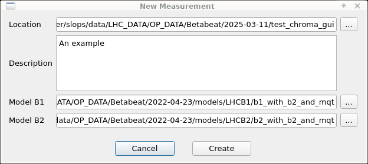
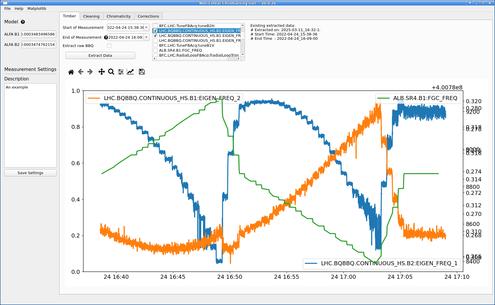
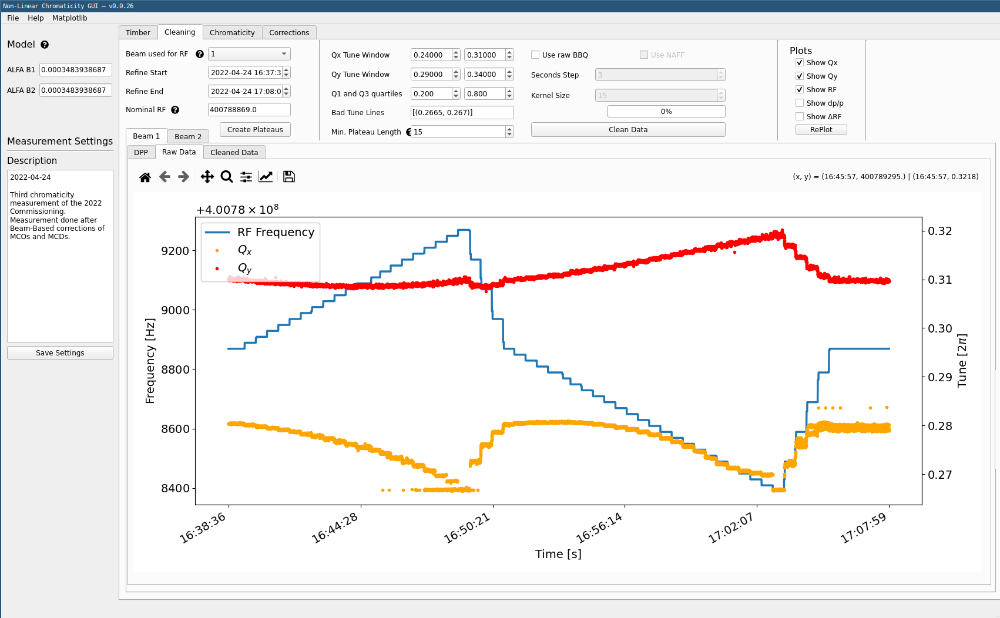
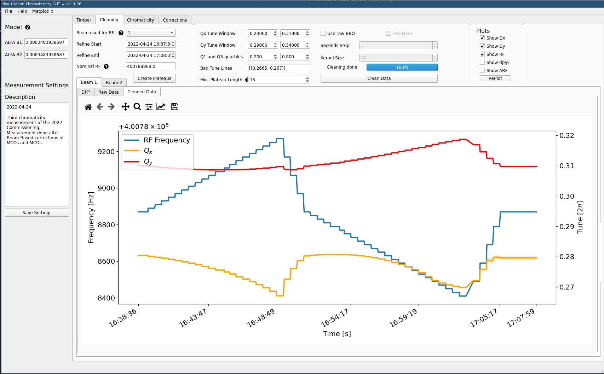
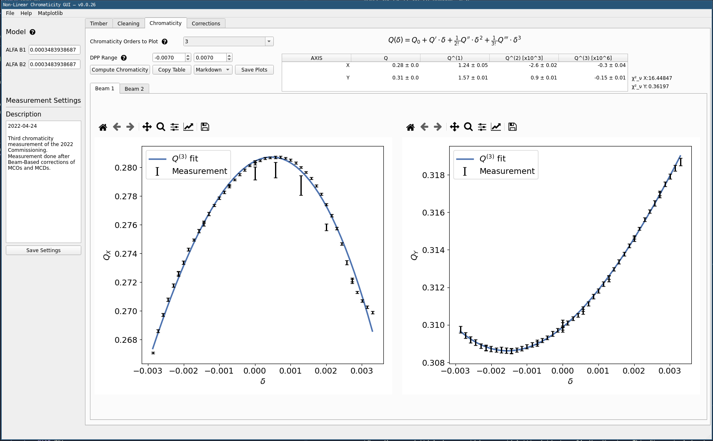
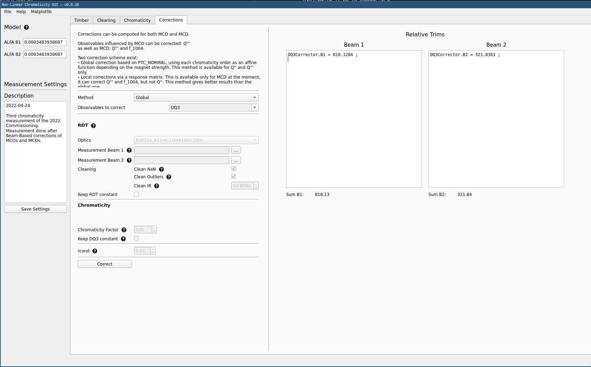

# The Non-Linear Chromaticity GUI

The non-linear chromaticity GUI provides functionality to analyze [chromaticity scans](#performing-scans) in the LHC.
The GUI itself has no functionality for making these measurements and only serves to extract and analyze data from `NXCALS`.

!!! info "Kerberos"
    Note that using the GUI requires a valid Kerberos token.

The GUI is published with `acc-py`, and can be run with:

```bash
/acc/local/share/python/acc-py/apps/acc-py-cli/pro/bin/acc-py app run chroma-gui
```

## Performing Scans

Chromaticity scans are performed by modulating the frequency of the RF cavities in the LHC.
The tune will be impacted by the chromaticity of the machine, and online tune data is automatically recorded to `NXCALS`.

!!! warning "Feedbacks OFF"
    Make sure to turn off both the tune and orbit feedbacks before performing an RF scan.
    See with the current EIC that no other operations are ongoing that could be affected.

To perform a scan, trim the RF circuit in steps to reach the desired momentum deviation.
A good rule of thumb, _for the LHC_, is that:

$$
dpp = \frac{\Delta f_{RF}}{140} \cdot 10^{-3}.
$$

A good modulation aims to reach between $2 \cdot 10^{-3}$ and $3 \cdot 10^{-3}$ in momentum deviation.
Typically, the scans are performed with ±300Hz in steps of 20Hz.

!!! tip "Max Modulation Amplitude"
    Scans have been performed safely in the past with ±400Hz, in cases where specific high orders were investigated.

## Analyzing Scans

To analyze data from a scan, start by launching the GUI as instructed above.
It should open to this default view:

<figure>
  <center>
  
  <figcaption> Chroma GUI Landing Page </figcaption>
  </center>
</figure>

### Starting a New Analysis

To start an analysis, click `File` in the top left, then click `New`.
The following menu will appear:

<figure>
  <center>
  
  <figcaption> New Measurement Analysis  </figcaption>
  </center>
</figure>

In there, set the following:

- For `Location`, select a directory where to store all data for this measurement analysis.
- For `Model B1` select the _directory_ with the relevant beam 1 model.
- For `Model B2` select the _directory_ with the relevant beam 2 model.
- Optionally, add a description of the measurement.
- Finally, click `Create`.

### Extracting Scan Data

Next, go to the `Timber` tab and select `start` and `end` dates to extract data from, then click `Extract Data`.

!!! tip "Time Convention"
    Note that the times are expected in UTC. One can check the online [Timber][timber_web]{target=_blank .cern_internal} interface for the correct time range of the scan data to extract.

!!! info "Data Extraction Process"
    There is no need to click `Extract raw BBQ` unless to re-analyze the raw data. There are specific UCAP nodes which have done this analysis already.

    There is no loading bar, the panel will just say "Extracting data from Timber..." on the right (and show some things in the terminal). Be patient.

When the extraction is done, the extracted variables will be listed in the central list view.
Clicking on any of the variables will plot the associated data just below.

<figure>
  <center>
  
  <figcaption> Timber Tab with Plot of Selected Extracted Data  </figcaption>
  </center>
</figure>

### Cleaning Extracted Data

Move on to the `Cleaning` tab.

- Potentially change the start and end times depending on when the modulation happens in your extracted data via `Refine Start` and `Refine End` entries.

    !!! warning "Expected Times"
        Please note that the `Refine Start` and `Refine End` entries refer to times in the Dataframes themselves, and it is possible that there are timezone issues from the extracted data times.
        One can check the times on the plotted data itself.

- Click the `Create Plateaus` button. This will extract the correct tune values from dp/p and create steps that can be analyzed. These will then be displayed, for the selected beam, both the RF frequency and the raw tune data.

<figure>
  <center>
  
  <figcaption> Cleaning Tab with Plot of RF Frequency and Raw Tune Data  </figcaption>
  </center>
</figure>

- Click `Clean Data` in the top part of the window. This will compute the tune average for each step and remove outliers. The windows for each tune can be specified and outliers removed in `Bad Tune Lines` in the top part. The minimum plateau length is used to remove very short steps.

In the plotting part of the window, move on to the `Cleaned Data` tab next to the `Raw Data` one.
This will display the clean tune data, with its error bar for each step.
Ideally this error bar should not be too visible.
Note that some steps may be entirely cleaned out due to the cleaning settings.

<figure>
  <center>
  
  <figcaption> Cleaning Tab with Plot of RF Frequency and Cleaned Tune Data  </figcaption>
  </center>
</figure>

### Computing Chromaticity

Move on to the `Chromaticity` tab.

- Select the highest order to be computed and plotted in `Chromaticity Orders to Plot`. Here 3 is a good start but you might want go higher based on the resulting data fits. All lower orders are computed anyways, check them if wanted in the plot.
- Click `Compute Chromaticity`. A fit is performed up to the provided order.

The results will be shown in plots below.
Similarly, the computed value for each order is shown in a table in the top right part of the window.

<figure>
  <center>
  
  <figcaption> Chromaticity Tab with Fit of Data up to the Provided Order  </figcaption>
  </center>
</figure>

!!! tip "Restricting Fit Range"
    One can manually set the `DPP Range` values to exclude extreme `dpp` values that would look fishy from the fit.

### Determining Corrections

Move to the `Corrections` tab.

- Keep the method set to `Global` correction scheme.
- For `Observables to correct` select `DQ2` or `DQ3` to correct $Q''$ or $Q'''$. Adapt the selection to the fitted order from the previous step.
- Click `Correct` to compute corrections for the given settings.

<figure>
  <center>
  
  <figcaption> Corrections Tab with Determined Trims for the Given Measurement and Settings  </figcaption>
  </center>
</figure>

!!! info "Trimming Corrections"
    The resulting correction needs to be **added** to all correctors as displayed, with no sign change.

    In the example screenshot above, this means going to `LSA App Suite`, selecting the relevant corrector circuit for `B1` and trimming an additional `818.1284` to the current value.

    The relevant LHC circuits can be found on pages 2 and 3 of this MD note:

    ??? abstract "MD6864 --- Decapole Studies at Injection, `M. Le Garrec et al.`, 2023, URL: [CERN-ACC-NOTE-2023-0018](https://cds.cern.ch/record/2879070){target=_blank}"
        ```
        @techreport{LeGarrecMD6864DecapoleStudies2023,
        type = {{Accelerators \& Technology Sector Note}},
        title = {{MD6864 --- Decapole Studies at Injection}},
        author = {Le Garrec, Mael and Carlier, Felix Simon and Dilly, Joschua Werner and Ferrentino, Vittorio and Maclean, Ewen Hamish and Paraschou, Konstantinos and Tomas Garcia, Rogelio},
        year = {2023},
        month = oct,
        number = {CERN-ACC-NOTE-2023-0018},
        institution = {CERN},
        url = {https://cds.cern.ch/record/2879070}
        }
        ```

[timber_web]: https://timber.cern.ch/

*[EIC]: Engineer in Charge, operators of the LHC
