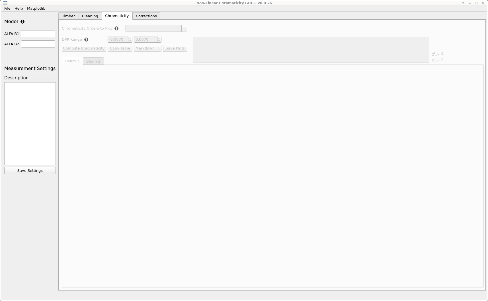

# The Non-Linear Chromaticity GUI

The non-linear chromaticity GUI provides functionality to analyze [chromaticity scans](#performing-scans) in the LHC.
The GUI itself has no functionality for making these measurements and only serves to extract and analyze data from `NXCALS`.

!!! note "Kerberos"
    Note that using the GUI requires a valid Kerberos token.

The GUI is published with `acc-py`, and can be run with:

```bash
/acc/local/share/python/acc-py/apps/acc-py-cli/pro/bin/acc-py app run chroma-gui
```

## Performing Scans

Chromaticity scans are performed by modulating the frequency of the RF cavities in the LHC.
The tune will be impacted by the chromaticity of the machine, and online tune data is automatically recorded to `NXCALS`.

!!! warning "Feedbacks OFF"
    Make sure to turn off both the tune and orbit feedbacks before performing an RF scan.
    See with the current EIC that no other operations are ongoing that could be affected.

To perform a scan, trim the RF circuit in steps to reach the desired momentum deviation.
A good rule of thumb, _for the LHC_, is that:

$$
dpp = \frac{\Delta f_{RF}}{140} \cdot 10^{-3}.
$$

A good modulation aims to reach between $2 \cdot 10^{-3}$ and $3 \cdot 10^{-3}$ in momentum deviation.
Typically, the scans are performed with ±300Hz.

!!! tip "Max Modulation Amplitude"
    Scans have been performed safely in the past with ±400Hz, in cases where specific high orders were investigated.

## Analyzing Scans

To analyze data from a scan, start by launching the GUI as instructed above.
It should open to this default view:

<figure>
  <center>
  
  <figcaption> Chroma GUI Landing Page </figcaption>
  </center>
</figure>

### Starting a New Analysis

To start an analysis, click `File` in the top left, then click `New`.
The following menu will appear:

<figure>
  <center>
  
  <figcaption> New Measurement Analysis  </figcaption>
  </center>
</figure>

In there, set the following:

- For `Location`, select a directory where to store all data for this measurement analysis.
- For `Model B1` select the _directory_ with the relevant beam 1 model.
- For `Model B2` select the _directory_ with the relevant beam 2 model.
- Optionally, add a description of the measurement.
- Finally, click `Create`.

### Extracting Scan Data

Next, go to the `Timber` tab and select `start` and `end` dates to extract data from, then click `Extract Data`.

!!! tip "Time Convention"
    Note that the times are expected in UTC. One can check the online [Timber][timber_web]{target=_blank .cern_internal} interface for the correct time range of the scan data to extract.

!!! note "Data Extraction Process"
    There is no need to click `Extract raw BBQ` unless to re-analyze the raw data. There are specific UCAP nodes which have done this analysis already.

    There is no loading bar, the panel will just say "Extracting data from Timber..." on the right (and show some things in the terminal). Be patient.

When the extraction is done, the extracted variables will be listed in the central list view.
Clicking on any of the variables will plot the associated data just below.

<figure>
  <center>
  
  <figcaption> Timber Tab with Plot of Selected Extracted Data  </figcaption>
  </center>
</figure>

### Cleaning Extracted Data

[timber_web]: https://timber.cern.ch/

*[EIC]: Engineer in Charge, operators of the LHC
