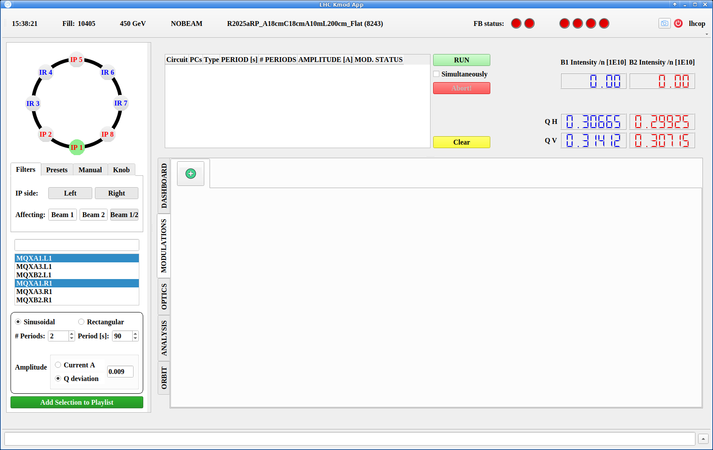
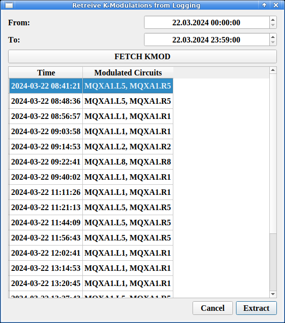
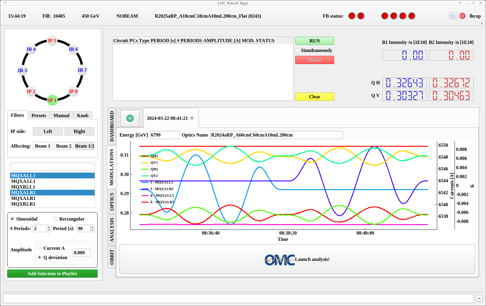
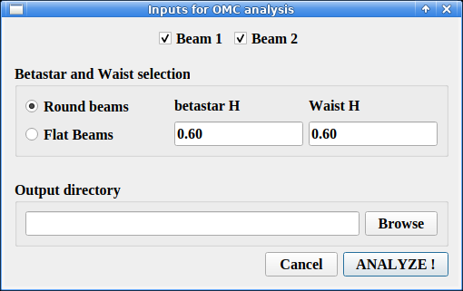
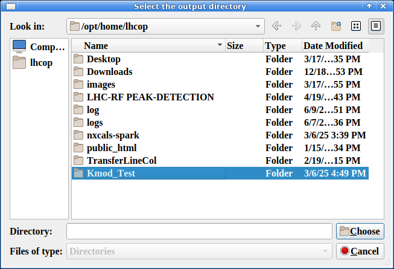
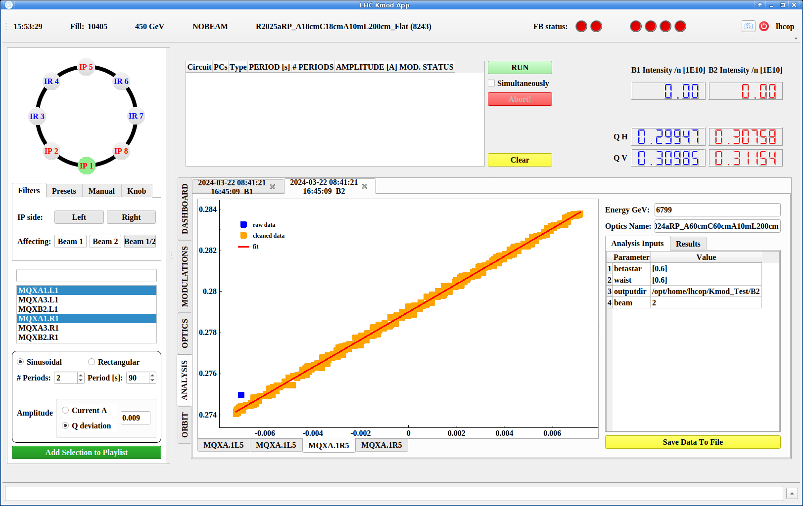

# Modulation Analysis

Any modulation's data is automatically saved in `NXCALS` and can be retrieved later for analysis.
We will briefly go over how to retrieve a previous modulation's data.
To see how to perform analysis on the data, jump to the [Analyzing Modulations](#analyzing-modulations) section.

## Retrieving Modulations

One can load a modulation from the `MODULATIONS` tab of the lower center part the GUI window, by clicking the big green `+` button, as shown below.

<figure>
  

  
  <figcaption> MODULATIONS Panel from Which to Load </figcaption>
  

</figure>

Clicking this button will open the `Retrieve` window.
There, select start and end times (`From` and `To` fields) between which to search for modulations and click the `FETCH KMOD` button.

A list of modulations will appear in the view below, showing for each the time of the modulation and the circuits that were modulated.
Select the desired modulations and click the `Extract` button.

<figure>
  

  
  <figcaption> Modulations Available for Extraction </figcaption>
  

</figure>

## Analyzing Modulations

After performing or retrieving a modulation, the measured data will be available in the `MODULATIONS` tab of the lower center part of the GUI.
A graph shows the measured tunes for each beam, as well as the modulated currents for the time of the modulation.

!!! note

    The following focuses on the analysis of modulations done at Interaction Points, aiming to determine values such as $\beta^{*}$ values, waist shifts, etc.

Just above the graph are also displayed both the beam energy as well as the optics, which are automatically queried from the beam process active during the modulation.
These can be manually changed in case they are incorrect.

<figure>
  

  
  <figcaption> View of a Performed Modulation </figcaption>
  

</figure>

From there, click the `Launch analysis!` button.
A first window will open with some options to select.
Select either `Round beams` or `Flat beams` as relevant and enter the expected $\beta^{*}$ values in `H` and `V` planes at the IP.

!!! warning "Units Conventions"

    It is rather unclear in the interface but the $\beta^{*}$ values are expected in `[m]`.

<figure>
  

  
  <figcaption> Analysis Settings Selection </figcaption>
  

</figure>

Below, `Browse` for a location where to save the data.
The GUI handles the structure among IPs, planes etc. and just needs to be provided with a directory.

!!! tip "Choice of Location"

    We have the convention of exporting analysis data to a `Kmod` folder in the location of the day for measurements, which is set by the `Beta-Beat` GUI.
    For a given day this would be: `/user/slops/data/LHC_DATA/OP_DATA/Betabeat/YYYY-MM-DD/Kmod`.

    One should then make a subfolder for the export of the modulation, e.g. `.../Kmod/IP1_60cm`.

Select a directory (or create one with the folder button at the top right) and click `Choose`.

<figure>
  

  
  <figcaption> Kmod Analysis Output Directory Selection </figcaption>
  

</figure>

Once back to the previous window, click `ANALYZE!` and the relevant codes will be run in the background.
As soon as the analysis is finished, the main GUI window will switch to the `ANALYSIS` tab, and display a graph of the regression fit for each modulated circuit.

<figure>
  

  
  <figcaption> Kmod Analysis Result </figcaption>
  

</figure>

To the right of the graph both the `Analysis Inputs` and `Results` can be explored, each in their own tab.
The exported data is already in the right format to be imported in the `Beta-Beat` GUI for better data points around the IPs in order to determine a correction.

!!! note "Saving Data"

    There is no need to click the yellow `Save Data To File` button at the bottom right of the window as the data has already been written to disk after analysis.
    This button is only useful if one wants to re-export the data in a different location.
