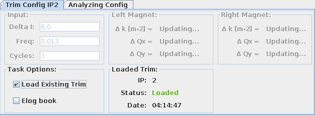
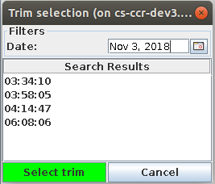
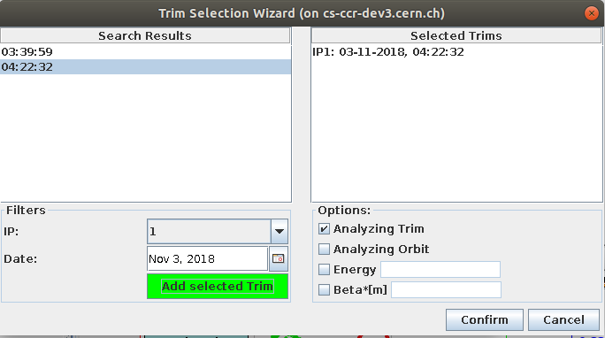
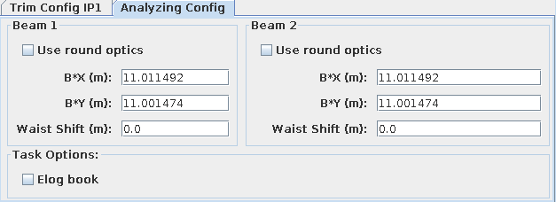

# Auto Trim

The `AutoTrim` functionality combines all existing tasks in the Kmod GUI.
The user can choose tasks to do for each IP.
The `AutoTrim` then executes all the trimming tasks and analyzing tasks in the best order possible to optimize the process.

The user can input parameters once to do the k-modulation and other analysis tasks on many IP's.
The results and current status of each process is displayed on the main panel.
The `AutoTrim` provides something like a pipeline of many k-modulations and their analyzing tasks.

!!! tip "First Time AutoTrim"

    If you are in the CCC and have never used the `AutoTrim` before, follow these steps:
    
    1. Open the `AutoTrimDialog` by clicking on the `AutoTim` button located on the left side of the main panel.
    2. Add the IPs you want to trim or analyze with the buttons on the left side.
    3. Input the trim parameter or load an existing trim for each IP tab.
    4. Select the analyzing options you want to execute.
    5. Input the needed values for the trim and all the optional tasks.
    6. Once everything is set up, right press the `Start` button and select the directory where to save the results (It will save the results depending on the trim time and IP. See wiki for more information).
    7. The `AutoTrim` will now check if the orbit feedback is on and the tune feedback is off. Make sure to put them in the desired state.
    8. The `ResultsView` will open and the `AutoTrim` gets started.

## AutoTrim Panel

### The InputPanel

This input panel provides all the options to set every parameter for k-modulation.
On the left panel the user can choose which IP to trim or analyze.

Depending on the parameters, the panel will show input panels for the specific IPs: each panel has a top bar with optional tasks that can be executed after the trim as well as an input field for the current energy.
The energy value is gathered live from the LHC, but can be edited.
Underneath is another tabbed pane for each task in the current process which needs some user input.

<figure>
  
  <figcaption>The AutoTrim input panel.</figcaption>
</figure>

By pressing the start button, it will ask the user for the save directory and then starts the `AutoTrim` process.
`AutoTrim` will then create a result folder for each IP, open the `ResultsView` on the main panel and start the pipeline of processes.
The chosen save directory is the root directory.
The `AutoTrim` will then create a subdirectory for each IP where the result files are stored.

In principle, this will perform a full IP trim for all of the selected IPs and planes. 
For more details, see the [full IP trim](full_ip_trim.md) section.

### The ResultsView

The `ResultsView` is the main panel of an `AutoTrim` process.
It is built as a tabbed pane which holds the content of the processes for many IPs and displays information such as process status, results, etc.
The status panel and the result panel are the main components for each process.

<figure>
  
  <figcaption>The ResultsView.</figcaption>
</figure>

At the top is a `thread queue` bar which displays all the active, finished and scheduled threads.

<figure>
  
  <figcaption>The thread queue of the results view.</figcaption>
</figure>

!!! tip
    By double-clicking on the IP label of the tabbed pane its possible to extract the IP panel in another frame.
    It will snap back to the tabbed pane if it gets closed by the user.

#### The Status Panel

The status panel shows information about the current process, with the currently running task is displayed at the top.
The user can click through the list of tasks to see start/end time, input parameters, log entries, and the current status.

There is also a panel for the input parameter of thes current task.
This has to be done in the actual task code since the view doesn't have a reference to the task.
The last panel is the logger text area for each task.
Per default, it will show the last logging entry with the corresponding time, but the user can expand the list by clicking on the drop-down button.

<figure>
  
  <figcaption>The AutoTrim Status Panel.</figcaption>
</figure>

??? info "Status Types Explained"
    | Status                             | Description                                                               |
    | :-------------------------------- | :------------------------------------------------------------------------ |
    | `Starting`{: style="color:green"} | Task is creating all the needed objects or loads some data from a file.*  |
    | `Running`{: style="color:green"}  | Main functionality of this task is currently executed.                    |
    | `Finished`{: style="color:blue"} | Task finished without any problems.                                       |
    | `Waiting`{: style="color:blue"}  | Task is waiting for some synchronization variable.*                       |
    | `Scheduled`{: style="color:grey"}| Task is in the queue and ready to be executed.                            |
    | `Canceled`{: style="background:yellow"} | Task got canceled by the user (Not possible still a big TODO).            |
    | `Crashed`{: style="color:red"}  | Task crashed because an exception is fired or a critical error occurred.  |
    
    \* Not used at the moment, might be useful later (non thread-safe functionality, etc.)

## Loading Existing Trims from Timber

The `AutoTrim` provides two ways to add existing trim data to the process queue:

- Adding the selected Timber entry directly to an existing IP tab in the `AutoTrim` panel. There, one can only select the trim entries depending on the IP of the tab.
- Selecting any trim you want with the `Trim-Selection` panel, which will then add the selected trims as tabs to the `AutoTrim` panel.

### Load a trim directly to an AutoTrim-Tab

Start by creating your IP tab by clicking on the button on the left side: tick the `Load existing trim` checkbox and it will open the trim selection panel.

<figure>
  
  <figcaption>AutoTrim: load existing trim.</figcaption>
</figure>

Expand the date picker and choose the day when the trim was executed.
Left click on the trim you want to load and press the `Select trim` button.

<figure>
  
  <figcaption>AutoTrim: load existing trim, date picker.</figcaption>
</figure>

The loaded trim date is then displayed on the trim panel and all the other input fields for the Full IP Trim are disabled, as input is not needed.
To discard the loaded trim and proceed with the Full IP Trim instead, untick the `Load existing trim` checkbox.

### The Trim-Selection Panel

The `Trim-Selection` panel will add the selected trim data as tabs to the `AutoTrim` panel.
It also provides some basic options to apply to every tab, such as setting analyzing the orbit to default.
This might be the best option if you want to reanalyze many trims with the same model.

Open this panel by pressing the `Load Trims` button located on the bottom center of the `AutoTrim` panel.
Filter the Timber entries by IP and date, then select the trim entries in the `Search Results` panel and press the green `Add selected trim` button.
The trims are now selected and displayed in the `Selected Trims` panel.
By clicking on `confirm` the tabs will be added to the `AutoTrim` panel.

You can now set some basic options for the selected trims in the `Options` pane.
These values are automatically set as preset values for the loaded trim tabs.

<figure>
  
  <figcaption>The AutoTrim Trim Selection Wizard.</figcaption>
</figure>

## Simulation Mode

The kmod application provides two different modes to execute all its functionality:

- The `Measurement mode`, which is the standard mode and should be used in the control center to gather real data from the LHC.
- The `Simulation mode`, which only simulates these live measurements.

If you start a normal trim task in `Simulation mode` the `AutoTrim` will load the last trim data from timber.
This data is then displayed like a normal trim during a live measurement.
The energy value is not automatically loaded from Timber, and uses a preset value of 6500.0 GeV.
The `AutoTrim` won't check if the Orbit and Tune feedback is on or off. 

## Analyzing a Trim

### Input Tab

This input tab is separated into two sides, one for each existing beam in the LHC. 
One side holds the input fields for all needed parameters in order to run the beta star analysis script. 
It is also possible to provide only one estimated beta star value as input by ticking the `Use round optics` option. 
This checkbox will disable the input for the beta star in the vertical plane and uses the horizontal input for both.

Parameters: 

- **B* X [m]**: Estimated horizontal beta-star (X) of measurements as a double.
- **B* Y [m]**: Estimated vertical beta-star (Y) of measurements as a double.
- **Waist Shift [m]**: Estimated waist-shift as double value.

<figure>
  
  <figcaption>The Analyzing Configuration.</figcaption>
</figure>

### Results Panel
This analyzing task will display the results on the Analyzing Trim tab. 
It will list the $\beta^{*}$ values and waist shift on the horizontal and vertical plane for each beam. 
The saved plots of the script are displayed on the right side for each beam.
By clicking on the image it will expand and show the full-size plot in a new frame.

<figure>
  
  <figcaption>The Analyzing Trim Results.</figcaption>
</figure>

*[IP]: Interaction Point