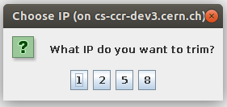
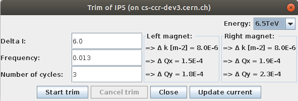
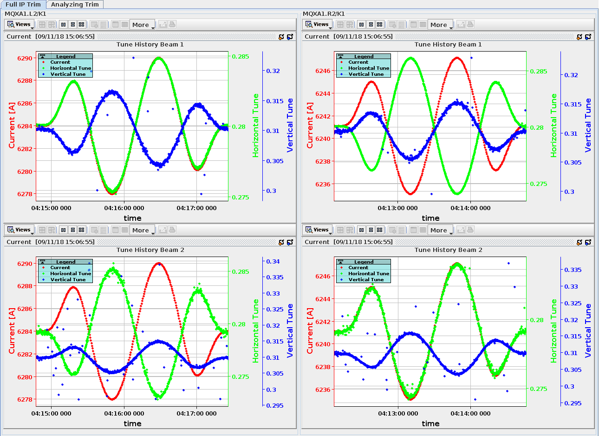

# Performing a Full IP Trim

The `Full IP Trim` module of the GUI executes the K-Modulation on a selected Interaction Point with its predefined quadrupoles.
Each bigger experiment like ATLAS (IP1), ALICE (IP2), CMS (IP5) and LHCb (IP8) is referred to by its corresponding number in the LHC complex.

<figure>
  
  <figcaption>Choose an IP.</figcaption>
</figure>

By using this module, the quadrupole identifier and several other parameters are predefined to the corresponding Interaction Points.
After the modulation is done, the trim data is present on the database and can be visualized and analyzed using the measurement view dialog.
In order to start the K-Modulation on a magnet, the power converter has to be accessed using the CERN provided LSA Java API. 

The available parameters are the following:

- **Delta I**: Change of magnet strength in Amperes. Default value is `6.0A`.
- **Frequency**: How fast the magnet strength is changed. Default value is `0.013`.
- **Cycles**: How many times the modulation is done. Default value is `3`.

    <figure>
      
      <figcaption>Select trim parameter.</figcaption>
    </figure>

## Result Panel

While the Full IP Trim is executed the current and the tune values are displayed live in the result panel.
After the modulation is done, it will show the whole trim results in the corresponding `ResultPanel` of this trimming task.
The trim results are stored in the `save directory` of the current IP.

<figure>
  
  <figcaption>Trim result panel.</figcaption>
</figure>

*[IP]: Interaction Point
*[LSA]: LHC Software Architecture