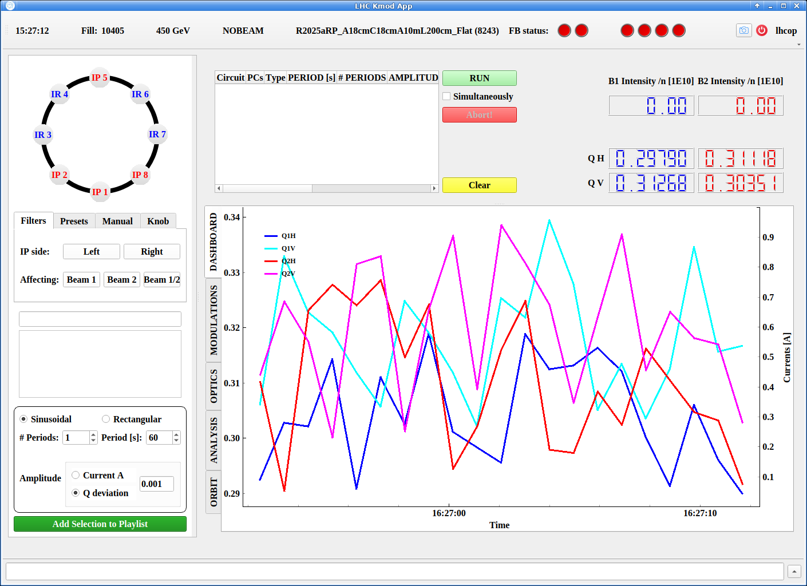

# The Kmod GUI

The Kmod GUI provides functionality to perform [K-Modulation][kmod_method] in the LHC.
It also has the ability to extract and analyze data from previous trims.

This section will guide you through the GUI's layout and functionality.
We also provide a procedure page for [performing K-modulation in the CCC][kmod_measurements].

The GUI is a lightweight Python application built on `acc-widgets`.
It can be run either from the `CCM` or the command line:

=== "From the CCM"

    Have a [working `CCM`][gui_basics] running as `lhcop`, then navigate to `LHC Control` -> `LHC Beam Measurements` -> `K-Modulation`.

=== "From the Command Line"

    The app is published with `acc-py`, and can be run with:

    ```bash
    /acc/local/share/python/acc-py/apps/acc-py-cli/pro/bin/acc-py app run pykmodlhc
    ```

After opening, the GUI should look like this:

<figure>
  <center>
  
  <figcaption> Kmod GUI Landing Page </figcaption>
  </center>
</figure>

The following pages are available:

- [Performing a Modulation](modulating.md) for how to do Kmod at an IP or a single circuit.
- [Extracting Data](extracting.md) for how to retrieve previous modulation data from `NXCALS`.
- [Analyzing Data](analyzing.md) for how to analyze the modulation data and export results.

[gui_basics]: ../about.md#running-in-the-ccc-in-2025
[kmod_method]: ../../measurements/physics/kmod.md
[kmod_measurements]: ../../measurements/procedures/kmod.md

*[CCC]: CERN Control Center
