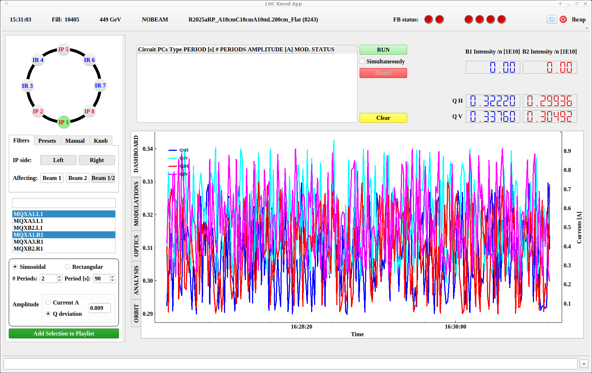

# Performing a Modulation

Performing a modulation is rather simple.
This page will showcase the interface and workflow, but more details and checks that should be followed are available in the [Kmod Measurement Procedure][kmod_measurements].

## Selecting Circuits

In the top left of the GUI window, all locations with circuits available for modulation are displayed, in a circular manner similar to their position in the machine.

To start, select a given `IP` in that view by clicking on it.
It will display with a green background.
The available circuits at this location will appear in the list view below.

In the `Filters` section, select the side(s) of the location (`Left`, `Right` or both) and the affected beams (`Beam 1`, `Beam 2` or both) for the modulation.
In the list below select the circuits to be modulated.

<figure>
  

  
  <figcaption> Selecting Q1 Circuits Left and Right of IP1 for Both Beams </figcaption>
  

</figure>

## Choosing Settings

Once the desired circuits are selected, move on to the `Settings` sectoion just below and choose:

- The modulation waveform (`Sinusoidal` or `Rectangular`).
- The number of modulation periods.
- The duration of a single modulation period.
- The modulation amplitude, either as `Current` or `Q` (tune) deviation.

!!! tip "OMC Defaults"

    Default values we usually use are: `2 period` of `90s` each, `Sinusoidal`, and with a`Q deviation` of `0.009` (for injection tunes).

!!! warning

    Be careful with the `Q deviation` setting, which should be based on the current working point.
    One tune will rise by the selected amount (at the height of the modulation), while the other will drop by the same amount during modulation.

    This could inadvertently lead to a Closest Tune Approach (CTA) or resonance crossing if the setting was chosen wrongly.
    See the [Kmod Measurement Procedure][kmod_measurements] for more relevant checks.

Once the settings are chosen, click the green `Add Selection to Playlist` button at the bottom left of the panel.
The modulation plan will show up in the upper center part of the GUI window.

## Modulating

## Next

[kmod_measurements]: ../../measurements/procedures/kmod.md
