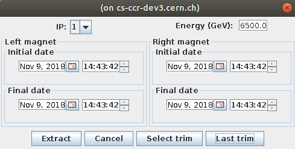
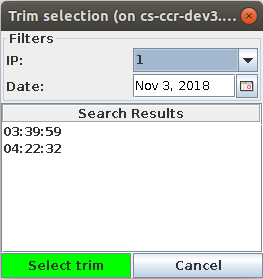
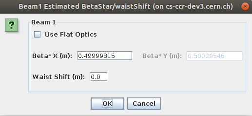

# Analyzing Trim Data

The Kmod GUI provides functionality to load previously recorded trim data and perform a k-modulation analysis of the results.
The steps are described below.

## Extract Trim Panel

If you want to extract data from a previous trim, press on the `Extract Previous Trim` button.
Input the right energy value for this trim in the top right input field and press the `Select trim` or the `Last Trim` button.
Just ignore the rest (TODO: why???)

The `Select trim` button will open the trim selection panel and the `Last trim` button will just load the last trim entry from Timber.

<figure>
  
  <figcaption>The "Select Trim" Panel.</figcaption>
</figure>

If you chose `Select trim`, then select the desired IP then navigate othe desired date and confirm with pressing on the green `Select trim` button.
You can switch between different IPs and dates by using the `combo` boxes.

<figure>
  
  <figcaption>Select Trim by Date.</figcaption>
</figure>

## Measurement View Dialog 

The selected/loaded trim will then be displayed in the `Measurement View Dialog`, from which you can analyze the trim data with different options.

<figure>
  
  <figcaption>Measurement View.</figcaption>
</figure>

To get beta-star values, press the `Analyze Trim button`, then in the next dialog select the directory in which to save the trim data and the results.
You will need to input the *estimated* beta star in the horizontal and vertical planes as well as the waist shift for each beam.

The values are loaded from the model files.
If no model is loaded, you have to input those values.
The (old) python code of this script can be found [here][kmod_python2]{target=_blank}.
The results are stored in the file named `beta_star.out`.

<figure>
  
  <figcaption>Estimated beta-star input.</figcaption>
</figure>


!!! tip "Special Case: Individual Magnet Modulation"

    If individual circuits/magnets have been modulated, the analysis cannot (yet) be triggered from the GUI.
    Instead, the `gui2kmod.py` script has to be called from the command line.
     
    For the input arguments, the working directory (`--working_directory`) should point to a folder where the extracted data of both modulated quadrupoles is present and the `--circuit` option should be selected, followed by the two circuit names.
    The initial guesses should be set to a large beta function and waist (e.g. `--BetastarAndWaist 200,-100`) to speed up the convergence.

    An *example* script call would look as follow:
    ```bash
    gui2kmod.py --circuit rq5.l4b1,rq5.r4b1 --beam b1 --BetastarAndWaist 200,-100 --instruments MONITOR,RBEND,INSTRUMENT,TKICKER --working_directory /path/to/data
    ```
    
    Results are then saved in the working directory in a folder with the magnet names.

!!! todo
    I think Hector took care of Kmod analysis for `omc3` so maybe the above tip section should point to the newest codes?


*[IP]: Interaction Point

[kmod_python2]: https://github.com/pylhc/Beta-Beat.src/blob/master/kmod/gui2beta/gui2kmod.py