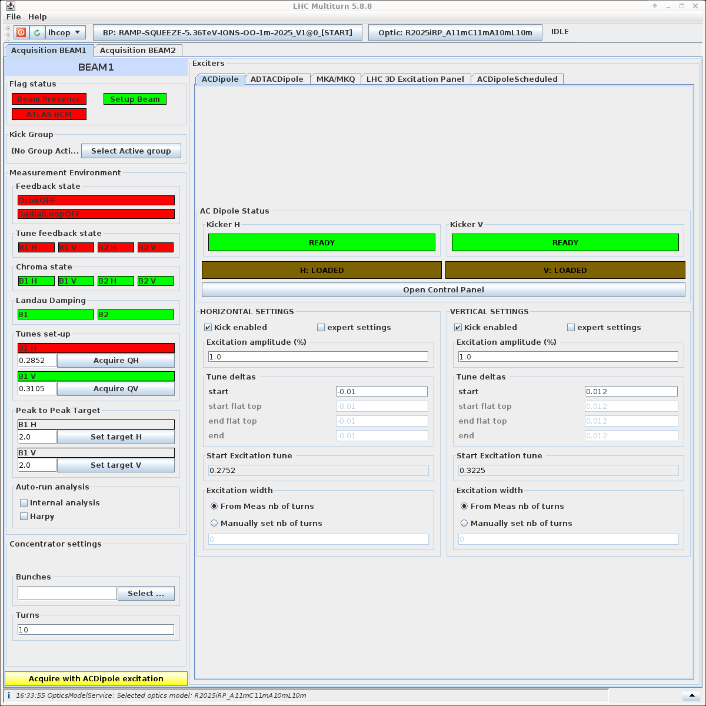

# AC-Dipole Measurements
Once all the steps have been followed in the [Multiturn GUI](gui.md), you can start the measurements with the AC-dipole.

See the gui below for the `ACDipole` tab in the Multiturn GUI:
<figure>
    

    
    <figcaption>AC-Dipole Tab</figcaption>
    

</figure>

There are two important steps to take before starting the measurements:
1. Set the Tune Deltas, this is done by changing the `start` text fields in the `Tune deltas` of the `Horizontal settings` and `Vertical settings` sections of the GUI:
   - The horizontal tune delta is typically set to **-0.01**.
   - The vertical tune delta is typically set to **0.012**.
   - These values result in typical excitation tunes of **Qx = 0.27** and **Qy = 0.322**.
2. Set the Kick Amplitudes by changing the `Excitation amplitude (%)` text fields in the `Horizontal settings` and `Vertical settings` sections of the GUI.

## Selecting the Kick Amplitudes
The kick amplitudes are very important for the measurements, as they determine the strength of the excitation. Generally, the higher the kick amplitude, the better the measurement, but this increases beam losses and risks dumping the beam. In most cases, large losses and beam dumps are unwanted, so it is important to select the kick amplitudes carefully.

---
**IMPORTANT**

Always ask the experts on shift if you are unsure about the kick amplitudes to use.

---

### Kick amplitudes at injection
At injection, the beam is not particularly hard, therefore, small kick amplitudes result in large peak to peak oscillations in the BPMs. This means we generally use small kick amplitudes, starting from **1%** or **3%** and going up slowly in steps of **2%** or **3%** until it appears that losses are starting to increase significantly. 

---
**NOTE**

Sometimes when you are increasing in kick amplitude, you will see suddenly large losses. If this is the case, it is recommended to kick a couple times at this amplitude to see if the losses reduce or are consistent. If they reduce, it is likely the beam just needs cleaning before you can increase the kick amplitude further. If they are consistent, this indicates that any higher kick amplitude will result in increased losses. Refer to the experts on shift if you are unsure about the losses, and whether you can increase the kick amplitude further.

---

### Kick amplitudes during the ramp
A typical table of amplitdues during the ramp is as follows:

<!--  time    TeV   phaseknob    ATS            betas(m)       kick(%)    
  30s   0.46        100%      1     11   11   10   10       3
 240s    1.0         50%      1     11   11   10   10       7                             
 405s    1.9          0%      1     10   10   10   10      13
 580s    2.9          0%      1      7    7   10    7      19      
 720s    3.7          0%      1      3.7  3.7 10    3.7    24
 860s    4.5          0%      1      2    2   10    2      30 
1010s    5.5          0%    0.75     2    2   10    2      36    
1160s    6.2          0%    0.57     2    2   10    2      41    
1247s    6.6          0%    0.5      2    2   10    2      45   -->

| Time | Energy (TeV) | Phase Knob | ATS | Kick Amplitude (%) |
|------|--------------|------------|-----|--------------------|
| 30s  | 0.46         | 100%       | 1   | 3                  | 
| 240s | 1.0          | 50%        | 1   | 7                  |
| 405s | 1.9          | 0%         | 1   | 13                 |
| 580s | 2.9          | 0%         | 1   | 19                 |
| 720s | 3.7          | 0%       | 1   | 24                 |
| 860s | 4.5          | 0%         | 1   | 30                 |
| 1010s | 5.5          | 0%         | 0.75| 36                 |
| 1160s | 6.2          | 0%         |  0.57| 41                 |
| 1247s | 6.6          | 0%         | 0.5 | 45                 |

This table scales the kick amplitudes with the energy, and hence the kick amplitudes are larger at higher energies. The values in the table are a good starting point, but it is important to monitor the losses and reduce the kick amplitudes accordingly.

### Kick amplitudes top energy
When at 6.8 TeV, the beam is quite hard, and hence we can use larger kick amplitudes. Starting from **5%** and going up in steps of **5%** until the losses start to increase significantly usually works well. 

---
**NOTE**

Always ask the experts on shift if you are unsure about the kick amplitudes to use.

---

