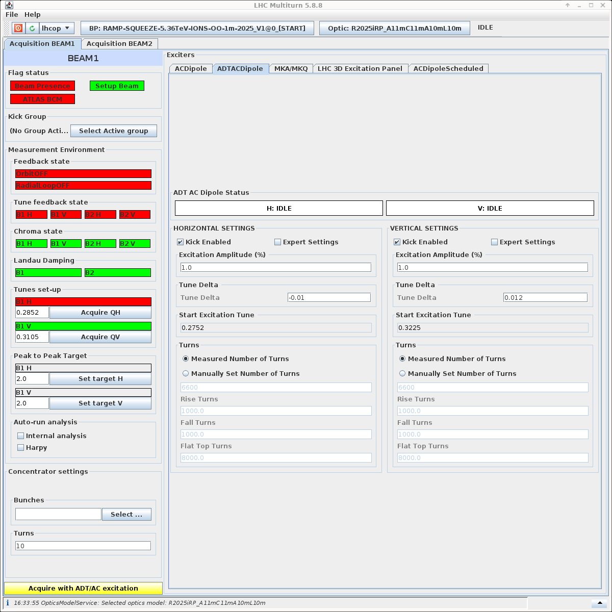

# ADT AC-Dipole Measurements
Once all the steps have been followed in the [Multiturn GUI](gui.md), you can start the measurements with the ADT AC-dipole.

See the gui below for the `ADTACDipole` tab in the Multiturn GUI:
<figure>
    

    
    <figcaption>ADT AC-Dipole Tab</figcaption>
    

</figure>

The ADT AC-dipole measurements are very similar to the AC-dipole measurements, with two main differences:
- The ADT AC-dipole measurements can be performed over a longer number of turns, typically **40,000 turns**.
- The ADT AC-dipole kicks are typically smaller than the AC-dipole kicks.

Therefore the steps to perform the measurements are essentially identical to the AC-dipole measurements, so please refer to the [AC-Dipole Measurements](acdipole.md) page for the steps to perform the measurements.

Otherwise, the same logic of increasing the kick amplitudes and looking into losses applies. 