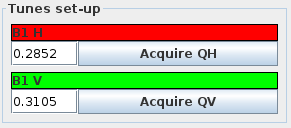

# Performing Beam Excitation

Once [all the checks](safety.md) have been performed, one can start measurements.
In the Multiturn GUI one can perform beam excitation with either the AC Dipole or the ADT, and both procedures are very similar.
Select either the `ACDipole` or `ADTACDipole` tab at the top of the GUI, depending on the desired excitation device.

## Common Settings

The following settings are set identically for both the AC Dipole and the ADT, in the left-hand side of the GUI:

### Kick Groups

Before exciting the beam, one should select or create a kick group.
A kick group collects measurements under a single name, gathers them in the logbook and makes it easier in the future to simultaneously load related kicks at once.

??? tip "Kickgroups in JSON"
    Each kick group also has a corresponding `.json` file in `/user/slops/data/LHC_DATA/OP_DATA/Betabeat/KickGroups/MULTITURN_ACQ_GROUPS`, in which the paths to the acquired turn-by-turn data and their individual `.json` files containing information about the excitation parameter is stored.
    See also the [PyLHC tool for KickGroups][pylhc_kickgroups]{target=_blank}.

Creating a new group is done by clicking the ++"Select Active group"++ button in the top left corner of the GUI, which will open the following dialog:

<figure>
    

    
    <figcaption> Select Active Group Dialog </figcaption>
    

</figure>

Typically one wants to create a new kick group.
To do so:

- Click the ++"Create new Group"++ button at the bottom in the centre, which will open the following dialog, with a default naming scheme:

<figure>
    

    
    <figcaption> Create New Group Dialog </figcaption>
    

</figure>

- Adapt the text entry under `Group Name` to reflect the measurements to be done in this group.
A good naming practice is to lead with the date and beam number as suggested, e.g. `YYYY-MM-DD_BEAM1_Measurement_description`.
Make sure to press ++"Enter"++ after typing the name.
Optionally add a description in the field below, and click the ++"Create"++ button.
Once created the new group will appear at the bottom of the list of available groups.

- Select the new group and click the ++"Activate selected"++.
This should then create a new entry in the `LHC-OMC` logbook with information about the group, and all acquisitions done in this group will be logged to that entry automatically.

### Tunes Setup

The fields in this section expect the values of the horizontal and vertical tunes for the selected beam:

<figure>
    

    
    <figcaption> Tunes Setup Section </figcaption>
    

</figure>

They should be the natural tunes used in the machine during measurements.
Either enter the values manually or, to enter the current tunes click the ++"Acquire QH"++ and ++"Acquire QV"++ buttons which will update the value to the current one measured with the BBQ.
These values can be manually refined if necessary.

!!! warning "Unexpected Tunes"
    This acquisition is also a sanity check for the state of the machine.
    It can happen that the machine tunes are different from what is expected, e.g. because it was forgotten to revert them to the desired working point.
    Such a mistake would easily be detected with a press of this button, which can prevent unexpected beam dumps.
    Use this feature!

### Concentrator Settings

These settings refer to the excitation to be performed.
The excitation device needs to know which bunches to excite and how long the excitation should last (in terms of turns).

<figure>
    

    
    <figcaption> Concentrator Settings Section </figcaption>
    

</figure>

- To select the bunches, click the ++"Select ..."++ button under the `Bunches` section, which opens the following dialog:

<!-- TODO: Need to add a screenshot of the multiturn -->

- Choose ++"Select Bunches with Beam"++ to select all bunches present in the machine.
We typically do not inject bunches that won't be excited for optics measurements.
It is also possible to manually enter the bunches, each number separated by a space.
<!-- TODO: Check if they are space of comma separated -->

- Set the number of turns to maintain the excitation for in the `Turns` field below.
These correspond to the excitation plateau length, and does not include ramp-up and ramp-down times.

!!! tip "Excitation Duration"
    For AC-Dipole measurements, this setting is typically __6600 turns__, while for ADT measurements it is typically __40,000 turns__.
    Do not set these values higher than these for the respective measurements, as this can lead to the AC Dipole being damaged or the BPM buffers overflowing causing data to be lost or overwritten.

## AC Dipole Excitation

Selecting the `ACDipole` tab will change the right-hand side of the GUI window to display the following:

<figure>
    

    
    <figcaption>AC Dipole Tab</figcaption>
    

</figure>

The two following settings need to be set before starting measurements.

### Tune Deltas

The excitation device drives the beam motion to a different frequency than the natural tune, which is determined by its offset from the natural tune, called the "tune delta".
Set these values in the `start` fields of the `Tune deltas` section, for both the horizontal and vertical planes (`Horizontal settings` and `Vertical settings` sections).

!!! tip "Typical Default Values"

    We often perform optics measurements using the $Q_x = 0.28$, $Q_y = 0.31$ tunes, and the following tune deltas:

    - The horizontal tune delta is typically set to $\Delta Q_x = -0.01$.
    - The vertical tune delta is typically set to $\Delta Q_y = 0.012$.

    These values result in typical excitation tunes of $Q_x^{driven} = 0.27$ and $Q_y^{driven} = 0.322$.
    Depending on the specific measurements, other tunes and tune deltas may be required.
    Always consult with the experts on shift if unsure about the values to use.

The resulting driven tunes will be automatically computed and displayed under `Start Excitation tune`.
Make sure to double check these values, as a wrong setting can lead to a direct beam dump.

### Kick Amplitudes

Kick amplitudes determine the excitation strength.
Generally higher kicks lead to better signal-to-noise ration and allow measuring more faint beam modes and RDTs, but come with the risk of beam losses and therefore signal degradation, or even beam dump.

Set the Kick Amplitudes by changing the value in `Excitation amplitude (%)` field, for both the horizontal and vertical planes (`Horizontal settings` and `Vertical settings` sections).
Always ask the experts on shift if unsure about the kick amplitudes to set.

??? info "Kick Amplitudes at Injection"

    As the beams are not particularly hard at injection, small kick amplitudes lead to large peak to peak oscillations and we generally use small amplitudes.
    A reasonable starting point is anywhere between __1%__ and __3%__, then going up slowly in steps of __2%__, until beam losses during kicks stop being reasonable.

??? info "Kick Amplitudes in the Ramp"

    Performing kicks in the ramp requires careful planning.
    As the beam energy increases, so does the beam rigidity harder and hence larger kick amplitudes can be used.
    Nevertheless, careful monitoring of losses during acquisitions and adjusting the kick amplitudes accordingly is crucial.

    Typically, we prepare a table various kicks to be performed, indicating the time in the ramp, corresponding energy, phase knob setting, ATS factor, kick amplitude and optics file.
    These should follow the various match points for the given energy ramp program, and the kick strengths should scale approximately linearly with the beam energy, starting from safe strength at injection.
    <!-- TODO: check this first! Most of these information can be found by searching `LSA` in the `CCM`, then navigating to and opening `Generator`, `Edit` mode and searching & selecting the relevant beam process. -->

    An __example table__ is shown below.

    | Time  | Energy (TeV) | Phase Knob | ATS  | Kick Amplitude (%) |   Optics    |
    |:-----:|:------------:|:----------:|:----:|:------------------:|:-----------:|
    |  30s  |     0.46     |    100%    |  1   |         3          | TODO: write |
    | 240s  |     1.0      |    50%     |  1   |         7          | TODO: write |
    | 405s  |     1.9      |     0%     |  1   |         13         | TODO: write |
    | 580s  |     2.9      |     0%     |  1   |         19         | TODO: write |
    | 720s  |     3.7      |     0%     |  1   |         24         | TODO: write |
    | 860s  |     4.5      |     0%     |  1   |         30         | TODO: write |
    | 1010s |     5.5      |     0%     | 0.75 |         36         | TODO: write |
    | 1160s |     6.2      |     0%     | 0.57 |         41         | TODO: write |
    | 1247s |     6.6      |     0%     | 0.5  |         45         | TODO: write |

    The values in this table are a good starting point, but it is important to monitor the losses and reduce the kick amplitudes accordingly.

??? info "Kick Amplitudes at Top Energy"

    At top energy the increased beam rigidity allows us larger kick amplitudes.
    A reasonable starting point is __5%__, then going up in steps of __5%__ until beam losses during kicks stop being reasonable.
    Remember that it is very time-consuming to get back to this state when losing the beam at top energy, so monitor beam losses carefully and be reasonable with the kick increases.

### Exciting the Beam

Trigger an acquisition by clicking the yellow ++"Acquire with ACDipole excitation"++ button at the bottom left of the GUI.
The AC Dipole will arm, then kick the beam.
Make sure to have a `BLM Display` application open and to monitor the losses during that time.

Afterwards, a new tab will open at the very top of the GUI to display the BPM measurements, which can be checked.

??? info "Losses on Kicks"
    Sometimes when increasing the kick amplitude, one will notice large losses.
    In this case it is recommended to kick a couple times at this amplitude or just below to see if the losses reduce or are consistent.

    Should they reduce the beam might have just needed cleaning and one can increase the kick amplitude further.
    Otherwise, stop increasing unless a beam dump is affordable.
    Refer to the experts on shift if unsure about the losses, and whether the kick amplitude can be increased further.

!!! danger "Do not Kick Both Beams Simultaneously"
    Triggering an acquisition will always turns off the tune feedback, radial loop, and orbit feedback for that beam.
    Afterward, the system restores these to the exact state they were in before the acquisition.

    This means if one kicks Beam 1 and quickly after Beam 2, Beam 1’s feedback loops will be left off!
    This is because they were off when the system triggered the Beam 2 measurement, and the system restores the global state.

## ADT AC-Dipole Excitation

Selecting the `ADTACDipole` tab will change the right-hand side of the GUI window to display the following:

<figure>
    

    
    <figcaption>ADT AC-Dipole Tab</figcaption>
    

</figure>

Currently ADT AC-dipole measurements are almost identical to the AC Dipole measurements.
Refer to the [AC Dipole Excitation](#ac-dipole-excitation) section above for the settings and steps.

!!! note "Slight Differences"

    Note that ADT AC-dipole measurements can be performed over a longer number of turns, typically __40,000 turns__, but the resulting peak-to-peak oscillations are smaller than for the AC Dipole kicks.

Trigger an acquisition by clicking the yellow ++"Acquire with ADT/AC excitation"++ button at the bottom left of the GUI.

*[AC Dipole]: Alternating Current Dipole
*[ADT]: LHC Transverse Damper
*[BBQ]: Base Band Q, a system used to continuously measure the beam's tunes
*[RDT]: Resonance Driving Term

[pylhc_kickgroups]: https://pylhc.github.io/PyLHC/entrypoints/kickgroups.html
