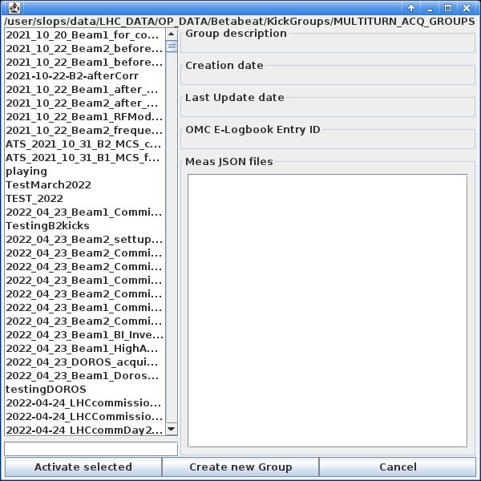
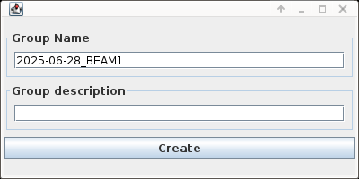

# The Multiturn GUI

The Multiturn GUI provides functionality to perform the basic BPM measurements in the LHC, while kicking the AC-dipole or the ADT. It allows one to measure the turn-by-turn response of the beam, during excitation and save the results for further analysis.

This section will guide you through the GUI's layout and functionality. We also provide a procedure page for [performing Multiturn measurements in the CCC][multiturn_measurements].

The GUI is a Java application and is typically run from the `CCM`:
=== "From the CCM"
    Have a [working `CCM`][gui_basics] running as `lhcop`, then navigate `LHC Control` -> `LHC Beam Measurements` -> `Multiturn`.

After opening, the GUI should look like this:
<figure>
  

  
  <figcaption> Multiturn GUI Landing Page </figcaption>
  

</figure>

## Steps to Setup the GUI
1. On first opening, the first step is to select the beam that you would like to work with. Select the tab at the top of the GUI named `Acquisition BEAM1` or `Acquisition BEAM2`, depending on the beam you are measuring. Do not kick both beams in the same GUI session, as this can lead to crashes and unexpected behavior. Open a separate GUI for each beam.

2. Next, it is necessary to select an active kick group. This is done by clicking the `Select Active group` button in the top left corner of the GUI. This will open the following dialog:
<figure>
    

    
    <figcaption> Select Active Group Dialog </figcaption>
    

</figure>

3. In the dialog, typically you will want to create a new kick group. To do this, click the `Create New Group` button at the bottom in the centre. This will open the following dialog:
<figure>
    

    
    <figcaption> Create New Group Dialog </figcaption>
    

</figure>

4. Change the text under `Group Name`. This name should describe the measurements that you will take in this group, and should always have the data and the beam number to start with, e.g. `YYYY-MM-DD_BEAM1_Measurement_description`. Make sure you press enter after typing the name, and then click the `Create` button. 

5. Once the group is created, it will appear in the list of available groups right at the bottom of the list. Then select the group by clicking on it and then clicking the `Activate Selected`. This should then create a new entry in the `LHC-OMC` logbook. <!-- Add link here? -->

6. Next, it is necessary to set up the tunes. This is possible by clicking the buttons `Acquire QH` and `Acquire QV`. Then, the values can be manually refined if necessary.

7. Finally, before moving to the measurement panels, change the input field turns to the number of turns you want to measure. For AC-dipole measurements, this is typically **6,600 turns**, while for ADT AC-dipole measurements, this is typically **40,000 turns**. Do not set these values higher than these for the respective measurements, as this can lead to the AC-dipole being damaged or the BPM buffers overflowing causing data to be lost/overwritten.

The following pages are available:

- [AC-Dipole Measurements](acdipole.md) for how to excite the beam with the AC-dipole.
- [ADT AC-Dipole Measurements](adt.md) for how to excite the beam with the ADT.
- [AC-Dipole Scheduler](scheduler.md) for how to schedule and run AC-Dipole measurements with a set of predefined kick amplitudes.
