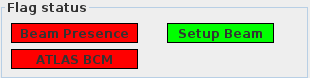
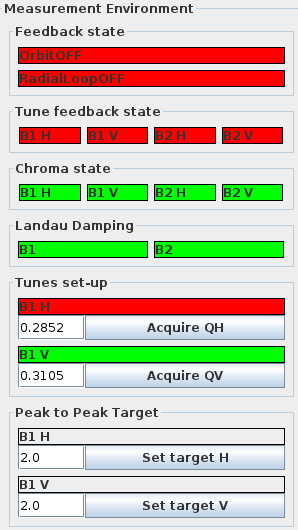
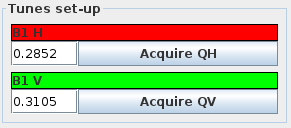
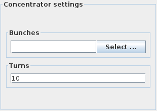

# Measurement Setup

After selecting which beam to excite and acquire data for, the next step is to prepare the correct excitation settings and check for various state flags.
A first check to perform is that specific systems of the machine themselves are in the correct state to allow for beam excitation.

!!! info "Good Red, Bad Red"
    As one will see below, an indicator colored in red is not always a bad thing in the Multiturn GUI, due to conventions.
    Check thoroughly the meaning of each indicator (also called flag) from the instructions below and make sure they are in a correct state.

??? tip "Quick Recap"

    Please read the following sections carefully regarding the meaning of various flags.
    Here is a quick recap of flags to check and the expected state for measurements:

    === "Beam Presence"
        Should be __green__.

    === "Setup Beam"
        Should be __green__.

    === "ATLAS BCM"
        Should be __red__.

    === "Orbit FB"
        Should be __red__.

    === "Radial Loop"
        Should be __red__.

    === "Tune FBs"
        Should all be __red__ during measurements. Is turned off automatically when acquiring, and turned back on afterwards.

    === "Chroma FBs"
        Not so important.

    === "Landau FBs"
        Not so important.

## Flag Status

At the top left of the GUI, a small section titled `Flag Status` displays simple main flags, as show below:

<figure>
    

    
    <figcaption> Flag Status Section </figcaption>
</figure>

Their meanings are as follows:

- `Beam Presence`: indicates whether beam is circulating in the LHC, for the beam corresponding to the selected tab. This will be green if beam is present, red otherwise. __Always make sure it is green__.
- `Setup Beam`: indicates whether the beam status set by the operator is `Setup`. It will be green if the beam is in `Setup` mode, red otherwise. __Always make sure it is green__.
- `ATLAS BCM`: indicates whether the ATLAS BCM has been masked from the interlock. It is green if the ATLAS BCM is active, red otherwise. __Always make sure it is red__, as we measure in special beam conditions and want it to be masked.

!!! info "Masking the BCM"
    The ATLAS BCM can only be masked by ATLAS operators, from their control room.
    Ask the current EIC to call the ATLAS control room and ask to mask their BCM before starting measurements.

## Measurement Environment

The `Measurement Environment` section just below provides a quick overview of the current machine feedback and damping states, as can be seen below:

<figure>
    

    
    <figcaption> Measurement Environment Section </figcaption>
</figure>

### Feedback State

- `OrbitOFF` (red) indicates that the orbit feedback is currently off and will appear green and change to `OrbitON` when it is active.
- `RadialLoopOFF` (red) shows the radial loop feedback is off; when on, it will appear green as `RadialLoopON`.

??? info "What are those?"
    The orbit feedback acts on correctors to keep the measured closed orbit to the reference one.
    The radial loop feedback acts on the RF cavities to keep the beam's bunched in the center of their respective RF buckets.

Both these feedback systems should be off during measurements, but on between kicks.
They will automatically be turned off when you start a measurement, and will be turned back on as soon as the acquisition is complete.

### Tune Feedback State

These buttons represent the state of the tune feedback for each beam and plane:

- `B1 H`: Beam 1, Horizontal
- `B1 V`: Beam 1, Vertical
- `B2 H`: Beam 2, Horizontal
- `B2 V`: Beam 2, Vertical

Red indicates the feedback is off, green indicates it is on.

??? info "What are those?"
    The tune feedback acts on dedicated quadrupole circuits in the arcs to keep the beam's tunes to the desired values.

These feedback should be off during measurements, but on between kicks.
They will automatically be turned off when you start a measurement, and will be turned back on as soon as the acquisition is complete.

### Chroma State & Landau Damping

Similarly to the above, these flags display the state of the chromaticity feedback for each beam and plane (chroma), or simply each beam (landau).
These are less important for the measurement setup and are typically left as is.
Talk to the experts on shift if you are unsure about these settings.

??? info "What are those?"
    The chromaticity feedback acts on dedicated sextupole circuits in the arcs to keep the beam's chromaticities to the desired values.
    The Landau damping flags display the powering state of the octupole circuits in the arcs, which are used to damp the beam's coherent oscillations.

## Kick Groups

Now is the time for active settings!
Before exciting the beam, one should select or create a kick group.
This is done by clicking the ++"Select Active group"++ button in the top left corner of the GUI, which will open the following dialog:

<figure>
    

    
    <figcaption> Select Active Group Dialog </figcaption>
    

</figure>

Typically one wants to create a new kick group.
To do so:

- Click the ++"Create new Group"++ button at the bottom in the centre, which will open the following dialog, with a default naming scheme:

<figure>
    

    
    <figcaption> Create New Group Dialog </figcaption>
    

</figure>

- Adapt the text entry under `Group Name` to reflect the measurements to be done in this group.
A good naming practice is to lead with the date and beam number as suggested, e.g. `YYYY-MM-DD_BEAM1_Measurement_description`.
Make sure to press ++"Enter"++ after typing the name.
Optionally add a description in the field below, and click the ++"Create"++ button.
Once created the new group will appear at the bottom of the list of available groups.

- Select the new group and click the ++"Activate selected"++.
This should then create a new entry in the `LHC-OMC` logbook with information about the group, and all acquisitions done in this group will be logged to that entry automatically.

## Tunes Setup

The fields in this section expect the values of the horizontal and vertical tunes for the selected beam:

<figure>
    

    
    <figcaption> Tunes Setup Section </figcaption>
    

</figure>

They should be the natural tunes used in the machine during measurements.
Either enter the values manually or, to enter the current tunes click the ++"Acquire QH"++ and ++"Acquire QV"++ buttons which will update the value to the current one measured with the BBQ.
These values can be manually refined if necessary.

## Concentrator Settings

These settings refer to the excitation to be performed.
The excitation device needs to know which bunches to excite and how long the excitation should last (in terms of turns).

<figure>
    

    
    <figcaption> Concentrator Settings Section </figcaption>
    

</figure>

- To select the bunches, click the ++"Select ..."++ button under the `Bunches` section, which opens the following dialog:
<!-- TODO: Need to add a screenshot of the multiturn -->
Choose ++"Select Bunches with Beam"++ to select all bunches present in the machine.
We typically do not inject bunches that won't be excited for optics measurements.
It is also possible to manually enter the bunches, each number separated by a space.

- Set the number of turns to maintain the excitation for in the `Turns` field below.
These correspond to the excitation plateau length, and does not include ramp-up and ramp-down times.

!!! info "Excitation Duration"
    For AC-Dipole measurements, this setting is typically __6600 turns__, while for ADT measurements it is typically __40,000 turns__.
    Do not set these values higher than these for the respective measurements, as this can lead to the AC Dipole being damaged or the BPM buffers overflowing causing data to be lost or overwritten.

*[ATLAS BCM]: ATLAS Beam Condition Monitor
*[EIC]: Engineer in Charge, operators of the LHC
*[BBQ]: Base Band Q, a system used to continuously measure the beam's tunes.
*[AC Dipole]: Alternating Current Dipole
*[ADT]: LHC Transverse Damper
*[BPM]: Beam Position Monitor
