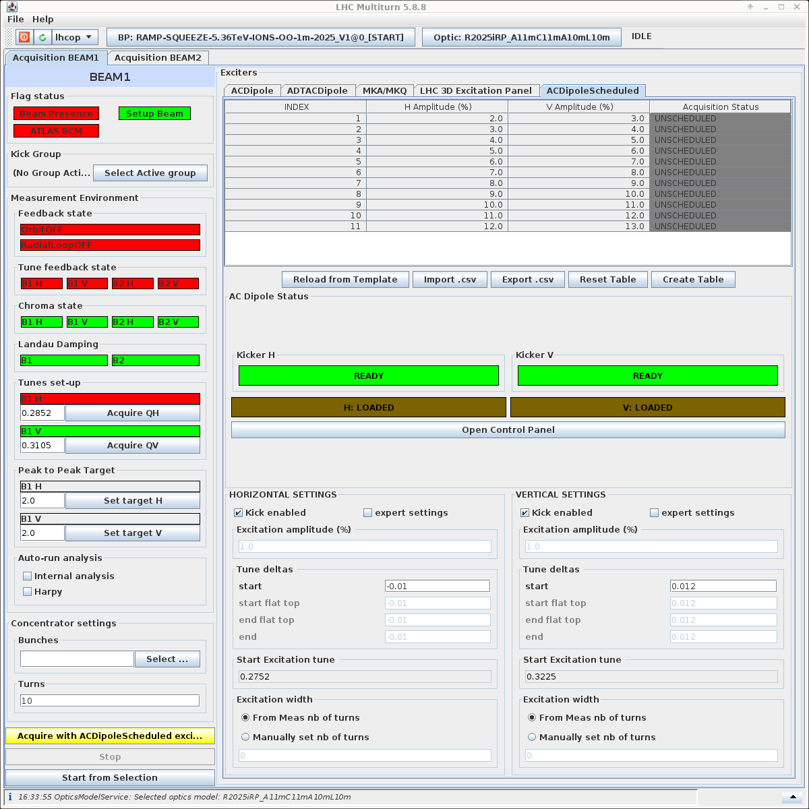
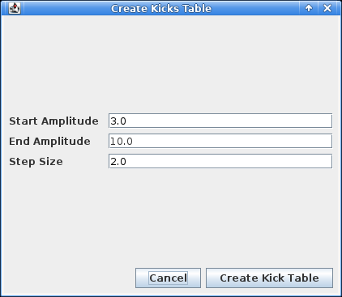
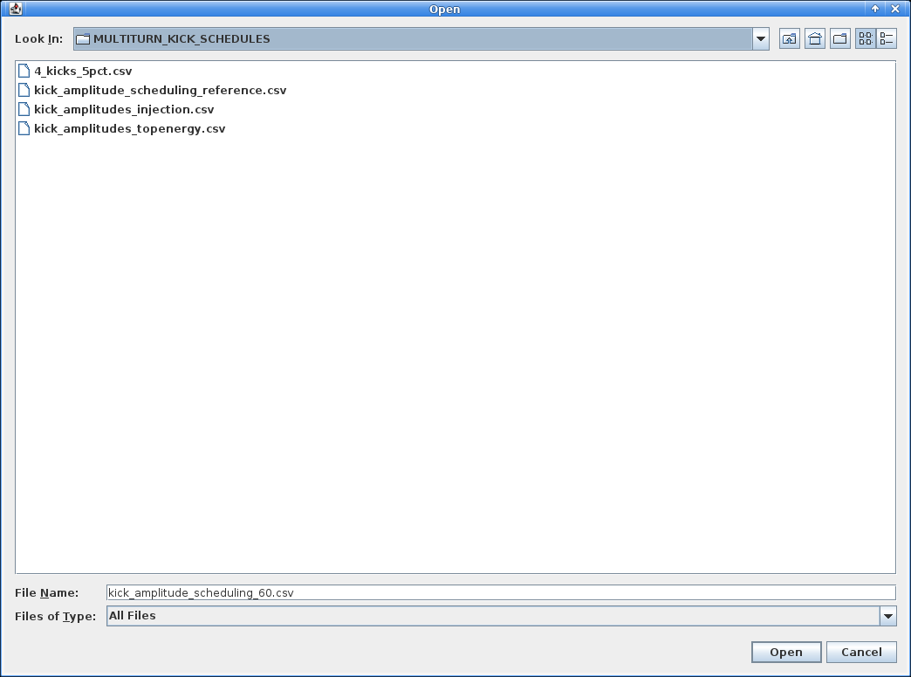

# AC Dipole Scheduler

It is possible to automate the process of running measurements with different kick amplitudes using the AC Dipole Scheduler.

The multiturn application provides a scheduler to run predefined kick amplitudes one after another.
This is useful to automate the process of running measurements with different kick amplitudes, which can speed up the process of collecting data for analysis, and potentially reduces the number of people required on shift.
The scheduler can be found in the `ACDipoleScheduled` tab of the Multiturn GUI, as illustrated below:

<figure>
    

    
    <figcaption>AC-Dipole Scheduler Tab</figcaption>
    

</figure>

## Creating a Kick Schedule

There are two main ways to create a kick schedule:

- **Manual Creation**: You can manually create a kick schedule by selecting the button `Create Table` below the table.
- **Prewritten Schedules**: You can load a prewritten kick schedule from a file by selecting the button `Import .csv` below the table.

You can also just edit the template table that is already present in the GUI by changing the `H Amplitude (%)` and `V Amplitude (%)` values in the table. It is not possible to edit the `Index` column. To reset this template table, select the button `Reload from Template` below the table.

### Manual Creation

To manually create a kick schedule, select the button `Create Table` below the table. This will create the following dialog:
<figure>
    

    
    <figcaption>Create Kick Schedule Dialog</figcaption>
    

</figure>

The start and end amplitudes are inclusive. The step size tells you how many rows of the table will be created, and will only create rows below or equal to the end amplitude. The `H Amplitude (%)` and `V Amplitude (%)` columns will be filled with the values from the start to the end amplitude, with the step size as the increment. The `Index` column will be automatically filled with the row number.

The example above will create a table with 4 rows - 3%, 5%, 7%, and 9% for both the horizontal and vertical kick amplitudes. The `Index` column will be filled with the values 1, 2, 3, and 4 respectively.

### Prewritten Schedules

To load a prewritten kick schedule, select the button `Import .csv` below the table. This will open a file dialog where you can select the `.csv` file containing the kick schedule. There exists a small repository of prewritten kick schedules that can be used as a starting point for your measurements, which can be found in the `/user/slops/data/LHC_DATA/OP_DATA/Betabeat/MULTITURN_KICK_SCHEDULES/` directory:

<figure>
    

    
    <figcaption>Prewritten Kick Schedules</figcaption>
    

</figure>

## Running a Kick Schedule

Once you have created or loaded a kick schedule, it is necessary to setup the horizontal and vertical kick tune deltas. Refer to the [AC-Dipole Measurements](acdipole.md) page for context on what to set these to.

Now all the settings are ready, it is possible to run the kick schedule from the very beginning of the table by selecting the button `Acquire with ACDipoleScheduled excitation` at the bottom left of the GUI (highlighted in yellow). This will start the measurement with the first row of the table, and will automatically move to the next row once the measurement is complete.

!!! info
    To cancel the acquisition while running a kick schedule, press the `Stop` button. Note that if a kick was just done when pressing `Stop`, the schedule will stop after the next kick is complete. There is no way to cancel the next kick once it is waiting for the AC-Dipole to be ready.

It is also possible to run the kick schedule from a specific row. This is done by selecting the row in the table and then selecting the button `Start from Selection`. This will start the measurement from the selected row and will automatically move to the next row once the measurement is complete.

*[AC Dipole]: Alternating Current Dipole
