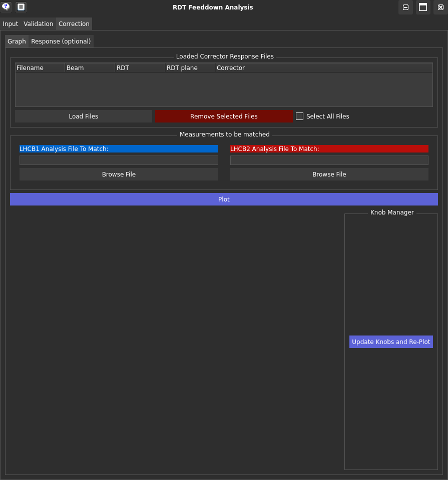
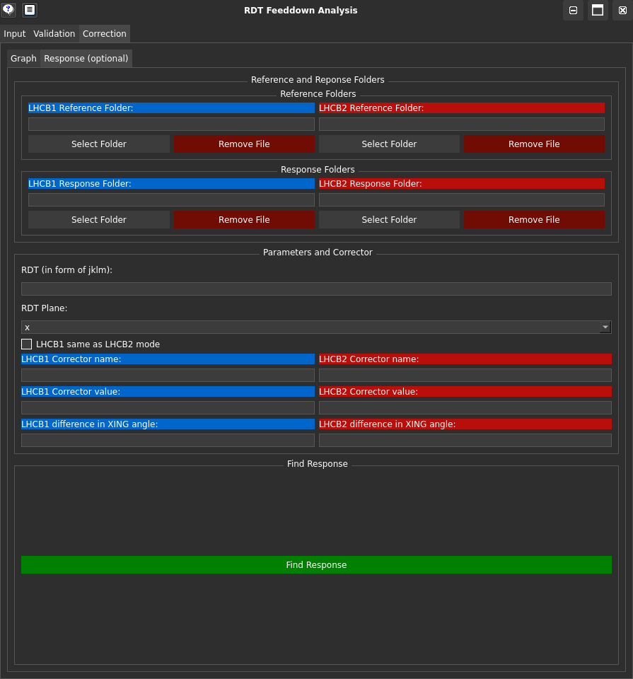

# The Correction Tab of the RDTfeeddown GUI

This part of the GUI allows you to quantify the RDT correction predicted from a specific corrector and can then interactively correct the RDT feeddown using this prediction.

## The Tabs Explained

- [Graph](#__tabbed_1_1){.rdtfeeddown_tab-link} tab: Displays the RDT feeddown data and the correction prediction graphically.

- [Response](#__tabbed_1_2){.rdtfeeddown_tab-link} tab (_optional_): Allows you to quantify the RDT shift predicted from a specific corrector.

=== "Graph Tab"

    <figure>
    

    
    <figcaption> RDTfeeddown Correction Graph Tab </figcaption>
    

    </figure>

    **Main Features:**

    - Load Files: Load the corrector response files generated by the [Response](#__tabbed_1_2){.rdtfeeddown_tab-link} tab.

    - ``Analysis File to Match``: Select the output file from the [Input](input.md){.rdtfeeddown_tab-link} tab that you want to match with the corrector response.

    - Plot: Plot the RDT data and the correction prediction. This will trigger a list of corrector knob names to be shown beneath the **Knob Manager** section. These will default to a value of 0. Values can be changed by entering a number and pressing <kbd>Enter</kbd> or clicking Update Knobs and Re-Plot.

=== "Response Tab"

    <figure>
    

    
    <figcaption> RDTfeeddown Correction Response Tab </figcaption>
    

    </figure>

    Similar to the [Input](input.md){.rdtfeeddown_tab-link} tab, this tab allows you to load measurement folders and reference data in the format outputted by the [OMC analysis tools](omc_homepage) to quantify the RDT response for a constant corrector strength between 2 different crossing angles.

    !!! warning "Response Behaviour Assumption Warning"
        This assumes a linear response!

    **Main Features:**

    - ``Reference Folder``: Select the reference measurement folder containing the measurement data with the corrector strength applied and the reference crossing angle.

    - ``Response Folder``: Select the measurement folder containing the data with the same corrector strength as the reference measurement applied, and a different crossing angle to the reference measurement 

    - ``LHCB1 same as LHCB2 mode``: If this option is selected, the response will be calculated assuming that the corrector name is the same for both LHC beams. This is useful when the corrector name is not beam-specific.

    - Find Response: This button will calculate the response of the RDT to the crossing angle with the specified corrector strength applied. The output will be in the format that can be used in the [Graph](#__tabbed_1_1){.rdtfeeddown_tab-link} tab.

        [omc_homepage]: https://pylhc.github.io/packages/omc3/about.html