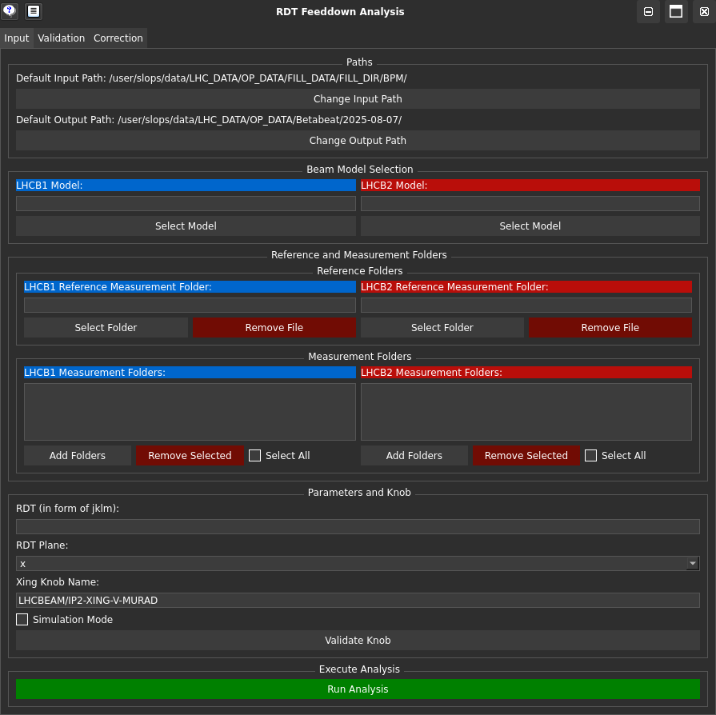

# The RDTfeeddown GUI

<figure>
  <center>
  
  <figcaption> RDTfeeddown Gui Landing Page </figcaption>
  </center>
</figure>

To launch and use the RDTfeeddown GUI, use the following command:

```bash
python -m pip install omc3
```

 : shows the error log for debugging.

!!! tip
    To pan in any of the plots, use <kbd>Ctrl</kbd>+<kbd>LeftClick</kbd> and drag the mouse.

The following pages are available detailing the tabs and how to use them:

- [Input](input.md){.tab-link} tab: for how to input files to produce an analysable format.
- [Validation](validation.md){.tab-link} tab: for how to use that analysable format to plot the RDT response as a function of crossing angle amongst another analyses.
- [Correction](correction.md){.tab-link} tab: for how to quantify the response of RDT with a corrector across crossing angles and use that to match to the analysable format measurement.
