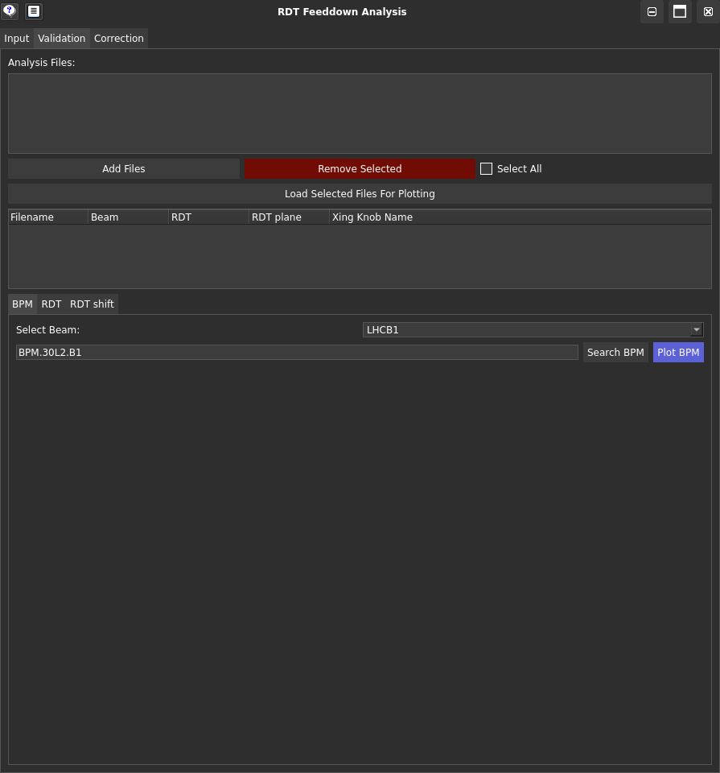
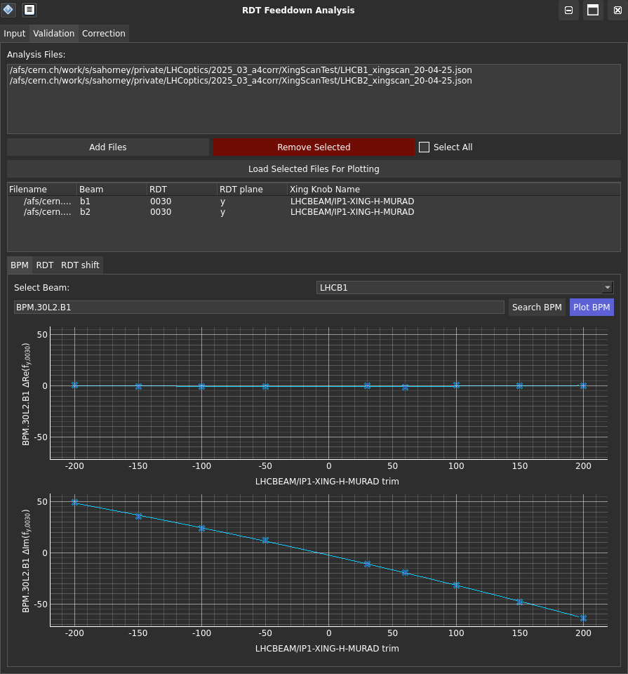
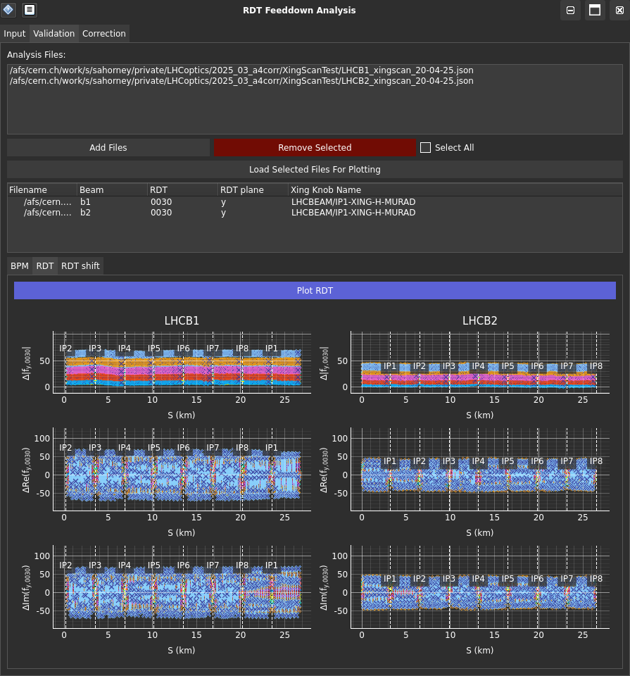
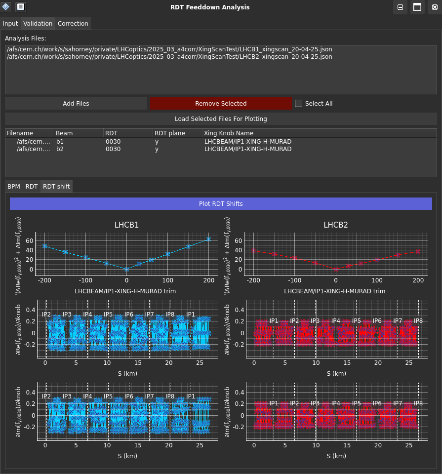

# Validation Tab of the RDTfeeddown GUI

<figure>
  <center>
  
  <figcaption> RDTfeeddown Validation Tab </figcaption>
  </center>
</figure>

The [Validation](validation.md){.tab-link} tab of the GUI provides a way to load data in the format created by the [Input](input.md){.tab-link} tab, and display it to validate it.

## Input Fields Explained

- <span class="guilabel">Add Files</span>: Add the generated files from the [Input](input.md){.tab-link} tab of the GUI containing the RDT data you want to plot (this simply adds the filenames to a list).
- <span class="guilabel">Load Selected Files for Plotting</span>: Load the selected files to display their data in the plotting tabs (this then checks that the files are compatible to be plotted together). The loaded files will be displayed in the box below the button.

## Plotting Tabs Explained

!!! warning
    Ignore the error message below for both the [RDT](#__tabbed_1_2){.tab-link} and [RDT shift](#__tabbed_1_3){.tab-link} tab, if you only have RDT data from one beam loaded (in this example it would only be LHCB1 data) - this should not affect the plotting.

    ```text
    Error accessing LHCB2 RDT data: 'NoneType' object is not subscriptable
    ```


=== "BPM"

    <figure>
    <center>
    
    <figcaption> RDTfeeddown Validation BPM Tab </figcaption>
    </center>
    </figure>

    This tab displays the RDT as a function of crossing angle for a BPM of your choice.

    !!! tip
        You can search for a BPM by typing its name in the search box and pressing the <span class="guilabel">Search BPM</span> button. This just checks if the BPM exists in the list of BPMs. 
        
    Either pressing <kbd>Enter</kbd> or <span class="guilabel" style="--guilabel-bg: #5C62D6;">Plot BPM</span> will plot the RDT at that BPM as a function of crossing angle.

=== "RDT"

    <figure>
    <center>
    
    <figcaption> RDTfeeddown Validation RDT Tab </figcaption>
    </center>
    </figure>

    This tab displays the RDT as a function of position *s* for all crossing angles when <span class="guilabel" style="--guilabel-bg: #5C62D6;">Plot RDT</span> is pressed.

=== "RDT shift"

    <figure>
    <center>
    
    <figcaption> RDTfeeddown Validation RDT Shift Tab </figcaption>
    </center>
    </figure>

    This tab displays the average RDT shift as a function of crossing angle when <span class="guilabel" style="--guilabel-bg: #5C62D6;">Plot RDT shifts</span> is pressed.


