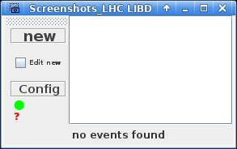
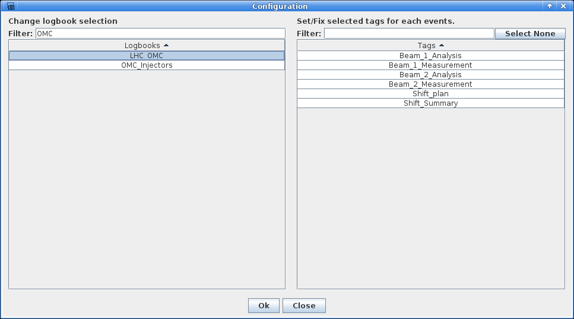

# The Screenshot GUI

The Screenshot GUI is a small utility to capture a screenshot and upload it straight to the logbook.
It is handy during operations, when one constantly wants to log settings, quick plots or the state of another GUI.

!!! info "Requirements"
    The tool needs to run inside the GPN and be logged in to write to the logbook.
    When started from the CCM under an operational account (e.g. `LHCOP` during LHC shifts), this is already taken care of.

This page provides a quick walkthrough of how to set it up to send screenshots directly to the OMC logbook.

## Opening the Client

The GUI is started from the CCM.
In the search bar, type `screenshot` and launch the `Screenshot LIBD logbook`.

<figure>
  

  
  <figcaption>The Screenshot Client on launch.</figcaption>
  

</figure>

## Selecting the Logbook

Before capturing anything, the target logbook has to be set.

- Click the `Config` button to open the configuration popup.
- Select the specific logbook to send the screenshots to.

!!! tip "OMC Logbooks"
    Searching for `OMC` will bring up the only two OMC logbooks, `LHC_OMC` and `OMC_Injectors`.

It is possible at that time, in the right part of the popup window, to select a tag that will be assigned to entries made via the screenshot tool.

<figure>
  

  
  <figcaption>Selecting the target logbook in the configuration popup, and potentially a tag.</figcaption>
  

</figure>

## Taking a Screenshot

There are two ways to capture a screenshot, depending on where it should go:

- To create a **new** logbook entry along with the screenshot, click the `New` button in the top left.
- To add the screenshot to an **existing entry**, click the corresponding entry in the list on the right.

!!! tip "Clarifying the Entry"
    Hovering the mouse over a list item shows a preview of the corresponding logbook entry.

<!-- TODO (screenshots Monday): main view with the numbered entry list on the right (ideally a hover preview visible).
<figure>
  

  
  <figcaption>The list of logbook entries, with the hover preview.</figcaption>
  

</figure>
-->

After choosing either option, the client window hides itself to stay out of the capture.
From there, one can:

- Drag-select a region of the screen to capture it.
- Right-click a window to capture that entire window.

At any moment in this capture mode, pressing ++esc++ exits it and brings the client window back.
What happens next depends on whether the logbook is currently open in a browser:

- If it is not open, the screenshot is simply uploaded in the background.
- If the logbook is open somewhere, a popup appears in it to attach the file to the entry, exactly as when adding an attachment manually. Confirm it and the upload is done.

*[GPN]: General Purpose Network
*[OMC]: Optics Measurements and Corrections
