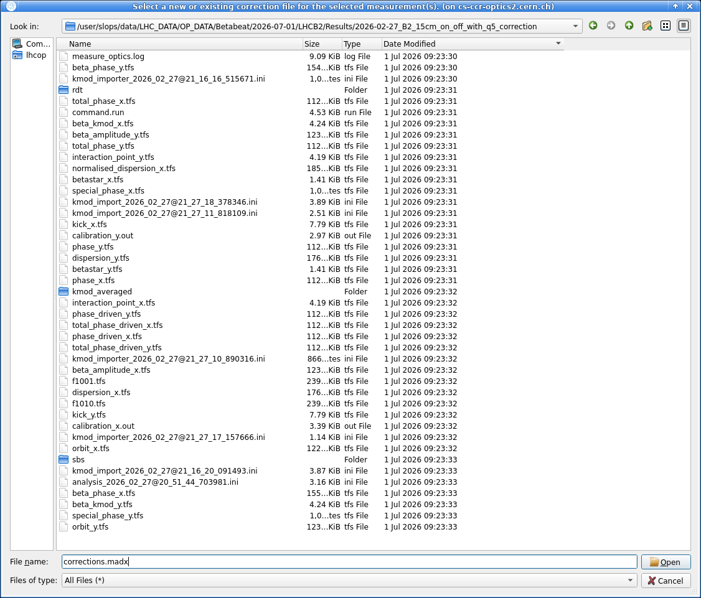
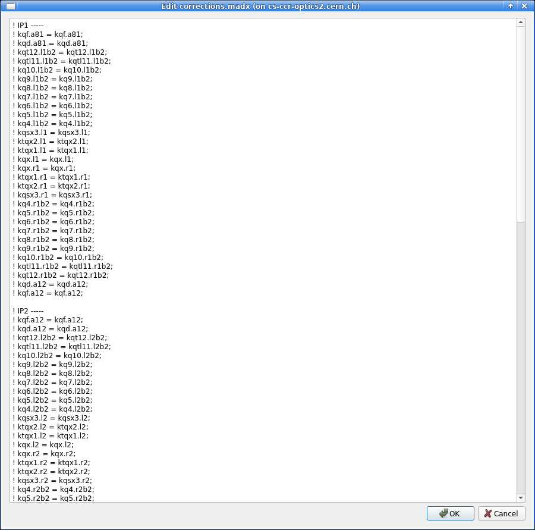
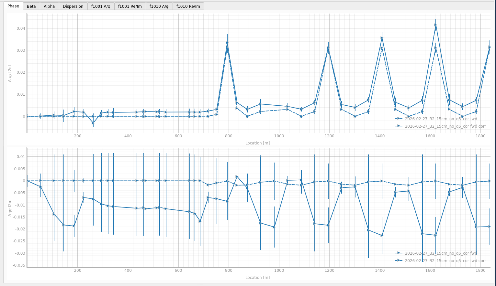
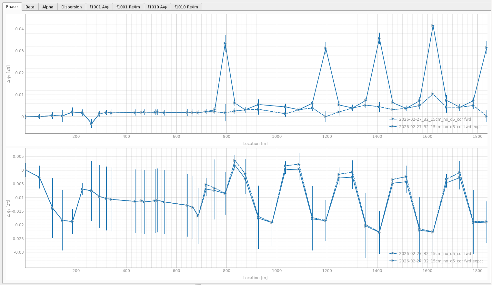
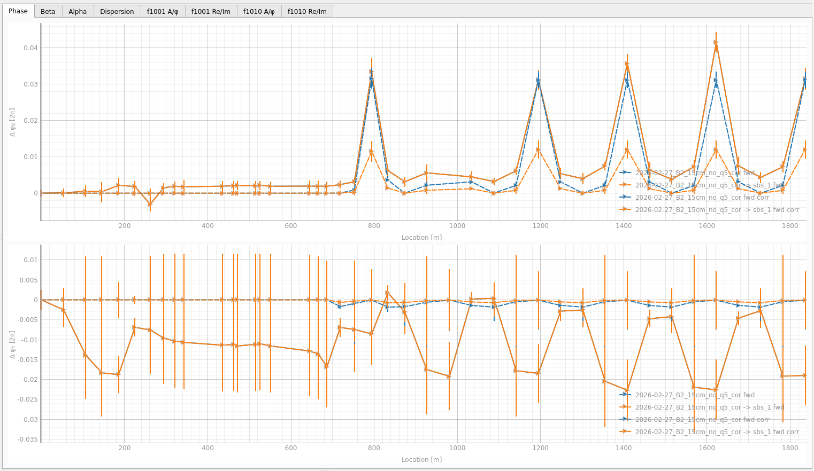

# Determining Corrections

After having identified potential sources of errors through the forward and backward [propagation][sbs_inspect_results], the next step is to determine and test corrections.
This page covers how to apply corrections in the GUI, test different correction schemes and interpret the resulting plots.

!!! warning "++"Run Matcher"++ — Not Implemented"
    In the future, the ++"Run Matcher"++ button is intended to launch an automated matching routine for the currently selected optics and segment.
    This would calculate corrections and produce a correction file that can then be loaded in the corrections dialogue and further modified.

## Applying Corrections

Clicking the ++"Corrections"++ button in the side panel opens the corrections dialogue, where you can load or create a correction file to apply to the model.
To create a file, simply type a name (e.g. `corrections.madx`) in the `File name` field and press the ++"Open"++ button to the right.
See the screenshot below.

<figure>
  

  
  <figcaption>The correction file dialogue, prompting to load or create a correction file. Creating a new file works by entering a name.</figcaption>
  

</figure>

After creating or selecting a correction file, a new window displays its contents directly and allows you to edit it.
If a correction file has already been associated, clicking the ++"Corrections"++ button will open the editor directly.

???+ tip "Corrector Suggestions"
    When a default correction file is created and [default segments][sbs_default_segments] have been added, correctors may be suggested provided this feature is activated in the [settings][sbs_main_settings].
    The screenshot below shows the correction file editor with suggested correctors for the LHC's default segments.

    <figure>
      

      
      <figcaption>The correction file editor, here showing suggested correctors for LHC default segments.</figcaption>
      

    </figure>

Note that the correction file path is applied to all currently selected optics.

If some of the selected measurements already have the same correction file loaded while others do not, a dialogue will ask whether to apply the same correction file to all of them.
If there is a conflict between different correction files across the selected optics, an error message will show.

After editing the correction file, click ++"OK"++ then [run the propagation][sbs_run_segments] again (with ++"Run Segment(s)"++) to compute the effect of the attempted correction.
After running the segment, the plots update to show the corrected results as dashed lines, in addition to the solid propagated measurement line.
What these dashed lines represent depends on the [plot settings][sbs_plot_settings], as detailed in [Corrected and Expected Plots](#corrected-and-expected-plots) below.

!!! info "Sign Conventions"
    The corrections applied in the GUI should modify the model to match the propagated measurement.
    In order to *actually correct* the machine, these corrections generally need to be inverted: they represent what error in the model would reproduce the observed measurement deviation, and the opposite of that error is what should be applied operationally.
    Be aware, however, that sign conventions may differ between `MAD-X` and `LSA` and care must be taken when translating correction values from the GUI to the control system.

    In practice for the LHC IRs, using `MQX?->K1` element strengths to reproduce errors requires a sign change when converting to `LSA`, for all triplets.
    However, the `ktqx2` knob (used in `MAD-X`) already carries a sign opposite to `LSA` Q2 (unlike `ktqx1` or `kqx`), so its `LSA` conversion cancels out: no sign change (or rather a double sign change) is needed.

### Corrected and Expected Plots

The [plot settings][sbs_plot_settings] let you choose what the dashed line represents:

- **Matched value (corr)**: the difference between the propagated corrected model and the nominal propagated model.
  If the correction successfully reproduces the measured errors, this dashed line should lie close to the solid propagated measurement line.
- **Expected value (expct)**: the difference between the measured values and the propagated corrected model.
  This represents the expected outcome after the correction has been applied to the machine, and should therefore be close to zero for the correction to be effective.

The tabs below illustrate each setting for the same correction:

=== "Matched (**corr** setting)"

    <figure>
      

      
      <figcaption>A good correction reproduces the effect observed in the machine, so the dashed line lies close to the solid propagated measurement.</figcaption>
      

    </figure>

=== "Expected (**expct** setting)"

    <figure>
      

      
      <figcaption>A good correction compensates the observed deviation, so the dashed residual line lies close to zero.</figcaption>
      

    </figure>

## Testing Multiple Correction Schemes

A practical approach to testing different correction strategies is to create virtual copies of the same measurement.
To do so, click the ++"Copy"++ button in the loaded optics section to create a virtual copy.

This copy references the same input measurement data but writes its output to a separate directory, making it possible to try multiple correction schemes side by side without duplicating files on disk.
In the side panel, virtual copies are displayed as `NAME -> OUTPUT_DIR_NAME` to distinguish them from the original optics entry.

<figure>
  

  
  <figcaption>Comparing two correction schemes on the phase, using virtual copies of the same measurement — the dashed blue correction outperforms the dashed orange one.</figcaption>
  

</figure>

Similarly, creating multiple segments with different start BPMs for the same region lets you evaluate sensitivity to the starting point.
This helps confirm whether the correction holds regardless of which BPM anchors the propagation.

*[SbS]: Segment-by-Segment

[sbs_inspect_results]: segments.md#inspecting-results
[sbs_default_segments]: segments.md#default-segments
[sbs_main_settings]: settings.md#main-settings
[sbs_run_segments]: segments.md#running-segments
[sbs_plot_settings]: settings.md#plot-settings
