# The Segment-by-Segment GUI

- provides a graphical user interface for the segment-by-segment method
- allows users to easily input data, configure settings, and visualize results

## General Workflow

<figure>
  

  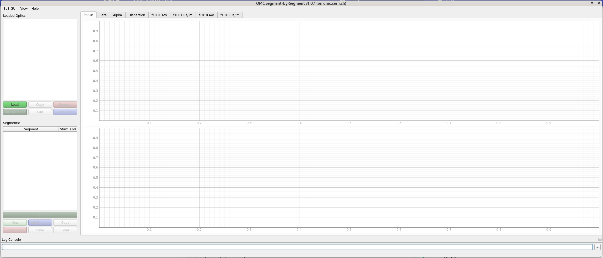
  <figcaption>Blank window of SbS-GUI as seen when starting the GUI.</figcaption>
  

</figure>

- Load optics
- Define segments
- Define corrections (optional)
    - Corrections applied to the model
- Run segment-by-segment analysis:
    - Optics parameters are propagated from the start and end through the segment
    - Differences to the measurements are computed
    - Errors from the original BPM are also propagated and added to the measurement error
- Visualize results:
    - Difference between propagated model and measurement (solid line), i.e. how the measurement compares to the model, assuming they start with the same value at the start BPM (or end BPM for backward propagation).
    - Tells you where there are differences between model and actual machine, i.e. where errors are located.
    - Check forward (arrows to the right) and backward propagation (arrows to the left), whether the deviations start to occur after same location.

### Correction Idea

- Corrections are applied to match the model to the measuremnt, i.e. to actually correct the machine, you generally need to invert them (beware of some sign conventions between MAD-X and LSA).
- Create multiple "virtual" copies of the measurement (same input data, different output folder) to
test multiple correction schemes without having to make actual copies of the data.
- Create multiple segments with different start BPMs to test the effect of the starting point on the results.
- Choose in the settings between plotting the matched value or the expected value of the corrected data (dashed line):
    - Matched value (corr): the difference between the propagated model after applying the correction to the nominal propagated model. This should ideally be close to the measurement.
    - Expected value (expct): the difference of the measured values to the corrected propagated model.
      This is the expected result of the SbS analysis (i.e. difference between propagated model and measurement) after applying the correction to the machine, and thus should be close to zero.

### Grouping of Segments

- Selecting multiple optics:
  - Identically defined segments (name, start/end bpm) are grouped together and will be plotted in the same plot.
  - Hovering over a segment in the table shows the optics it belongs to and if it has been run or not for that measuremnt (i.e. if the file exists).
  - If the segment has been run for multiple optics, the plot will show the results for all those optics, allowing for easy comparison between different measurements or corrections for the same segment.
  - Segments with different start/end BPMs are not grouped together, even if they have the same name, as they represent different segments in the accelerator and thus different analyses.

- Selecting multiple segments:
    - By default, only segments with the same start BPMs are plotted together,
    as the position is relative to the start BPM. This can be changed in the settings (`Same segment start`), but it is not recommended to plot segments with different start BPMs together, as it can lead to confusion and misinterpretation of the results.
    - If `Model Location` is activated also segments with different start BPMs are plotted together,
    as they are now plotted relative to the model location, i.e. their position in the accelerator, which allows for easy comparison of segments with different start BPMs.

## Plotting

- Solid line: difference between propagated model and measurement, i.e. how the measurement compares to the model, assuming they start with the same value at the start BPM (or end BPM for backward propagation).

- Dashed line (if corrections are applied): Either corrected model diff (corr) or expected measurement diff (expct) depending on the settings. See above for details.

- Arrow Markers: direction of propagation (right for forward, left for backward).

- Multiple plots possible, see grouping of segments above.

- Same color per segment and optics, different markers/line style for forward/backward/corrected/expected.
  Better not to activate everything when plotting multiple segments, as it can get very crowded.

- Tabs: Different optics parameters that are propagaret through the segments.

### Shortcuts

In the plot, you can use the following shortcuts:

- **Hover**: Show Optics name, BPM name and the value of the point in the plot.
- **Double Click** / **Right Click**: Zoom history back one step (only works for rectangle zoom).
- **Shift + Right Click**: Reset zoom to the original view.
- **Alt + Right Click**: Open the pyqtgraph context menu.
- **Click and Drag**: Draw a rectangle to zoom into a specific area of the plot.
- **Scroll in Graph**: Zoom in and out of the plot, both axis.
- **Scroll over one axis**: Zoom in and out of the plot, only the axis you are scrolling over.

## Menu

### SbS-Gui

<figure>
  

  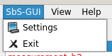
  <figcaption>The SbS-Gui menu.</figcaption>
  

</figure>

- **Settings**: Open the [settings dialog](#settings).
- **Exit**: Close the GUI.

### View

<figure>
  

  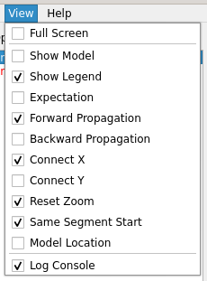
  <figcaption>The View menu.</figcaption>
  

</figure>

- **Full Screen**: Toggle full-screen mode.
- **Plotting Settings**: Quick access to the checkboxes of the [plotting settings dialog](#plot-settings). For details, see the [plotting settings section](#plot-settings).
- **Log Console**: Show or hide the [log console](#log-console) at the bottom of the GUI.

### Help

<figure>
  

  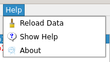
  <figcaption>The Help menu.</figcaption>
  

</figure>

- **Reload Data**: Reload the data from the input files. This is useful if you have made changes to the input files and want to see the updated results without restarting the GUI.
- **Show Help**: Open the help dialog with some main instructions on how to use the GUI.
- **About**: Opens the about dialog, which displays some information about the GUI, e.g. the version.

## Settings

### Main Settings

<figure>
  

  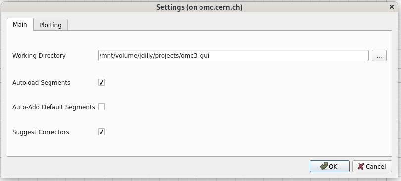
  <figcaption>The main settings.</figcaption>
  

</figure>

Note: Hints available on hovering over the settings text.

- **Working Directory**:
The directory where the input files are located.
The GUI will use this directory as the default directory when opening file dialogs for loading optics and measurement data.

- **Autoload Segments**:
Automatically load existing segements when loading a new measurement optics directory.
This looks for files created by the GUI in earlier runs and for now only works if the segment has actually been run.
(Future implementation: also check for json files - see `Save` and `Load` buttons.)

- **Auto-Add Default Segments**:
Automatically add default segments when loading a new measurement optics directory.

- **Suggest Correctors**:
When opening the [corrections dialog](#corrections) for a new/not yet existing correction file, suggest correctors based on the optics and measurement data.

### Plot Settings

<figure>
  

  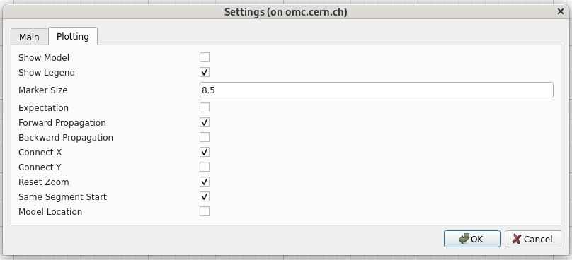
  <figcaption>The plotting settings.</figcaption>
  

</figure>

Note: Hints available on hovering over the settings text.

- **Show Model**: Adds markers for the location of elements in the model to the plots.
- **Show Legend**: Show legends in the plots.
- **Marker Size**: Size of the markers in the plots.
- **Expectation**: If run with corrections, show the expected measurement difference instead of the corrected model difference (details above).
- **Forward Propagation**: Show forward propagation results (arrows to the right).
- **Backward Propagation**: Show backward propagation results (arrows to the left).
- **Connect X**: Keep the same X-Axis limits for both charts when zooming.
- **Connect Y**: Keep the same Y-Axis limits for both charts when zooming.
- **Reset Zoom**: When chaning segments, reset the zoom to the original view.
                  When deactivated, the current limits will be kept when changing segments, which can be useful for comparing different segments or optics with the same zoom level.
- **Same Segment Start**: Plot segments together, even if they have different start BPMs. Not recommended, as it can lead to confusion and misinterpretation of the results, as they will both start at the same point in the plot, even though they represent different locations in the accelerator.
- **Model Location**: Plot segments relative to the model location, i.e. their position in the accelerator, which allows for easy comparison of segments with different start BPMs. If deactivated, segments will start at a location of zero at their start BPM.

<figure>
  

  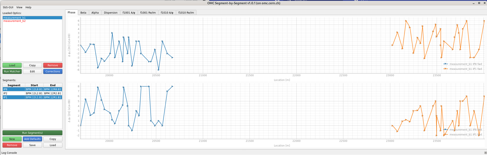
  <figcaption>Example of two segements with different start BPMs when plotted with `Model Location` activated.</figcaption>
  

</figure>

## Side Panel

### Loaded Optics

<figure>
  

  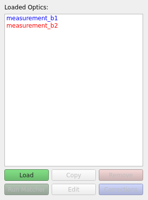
  <figcaption>The loaded optics section in the side panel.</figcaption>
  

</figure>

- Shows the currently loaded optics.
- Different colors for different beams.
- Hovering over the optics name gives short summary of paths and accelerator parameters.

#### Load Optics

- Click `Load` button to load new optics.
- Opens file dialog to select the measuremnt folder to load.
- Alternatively, you can also select a previous SbS output folder directly,
useful for [virtual copies](#virtual-copies) or if you had used a different output directory name, than the default `sbs`.

- Tries to automatically asses which accelerator and beam. Tries to find correct model folder. If not successful needs to be [set manually](#edit-optics).
- SbS analysis output is stored in sub-directories of the optics folder, by default in the `sbs` folder.
- If activated in the settings, the GUI will automatically look for existing segments in the `sbs` folder and load them into the segments table.

#### Virtual Copies

- Click `Copy` button to create a virtual copy of the optics.
- Uses the same input data, but different output folder, which allows to test multiple correction schemes without having to make actual copies of the data.
- Shown in the side panel as `NAME -> OUTPUT_DIR_NAME` to distinguish them from the original optics.

#### Remove Optics

- Click `Remove` button to remove the currently selected optics. Only removes it from the GUI, but does not delete any files.

#### Run Matcher

NOT IMPLEMENTED.

FUTURE: should run the automated matcher for the currently selected optics which will calculate the correction and create the correction file, which can then be loaded in the corrections dialog and applied to the model.
NOTE: Button maybe better in placed in the segments? As it needs to know which segments to run.

#### Edit Optics

<figure>
  

  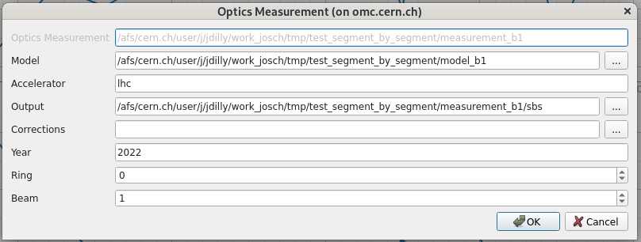
  <figcaption>The edit optics measurement dialog.</figcaption>
  

</figure>

- Click `Edit` button or double click the optics name in the side panel to edit the optics paths and parameters.
- Does not allow to change the measurement path (you need to load a new measurement folder for that).

- **Model**: Path to the model folder, which should contain the optics files for the model.
- **Accelerator**: Accelerator name, e.g. `lhc`, `sps`, `ps`, `psbooster`.
- **Output**: Path to the output folder, where the SbS analysis output is stored.
- **Corrections**:
Path to the corrections file, which needs to contain all corrections to be applied to the model.
The corrections are exectuted by MAD-X as is, to correct the model, so they need to be written in the MAD-X syntax and be the "inverse" of the corrections applied in the machine (MAD-X/LSA sign conventions apply).
- **Year**: Year of the accelerator optics to use (i.e. the acc-models branch to use to create the appropriate model. See `omc3` model creators).
- **Ring**: Ring to use if applicable (for PSB)
- **Beam**: LHC beam to use if applicable, e.g. `1` or `2`.

Note: The parameters will be checked for validity when clicking `OK`. Which parameters are required depends on the accelerator.

#### Corrections

- Click `Corrections` button to open the corrections dialog, where you can load or create a correction file to apply to the model.
- If a correction file is already loaded, the dialog will show the content of the file and allow you to edit it.
- If no correction file is loaded, the dialog may suggest correctors based on the optics and measurement data, if so activated in the settings.
- The path to the corrections file is applied to all currently selected optics and can also be edited in the [edit optics dialog](#edit-optics).
- If some of the selected measurements already have the same correction file loaded, but some have none, a dialog will ask you whether you want to use the same correction file for all selected optics.
- If there is a conflict between multiple correction files in the selected optics measurements, an error message will be shown.

### Segments

<figure>
  

  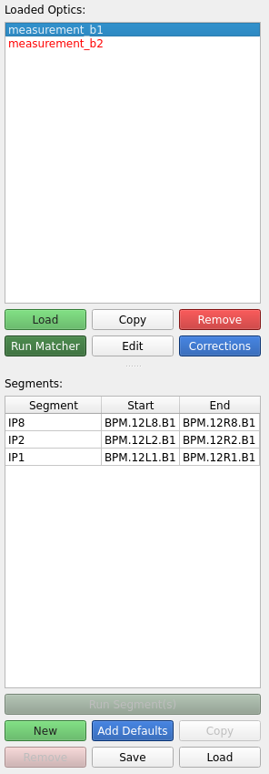
  <figcaption>The side panel.</figcaption>
  

</figure>

- Shows the defined segments for the currently selected optics.
- Segment name, start, end.
- `start` and `end` are optional. If either one is not given, BOTH are ignored and only the name is used to define the segment.
  The SbS analysis will then find the closest BPMs before and after the given element to perform the propagation.
- Hovering over the segment name shows the optics it belongs to and if it has been run or not for that measuremnt (i.e. if the file exists).
- Click on the segment name to select it and show the results in the plot, if it has been run already (i.e. if the output file exists).
- Check ["Grouping of Segments"](#grouping-of-segments) for details on how segments are plotted together.

Warning:

- Start and End of a Segment as given here do not need to be BPMs but could be any element of the model.
  The SbS analysis will find then the next BPM in the measurement data and use that as the start and end of the segment.
  WARNING: This can lead to different start BPMs for different measuremens, even if the defined segment here has the same start element (the GUI checks only the segment definition, not the actual sbs output), depending on if the BPMs are filtered in the measurement data. This in turn can lead to confusion when plotting multiple segments together, as they will start at the same point in the plot, even though they represent different locations in the accelerator.
  This can be avoided by plotting the "Model Location" (see [settings](#plot-settings)).

#### Run Segment-by-Segment Analysis

- Click `Run Segement(s)` button to run the segment-by-segment analysis for the currently selected segment and optics.
- This will re-run the analysis for the selected segment and optics, even if the file already exists.
- When SbS analysis is running in the background, a spinner icon will appear at the bottom right of the GUI.
- Hovering over the "running tasks" text will show the name of the currently running task (i.e. `SbS for <optics name>`).

<figure>
  

  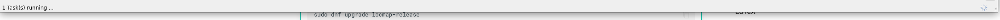
  <figcaption>Running task indicator.</figcaption>
  

#### New Segment

<figure>
  

  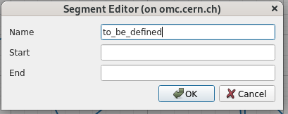
  <figcaption>The new segment dialog.</figcaption>
  

</figure>

- Click `New` button to create a new segment for the currently selected optics.
- Enter segment name, start Element and end Element. If either start and end if not given, BOTH are ignored and only the name is used to define the element-segment.

#### Default Segments

- Click `Add Defaults` button to add default segments for the currently selected optics.
E.g. for the lhc these are the segments
IP1, IP2, IP5 and IP8 starting from BPM.L12 to BPM.R12, which contain the main interaction points of the LHC and thus of particular interest for the SbS analysis.

- If activated in the settings, the GUI will automatically add these default segments when loading a new measurement optics directory.

#### Copy Segment

- Click `Copy` button to create a copy of the currently selected segment for the currently selected optics.
- The copied segment will have the same start and end BPMs, but a different name.
- Makes it easy to quickly create similar segments, e.g. with different start BPMs, to test the effect of the starting point on the results.

#### Remove Segment

- Click `Remove` button to delete the currently selected segment for the currently selected optics.

#### Save/Load Segment

NOT IMPLEMENTED.

FUTURE: Save the segment definition (name, start, end) in a json file in the output directory of the optics, e.g. `sbs/segments.json`, and load it when loading the optics or clicking the `Load` button. This way, the segments will be saved even if they have not been run yet (i.e. no output file exists) and can be easily shared between different measurements or optics by copying the json file.

## Log Console

<figure>
  

  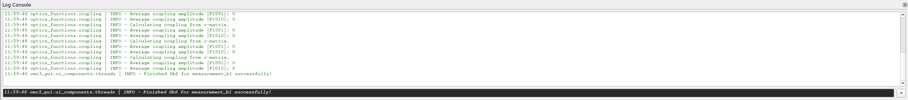
  <figcaption>The log console.</figcaption>
  

</figure>

- Logging output from GUI actions.
- Logging output from called python modules.
- Expandable and collapsable via arrow.
- Close with the "X" button on the right (re-enable through the [`View` menu](#view)).
- Movable and resizable.
- Right-click in the console to open the context menu, which also allows to to access the preferences.

Hint:  initialized with log level `INFO`, call GUI with `python -d` to set log level to `DEBUG` and get more detailed logging output, e.g. for debugging purposes.
