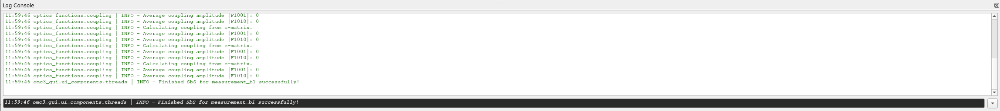

# The Segment-by-Segment GUI

The Segment-by-Segment GUI provides a graphical interface to run the segment-by-segment method on various parts of the machine.
The interface allows users to input data, configure settings, run segments, determine corrections and visualise results for various observables.
For information about the Segment-by-Segment method, see its dedicated [explanatory page](../../measurements/physics/sbs.md).

The GUI is launched from the Beta-Beat GUI's [Optics Panel](../betabeat/optics_panel.md) after running a full optics analysis.
With an analysis selected, clicking the ++"Segment-by-Segment"++ button will trigger the GUI to start.
<!-- TODO: check button name -->

??? info "Running from the Command Line"
    The Sbs GUI is a Python program and part of the `omc3_gui` package.
    It can be started from the command line with by providing desired arguments to the following call:

    ```bash
    python -m omc3_gui.sbs_gui # args here
    ```

    Note that this GUI requires the `omc3` package, a QT recent bindings (`PyQT` / `PySide`) and the `accwidgets` package which is quite CERN specific.
    It is recommended to run it from the BetaBeat GUI as instructed above.

The default main GUI window should open to this view:

<figure>
  <center>
  
  <figcaption>Blank window of SbS-GUI as seen when starting the GUI.</figcaption>
  </center>
</figure>

For details on the menu bar, configurable settings and the log console, see the [Menu & Settings](settings.md) page.

## Loading Measurement Data

<figure>
  <center>
  
  <figcaption>The loaded optics section in the side panel.</figcaption>
  </center>
</figure>

This section displays the list of currently loaded optics measurements.
Each entry is color-coded by beam for quick identification.
Hovering over an optics name displays a tooltip with a summary of its associated paths and accelerator parameters.

#### Load Optics

Clicking the `Load` button opens a file dialog where you can select the measurement folder to load.
Alternatively, you can point directly to a previous SbS output folder, which is useful when working with [virtual copies](#virtual-copies) or when you had previously used a different output directory name than the default `sbs`.

Upon loading, the GUI attempts to automatically determine the accelerator type, beam and the appropriate model folder.
If the automatic detection is not successful, these parameters need to be set manually via the `Edit` button (see the _Edit Optics_ details below).
The SbS analysis output is stored in sub-directories of the optics folder, by default in a folder named `sbs`.
If the corresponding option is activated in the [settings](settings.md#main-settings), the GUI will automatically scan the `sbs` folder for existing segment results and load them into the segments table.

#### Virtual Copies

Clicking the `Copy` button creates a virtual copy of the currently selected optics.
A virtual copy references the same input measurement data but writes its output to a separate directory, making it possible to test multiple correction schemes side by side without duplicating files on disk.
In the side panel, virtual copies are displayed as `NAME -> OUTPUT_DIR_NAME` to distinguish them from the original optics entry.

#### Remove Optics

Clicking the `Remove` button removes the currently selected optics from the GUI.
This only unloads it from the interface and does not delete any files from disk.

#### Run Matcher

!!! warning "Not Implemented"
    This feature is not yet implemented.
    In the future, the `Run Matcher` button is intended to launch the automated matcher for the currently selected optics, which would calculate the correction and produce a correction file.
    That file could then be loaded in the [corrections dialog](#corrections) and applied to the model.

??? info "Edit Optics"

    <figure>
      <center>
      
      <figcaption>The edit optics measurement dialog.</figcaption>
      </center>
    </figure>

    The edit dialog can be opened by clicking the `Edit` button or by double-clicking the optics name in the side panel.
    It allows you to modify the paths and accelerator parameters associated with the loaded optics.
    Note that the measurement path itself cannot be changed from this dialog; to use a different measurement directory, load a new measurement folder instead.

    The available fields are:

    - **Model**: Path to the model folder, which should contain the optics files for the model.
    - **Accelerator**: Accelerator name, e.g. `lhc`, `sps`, `ps`, `psbooster`.
    - **Output**: Path to the output folder where the SbS analysis results are stored.
    - **Corrections**: Path to the corrections file containing all corrections to be applied to the model. The corrections are executed by MAD-X as-is to correct the model, so they must be written in MAD-X syntax and represent the "inverse" of the corrections applied in the machine (MAD-X/LSA sign conventions apply).
    - **Year**: Year of the accelerator optics to use, corresponding to the `acc-models` branch from which the appropriate model is created (see the `omc3` model creators).
    - **Ring**: Ring to use, if applicable (relevant for PSB).
    - **Beam**: LHC beam to use, if applicable, e.g. `1` or `2`.

    The parameters are validated when clicking `OK`. Which parameters are required depends on the selected accelerator.

#### Corrections

Clicking the `Corrections` button opens the corrections dialog, where you can load or create a correction file to apply to the model.
If a correction file is already associated with the selected optics, the dialog displays its contents and allows you to edit them directly.
When no correction file is loaded, the dialog may suggest correctors based on the optics and measurement data, provided this feature is activated in the [settings](settings.md#main-settings).

The correction file path is applied to all currently selected optics and can also be edited from the edit optics dialog (see the _Edit Optics_ details above).
If some of the selected measurements already have the same correction file loaded while others have none, a dialog will ask whether you want to apply the same correction file to all of them.
If there is a conflict between different correction files across the selected optics, an error message is shown.

### Segments

<figure>
  <center>
  
  <figcaption>The side panel.</figcaption>
  </center>
</figure>

This section displays the defined segments for the currently selected optics.
Each segment is shown with its name, start element and end element.
The `start` and `end` fields are optional: if either one is left empty, both are ignored and only the segment name is used.
In that case, the SbS analysis will automatically find the closest BPMs before and after the named element to use as the propagation boundaries.

Hovering over a segment entry in the table displays a tooltip indicating which loaded optics it belongs to and whether the analysis has been run for each one (i.e. whether the output file exists).
Clicking on a segment name selects it and displays the corresponding results in the plot, provided the analysis has already been performed.
See ["Segment Grouping and Comparison"](#segment-grouping-and-comparison) for details on how segments from multiple optics or selections are overlaid.

!!! warning "Start and End Elements vs. Actual BPMs"
    The start and end elements specified here do not need to be BPMs — they can be any element in the model.
    The SbS analysis will locate the nearest BPM in the measurement data and use that as the actual start or end of the segment.
    This means that for different measurements, the actual start BPM may differ even if the defined segment uses the same start element, depending on which BPMs are present or filtered in the measurement data.
    Since the GUI checks only the segment definition and not the actual SbS output, this can lead to confusion when plotting multiple segments together: they will appear to start at the same point in the plot despite corresponding to different physical locations.
    Activating the `Model Location` option in the [plot settings](settings.md#plot-settings) avoids this issue by plotting positions in the accelerator frame rather than relative to the segment start.

#### Run Segment-by-Segment Analysis

Clicking the `Run Segment(s)` button launches the segment-by-segment analysis for the currently selected segments and optics.
If the output file already exists for a given combination, it will be overwritten by the new run.
While the analysis is running in the background, a spinner icon appears at the bottom right of the GUI.
Hovering over the "running tasks" text next to the spinner displays the name of the currently running task (e.g. `SbS for <optics name>`).

<figure>
  <center>
  
  <figcaption>Running task indicator.</figcaption>
  </center>
</figure>

#### New Segment

<figure>
  <center>
  
  <figcaption>The new segment dialog.</figcaption>
  </center>
</figure>

Clicking the `New` button opens the segment editor dialog for the currently selected optics.
In the dialog, you enter the segment name along with the start element and end element.
If either the start or end element is left empty, both are ignored and only the segment name is used to define the segment; the analysis will then automatically determine the nearest BPMs.

#### Default Segments

Clicking the `Add Defaults` button populates the segments table with a predefined set of segments appropriate for the currently selected accelerator.
For example, in the LHC the default segments cover IP1, IP2, IP5 and IP8 — spanning from `BPM.L12` to `BPM.R12` — which contain the main interaction points and are therefore of particular interest for the SbS analysis.

If the corresponding option is activated in the [settings](settings.md#main-settings), these default segments are automatically added whenever a new measurement optics directory is loaded.

#### Copy Segment

Clicking the `Copy` button creates a duplicate of the currently selected segment for the currently selected optics.
The copy retains the same start and end elements but is given a different name.
This is particularly useful for quickly creating variants of a segment — for instance with different start BPMs — to evaluate how the choice of starting point affects the results.

#### Remove Segment

Clicking the `Remove` button deletes the currently selected segment from the segments table for the currently selected optics.
This only removes the segment definition from the GUI; it does not delete any output files from disk.

#### Save/Load Segment

!!! warning "Not Implemented"
    This feature is not yet implemented.
    In the future, segment definitions (name, start, end) will be saved as a JSON file in the output directory of the optics (e.g. `sbs/segments.json`) and reloaded automatically when the optics are loaded or when the user clicks the `Load` button.
    This will allow segment definitions to persist even if the analysis has not been run yet and will make it easy to share segment configurations between different measurements by copying the JSON file.

## Log Console

<figure>
  <center>
  
  <figcaption>The log console.</figcaption>
  </center>
</figure>

The log console displays logging output from both GUI actions and the underlying Python modules called during the analysis.
It can be expanded or collapsed using the arrow control and closed entirely with the "X" button on its right side; if closed, it can be re-enabled through the [`View` menu](#view).
The console panel is also movable and resizable within the GUI window.
Right-clicking inside the console opens a context menu that provides access to additional preferences.

!!! tip "Debug Logging"
    By default, the log console is initialized with log level `INFO`.
    To enable more detailed output for debugging purposes, launch the GUI with the `-d` flag (e.g. `python -d`), which sets the log level to `DEBUG`.
