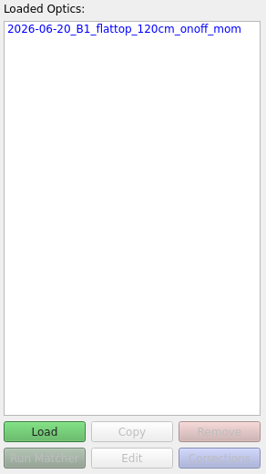
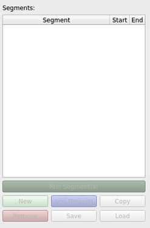
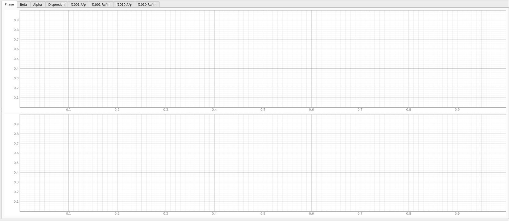

# The Segment-by-Segment GUI

The Segment-by-Segment GUI provides a graphical interface to run the [segment-by-segment method][sbs_method] on various parts of the machine.
It allows users to input data, configure settings, run segments, determine corrections and visualise results for various observables.
This section will guide you through the GUI's layout and functionality.

The GUI is a Python application built on `acc-widgets`.
It can be run either from the Beta-Beat GUI's [Optics Panel][bbgui_optics_panel] after running a full optics analysis, or the command line:

=== "From the Beta-Beat GUI"

    After performing an optics analysis, navigate to the optics panel.
    With an analysis selected, click the ++"Segment-by-Segment"++ button to start the GUI.
    <!-- TODO: check button name -->

=== "From the Command Line"

    The SbS GUI is a Python program and part of the `omc3_gui` package.
    It can be started from the command line by providing desired arguments to the following call:

    ```bash
    python -m omc3_gui.sbs_gui # args here
    ```

    Note that this GUI requires the `omc3` package, recent QT bindings (`PyQT` / `PySide`) and the `accwidgets` package which is quite CERN specific.
    It is recommended to run it from the Beta-Beat GUI.

After opening, the GUI displays the main window:

<figure>
  <center>
  
  <figcaption>Blank window of SbS-GUI as seen when starting the GUI.</figcaption>
  </center>
</figure>

The GUI window is made up of the following main components.

=== "Optics Panel"

    The top left panel displays the loaded measurement data as well as various actions related to data.
    <!-- TODO: Take better quality screenshot -->

    <figure>
      <center>
      
      <figcaption>The optics panel and associated buttons.</figcaption>
      </center>
    </figure>

=== "Segments Panel"

    The lower left panel displays the defined segments and buttons to perform actions with those segments.
    <!-- TODO: Take better quality screenshot -->

    <figure>
      <center>
      
      <figcaption>The segments panel and associated buttons.</figcaption>
      </center>
    </figure>

=== "Main Plot Area"

    The main part of the window, to the right of the previous two panels, displays the quantities propagated through the selected segment.
    <!-- TODO: Take better quality screenshot -->

    <figure>
      <center>
      
      <figcaption>The main plot panel.</figcaption>
      </center>
    </figure>

    The various tabs in the top part allow the user to select which quantity to plot.

=== "Log Console"

    At the very bottom of the window is the log console, which displays logging output from both GUI actions and the underlying Python modules called during the analysis.

    <figure>
      <center>
      
      <figcaption>The log console, expanded.</figcaption>
      </center>
    </figure>

    It can be expanded or collapsed using the arrow control and closed entirely with the ++"X"++ button on its right side.
    If closed, it can be re-enabled through the [View menu][sbs_view_menu].

    !!! tip "Debug Logging"
        By default, the log console is initialized with log level `INFO`.
        To enable more detailed output for debugging purposes, launch the GUI with the `-d` flag (e.g. `python -m omc3_gui.sbs_gui -d`), which sets the log level to `DEBUG`.

    The console panel is also movable and resizable within the GUI window.
    Right-clicking inside the console opens a context menu that provides access to additional preferences.

---

The following pages are available:

- [Menus & Settings](settings.md) for the available menus and the meaning of various options.
- [Loading Data and Running Segments](segments.md) for how to load measurement data, define and run segments, and interpret the plots.
- [Determining Corrections](corrections.md) for how to attempt determining corrections and testing their effect through the segments.

*[SbS]: Segment-by-Segment

[sbs_method]: ../../measurements/physics/sbs.md
[bbgui_optics_panel]: ../betabeat/optics_panel.md
[sbs_view_menu]: settings.md#view-menu
