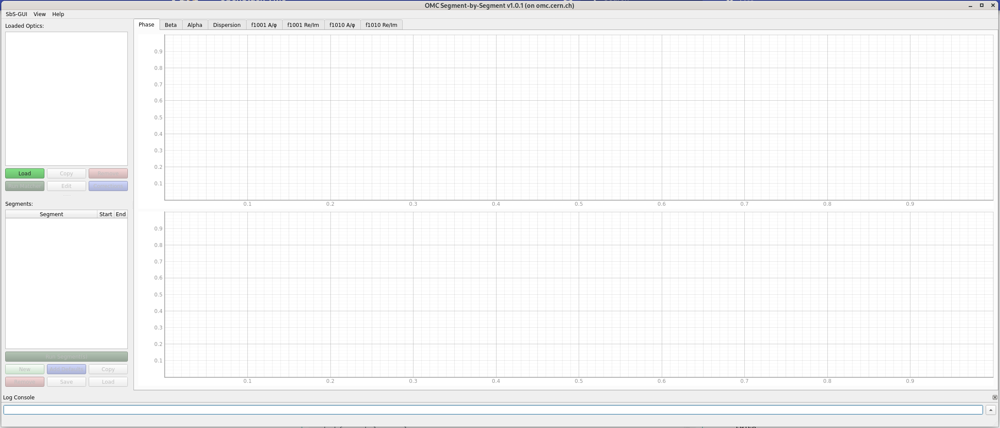

# The Segment-by-Segment GUI

The Segment-by-Segment GUI provides a graphical interface to run the [segment-by-segment method](../../measurements/physics/sbs.md) on various parts of the machine.
It allows users to input data, configure settings, run segments, determine corrections and visualise results for various observables.
This section will guide you through the GUI's layout and functionality.

The GUI is a Python application built on `acc-widgets`.
It can be run either from the Beta-Beat GUI's [Optics Panel](../betabeat/optics_panel.md) after running a full optics analysis, or the command line:

=== "From the Beta-Beat GUI"

    After performing an optics analysis, navigate to the optics panel.
    With an analysis selected, click the ++"Segment-by-Segment"++ button to start the GUI.
    <!-- TODO: check button name -->

=== "From the Command Line"

    The SbS GUI is a Python program and part of the `omc3_gui` package.
    It can be started from the command line by providing desired arguments to the following call:

    ```bash
    python -m omc3_gui.sbs_gui # args here
    ```

    Note that this GUI requires the `omc3` package, recent QT bindings (`PyQT` / `PySide`) and the `accwidgets` package which is quite CERN specific.
    It is recommended to run it from the Beta-Beat GUI.

After opening, the GUI should open to the main window:

<figure>
  <center>
  
  <figcaption>Blank window of SbS-GUI as seen when starting the GUI.</figcaption>
  </center>
</figure>

The following pages are available:

- [Menus and Settings](settings.md) for the available menus, and the meaning of various options.
- [Running Segments](segments.md) for how to load default segments, modify existing ones and defining entirely new ones to run as well as how to interpret the plots.
- [Determining Corrections](corrections.md) for how to attempt determining corrections and testing their effect through the segments.

## Loading Measurement Data

<figure>
  <center>
  
  <figcaption>The loaded optics section in the side panel.</figcaption>
  </center>
</figure>

The first step is to load optics measurement data.
Click the `Load` button in the side panel to open a file dialog where you can select the measurement folder.
Alternatively, you can point directly to a previous SbS output folder, which is useful when resuming work or when you had previously used a different output directory name than the default `sbs`.

Upon loading, the GUI attempts to automatically determine the accelerator type, beam and the appropriate model folder.
If the automatic detection is not successful, these parameters need to be set manually via the `Edit` button (see the _Edit Optics_ details below).
The SbS analysis output is stored in sub-directories of the optics folder, by default in a folder named `sbs`.
If the corresponding option is activated in the [settings](settings.md#main-settings), the GUI will automatically scan the `sbs` folder for existing segment results and load them into the segments table.

Once loaded, optics entries appear in the side panel, color-coded by beam.
Hovering over an optics name displays a tooltip with a summary of its associated paths and accelerator parameters.
To remove an optics entry from the GUI, select it and click the `Remove` button — this only unloads it from the interface and does not delete any files from disk.

??? info "Edit Optics"

    <figure>
      <center>
      
      <figcaption>The edit optics measurement dialog.</figcaption>
      </center>
    </figure>

    The edit dialog can be opened by clicking the `Edit` button or by double-clicking the optics name in the side panel.
    It allows you to modify the paths and accelerator parameters associated with the loaded optics.
    Note that the measurement path itself cannot be changed from this dialog; to use a different measurement directory, load a new measurement folder instead.

    The available fields are:

    - **Model**: Path to the model folder, which should contain the optics files for the model.
    - **Accelerator**: Accelerator name, e.g. `lhc`, `sps`, `ps`, `psbooster`.
    - **Output**: Path to the output folder where the SbS analysis results are stored.
    - **Corrections**: Path to the corrections file containing all corrections to be applied to the model. The corrections are executed by MAD-X as-is to correct the model, so they must be written in MAD-X syntax and represent the "inverse" of the corrections applied in the machine (MAD-X/LSA sign conventions apply).
    - **Year**: Year of the accelerator optics to use, corresponding to the `acc-models` branch from which the appropriate model is created (see the `omc3` model creators).
    - **Ring**: Ring to use, if applicable (relevant for PSB).
    - **Beam**: LHC beam to use, if applicable, e.g. `1` or `2`.

    The parameters are validated when clicking `OK`. Which parameters are required depends on the selected accelerator.

## Defining Segments

<figure>
  <center>
  
  <figcaption>The side panel.</figcaption>
  </center>
</figure>

With measurement data loaded, the next step is to define the segments of the accelerator to analyse.
Each segment is defined by a name, a start element and an end element.

The quickest way to get started is to click the `Add Defaults` button, which populates the segments table with a predefined set of segments appropriate for the currently selected accelerator.
For example, in the LHC the default segments cover IP1, IP2, IP5 and IP8 — spanning from `BPM.L12` to `BPM.R12` — which contain the main interaction points and are therefore of particular interest for the SbS analysis.
If the corresponding option is activated in the [settings](settings.md#main-settings), these default segments are automatically added whenever a new measurement optics directory is loaded.

To create a custom segment, click the `New` button to open the segment editor dialog.

<figure>
  <center>
  
  <figcaption>The new segment dialog.</figcaption>
  </center>
</figure>

In the dialog, enter the segment name along with the start element and end element.
The `start` and `end` fields are optional: if either one is left empty, both are ignored and only the segment name is used.
In that case, the SbS analysis will automatically find the closest BPMs before and after the named element to use as the propagation boundaries.

The `Copy` button creates a duplicate of the currently selected segment with a different name, which is useful for quickly creating variants — for instance with different start BPMs — to evaluate how the choice of starting point affects the results.
The `Remove` button deletes the selected segment from the table; this only removes the definition from the GUI and does not delete any output files from disk.

!!! warning "Start and End Elements vs. Actual BPMs"
    The start and end elements specified here do not need to be BPMs — they can be any element in the model.
    The SbS analysis will locate the nearest BPM in the measurement data and use that as the actual start or end of the segment.
    This means that for different measurements, the actual start BPM may differ even if the defined segment uses the same start element, depending on which BPMs are present or filtered in the measurement data.
    Since the GUI checks only the segment definition and not the actual SbS output, this can lead to confusion when plotting multiple segments together: they will appear to start at the same point in the plot despite corresponding to different physical locations.
    Activating the `Model Location` option in the [plot settings](settings.md#plot-settings) avoids this issue by plotting positions in the accelerator frame rather than relative to the segment start.

!!! warning "Save/Load Segments — Not Implemented"
    In the future, segment definitions (name, start, end) will be saved as a JSON file in the output directory of the optics (e.g. `sbs/segments.json`) and reloaded automatically when the optics are loaded.
    This will allow segment definitions to persist even if the analysis has not been run yet and will make it easy to share segment configurations between different measurements by copying the JSON file.

## Running the Analysis

Once segments are defined, select the segments and optics you want to analyse, then click the `Run Segment(s)` button.
If the output file already exists for a given combination, it will be overwritten by the new run.

During the analysis, optics parameters are propagated from the start and end BPMs through each defined segment using MAD-X.
The propagated values are then compared against the measured data to compute the differences.
Errors from the original BPMs are also propagated through the segment and added in quadrature to the measurement uncertainty.

!!! tip "Choice of First and Last BPMs"
    The measurement values and errors at the location of the first BPM in the segment are the ones used for the propagation.
    Depending on the quality of the measurement at said BPM, the propagation might yield low quality data.
    It can sometimes be a good idea to attempt the segment with a different start BPM (and end BPM for reverse propagation) if encountering this issue.

While the analysis is running in the background, a spinner icon appears at the bottom right of the GUI.
Hovering over the "running tasks" text next to the spinner displays the name of the currently running task (e.g. `SbS for <optics name>`).

<figure>
  <center>
  
  <figcaption>Running task indicator.</figcaption>
  </center>
</figure>

## Inspecting Results

After the analysis has completed, click on a segment name in the table to display its results in the main plot area.
The plot shows the difference between the propagated model and the measurement, allowing you to identify where discrepancies exist and pinpoint the locations of optics errors.

The solid line represents this difference under the assumption that the model and measurement share the same value at the start BPM (or the end BPM for backward propagation).
Arrow markers indicate the direction of propagation — rightward arrows for forward propagation and leftward arrows for backward propagation.
Inspecting both directions helps confirm the error source: if deviations appear after the same location from both sides, that location is likely where the error originates.

The tabs above the plot area allow switching between the different optics parameters that are propagated through the segments, such as the phase advance, the $\beta$-function or coupling RDTs.

### Comparing Multiple Segments or Optics

When multiple optics are loaded simultaneously, identically defined segments — those sharing the same name, start BPM and end BPM — are automatically grouped together and overlaid on the same plot.
This makes it straightforward to compare results from different measurements or different correction schemes for the same region of the accelerator.
Hovering over a segment entry in the table displays a tooltip showing which loaded optics it belongs to and whether the analysis has been run for each one.
Note that segments with different start or end BPMs are never grouped together, even if they share the same name, because they represent physically different analyses.

When multiple segments are selected, the default behaviour is to only plot together those that share the same start BPM, since the horizontal axis position is relative to the start of the segment.
This constraint can be relaxed via the `Same segment start` option in the [plot settings](settings.md#plot-settings), although doing so is generally not recommended as it can lead to confusion when comparing positions.
Activating the `Model Location` option changes the horizontal axis to show absolute positions in the accelerator rather than positions relative to the segment start, which makes it meaningful to overlay segments with different start BPMs and compare their results directly.

Each combination of segment and optics is assigned a consistent color, while different markers and line styles distinguish forward propagation, backward propagation, corrected and expected traces.
When plotting many segments at once, it is advisable not to activate all trace types simultaneously, as the plot can become very crowded and difficult to read.

### Shortcuts

The plot supports the following keyboard and mouse shortcuts for navigation and inspection:

- **Hover**: Show Optics name, BPM name and the value of the point in the plot.
- **Double Click** / **Right Click**: Zoom history back one step (only works for rectangle zoom).
- **Shift + Right Click**: Reset zoom to the original view.
- **Alt + Right Click**: Open the pyqtgraph context menu.
- **Click and Drag**: Draw a rectangle to zoom into a specific area of the plot.
- **Scroll in Graph**: Zoom in and out of the plot, both axis.
- **Scroll over one axis**: Zoom in and out of the plot, only the axis you are scrolling over.

## Finding Corrections

Once you have inspected the results and identified optics errors, the next step is to determine corrections.
Clicking the `Corrections` button in the side panel opens the corrections dialog, where you can load or create a correction file to apply to the model.
If a correction file is already associated with the selected optics, the dialog displays its contents and allows you to edit them directly.
When no correction file is loaded, the dialog may suggest correctors based on the optics and measurement data, provided this feature is activated in the [settings](settings.md#main-settings).

The correction file path is applied to all currently selected optics.
If some of the selected measurements already have the same correction file loaded while others have none, a dialog will ask whether you want to apply the same correction file to all of them.
If there is a conflict between different correction files across the selected optics, an error message is shown.

!!! warning "Run Matcher — Not Implemented"
    In the future, the `Run Matcher` button is intended to launch the automated matcher for the currently selected optics, which would calculate the correction and produce a correction file that can then be loaded in the corrections dialog.

### Understanding Correction Sign Conventions

The corrections applied in the GUI modify the model to match the measurement.
In order to actually correct the machine, these corrections generally need to be inverted: the GUI finds what error in the model would reproduce the observed measurement deviation, and the opposite of that error is what should be applied operationally.
Be aware that sign conventions may differ between MAD-X and LSA, so care must be taken when translating correction values from the GUI to the control system.

### Testing Multiple Correction Schemes

A practical approach to testing different correction strategies is to create virtual copies of the same measurement.
Click the `Copy` button in the loaded optics section to create a virtual copy: it references the same input measurement data but writes its output to a separate directory, making it possible to try multiple correction schemes side by side without duplicating files on disk.
In the side panel, virtual copies are displayed as `NAME -> OUTPUT_DIR_NAME` to distinguish them from the original optics entry.

Similarly, creating multiple segments with different start BPMs for the same region of the accelerator lets you evaluate how sensitive the results are to the choice of starting point and whether the correction holds regardless of which BPM anchors the propagation.

### Corrected and Expected Plots

When corrections have been applied and the analysis is re-run, the plot shows a dashed line in addition to the solid measurement line.
The [plot settings](settings.md#plot-settings) let you choose what this dashed line represents:

- **Matched value (corr)**: the difference between the propagated corrected model and the nominal propagated model.
  If the correction successfully reproduces the measured errors, this dashed line should lie close to the solid measurement line.
- **Expected value (expct)**: the difference between the measured values and the propagated corrected model.
  This represents the expected outcome of the SbS analysis after the correction has been applied to the machine, and should therefore be close to zero if the correction is effective.
