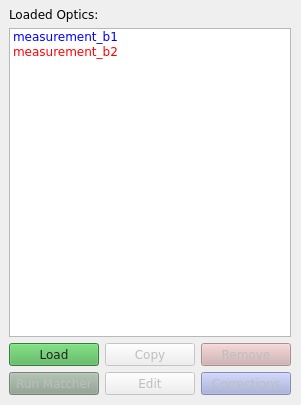
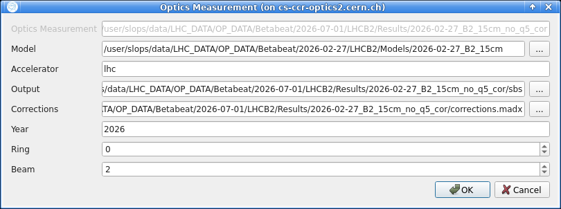
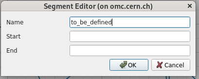
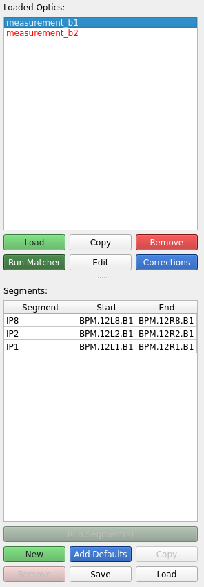
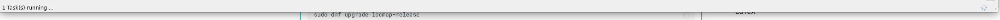

# Loading Data and Running Segments

The first step in a [segment-by-segment][sbs_method] analysis is loading data and running a segment to propagate the measured properties through the machine's model.
This page will showcase the interface and workflow to do so.

## Loading Measurement Data

If started from the Beta-Beat GUI with an optics analysis selected, the corresponding optics data and associated model will be automatically loaded.

Otherwise, or to load additional measurements, click the `Load` button in the side panel to open a file dialog and select the measurement folder corresponding to the optics analysis to be loaded.

It is possible to directly point to an existing SbS output folder, which is useful when resuming previous work or when a different output directory name than the default `sbs` was used.

!!! info "Corresponding Models"
    At load time, the GUI will attempt to determine the accelerator type, beam and the appropriate model folder.
    Should this automatic detection fail, these parameters need to be set manually via the `Edit` button (see **Editing Optics** below).

Once loaded, the optics entries will appear in the side panel, color-coded by beam.
Hovering over an optics name displays a tooltip with a summary of its associated paths and accelerator parameters.

<figure>
  

  
  <figcaption>The loaded optics section in the left side panel.</figcaption>
  

</figure>

The SbS analysis output is by default stored in a folder named `sbs` within the corresponding optics folder.
If the corresponding option is activated in the [settings][sbs_settings], the GUI will automatically scan the `sbs` folder for existing segment results and load them into the segments table when loading the data.

??? info "Editing Optics"

    The `edit` dialog can be opened by clicking the ++"Edit"++ button or by double-clicking the optics name in the side panel.
    It allows one to modify the paths and accelerator parameters associated with the loaded optics.

    Note that the measurement path itself cannot be changed from this dialog.
    To use a different measurement directory, load a new measurement folder instead.

    The edit window will look like so.

    <figure>
      

      
      <figcaption>The edit optics measurement dialog.</figcaption>
      

    </figure>

    The available fields are:

    - **Model**: Path to the model folder, which should contain the optics files for the model.
    - **Accelerator**: Accelerator name, e.g. `lhc`, `sps`, `ps`, `psbooster`.
    - **Output**: Path to the output folder where the SbS analysis results are stored. Defaults to `sbs` within the measurement folder.
    - **Corrections**: Path to the corrections file containing all corrections to be applied to the model. The corrections are executed by `MAD-X` as-is to correct the model, so they must be written in `MAD-X` syntax and represent the "inverse" of the corrections applied in the machine (`MAD-X`/`LSA` sign conventions apply).
    - **Year**: Year of the accelerator optics to use, corresponding to the `acc-models` branch from which the appropriate model is created. See the [omc3 model creation](../betabeat/model_creation.md).
    - **Ring**: Ring to use, if applicable (relevant for PSB).
    - **Beam**: LHC beam to use, if applicable, e.g. `1` or `2`.

    The parameters are validated when clicking `OK`.
    Which parameters are required depends on the selected accelerator.

To remove an optics entry from the GUI, select it and click the ++"Remove"++ button.
This only unloads it from the interface and does not delete any files from disk.

## Defining Segments

Before running any propagation it is necessary to define segments.
Each segment is defined by a name, a start element and an end element.
Segments can be added by first selecting a loaded optics measurement.

### Default Segments

The quickest way to get started is to click the ++"Add Defaults"++ button, which populates a predefined set of segments appropriate for the currently selected accelerator.

For instance, in the LHC the default segments cover IP1, IP2, IP5 and IP8.
Each spans from `BPM.L12` to `BPM.R12` and contains one of the main interaction points.
They are therefore of particular interest for the LHC analysis.

!!! tip "Auto Defaults"
    If the corresponding option is activated in the [settings](settings.md#main-settings), default segments are automatically added whenever a new measurement optics directory is loaded.

### Custom Segments

It is possible to create an arbitrary custom segment by clicking the ++"New"++ button.
This opens the segment editor dialog, as shown below.

<figure>
  

  
  <figcaption>The new segment dialog.</figcaption>
  

</figure>

In the dialog, enter the segment name along with the start element and end element.
The SbS GUI will automatically find the closest BPMs before and after the named element to use as the propagation boundaries.

!!! warning "Start and End Elements vs. Actual BPMs"
    The above means that, for different measurements, the actual start BPM may differ even if the defined segment uses the same start element; depending on which BPMs are present or filtered in the measurement data.

    Since the GUI checks only the segment definition and not the actual SbS output, this can lead to confusion when plotting multiple segments together: they will appear to start at the same point in the plot despite corresponding to different physical locations.
    Activating the [`Model Location` option in the plot settings](settings.md#plot-settings) avoids this issue by plotting positions in the accelerator frame rather than relative to the segment start.

The ++"Copy"++ button creates a duplicate of the currently selected segment with a different name, which is useful for quickly creating variants, for instance with different start BPMs, to evaluate how the choice of starting point affects the results.

The ++"Remove"++ button deletes the selected segment from the table.
This only removes the definition from the GUI and does not delete any output files from disk.

New segments will display in the segments table, as shown below.

<!-- TODO: Better quality picture? -->
<figure>
  

  
  <figcaption>The side panel with added segments for the measurement_b1 loaded optics.</figcaption>
  

</figure>

It is possible at any time to edit a given segment's properties by double clicking either the `Segment`, `Start` or `End` entry in the table and changing its content.

!!! warning "Save/Load Segments — Not Implemented"
    In the future, segment definitions (name, start, end) will be saved to disk in the output directory of the optics (e.g. a `sbs/segments.json` file) and reloaded automatically as the optics are loaded.
    Doing so will allow segment definitions to persist even without running propagation, and will make it easy to share segment configurations between different measurements by copying the file.

## Running Segments

Once segments are defined, for a given optics select the segments to propagate measured properties through, then click the ++"Run Segment(s)"++ button.

!!! info "Output Persistence"
    Please note that (re-)running a segment will overwrite any previous run with the most recent results.

The GUI calls `MAD-X` to propagate optics parameters from the `start` and `end` BPMs through each defined segment.
The propagated values are then compared against the measured data and deviations are computed.

Measured errors are also propagated through the segment, although analytically, and added in quadrature to the measurement uncertainty.

!!! tip "Choice of First and Last BPMs"
    The measurement values and errors at the location of the first BPM in the segment are the ones used for the propagation.
    Depending on the quality of the measurement at said BPM, the propagation might yield low quality data.
    It can sometimes be a good idea to attempt the segment with a different start BPM (and end BPM for backwards propagation) in such a case.

While the propagation is running in the background, a spinner icon appears at the bottom right of the GUI.
Hovering over the `running tasks` text next to the spinner displays the name of the currently running task (e.g. `SbS for <optics name>`).

<figure>
  

  
  <figcaption>Running task indicator.</figcaption>
  

</figure>

## Inspecting Results

After the propagation has completed for a segment, selecting it in the segments table will display its results in the main plot area.
By default the plot shows the difference between the propagated model and the measurement.
This view allows one to identify where discrepancies exist and pinpoint the locations of optics errors.

<!-- TODO: Add a propagation result screenshot here -->

The solid line represents said difference under the assumption that the model and measurement share the same value at the start BPM (or end BPM for backward propagation).
Arrow markers indicate the direction of the propagation: rightward arrows for forward propagation and leftward arrows for backward propagation.

Inspecting both directions helps confirm the error source: if deviations appear after the same location from both sides, that location is likely where the error originates.
<!-- TODO: Have an example pointing at the screenshot above? -->

The tabs above the plot area allow switching between the different optics parameters propagated through the segments, such as the phase advance, the $\beta$-function or coupling RDTs.

Once optics errors have been identified, see [determining corrections](corrections.md) on the next page for how to test corrections.

### Comparing Multiple Segments or Optics

When multiple optics are loaded simultaneously, identically defined segments (sharing the same name, start BPM and end BPM) are automatically grouped together and overlaid on the same plot when selected together.

This grouping makes it straightforward to compare results from different measurements or different correction schemes for the same segment of the accelerator.
Hovering over a segment entry in the table displays a tooltip showing which loaded optics it belongs to and whether propagation has been run.

!!! warning "Identical Only"
    Note that segments with different start or end BPMs are never grouped together, even when sharing a name.
    This is because they are, well, different segments.

When multiple segments are selected, the default behaviour is to only plot together those that share the same start BPM, since the horizontal axis position is relative to the start of the segment.

This constraint can be relaxed via the `Same segment start` option in the [plot settings](settings.md#plot-settings), although doing so is generally not recommended as it can lead to confusion when comparing positions.
Activating the `Model Location` option changes the horizontal axis to show absolute positions in the accelerator rather than positions relative to the segment start, which makes it meaningful to overlay segments with different start BPMs and compare their results directly.

Each combination of segment and optics is assigned a consistent color, while different markers and line styles distinguish forward propagation, backward propagation, corrected and expected traces (see the next page for the meaning of the former two).
When plotting many segments at once, it is advised not to activate all trace types simultaneously, as the plot can become very crowded and difficult to read.

??? tip "Some Plot Shortcuts"

    The plot supports the following keyboard and mouse shortcuts for navigation and inspection:

    - **On Hover**: Show optics name, BPM name and the value of the point in the plot.
    - **Double Click** / **Right Click**: Zoom history back one step (only works for rectangle zoom).
    - **Shift + Right Click**: Reset zoom to the original view.
    - **Alt + Right Click**: Open the `pyqtgraph` context menu.
    - **Click and Drag**: Draw a rectangle to zoom into a specific area of the plot.
    - **Scroll in Graph**: Zoom in and out of the plot, both axes.
    - **Scroll over one axis**: Zoom in and out of the plot, only for the axis scrolled over.

*[SbS]: Segment-by-Segment
*[RDT]: Resonance Driving Term

[sbs_method]: ../../measurements/physics/sbs.md
[sbs_settings]: settings.md#main-settings
