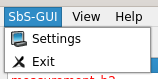
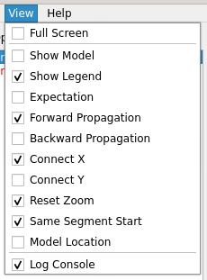
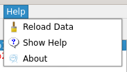
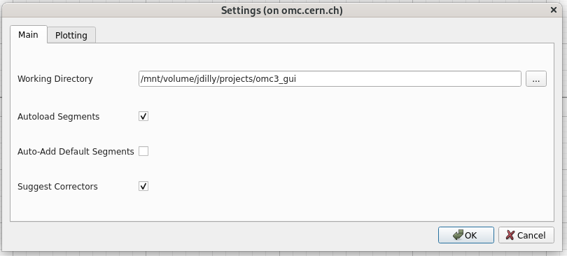
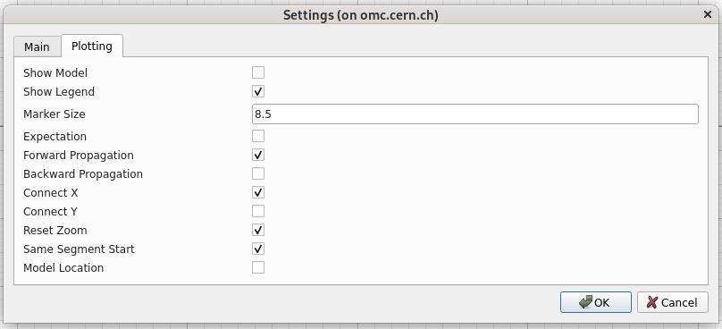
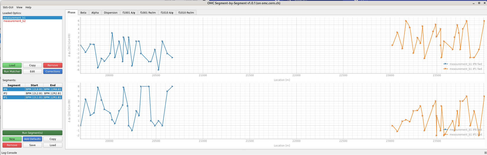

# Menus and Settings

As mentioned in the previous pages, various behaviours and display options can be selected.
This page documents the menu bar and configurable settings of the Segment-by-Segment GUI.

## Menus

The SbS GUI offers three menus, all located in the top bar of the GUI.

### SbS-GUI Menu

The SbS-GUI menu is very succinct.

<figure>
  

  
  <figcaption>The SbS-GUI menu.</figcaption>
  

</figure>

- **Settings**: Open the [settings dialog](#settings).
- **Exit**: Close the GUI.

### View Menu

The view menu is split into three sections, separated by horizontal lines.

<figure>
  

  
  <figcaption>The View menu.</figcaption>
  

</figure>

- **Full Screen**: Toggle full-screen mode.
- **Various Plotting Settings**: Quick access to the checkboxes of the [plot settings](#plot-settings).
- **Log Console**: Show or hide the log console at the bottom of the GUI.

### Help Menu

The help menu provides options for reloading data, accessing help, and viewing information about the GUI.

<figure>
  

  
  <figcaption>The Help menu.</figcaption>
  

</figure>

- **Reload Data**: Reload the data from the input files. This is useful if you have made changes to the input files and want to see the updated results without restarting the GUI.
- **Show Help**: Open the help dialog with some main instructions on how to use the GUI.
- **About**: Opens the about dialog, which displays some information about the GUI, e.g. the version.

## Settings

The settings window is accessible from the [`SbS-GUI` menu](#sbs-gui-menu), and is split into two tabs.
Note that contextual hints are available on hovering over each setting's text.

### Main Settings

The main settings tab allows configuring the working directory for the GUI as well as various automatic behaviours.

<figure>
  

  
  <figcaption>The main settings.</figcaption>
  

</figure>

- **Working Directory**: The directory where the input files are located.
The GUI will use this directory as the default directory when opening file dialogs for loading optics and measurement data.

- **Autoload Segments**: Automatically load existing segments when loading a new measurement optics directory.
This looks for files created by the GUI in earlier runs and for now only works for a segment if it has actually been run.

- **Auto-Add Default Segments**: Automatically add default segments when loading a new measurement optics directory, if applicable.

- **Suggest Correctors**: When opening the [corrections dialog](corrections.md#applying-corrections) for a new correction file, suggest correctors based on the optics and measurement data.

### Plot Settings

The plotting settings tab controls the visual appearance and behaviour of the segment plots, including marker display, propagation directions, axis linking, and zoom behaviour.

<figure>
  

  
  <figcaption>The plotting settings.</figcaption>
  

</figure>

- **Show Model**: Adds markers for the location of elements in the model to the plots.
- **Show Legend**: Show legends in the plots.
- **Marker Size**: Size of the markers in the plots.
- **Expectation**: If run with corrections, show the expected measurement difference instead of the corrected model difference (see [corrected and expected plots](corrections.md#corrected-and-expected-plots)).
- **Forward Propagation**: Show forward propagation results (arrows to the right).
- **Backward Propagation**: Show backward propagation results (arrows to the left).
- **Connect X**: Keep the same X-Axis limits for both charts when zooming.
- **Connect Y**: Keep the same Y-Axis limits for both charts when zooming.
- **Reset Zoom**: When changing segments, reset the zoom to the original view.
When deactivated, the current limits will be kept when changing segments, which can be useful for comparing different segments or optics with the same zoom level.
- **Same Segment Start**: Plot segments together, even if they have different start BPMs. This is *not recommended* as it can lead to confusion and misinterpretation of the results: different locations in the accelerator can appear at the same location on the plot.
- **Model Location**: Plot segments relative to the model location, i.e. their position in the accelerator, which allows for easy comparison of segments with different start BPMs. If deactivated, segments will start at a location of zero at their start BPM.

<figure>
  

  
  <figcaption>Example of two segments with different start BPMs when plotted with `Model Location` activated.</figcaption>
  

</figure>

*[SbS]: Segment-by-Segment
