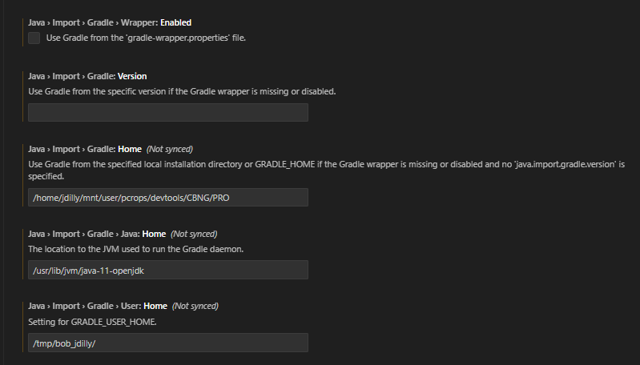
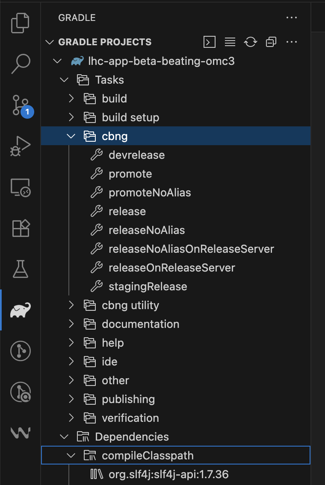

# IDE Setup

There are multiple IDEs that have been used in the past to develop the GUI.
While editing the code itself can be done with any IDE, running the application comes with some pitfalls,
due to the usage of [Common Build Next Generation (CBNG)][cbng_wiki]{target=_blank .cern_login} to resolve dependencies.
CBNG is only available in the Technical Network and one needs to either run the development tools from somewhere in the TN (e.g. from the `dev-server`) or [mount the required paths via `sshfs`][mounting_tn].

In principle running the CBNG commands can be done through the command-line,
but to have full debugging capabilities it is recommended to set it up in the IDE directly.

The easiest IDE to setup is the modified [Accsoft Eclipse](#eclipse) versions, as for [IntelliJ IDEA](#intellij-idea) and [VSCode](#vscode) additional configuration is required.
We recommend nonetheless the usage of VSCode, as this is the one most widely used in our team and hence we have the most experience with it.
To be able to use the same IDE for different languages is also of value.

## Setting Up the IDE

### VSCode

To be able to use [VSCode][vscode_webpage]{target=_blank} as an IDE for Java, the [Extension pack for Java][vscode_java]{target=_blank} needs to be installed.

Additionally, the following settings need to be set in `Extensions -> Language Support for Java -> Gradle`:

- *Java > Import > Gradle > Wrapper: Enabled*:<br>
  Needs to be **un-ticked**.
- *Java > Import > Gradle: Version*:<br>
  Needs to be **empty**.
- *Java > Import > Gradle: Home*:<br>
  Set to the absolute path to the CBNG directory, e.g. `/user/pcrops/devtools/CBNG/PRO/` or [wherever you have mounted][mounting_tn] the `/user` folder (see screenshot).
- *Java > Import > Gradle > Java: Home*:<br>
  Set to where the Java SDK is installed, e.g. `/usr/lib/jvm/java-11-openjdk/` on your current system. This is very important as otherwise the wrong Java version might be used!
- *Java > Import > Gradle > User: Home*:<br>
  Set a path to where you want your local gradle wrapper to put the cached data, e.g. `/tmp/bob_username/`.
  Beware that this setting might also be steered via the `GRADLE_USER_HOME` environment variable. Make sure that you do not have conflicting values there, as it is not clear which one will have priority.

<figure>
  <center>
    
    <figcaption>Example VSCode settings for CBNG.</figcaption>
  </center>
</figure>

If everything worked correctly, the CBNG specific tasks and dependencies should be available from within the IDE in the *Gradle* (Elephant) view in the sidebar.

<figure>
  <center>
    
    <figcaption>VSCode Gradle Tasks.</figcaption>
  </center>
</figure>

??? note "Launch Configuration"
    To create a launch configuration for the main class, add the following to the `launch.json` file:
    ```json
      {
          "type": "java",
          "name": "Main",
          "request": "launch",
          "mainClass": "cern.lhc.betabeating.main.Main",
          "projectName": "betabeating-app"
      }
    ```

!!! warning "Troubleshooting"
    If you are having problems with the setup, check the [CBNG Wiki][cbng_wiki]{target=_blank} for further details.
    Often it is enough to remove the cached dirs, typically `/tmp/bob_username`  (see `GRADLE_USER_HOME` above) and `/tmp/bob_cache_username` (check `BOB_USER_CACHE`) and then restart VSCode (`Ctrl + Shift + P` -> `Reload Window`).

### Eclipse

A more extensive guide can be found in the [CBNG Wiki for Eclipse integration][cbng_eclipse]{target=_blank}.

In short, download your preferred version from their [download page][accsoft_eclipse]{target=_blank} and install.
With this version, `CBNG` comes automatically installed and can be used by simply dragging the desired project into the CBNG window.

### IntelliJ IDEA

A more extensive guide can be found in the [CBNG Wiki for IDEA integration][cbng_idea]{target=_blank}.

In short, download your preferred version from their [download page][idea_download]{target=_blank} and install.
`CBNG` needs to be setup in IDEA manually, by setting the Gradle home path in:

```text
File -> Settings -> Build, Execution, Deployment -> Build Tools -> Gradle
```

to the specified location `/user/pcrops/devtools/CBNG/PRO/` or [wherever you have mounted][mounting_tn] the `/user` folder

??? warning "IntelliJ Specificity"
    After importing a project (see below), you might have to:

    1. Create an empty `build.gradle` file if you want to trigger a gradle import dialogue where you need to choose **use local gradle distribution** and set the **gradle home** to `/user/pcrops/devtools/CBNG/PRO/bin/bob` (as above).
    1. Go to `File -> Project Structure ... -> Modules` and set the **Dependencies storage format** to `Eclipse (.classpath)`.
    This one you should check on a regular basis, as it tends to reset itself.

### CBNG from the Command Line

Another sometimes easier alternative that works with any IDE is to run CBNGs `bob` with the desired command (e.g. `build`, `dependencies`, `eclipse`) in the folder of the project from the commandline.
The full path to `bob` is:

```text
/user/pcrops/devtools/CBNG/PRO/bin/bob
```

!!! info
    See `bob --help` for instructions about its commands.

!!! warning "Environment Variables"
    CBNG needs to be run with the same environment variables as the IDE, e.g. `JAVA_HOME`, `BOB_USER_CACHE` and `GRADLE_USER_HOME` (see [VSCode](#vscode)).
    You can for example export them in your `~/.bashrc` file, or in the terminal where you run CBNGs `bob` commands.

    ```bash
    export BOB_USER_CACHE=/tmp/bob_cache_username
    export GRADLE_USER_HOME=/tmp/bob_username
    export JAVA_HOME=/usr/lib/jvm/java-11-openjdk/
    ```

## Importing a Project

The project can be imported using the git-integrations of the IDEs (Eclipse and IntelliJ) directly, using the Gitlab paths below.
This should be straightforward, but you are giving up some control.

It is recommended to import a project manually, following the steps below:
Firstly, you should clone the desired repository to an adequate location on your hard-drive, depending on which project you want to work on:

=== "Beta-Beat GUI"
    ```bash
    git clone https://gitlab.cern.ch/acc-co/lhc/lhc-app-beta-beating
    ```

You then simply import/open the project into your IDE.

To make it runnable, you will have to use CBNG to **resolve dependencies** and **build** the project first.
Depending on your IDE, this might be run automatically (VSCode) or you should run CBNGs `eclipse` or `idea` (in case of these IDEs) followed by `build` (all IDEs).
Running `clean` and/or`dependencies` can also help.

!!! warning
    No one in the OMC-Team is a `CBNG` expert, and sometimes running these commands leads to the desired outcome (of a runnable project) or not depending on the color of the DG's clothing.

## Useful Links

- [CBNG Wiki][cbng_wiki]{target=_blank}
- [Accsoft-Eclipse Downloads][accsoft_eclipse]{target=_blank}

[mounting_tn]: ../../resources/shared_filesystems.md#mounting-tn-resources-on-gpn-and-other-machines
[idea_download]: https://www.jetbrains.com/idea/download/
[accsoft_eclipse]: http://eclipse.cern.ch/
[cbng_eclipse]: https://confluence.cern.ch/display/DVTLS/CBNG+-+Eclipse+Integration
[cbng_idea]: https://confluence.cern.ch/display/DVTLS/CBNG+-+IntelliJ+IDEA+integration
[cbng_wiki]: https://confluence.cern.ch/display/DVTLS/CBNG
[vscode_java]: https://marketplace.visualstudio.com/items?itemName=vscjava.vscode-java-pack
[vscode_webpage]: https://code.visualstudio.com/

*[DG]: Director General
*[TN]: Technical Network
