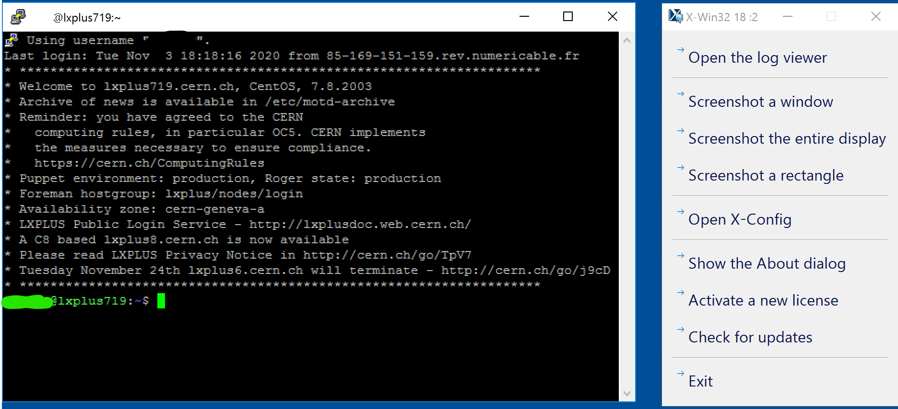
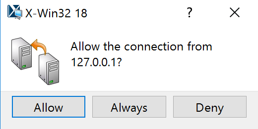

# GUI's

How to's related to the setup and running of the Gui's

## Running GUIs Locally

To use the [KMod GUI][kmod_gui] or the `KnobPanel` in the [Beta-Beat GUI][bb_gui], it is required to be on the TN, as they need to connect to LSA.
If you are in the GPN but not on the TN, you will need to tunnel through some machines.

First, install the program [sshuttle][sshuttle]{target=_blank}, which should be available in your package manager.
Then, run this command in a terminal and leave it open:

```bash
sshuttle -vr <username>@cs-ccr-dev2 172.18.0.0/16
```

All traffic related to the technical network will be redirected through the `cs-ccr-dev2` machine which has access to both networks. In case it isn't available, the other `cs-ccr-devX` machines can be used.

## Running Graphical Software on lxplus or the TN (e.g. GUI, Eclipse)

The  most intuitive way to run graphical software on computers within the CERN network from your own PC would be connecting to them by `ssh -X` and control their GUI via the forwarded X-Server.
While this usually works fine from within CERN itself, where connection speeds are high, depending on the ping and bandwidth of your local connection this can be a frustrating experience.

Using RDP is a way to avoid this, as with this protocol the graphical interface is rendered locally and only the picture of the screen is transmitted.
Sadly, the machine you want to work on (_dev-server_, _optics-server_) will not have this installed.

However, **cernts.cern.ch** allows you to connect to a windows machine via `Remote Desktop Connection` from Windows, or e.g. `Remmina` from Linux.
Once logged in with your CERN credentials (Add `CERN.CH\` in front of your username to specify your domain) you can run:

!!! note
    `Start` &rarr; `X-Win32 18` &rarr; `Lxplus (Default)`

which opens a putty-terminal connected to `lxplus` and starts a `X-Server` in the background.

<figure>
  
  <figcaption>Putty and XServer on cernts</figcaption>
</figure>

Executing any graphical software from this terminal will ask for connection authorization, which you need to approve.

<figure>
  
  <figcaption>Approval prompt for a connection to XServer</figcaption>
</figure>

This way you can run any graphical application smoothly.
If your internet connection fails, you should still be able to resume your current session, at least for a while.

!!! help "Creating Shortcut to Other Machines"
    In order to connect to another machine directly (instead of hopping through `lxplus`) you can create a shortcut:

    1. Open `X-Win32 18 Configuration`.
    2. `Manual...` &rarr; `More...` &rarr; `command`.
    3. Target: `"C:\Program Files (x86)\PuTTY_CERN\putty.exe" -ssh -X machine_at_cern.cern.ch`.
    
    Fill out the other fields to your liking.
    You can even create a shortcut on the screen, from the right-click menu on the newly created connection.

!!! example "Alternative way to create configuration"

    1. Create a file with the ending `.xw32`, e.g on the desktop.
    2. Fill it with:
    ```xml
    <Session>
    <HideOnStart>false</HideOnStart>
    <Module>command</Module>
    <Name>name_you_want_to_give</Name>
    <NewInstance>never</NewInstance>
    <Settings>
        <Target>"C:\Program Files (x86)\PuTTY_CERN\putty.exe" -ssh -X machine_at_cern.cern.ch</Target>
    </Settings>
    <ShowStatus>false</ShowStatus>
    <WindowMode>multiple</WindowMode>
    </Session>
    ```
    3. Click on file.

*[TN]: Technical Network
*[GPN]: General Purpose Network, the main CERN network
*[CBNG]: Common Build Next Generation
*[LSA]: LHC Software Architecture
*[CI]: Continuous Integration
*[CD]: Continuous Delivery
*[lxplus]: Linux Public Login User Service

[kmod_gui]: ../../guis/kmod/gui.md
[bb_gui]: ../../guis/betabeat/gui.md
