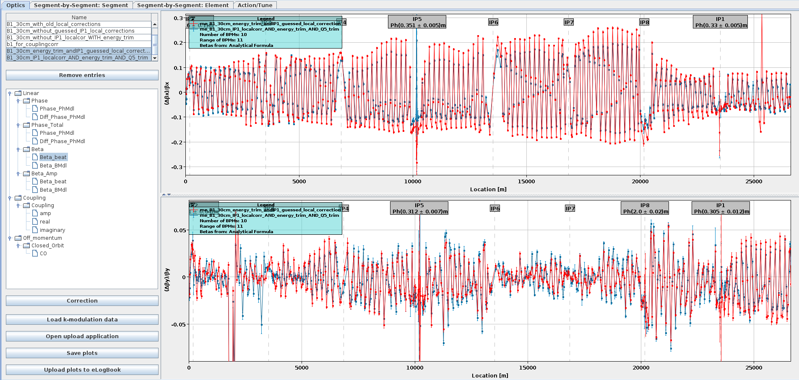
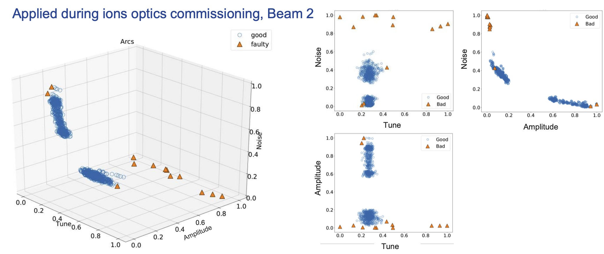

# BPM Filtering

<style>
.tbt-related { color: var(--color-atlasgreen); font-weight: bold; }
.svd-related { color: var(--color-cernred); font-weight: bold; }
.spec-related { color: var(--color-atlasorange); font-weight: bold; }
.manual-related { color: var(--color-cernlightblue); font-weight: bold; }
.iforest-related { color: var(--color-cernpurple); font-weight: bold; }
</style>

The content of this page has been converted from the presentation given as ["OMC3 bad BPM detection" on the 31.03.2025](https://indico.cern.ch/event/1531923/) .

## OMC-Analysis

* To get <span class="omc-emph">reliable</span> and <span class="omc-emph">reproducible</span> optics measurements, we cannot trust all BPM data that we are getting.
* At <span class="omc-emph">different stages</span> of the code, we try to determine the "trustworthiness".
* Some BPMs are fully <span class="omc-emph">excluded</span>, others are getting <span class="omc-emph">errorbars</span> based on their <span class="omc-emph">noise-level</span> (which are often used as *weights*, e.g. for correction calculations).

## Automatic

* First the <span class="tbt-related">Turn-by-Turn Data</span> is checked for "obvious" signs.
    * <span class="tbt-related">EXACT_ZERO</span>: Any value has an <span class="tbt-related">exact zero</span> (might lead to false positives, but unlikely if happens in multiple datasets).
    * <span class="tbt-related">NANS</span>: Data contains <span class="tbt-related">NaN-values</span> (happens in SPS BPMs).
    * <span class="tbt-related">FLAT</span>: <span class="tbt-related">Peak-to-Peak</span> value was <span class="tbt-related">below</span> a given threshold (default: 10nm).
    * <span class="tbt-related">SPIKY</span>: A <span class="tbt-related">spike</span> in the data, <span class="tbt-related">above</span> a given threshold (default: 2cm).
* To reduce <span class="svd-related">noise</span> we perform an SVD-decomposition and keep only the <span class="svd-related">strongest modes</span>.
    * <span class="svd-related">SVD_PEAK</span>: The BPM had a <span class="svd-related">mode</span> in the U-Matrix above a given threshold (default: 0.925).
* Most information about the optics come from a <span class="spec-related">spectral analysis</span>.
    * <span class="spec-related">NO_TUNE</span>: Tune line could <span class="spec-related">not be found</span> in the spectrum.
    * <span class="spec-related">TUNE_CLEAN</span>: Tune line found was <span class="spec-related">too far from the average</span> of the other BPMs (default: > $10^{-5}$).

## Manual

* <span class="manual-related">KNOWN</span>: Identified <span class="manual-related">manually</span>; sticking out spectrum/optics <span class="manual-related">regularly</span>.
    * <span class="manual-related">Large error bars</span>.
    * <span class="manual-related">Non-sensical</span> data points.
    * Cause <span class="manual-related">analysis issues</span> (e.g. phase-offsets, negative $\beta$, NaNs).
    * <span class="manual-related">Calibration</span> issues:
        * $\beta$-from-phase looks normal, peak in $\beta$-from-amplitude
        * $\beta$-ratios large.
        * Measure in <span class="manual-related">different optics</span> to <span class="manual-related">confirm BPM issue</span>.
* **Good hint:** <span class="manual-related">Filtering them solves observed issues</span>.

<figure>
  <center>
  
  <figcaption>Observed Beta-Beating with some large errorbars (e.g. IP1 and IP5) and unrealistic beating (around 2200m in Y)</figcaption>
  </center>
</figure>

## Isolation Forest

* Using <span class="iforest-related">machine learning techniques</span> to identify Bad-BPMs.
    * <span class="iforest-related">IFOREST</span>: Identified BPM, due to being an <span class="iforest-related">outlier in Tune, Noise and/or Amplitude</span>

!!! warning "Under Re-evaluation"
    This functionality is currently under re-evaluation and has only been used on a small amount of data in 2021-2024!

<figure>
  <center>
  
  <figcaption>Isolation Forest Clustering of BPMs Revealing Outliers</figcaption>
  </center>
</figure>

[E. Fol - Machine Learning for BPM failure detection](https://indico.cern.ch/event/762124/contributions/3174751/attachments/1740028/2815322/hss_meeting_2410.pdf)<br>
[E. Fol - Isolation Forest for bad BPMs: performance evaluation](https://indico.cern.ch/event/776442/contributions/3228674/attachments/1759222/2853627/omc_meeting_26nov.pdf)

## Bad BPMs Summary Script

* Bad-BPMs are written out in files <span class="omc-emph">per analysed TbT-Data</span>.
* Script available to <span class="omc-emph">gather, summarize and make statistics</span>.

```bash
usage: bad_bpms_summary.py [-h] --dates DATES [DATES ...] [--root ROOT] [--outfile OUTFILE]
                           [--print_percentage PRINT_PERCENTAGE] [--accel_glob ACCEL_GLOB]

options:
  --dates DATES [DATES ...]
                        Dates to include in analysis. This should be either subfolders in
                        `root` or glob-patterns for those.
  --root ROOT           Path to the root directory, containing the dates.
                        Default: `/user/slops/data/LHC_DATA/OP_DATA/BetaBeat/`
  --outfile OUTFILE     Path to the file to write out.
  --print_percentage PRINT_PERCENTAGE
                        Print out BPMs that appear in more than this percentage of measurements.
  --accel_glob ACCEL_GLOB
                        Accelerator name (glob for the sub-directories).
```

Example: All bad BPMs from 2025, written into file and all &gt; 50% in terminal

```bash
python -m omc3.scripts.bad_bpms_summary --dates 2025-* \
                                       --accel_glob LHCB* \
                                       --outfile bad_bpms_2025.txt \
                                       --print_percentage 50
```

*[BPM]: Beam Position Monitor
