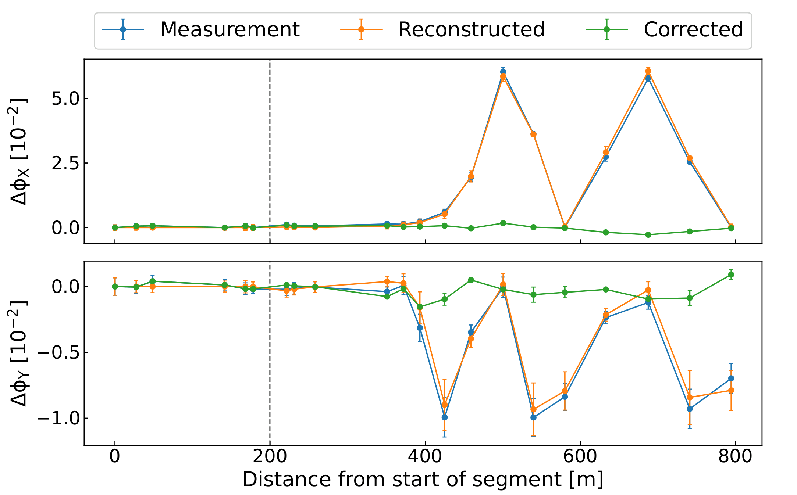
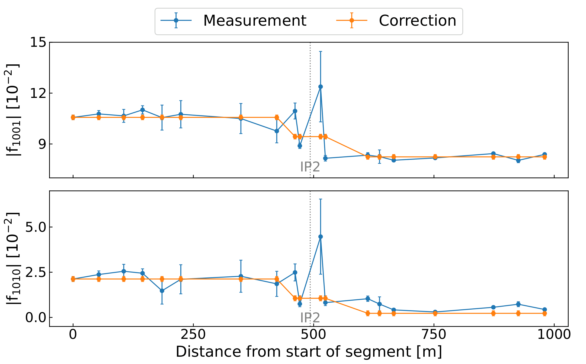

# Segment-by-Segment

In the LHC local linear optics errors are determined and corrected using the Segment-by-Segment technique, usually shortened as SbS.
The technique, introduced in [^TomasLHCOMC] [^TomasReviewOMC] and successfully used in the LHC for many years, treats a section (or segment) of the accelerator as an independent beam line and propagates optics parameters measured at the start of the segment through the line.
We perform this propagation through the MAD-X code.

The optics parameters propagated according to the model of the corresponding segment in the machine are compared with the measured values.
One then tries to find correction settings, aka powering changes of selected magnets, that would best reproduce the measured optics in the model-propagated equivalent.
Inverting these settings and applying the inverted values in the machine corrects the measured deviations, for linear phenomena.

This method is mostly used in the LHC Interaction Regions, where the $\beta$-beating is corrected by compensating for the discrepancies in the betatron phase, which has the same impact as correcting the $\beta$-function  directly but proved to be a more precise and local observable.
For this, one looks at the $\Delta \Phi$ quantity and tries to minimize it through the segment:

$$
\Delta \Phi = \Phi_{model} - \Phi_{measurement}
$$

The figure below shows an example of a local correction of the phase advance through IR5 from the LHC 2022 commissioning.

<figure>
  <center>
  
  <figcaption>Measured and propagated local phase advances through IR5 from the LHC 2022 commissioning.</figcaption>
  </center>
</figure>

The vertical line indicates the IP5 location in the segment.
The blue line shows the measured phase deviation and its error through the segment.
The orange line shows the effect of the "reconstructed" errors in the model, suggesting the error to be corrected in the machine.
The green line shows the expected remaining deviation after applying the determined correction.

The SbS technique can also be applied to observables such as the $\beta$-functions or the coupling RDTs.
In the case of the coupling RDTs, due to the lower number of magnets available for correction in the IRs, one usually tries to compensate for the RDTs at the edges of the IR segment, meaning compensating for the IR's contribution to the global coupling in the machine.

Below shows an example of a local correction of the coupling RDTs around IP2 from the LHC 2021 beam test.

<figure>
  <center>
  
  <figcaption>Measured and propagated local coupling RDTs through IR2 from the LHC 2021 beam test.</figcaption>
  </center>
</figure>

The blue line shows the measured RDTs through the segment, while the orange line shows the attempt at canceling the contribution at the edges of the segment with the two available correctors in the IR.
In this case a good rematching at the edges of the segment means the contribution of the IR to the global coupling is well compensated.

!!! tip "SbS for Coupling RDTs"
    Note that for coupling RDTs in the LHC IRs, a compromise has to be found between the situation of beam 1 and beam 2, since the corrector magnets are common to both beams.

To determine SbS corrections, see the dedicated [Segment-by-Segment GUI pages](../../guis/segment_by_segment/gui.md).

[^TomasLHCOMC]:
    ??? abstract "CERN Large Hadron Collider Optics Model, Measurements, and Corrections, `R. Tomás et al.`, [Phys. Rev. Accel. Beams **13**, 2010](https://journals.aps.org/prab/abstract/10.1103/PhysRevSTAB.13.121004){target=_blank}"
        ```
        @article{PhysRevSTAB.13.121004,
          title = {CERN Large Hadron Collider optics model, measurements, and corrections},
          author = {Tom\'as, R. and Br\"uning, O. and Giovannozzi, M. and Hagen, P. and Lamont, M. and Schmidt, F. and   Vanbavinckhove, G. and Aiba, M. and Calaga, R. and Miyamoto, R.},
          year = {2010},
          month = {Dec},
          volume = {13},
          pages = {121004},
          doi = {10.1103/PhysRevSTAB.13.121004},
          url = {https://link.aps.org/doi/10.1103/PhysRevSTAB.13.121004}
          journal = {Phys. Rev. Accel. Beams},
          publisher = {American Physical Society},
        }
        ```

[^TomasReviewOMC]:
    ??? abstract "Review of Linear Optics Measurement and Correction for Charged Particle Accelerators, `R. Tomás et al.`, [Phys. Rev. Accel. Beams **20**, 2020](https://journals.aps.org/prab/abstract/10.1103/PhysRevAccelBeams.20.054801){target=_blank}"
        ```
        @article{PhysRevAccelBeams.20.054801,
          title = {Review of Linear Optics Measurement and Correction for Charged Particle Accelerators},
          author = {Tom\'as, Rogelio and Aiba, Masamitsu and Franchi, Andrea and Iriso, Ubaldo},
          year = {2017},
          month = {May},
          volume = {20},
          pages = {054801},
          doi = {10.1103/PhysRevAccelBeams.20.054801},
          url = {https://link.aps.org/doi/10.1103/PhysRevAccelBeams.20.054801}
          journal = {Phys. Rev. Accel. Beams},
          publisher = {American Physical Society},
        }
        ```

*[SbS]: Segment-by-Segment
*[RDT]: Resonance Driving Term
