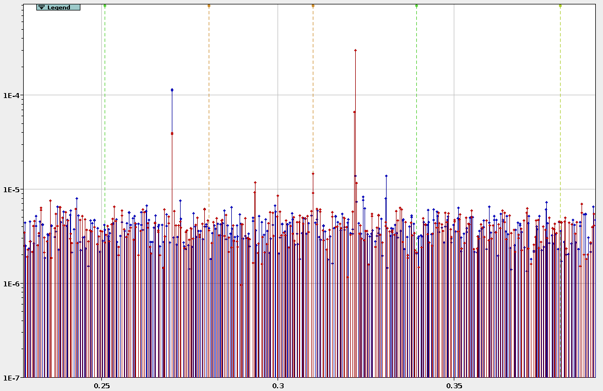
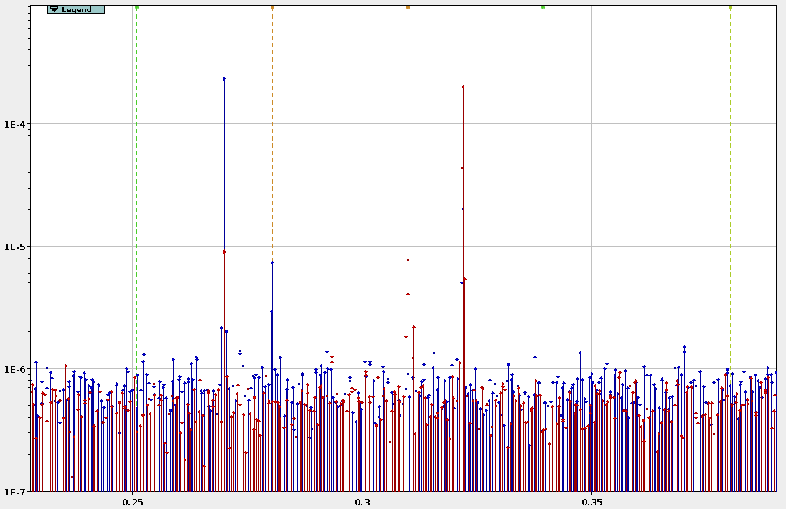
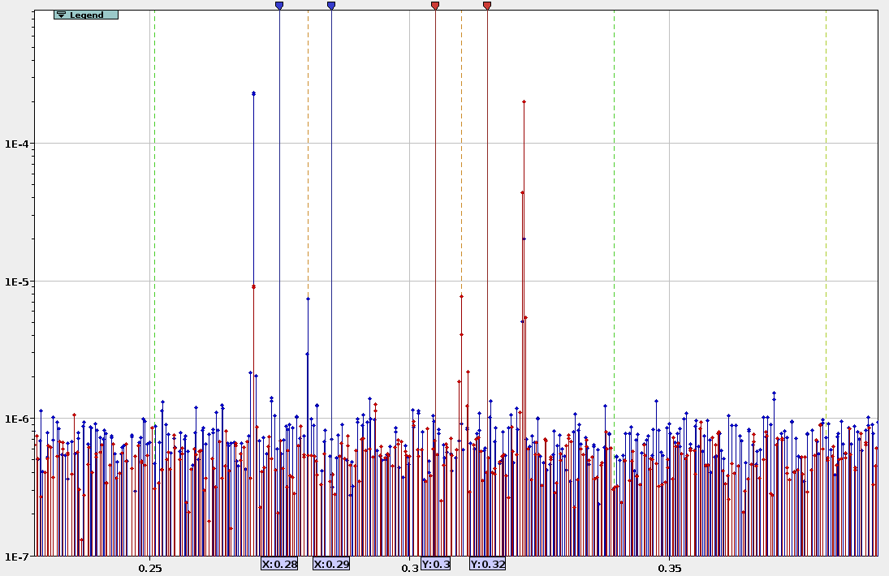
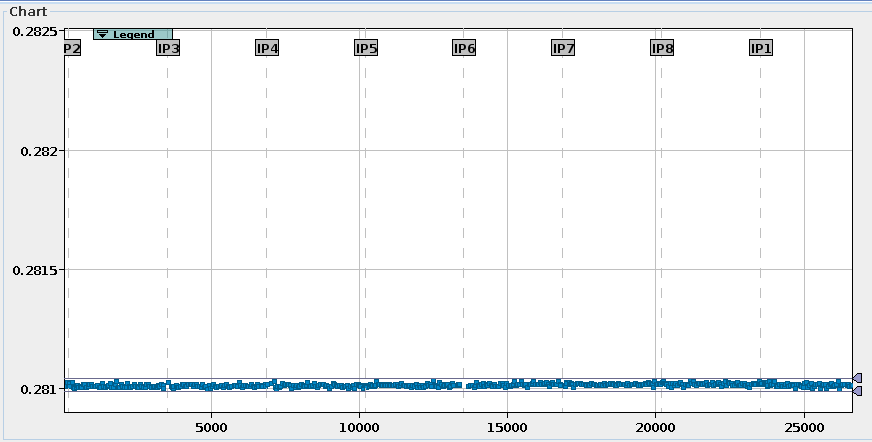

# Amplitude Detuning Measurements

!!! note ""
    Please keep in mind the [general checks](general_checks.md) for measurements.

!!! info "The Procedure in Short"

    The basis of this measurement is to kick with increasing amplitude in a single plane and perform fits over the resulting tune shifts.
    To assure a good direct and cross detuning measurement, it is important to check that both natural tune lines (for the horizontal and vertical tune) are visible in the respective spectrum.
    It is of utmost importance for the detuning analysis to perform rigorous cleaning on the data. 

## Measurement

### Preparations

- [ ] 

Confirm machine state

      

      Make sure that the configuration of the machine is as you expect it. 
      

    - [ ] Perform the [general checks](general_checks.md)
    - [ ] Check correct $\beta^*$ 
    - [ ] Check correct crossing angles
    - [ ] 

Check collimation sequence

        

        **"LOAD COARSE SETTINGS FOR NLO AT 30 CM"** is the current (run 3, 2022) collimation sequence for AC-Dipole kicks in the LHC at $\beta^* = 30 cm$ up to $\pm 170\mu rad$ IP1-V/IP5-H crossing
        and $\pm150\mu rad$ IP1-H, $-150\mu rad$ to $+140\mu rad$ IP5-V separation.
        

- [ ] 

Correct Coupling

      

        As always, coupling should be well corrected to $|C-| \leq 10^{-3}$.
        This can be easily achieved by performing diagonal kicks of mediocre strength, and get the correction values from the GUI. 
        **Beware that the signs need to be switched for correction in the machine**.
      

- [ ] 

Do initial measurement

      

      Start with a low AC-Dipole amplitude in both planes (e.g. 5%-10%) and analyse the resulting data.
      

    - [ ] 

Check both **Natural Tunes** are visible

        

        Perform a quick harmonic analysis on the resulting data and check the spectrum.
        Both natural tunes need to be visible in their respective plane for the majority of BPMs.
        If not, maybe try to adapt the tune delta and move the driven tunes closer to the natural ones.
        See Info-box "Tune Deltas" below.
        

        <figure class="leftFigure">
            
            <figcaption>Bad Spectrum.</figcaption>
        </figure>
        <figure class="rightFigure">
            
            <figcaption>Good Spectrum.</figcaption>
        </figure>
        

    - [ ] Repeat until the spectrum looks usable

!!! info "Tune Deltas"

    in the past, clean amplitude detuning measurements could be achieved with tune deltas (signs as given in Multiturn) of  
    Horizontal: -0.009,  
    Vertical: +0.007.

### Actual Measurement 

!!! warning "When kicking with crossing angles"

    When kicking with the crossing orbit bump in, make sure at each kick, that the **losses occur in IP6/IP7** 
    and **not in the IPs with the crossing** in (usually IP1 and IP5)!
    Losses in these IPs can appear with minor amplitude change, so **keep the amplitude increase between kicks small**.
    If you see losses in the IPs with crossing angles, but you are not yet happy with your maximum amplitude and you still have a lot of beam intensity left,
    you can kick at the same amplitude a few times and hope that the losses go down (the outermost particles are scraped) and then (carefully) continue increasing amplitude again.

- [ ] 

Kicks in the vertical plane

      

      While keeping the AC-Dipole amplitude in the horizontal plane constant (but not zero, to avoid weird AC-Dipole behaviour and to see if there is coupling effects),
      slowly increase the amplitude in the vertical plane.
      

    - [ ] Kick with slowly increasing amplitude (1%-5% increase between kicks)
    - [ ] 

Check losses are low during each kick

          

          Adapt amplitude increase accordingly, as you do not want to dump the beam because the losses were to high.
          Also check the beam intensity, you will want to have good intensity if there are more detuning measurements in the other planes/settings to do. 
          When kicking with crossing: head the warning above! Losses may occur with only a small amplitude increase!
          

    - [ ] 

Check for tune drift

          

          If you are kicking with reduced tune deltas, it is also important to have an eye on the tune drift of the machine, 
          so that you do not further decrease the distance between natural tune and excitation. 
          Update the tune in multiturn if necessary.
          The tune drifts will be compensated in the python analysis step by using data from the BBQ.
          

    - [ ] Try to reach $0.015 \, \rm{\mu m} - 0.020 \, \rm{\mu m}$ in action ($2J_x$)
    - [ ] Get around 15-20 kicks

- [ ] 

Kicks in the horizontal plane

      

      While keeping the AC-Dipole amplitude in the vertical plane constant (but not zero, to avoid weird AC-Dipole behaviour and to see if there is coupling effects),
      slowly increase the amplitude in the horizontal plane.
      

    - [ ] Kick with slowly increasing amplitude (1%-5% increase between kicks)
    - [ ] 

Check losses are low during each kick

          

          Adapt amplitude increase accordingly, as you do not want to dump the beam because the losses were to high.
          Also check the beam intensity, you will want to have good intensity if there are more detuning measurements in the other planes/settings to do. 
          When kicking with crossing: head the warning above! Losses may occur with only a small amplitude increase!
          

    - [ ] 

Check for tune drift

          

          If you are kicking with reduced tune deltas, it is also important to have an eye on the tune drift of the machine, 
          so that you do not further decrease the distance between natural tune and excitation. 
          Update the tune in multiturn if necessary.
          The tune drifts will be compensated in the python analysis step by using data from the BBQ.
          

    - [ ] Try to reach $0.015 \, \rm{\mu m} - 0.020 \, \rm{\mu m}$ in action ($2J_y$)
    - [ ] Get around 15-20 kicks

- [ ] 

Diagonal Kicks (optional)

      

      To increase the accuracy of the cross-term measurement, 2D kicks (and 3.5D fitting) can be performed.
      If this is desired, it makes sense to throw some diagonal kicks, i.e. kicks with (more or less, not too important for the fitting) equal amplitude into the mix.
      

    - [ ] Kick with slowly increasing amplitude (1%-5% increase between kicks)
    - [ ] 

Check losses are low during each kick

          

          Adapt amplitude increase accordingly, as you do not want to dump the beam because the losses were to high.
          Also check the beam intensity, you will want to have good intensity if there are more detuning measurements in the other planes/settings to do. 
          When kicking with crossing: head the warning above! Losses may occur with only a small amplitude increase!
          

    - [ ] 

Check for tune drift

          

          If you are kicking with reduced tune deltas, it is also important to have an eye on the tune drift of the machine, 
          so that you do not further decrease the distance between natural tune and excitation. 
          Update the tune in Multiturn if necessary.
          The tune drifts will be compensated in the python analysis step by using data from the BBQ.
          

    - [ ] Try to reach $0.015 \, \rm{\mu m} - 0.020 \, \rm{\mu m}$ in action in both planes
    - [ ] Get around 15-20 kicks

!!! info "Action Estimation"

    The action can be calculated if $\beta$ and peak-to-peak is known for a specific BPM by $2J = \frac{(0.5 \cdot pk2pk)^2}{\beta}$.
    Otherwise it can always be checked running optics analysis on a file and looking into the Optics &rarr; Action/Tune tab or the kick-file.

## Analysis

Analysis performed with the Beta-Beat GUI omc3 v0.1.0.

The analysis of amplitude detuning data requires very accurate estimates of the natural tunes, 
which can be hard to find if they get lost in the BPM noise or when they are close to resonances in the spectrum.
Multiple features have been implemented in python and GUI to ease the detuning analysis.

As the main steps follow the standard optics analysis, the entries described here are mostly hints and tricks 
on how to optimize the analysis and only need to be applied where necessary.

- [ ] 

Load Data

      

      Simply load the data in the BPM panel.
      Make sure you are loading the correct data and check the logbook for misfired kicks etc.
      

- [ ] 

Run Spectral Analysis

      

      A bad spectral analysis can be recovered by the steps mentioned in "Cleaning", 
      but a good frequency spectrum and well found natural tunes will save you a lot of time later on.
      

    - [ ] 

Small `tolerance` ($\approx 10^{-3}$)

          

          The tune tolerance (found in the `Tune Settings`) specifies in what region around the assumed natural tune (see next step, the region is $f \pm tolerace$), the highest frequency line is chosen to be the natural tune.
          To not accidentally capture the main tune or other excited resonances close by, the tolerance should be kept low ($\approx 10^{-3}$).
          In case of large detuning (e.g. $40 \cdot 10^3 m^{-1} \times 0.016 \rm{\mu m} = 6.4 \cdot 10^{-3}$) or change of the AC-Dipole frequency (e.g. to adapt for tune drifts), this could mean that the natural tune will not fall into this window anymore.
          The both can be avoided using `Autotunes` and maybe adapting the tune deltas (see next step), but can also be easily remedied in the cleaning step via the `Update Nattune` functionality.
          You can check the approximate tolerance window, by using the `Set Window` button of `Update Nattune`, which will set the markers according to the `Nattune` and `tolerance` in the `Tune Settings`,
          which might differ a bit from the actual window if `Autotunes` are used.
          

          <figure style="width:90%;">
              
              <figcaption>Tune settings.</figcaption>
          </figure>
          <figure style="width:90%;">
              
              <figcaption>Approximate tolerance window, shown in blue for the horizontal and in red for the vertical tune.</figcaption>
          </figure>
          

    - [ ] 

Use `Autotunes` and `Nat. Deltas`

          

          In case the tunes do not coincide with the model, e.g. due to tune-drifts, we might run into problems when using a small tolerance (see previous step) as the natural tune might now be outside of the search window.
          One way to remedy that would be to also keep the model tunes up-to-date, e.g. use the exact tune values from the kick entries in the logbook.
          The one thing that should be constant during the measurement process though, are the tune deltas.
          The easiest way therefore, to make sure that at least the non-detuned tune is in the tolerance window, is to use the `Autotunes` in the `Tune Settings`:
          If this is activated (here for `transverse` planes), the highest peak in the whole spectrum is automatically assumed to be the driven tune.
          From those we can specify the difference to the natural tunes, by activating the `Nat. Deltas`, instead of the natural tunes themselves.
          Now, no matter the tune drift (if the tunes are kept updated in Multiturn), the unperturbed natural tune should always be, where we expect it.
          **Beware that the signs between the `Nat. Deltas` and Multiturns are inverted**, as Multiturn uses the $\Delta$ to specify the excitation frequency based on the natural tune, 
          while the GUI/harpy searches for the natural tune at $\Delta$ from the driven tune.
          

          <figure style="width:90%;">
              
              <figcaption>Tune settings.</figcaption>
          </figure>
          

    - [ ] 

Good Frequency Resolution (`TurnBits > 15`)

          

          As the tune shift can be very small, we would want a good resolution in frequency, which can be controlled by `TurnBits`.
          The standard value of `TurnBits` of `20` (leading to $2^{20}$ complex coefficients, i.e. $2^{21}$ spectral lines) is a good start, but can lead to excessive memory use when analysing 15-20 files at once. 
          I estimate (from experience), that with `19` turn-bits, you will need 60GB to 80GB of RAM, `20` will obviously double and `18` half that value.
          Both of these should be good values to use (see Infobox "TurnBit Estimation" below). 
          The `OutputBits` on the other hand can be smaller, as the highest line stored per "bucket" will keep the frequency location calculated from the higher resolution form `TurnBits`.
          Therefore, even if the wrong line is selected (see step "Small tolerance"), the correct tune line will still be available in its bucket. 
          The only issue would be, if there is a resonance really close by. 
          A value of `10`-`12` ($0.5 \cdot 10^{-4} - 10^{-4}$ tune units) should be enough, to keep the file-size manageable and allow to open all the files simultaneously in the GUI.
          

- [ ] 

Check and Clean Data

      

      As mentioned before, it is of utmost importance to have clean data for the analysis as otherwise the fit will not work and yield unreasonable results.
      In principle each file needs to be checked that all BPMs point to the correct horizontal and vertical natural tunes, and cleaned appropriately.
      The following steps can be applied to recover the right natural tunes, if visible in the spectrum, limit error-bars and clean outliers.
      

    - [ ] 

Check Time and Space for `NATTUNEX` and `NATTUNEY`

        

        For the amplitude detuning analysis, the most important factor is the correct determination of the natural tunes.
        When the `harpy` frequency analysis is done, one can check the found tunes in the `Analysis Panel` in the `Time and Space` tab.
        Make sure to select `NATTUNEX` and `NATTUNEY` not just the main tunes.
        **And be sure that the found tune shown is the natural tune and not the driven tune**.
        Often it is required to check only one of them at a time, to get a clearer view. 
        This can be easily achieved by *right clicking* into the data selection box on the left hand side of the plane that you want to unselect (or choosing `none`)
        and then *middle clicking* into the chart to autozoom the data.
        The BPMs should differ only very little in the found tune ($< 10^{-5}$), otherwise they need to be cleaned.
        The following steps describe how to do that.
        

        <figure style="width:90%;">
            
            <figcaption>Example for clean (but not perfect) `NATTUNEX` data.</figcaption>
        </figure>
        

    - [ ] 

Check Frequency Chart

        

        In case of differences in the found tunes of the BPMs, the first check should always be the `Frequency Chart` in the adjacent tab of the `Analysis Panel`.
        Especially, if there are clusters of found frequencies (i.e half of the BPMs agree on one frequency, the other half on another) in the `Time and Space Chart`,
        this hints at resonance lines close by that are mistaken for the natural tune.
        In any case, one needs to manually identify which of the lines within the selected `tolerance` (see in one of the analysis steps above) is the actual tune.
        If it is not clear at first glance, **compare the spectrum of the current kick with previous kicks** to see the natural tune evolution with increasing amplitude.
        Once the right tune is identified - or determined of being not present in the spectrum - one of the next steps can be applied.
        

    - [ ] 

Update natural tune window (where applicable)

        

        If the correct natural tune is visible in the spectrum but could not be identified properly, due to resonance lines close by or because the line lies outside of the `tolerance` window,
        one does not have to repeat the analysis with adapted tunes, deltas and tolerance window, as needs to be done when using the python2 GUI,
        but can use the `Update Lin-File` functionality:

        <ul>
        <li> Select the BPMs you want to update. 
          If you want to update only one plane deselect (*right click* into the data selection box or choose `none`) all BPMs in the other plane.
          If you want to update all BPMs in one plane, use `Ctrl + a` in the data of the plane you want to select. *(Minimize the legend first...)* 
          **ONLY SELECTED BPMS WILL BE UPDATED** 
        <li> Activate the `Natural Tune Window` by checking `show`.
        <li> Click `Set Window` if the vertical markers are not showing.
        <li> Set the markers so that the highest line they contain is the natural tune. 
             If there is no line for a selected BPM between the markers ( the window is `empty`), it can either throw an `error`, `remove` the bpm or `ignore` and leave the value as is.  
             (blue markers for the horizontal tune, red markers for the vertical tune).
        <li> Click <code style="color:green">Update Lin-File</code>.
        </ul>
        <figure style="width:90%;">
            
            <figcaption>How to update the natural tune in the Lin-File.</figcaption>
        </figure>
        

    - [ ] 

Clean wrong BPMs (where applicable)

        

        

    - [ ] 

Clean wrong Measurements (where applicable)

        

        

- [ ] 

Run Optics Analysis

    

    

- [ ] 

Final Cleaning in Kick-Files

    

    

- [ ] 

Run Amplitude Detuning Analysis

    

    

    - [ ] 

With BBQ correction

        

        

??? info "Quick TurnBit Estimation"
    Let's assume a small detuning of $10 \cdot 10^3 \, \rm{m}^{-1}$ and an action increase between kicks of $0.020 \rm{\mu m} / 20 \, \rm{kicks}$,
    leading to a detuning difference between two kicks of $\Delta Q = 1 \cdot 10^{-5}$.
    The frequency resolution $\Delta f$ is the inverse of the length of the turns-data (halfed, as we have pairs), so $2^{-\rm{TurnBits}-1}$ : 
    `TurnBits = 20`: $\Delta f = 4.8 \cdot 10^{-7}$ 
    `TurnBits = 19`: $\Delta f = 9.5 \cdot 10^{-7}$ 
    `TurnBits = 18`: $\Delta f = 1.9 \cdot 10^{-6}$ 
    `TurnBits = 17`: $\Delta f = 3.8 \cdot 10^{-6}$ 
    `TurnBits = 16`: $\Delta f = 7.6 \cdot 10^{-6}$ 
    `TurnBits = 15`: $\Delta f = 1.5 \cdot 10^{-5}$ 
    We therefore need to set `TurnBits` to at least `16` to assure that we will see the change $\Delta Q$ between kicks.