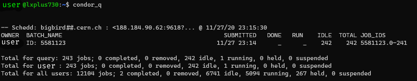

# PyLHC Submitter

[See the API documentation][documentation] for a detailed description of the code and the different parameters.

Note that the full functionality is only available under Linux with `HTCondor` configured, e.g. on CERN's `lxplus` service.
Currently, due to lack of htcondor Python bindings on `PypI` for `Windows` and `macOS`, only local job execution is possible for these platforms.

## Using the Job Submitter:

In the following examples, we will perform a tune sweep using a `MAD-X` mask.
The simulations will be parametrized for both beams over a range of tunes in each plane.
Parameters in the template script (see below) are indicated in the `%(PARAMETER)s` format.

??? example "The `my_madx.mask` Template File"
    ```fortran
    ! ----- Create Symlinks to Resources ----- !
    option, warn, info;
    system, "mkdir Outputdata";
    system, "ln -fns /afs/cern.ch/eng/lhc/optics/V6.503 db5";
    system, "ln -fns /afs/cern.ch/eng/lhc/optics/SLHCV1.0 slhc";
    system, "ln -fns /afs/cern.ch/eng/lhc/optics/runII/2018 optics2018";
    !option, -echo, warn, -info;

    ! ----- Make macros available  ----- !
    call, file="optics2018/toolkit/macro.madx";

    ! ----- Beam Options  ----- !
    mylhcbeam=%(BEAM)s;  ! Will be replaced by values given to the submitter
    qx=%(TUNEX)s;        ! Will be replaced by values given to the submitter
    qy=%(TUNEY)s;        ! Will be replaced by values given to the submitter
    emittance=3.75e-06;
    n_part=1.0e10;

    ! ----- Set up Lattice ----- !
    call, file="optics2018/lhc_as-built.seq";  ! LHC machine definition

    ! -----  Definine the optics ----- !
    call, file="optics2018/PROTON/opticsfile.22_ctpps2";  ! Optics to Round 30cm collision optics

    ! ----- Create Beams ----- !
    beam, sequence=lhcb1, bv= 1, energy=NRJ, particle=proton, npart=n_part, kbunch=1, ex=emittance, ey=emittance;
    beam, sequence=lhcb2, bv=-1, energy=NRJ, particle=proton, npart=n_part, kbunch=1, ex=emittance, ey=emittance;

    ! ----- Tune Matching ----- !
    use, sequence=lhcb%(BEAM)s;
    match, chrom;
        global, q1=qx, q2=qy;
        vary, name=dQx.b%(BEAM)s, step=1.0E-7;  ! Will be replaced by values given to the submitter
        vary, name=dQy.b%(BEAM)s, step=1.0E-7;  ! Will be replaced by values given to the submitter
        lmdif, calls=100, tolerance=1.0E-21;
    endmatch;

    ! ----- Output Twiss ----- !
    select, flag=twiss, clear;
    select, flag=twiss, pattern="BPM", column=name,s,x,y,betx,bety,alfx,alfy,dx,dpx,mux,muy;
    select, flag=twiss, pattern="M", column=name,s,x,y,betx,bety,alfx,alfy,dx,dpx,mux,muy;
    select, flag=twiss, pattern="IP", column=name,s,x,y,betx,bety,alfx,alfy,dx,dpx,mux,muy;
    twiss, chrom, file="Outputdata/b%(BEAM)s.twiss.tfs";  ! Will be replaced by values given to the submitter

    ! ----- Cleanup Symlinks ----- !
    system, "unlink db5";
    system, "unlink slhc";
    system, "unlink optics2018";
    ```

### Starting Studies from Python

??? success "Recommended Method"
    Starting studies from Python is the recommended method, especially with a high number of parameters.
    As we will see later on, other methods methods require all parameter values to be written down while the pythonic way allows for an easier and clearer definition of the parameter space.

The parametrizing of simulations and submission to `HTCondor` through Python is as simple as calling the `main` function of the submitter with the desired parameters.
See below:
```python
import numpy as np
from pylhc_submitter.job_submitter import main as htcondor_submit

if __name__ == "__main__":
    htcondor_submit(
        executable="madx",  # default pointing to the latest MAD-X on afs
        mask="my_madx.mask",  # template to fill and execute MAD-X on
        replace_dict=dict(  # parameters to look for and replace in the template file
            BEAM=[1, 2],
            TUNEX=np.linspace(62.3, 62.32, 11).tolist(),
            TUNEY=np.linspace(60.31, 60.33, 11).tolist(),
        ),
        jobid_mask="b%(BEAM)d.qx%(TUNEX)s.qy%(TUNEY)s",  # naming of the submitted jobfiles
        working_directory="/afs/cern.ch/work/u/username/study.tune_sweep",  # outputs
        jobflavour="workday",  # htcondor flavour
    )
```

---
### Starting Studies from a Config File

The same can also be achieved by specifying the previously called parameters in a **config.ini** file.
It is worth noting that with any submission, the `job_submitter` will create such a file.
See below the equivalent **config.ini** of the above Python example:
```
[DEFAULT]
executable="madx"
mask="my_madx.mask"
working_directory="/afs/cern.ch/work/u/username/study.tune_sweep"
replace_dict={
    "BEAM": [1, 2],
    "TUNEX": [62.3, 62.302, 62.304, 62.306, 62.308, 62.31, 62.312, 62.314, 62.316, 62.318, 62.32],
    "TUNEY": [60.31, 60.312, 60.314, 60.316, 60.318, 60.32, 60.322, 60.324, 60.326, 60.328, 60.33],
}
jobid_mask="b%(BEAM)d.qx%(TUNEX)s.qy%(TUNEY)s"
jobflavour="workday"
```

The jobs are then started by calling the submitter on this file from the command line:
```bash
python -m pylhc_submitter.job_submitter --entry_cfg config.ini
```

---
### Starting Studies from the Command Line

!!! warning "Users Beware"
    While doing so is possible, using a simple command line call is discouraged.
    As we will see in the example below, this method is not as clear as the previous ones, and prone to errors.

It is possible to skip the creation of a Python or a **config.ini** file completely when submitting, by providing parameters through the `replace_dict` flag at the command line.
The above examples would be done through a (very lengthy) command line call as below:
```bash
python -m pylhc_submitter.job_submitter --executable madx --mask my_madx.mask --working_directory /afs/cern.ch/work/u/username/study.tune_sweep --replace_dict "{'BEAM': [1, 2], 'TUNEX': [62.3, 62.302, 62.304, 62.306, 62.308, 62.31, 62.312, 62.314, 62.316, 62.318, 62.32], 'TUNEY': [60.31, 60.312, 60.314, 60.316, 60.318, 60.32, 60.322, 60.324, 60.326, 60.328, 60.33]}" --jobid_mask b%(BEAM)d.qx%(TUNEX)s.qy%(TUNEY)s --jobflavour workday
```

---
### Starting Studies with Mask Strings

Instead of using a mask file, `job_submitter` can also use a string as input for the executable.
This can prove useful if the executable has a number of variable input parameters, i.e. `executable --param1 X --param2 Y`.

A simple mask string call using the **config.ini** input to the pylhc-submitter would look like this:
```
[DEFAULT]
executable="expr"
mask="%(SUMMAND1)s + %(SUMMAND2)s > Outputdata/result.txt"
working_directory="/afs/cern.ch/work/u/username/study.addition"
replace_dict={"SUMMAND1": [1, 2, 3, 4], "SUMMAND2": [6, 7, 8, 9]}
run_local=True
num_processes=4
```

Note that again, the user has to take care that the required results are saved in the correct `job_output_dir`.
The `mask` string can be a more complicated multiline string, executing multiple commands.

??? example "Example Multiline Config File"
    ```
    [DEFAULT]
    executable=None
    mask="madx < Job%(SEED)s.madx\n
          python -m analysis.main --method %(METHOD)s"
    working_directory="/afs/cern.ch/work/u/username/study.multiline"
    replace_dict={"SEED"= [1, 2, 3, 4], "METHOD"= ['fast', 'slow', 'new']}
    run_local=True
    num_processes=4
    ```

---
## What Happens After Submitting

When submitting, the `job_submitter` determines jobs to be submitted to `HTCondor` through the inner product of the `replace_dict`: in our example each possible combination of the 3 given parameters.
The script will issue several logging statements to keep the user updated, but here is what happens behind the scenes.

A folder structure is created in the given `working directory`, in which one will find:

- A **Job.tfs** file, a global summary dataframe in which each row corresponds to a set of parameters filled in for one submitted job:
    - The first column, `JobId`, is either numbering of the jobs or - in our case - the filled in `jobid_mask`,
    - The next columns are the given parameters, here: `BEAM`, `TUNEX` and `TUNEY`. They contain the value filled in the respective job-instance of said row,
    - The `JobDirectory`, `JobFile` and `ShellScript` columns respectively contain the path to the job directory, the name of the filled mask file and the name of the script which are used to run the job.
- A **queuehtc.sub** file, the `HTCondor` submission file used, which tells `HTCondor` the paths to all the `ShellScripts` to run.
- Many sub-directories named according to the `jobid_mask`, one per job, each with:
    - A `ShellScript` **<Jobid>.sh**, which contains commands to create the `job_output_dir` and the `madx` command to run the script,
    - A `JobFile` which is the original `mask`, parameter values filled in.

??? tip "Dry Runs"
    In case one runs the submitter with the `dryrun` flag, the execution stops here and prepared files are accessible, but nothing is sent to the `HTCondor` scheduler.
    One can use this option to perform a thorough check before using `condor_submit` on the created submission file **queuehtc.sub**.

??? warning "Number of Jobs"
    As `job_submitter` creates a job for each combination in the inner product of the `replace_dict` parameters, the number of jobs can easily get high.
    In our example case, we are submitting `beam * tunex * tuney = 2 * 11 * 11 = 242` jobs.
    It is worth noting that currently the maximum number of jobs to be submitted to `HTCondor` is set to `100k`.

After submitting our tune sweep studies, we can check the status of our jobs via the `condor_q` (unless running locally).
The output should look something like this:

<figure>
    
    <figcaption><code>condor_q</code>: Shows the jobs in the condor queue.</figcaption>
</figure>

When all jobs are done running, the `htcondor.<jobid>.err`, `htcondor.<jobid>.log` and `htcondor.<jobid>.out` files for the respective job are transferred back to the appropriate directories.
Finally, for each job the `job_output_dir`, here containing the **.twiss.tfs** file, will be transfered back as well, ready for post-processing.

## Checking for and Resubmitting Failed Jobs

To see if and which Jobs have failed, the same command as above can be rerun using `resume_jobs` and `dryrun` flags (or use them as parameters set to `True`).
By default, Jobs are classified as successful if the specified `job_output_dir` is present.
<!-- TODO add example script output -->

To resubmit the failed jobs to `HTCondor`, simply rerun the call and omit the `dryrun` flag or set its parameter to `False`.

!!! tip "Refining the Resubmission"
    To further refine the resubmission, the script can also check for the presence of files in the `job_output_dir` by using the `check_files` flag.
    In the case of our tune sweep example, this would look like `check_files=["*.twiss.tfs"]`.

## Pitfalls and Hints

!!! warning "The `ssh` Option"
    When using the `ssh` option, the working directory needs to be accessible from both the local machine as well as the `ssh` server.
    In this case, `ssh` is only used for the final command submitting the jobs to `HTCondor`.

!!! warning "Running Locally"
    The `run_local` flag allows parallelizing jobs on your local machine through multiprocessing.
    This is only recommended for short jobs and for a small number of jobs, as the stress on your machine can be intense.
    The `num_processes` option allows to specify how many concurrent processes will run, by default 4.

[documentation]: https://pylhc.github.io/submitter/entrypoints/job_submitter.html
